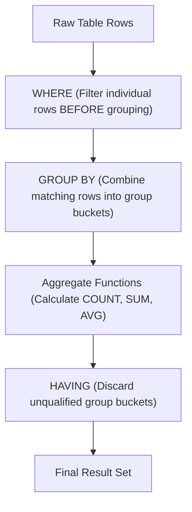

# When to use HAVING

---

## 🟢 Junior Level

The **`HAVING`** clause is used exclusively to filter query results based on the output of **aggregate functions** (`COUNT`, `SUM`, `AVG`, `MIN`, `MAX`) after rows have been grouped using **`GROUP BY`**.



### Simple Real-World Analogy
Imagine a school basketball tournament:
1. **`WHERE` (Row filter):** First, screen individual students to admit only those with a valid medical clearance (`WHERE medical_clearance = true`).
2. **`GROUP BY` (Bucketing):** Group the eligible students by their registered team (`GROUP BY team_id`).
3. **`HAVING` (Group filter):** Only teams with at least 5 active players (`HAVING COUNT(*) >= 5`) and an average player height over 180 cm (`HAVING AVG(height_cm) > 180`) qualify for the tournament bracket.

### Standard Practical Use Cases

#### 1. Detecting Duplicates
```sql
-- Find email addresses registered to more than one account
SELECT email, COUNT(*) AS occurrences
FROM users
GROUP BY email
HAVING COUNT(*) > 1;
```

#### 2. Filtering by Aggregate Business Thresholds
```sql
-- Identify high-volume customers who completed at least 5 orders
SELECT customer_id, COUNT(*) AS completed_orders
FROM orders
WHERE status = 'COMPLETED'
GROUP BY customer_id
HAVING COUNT(*) >= 5;
```

#### 3. Filtering by Statistical Metrics
```sql
-- Identify departments with an average salary exceeding $120,000
SELECT department_id, AVG(salary) AS avg_salary
FROM employees
GROUP BY department_id
HAVING AVG(salary) > 120000;
```

---

## 🟡 Middle Level

### Architectural Synergy: Dual-Stage Filtering (`WHERE` + `HAVING`)

High-performance SQL strictly separates pre-aggregation row reduction from post-aggregation group qualification:

```sql
SELECT 
    seller_id,
    COUNT(*) AS total_sales,
    SUM(sale_amount) AS revenue
FROM sales
WHERE sale_date >= '2026-01-01'        -- 1. WHERE: Discards stale records (Uses B-tree Index!)
  AND refund_status IS NULL            -- 2. WHERE: Discards refunded orders BEFORE memory aggregation
GROUP BY seller_id                      -- 3. GROUP BY: Assembles qualified rows into memory hash table
HAVING COUNT(*) >= 50                   -- 4. HAVING: Applies sales volume qualification
   AND SUM(sale_amount) >= 1000000;     -- 5. HAVING: Applies revenue qualification
```

**Why this division of labor is critical:**
- **`WHERE` executes prior to aggregation.** It leverages B-tree indexes to eliminate 90%+ of irrelevant rows, minimizing memory footprint and I/O.
- **`HAVING` executes after aggregation.** It evaluates only against the aggregated accumulators of the resulting groups.

### Advanced Group Filtering Scenarios

#### 1. Conditional Aggregate Assertions via `FILTER (WHERE ...)`
PostgreSQL supports standard SQL `FILTER` clauses inside aggregates, enabling powerful multi-dimensional group assertions:

```sql
-- Find projects with at least 10 tasks where at least 3 tasks are blocked:
SELECT project_id, COUNT(*) AS total_tasks
FROM tasks
GROUP BY project_id
HAVING COUNT(*) >= 10
   AND COUNT(*) FILTER (WHERE status = 'BLOCKED') >= 3;
```

#### 2. Relational Division (100% Condition Fulfillment)
```sql
-- Find orders where 100% of line items are completely delivered:
SELECT order_id
FROM order_items
GROUP BY order_id
HAVING COUNT(*) = COUNT(*) FILTER (WHERE item_status = 'DELIVERED');
```

#### 3. Global Guard (`HAVING` Without `GROUP BY`)
When `HAVING` is written without a `GROUP BY` clause, the entire table is treated as a single aggregate group:

```sql
-- Alert monitoring query: returns a single row if the system threshold is violated
SELECT 'CRITICAL: High average latency detected!' AS alert_banner
FROM http_access_logs
WHERE request_timestamp >= NOW() - INTERVAL '5 minutes'
HAVING AVG(response_time_ms) > 1500;
```
If the average response time is 1500 ms or less, the query returns **0 rows**.

### Object-Relational Mapping: Spring Data JPA & Criteria API

In Java enterprise applications, group filtering is expressed using JPQL `@Query` or the `CriteriaBuilder.having()` method:

```java
// 1. Spring Data JPA JPQL Query
public interface OrderRepository extends JpaRepository<Order, Long> {

    @Query("""
        SELECT o.customer.id, COUNT(o.id), SUM(o.totalPrice)
        FROM Order o
        WHERE o.createdAt >= :startDate
        GROUP BY o.customer.id
        HAVING COUNT(o.id) >= :minOrders AND SUM(o.totalPrice) >= :minSpent
    """)
    List<CustomerStatsDto> findVipCustomers(
        @Param("startDate") LocalDateTime startDate,
        @Param("minOrders") long minOrders,
        @Param("minSpent") BigDecimal minSpent
    );
}

// 2. JPA Criteria API Dynamic Construction
CriteriaBuilder cb = em.getCriteriaBuilder();
CriteriaQuery<CustomerStatsDto> cq = cb.createQuery(CustomerStatsDto.class);
Root<Order> order = cq.from(Order.class);

cq.multiselect(
    order.get("customer").get("id"),
    cb.count(order),
    cb.sum(order.get("totalPrice"))
);
cq.where(cb.greaterThanOrEqualTo(order.get("createdAt"), startDate));
cq.groupBy(order.get("customer").get("id"));
cq.having(
    cb.and(
        cb.ge(cb.count(order), minOrders),
        cb.ge(cb.sum(order.get("totalPrice")), minSpent)
    )
);

List<CustomerStatsDto> results = em.createQuery(cq).getResultList();
```

---

## 🔴 Senior Level

### The Group Explosion Bottleneck (Cardinality Explosion)

If the `WHERE` clause has low selectivity (e.g., scanning 100,000,000 rows) and the grouping column has high cardinality (e.g., 10,000,000 unique `user_id` values), a restrictive `HAVING` clause **will not prevent memory exhaustion or catastrophic disk spills**:

```sql
-- ⚠️ HIGH RISK QUERY:
SELECT user_id, SUM(amount)
FROM transactions
WHERE created_at >= '2025-01-01'   -- Scans 100,000,000 rows
GROUP BY user_id                    -- Generates 10,000,000 in-memory buckets!
HAVING SUM(amount) > 100000;        -- Only keeps 50 final rows, BUT evaluates AFTER all 10M groups exist!
```

**PostgreSQL Execution Mechanics:**
1. **Hash Table Allocation:** `HashAggregate` attempts to build a hash table containing 10,000,000 entries within `work_mem`.
2. **Spill to Disk:** Once `work_mem` is exceeded, PostgreSQL partitions the hash table and spills temporary files to disk (`temp_files`), generating gigabytes of disk I/O.
3. **Execution Latency:** Execution time degrades from milliseconds to tens of minutes, regardless of how few rows satisfy the final `HAVING` condition.

**Architectural Solutions:**
1. **Pre-Aggregation Filtering (CTE / Derived Table):**
   If only transactions above a certain magnitude can realistically push a user's sum over `$100,000`:
   ```sql
   WITH large_tx AS (
       SELECT user_id, amount
       FROM transactions
       WHERE created_at >= '2025-01-01'
         AND amount >= 1000       -- Filters out micro-transactions BEFORE hashing
   )
   SELECT user_id, SUM(amount)
   FROM large_tx
   GROUP BY user_id
   HAVING SUM(amount) > 100000;
   ```
2. **Materialized Views with B-tree Indexes:**
   For analytical dashboards, pre-aggregate data asynchronously:
   ```sql
   CREATE MATERIALIZED VIEW mv_user_turnover AS
   SELECT user_id, SUM(amount) AS total_amount, COUNT(*) AS tx_count
   FROM transactions
   GROUP BY user_id;

   CREATE INDEX idx_mv_turnover ON mv_user_turnover(total_amount);

   -- Query completes in sub-milliseconds via Index Scan without grouping overhead:
   SELECT user_id, total_amount FROM mv_user_turnover WHERE total_amount > 100000;
   ```

### Window Functions Prohibition in `HAVING`

A common mistake on technical interviews is attempting to filter window functions inside `HAVING`:

```sql
-- ❌ SYNTAX ERROR: Window functions are not allowed in HAVING
SELECT 
    department_id, 
    employee_id, 
    salary,
    DENSE_RANK() OVER (PARTITION BY department_id ORDER BY salary DESC) AS rank
FROM employees
HAVING DENSE_RANK() OVER (PARTITION BY department_id ORDER BY salary DESC) <= 3;
```

**Root Engine Cause:**
In the SQL logical query processing pipeline, `HAVING` evaluates during the `Aggregate` step. The `WindowAgg` step (calculating `OVER (...)` partitions, orderings, and frames) takes place **strictly after `HAVING`**.

```
FROM ──► WHERE ──► GROUP BY ──► HAVING ──► WINDOW FUNCTIONS ──► SELECT ──► ORDER BY ──► LIMIT
```

**Proper Solution:** Wrap the window calculation inside a CTE or Derived Table:
```sql
WITH RankedEmployees AS (
    SELECT 
        department_id, 
        employee_id, 
        salary,
        DENSE_RANK() OVER (PARTITION BY department_id ORDER BY salary DESC) AS salary_rank
    FROM employees
)
SELECT department_id, employee_id, salary, salary_rank
FROM RankedEmployees
WHERE salary_rank <= 3;
```

### Subqueries in the `HAVING` Clause

SQL permits scalar subqueries inside `HAVING`. When the subquery does not reference outer grouping columns, PostgreSQL compiles it as an **`InitPlan`**:

```sql
-- Find product categories whose average order price exceeds the overall global average
SELECT category_id, AVG(order_sum) AS cat_avg
FROM order_lines
GROUP BY category_id
HAVING AVG(order_sum) > (
    SELECT AVG(order_sum) FROM order_lines
);
```
In `EXPLAIN ANALYZE`, the inner subquery appears as an `InitPlan`. It executes **once** prior to outer query execution, and its scalar result is cached and reused for all group evaluations.

---

## 4 Tricky Questions

### 1. Is writing `HAVING user_id = 10` syntactically legal when `user_id` is in `GROUP BY`, and why is it considered an architectural code smell?
**Answer:**  
Yes, it is syntactically valid in SQL because `user_id` is a grouping column. However, it is an **anti-pattern and architectural code smell**.  
- In `HAVING user_id = 10`, the database engine must scan and group rows across the entire table (or table partition) before discarding every group except `user_id = 10`.
- Moving the condition to `WHERE user_id = 10` enables PostgreSQL to use a **B-tree Index Scan** on `user_id`, instantly fetching only the rows for that specific user and aggregating a single small bucket. Placing it in `HAVING` can make the query 1,000x slower.

### 2. How does the PostgreSQL planner evaluate a scalar subquery inside `HAVING` (InitPlan vs. SubPlan)?
**Answer:**  
- **Uncorrelated Subquery (`InitPlan`):** If the subquery inside `HAVING` has no correlation to the outer query (e.g., `HAVING AVG(salary) > (SELECT AVG(salary) FROM employees)`), the optimizer executes the subquery **once** at the beginning of query execution, caches the scalar result, and compares each group's aggregate against that constant value.
- **Correlated Subquery (`SubPlan`):** If the subquery references outer grouped columns, it turns into a `SubPlan` and must be re-executed for **every single evaluated group**, resulting in $O(N)$ subquery executions that severely impact performance.

### 3. What is the fundamental performance difference between `HAVING COUNT(*) > 0` on an aggregated join vs. using an outer `EXISTS(...)` semi-join?
**Answer:**  
- `HAVING COUNT(*) > 0` requires the database to perform a full join of all matching rows, load them into memory, and count every single occurrence across the entire partition before checking if the sum is greater than zero.
- `EXISTS (SELECT 1 FROM child WHERE child.parent_id = parent.id)` executes as a **Semi-Join**. The engine utilizes **short-circuit evaluation**: the moment the first matching record is found in the child index, it immediately halts evaluation for that parent row and returns `TRUE`. It avoids reading all remaining child rows and requires zero aggregation memory.

### 4. How can you differentiate a real `NULL` grouping key from a `NULL` generated by `ROLLUP` or `CUBE` when filtering with `HAVING`?
**Answer:**  
By using the standard SQL function **`GROUPING(column_name)`**:
- `GROUPING(column) = 1`: The `NULL` was generated synthetically by `ROLLUP` or `CUBE` to represent a subtotal or grand total row.
- `GROUPING(column) = 0`: The `NULL` represents an actual `NULL` value present in the underlying table data.

```sql
SELECT department_id, SUM(salary)
FROM employees
GROUP BY ROLLUP (department_id)
HAVING GROUPING(department_id) = 0; -- Keeps real department groups (including NULL dept), excludes grand total row
```

---

## 🎯 Interview Cheat Sheet

### Core Concepts (First 30 Seconds)
- **Primary Function:** `HAVING` filters aggregated group records; `WHERE` filters individual raw rows.
- **Execution Order:** `WHERE` (Pre-grouping $\rightarrow$ Uses Indexes) $\longrightarrow$ `GROUP BY` $\longrightarrow$ `HAVING` (Post-grouping on aggregates).
- **Valid Expressions:** Aggregate functions (`COUNT`, `SUM`, `AVG`, `MIN`, `MAX`) are permitted in `HAVING`, strictly forbidden in `WHERE`.
- **Memory Impact:** `HAVING` evaluates after `HashAggregate` builds all groups in `work_mem`; it does **not** prevent memory bloat or disk spills if cardinality is high.
- **Without GROUP BY:** `HAVING` without `GROUP BY` aggregates the entire table into a single summary group.

### Key Gotchas & Edge Cases
- **Window Functions:** Strictly illegal in `HAVING` (`Window functions are not allowed in HAVING`). Window functions execute after `HAVING`; use CTEs/derived tables instead.
- **Filtering by Group Column:** Putting non-aggregate column conditions in `HAVING` instead of `WHERE` bypasses index scans and causes full table aggregation.
- **InitPlan Optimization:** Scalar uncorrelated subqueries in `HAVING` compile to `InitPlan` and execute only once.
- **Short-Circuiting:** Never use `HAVING COUNT(*) > 0` when `EXISTS (...)` semi-join is possible.

### Red Flags (What NOT to Say)
- ❌ *"HAVING speeds up the query by reducing the number of rows read from disk."* (Only `WHERE` reduces rows read from disk; `HAVING` filters rows already in memory/temp files).
- ❌ *"You can put window functions like ROW_NUMBER() in the HAVING clause."* (Window functions evaluate after `HAVING`).
- ❌ *"HAVING reduces work_mem usage during GROUP BY."* (All groups must be created in memory before `HAVING` evaluates).

### Related Topics
- [Difference between WHERE and HAVING](11.%20Difference%20between%20WHERE%20and%20HAVING.md) — Fundamental logical query processing order
- [What does GROUP BY do](12.%20What%20does%20GROUP%20BY%20do.md) — HashAggregate and GroupAggregate mechanics
- [What are Window Functions](14.%20What%20are%20Window%20Functions.md) — Calculating metrics without collapsing rows
- [What is Explain plan](20.%20What%20is%20Explain%20plan.md) — Spotting HashAggregate spills and InitPlan nodes
