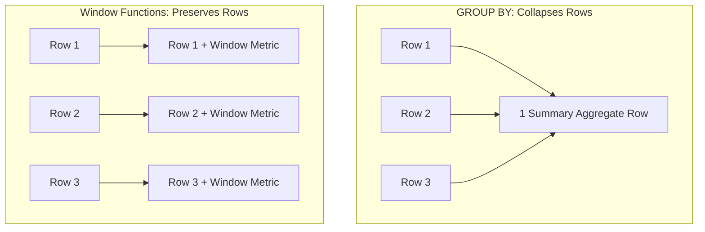

# What are Window Functions

---

## 🟢 Junior Level

**Window functions** are specialized SQL analytical functions that perform calculations across a set of table rows related to the current row (a "window"), while **preserving the individual identity and detail of every single row**.

Unlike **`GROUP BY`**, which collapses multiple rows into a single summary record, window functions produce a 1:1 row output: every original input row remains intact in the result set, augmented with the calculated analytical metrics.



### Simple Real-World Analogy
Imagine a classroom of students receiving test scores:
- **`GROUP BY`:** The teacher collects all test papers and writes a single number on the chalkboard: *"Class Average: 85%"*. All individual student names, test answers, and individual grades are erased.
- **`Window Function`:** The teacher returns each student's personal exam paper with their individual score (e.g., *Alice: 94%*), and stamped next to it is the class average (*Class Avg: 85%*). Every student retains their personal record while gaining aggregate context.

### Basic SQL Example
```sql
-- Retrieve each employee's salary alongside their department's average salary:
SELECT 
    name,
    department,
    salary,
    AVG(salary) OVER (PARTITION BY department) AS dept_avg_salary
FROM employees;

-- Result: Every row is preserved!
-- name    | department | salary | dept_avg_salary
-- Alice   | IT         | 150000 | 140000
-- Bob     | IT         | 130000 | 140000
-- Charlie | HR         | 90000  | 85000
-- Diana   | HR         | 80000  | 85000
```

### Major Categories of Window Functions
1. **Aggregate Functions:** `SUM() OVER(...)`, `AVG() OVER(...)`, `COUNT() OVER(...)`, `MIN() / MAX() OVER(...)`.
2. **Ranking Functions:** `ROW_NUMBER()`, `RANK()`, `DENSE_RANK()`, `NTILE()`.
3. **Value / Navigation Functions:** `LAG()` (previous row), `LEAD()` (subsequent row), `FIRST_VALUE()`, `LAST_VALUE()`.

---

## 🟡 Middle Level

### Anatomy of the `OVER` Clause

A window specification is declared using the `OVER (...)` clause, consisting of three optional components:

```sql
FUNCTION() OVER (
    PARTITION BY department_id              -- 1. Logical division into window buckets
    ORDER BY hire_date ASC                  -- 2. Sort sequence within each bucket
    ROWS BETWEEN 2 PRECEDING AND CURRENT ROW -- 3. Window frame boundaries
)
```

1. **`PARTITION BY`**: Divides rows into independent partitions. If omitted, the entire result set is treated as a single partition.
2. **`ORDER BY`**: Determines the evaluation order within each partition (vital for running totals and rankings).
3. **`ROWS / RANGE / GROUPS` (Frame Clause)**: Defines the sliding window boundaries relative to the active row.

### `GROUP BY` vs. Window Functions Comparison

| Feature | `GROUP BY` Aggregation | Window Functions (`OVER`) |
|---|---|---|
| **Output Cardinality** | Collapses rows (1 row per group) | Preserves all rows (1:1 mapping) |
| **Row Payload** | Discards individual row attributes | Retains all original column attributes |
| **Pipeline Stage** | Evaluated **before** `HAVING` and `SELECT` | Evaluated **in `SELECT`**, after `WHERE`, `GROUP BY`, `HAVING` |
| **Query Combination** | Cannot display fine details + aggregates | Can be combined with `GROUP BY` (window over aggregates) |

### Frame Modes: `ROWS` vs. `RANGE` vs. `GROUPS`

When an `ORDER BY` clause is present without an explicit frame, SQL defaults to:
$$\text{RANGE BETWEEN UNBOUNDED PRECEDING AND CURRENT ROW}$$

```sql
-- 1. ROWS: Evaluates physical row offsets (Highest Performance)
SELECT date, amount,
       AVG(amount) OVER (
           ORDER BY date 
           ROWS BETWEEN 6 PRECEDING AND CURRENT ROW
       ) AS moving_avg_7_rows
FROM sales;

-- 2. RANGE: Evaluates logical value intervals (Handles duplicate timestamps properly)
SELECT date, amount,
       SUM(amount) OVER (
           ORDER BY date 
           RANGE BETWEEN INTERVAL '7 days' PRECEDING AND CURRENT ROW
       ) AS weekly_revenue
FROM sales;
```

> [!WARNING]
> **The Default Frame Trap:** When duplicate keys exist in `ORDER BY` (e.g., multiple sales at the exact same timestamp), the default `RANGE` evaluates all tied rows as a single "peer group" and accumulates their values simultaneously. `ROWS` moves strictly row-by-row. Furthermore, `ROWS` avoids value comparisons in memory and is substantially faster than `RANGE`.

### Navigation Functions: `LAG()` and `LEAD()`

Navigation functions eliminate the need for costly self-joins when analyzing sequential time series:

```sql
-- Calculate Month-over-Month (MoM) revenue growth:
SELECT 
    report_month,
    revenue,
    LAG(revenue, 1) OVER (ORDER BY report_month) AS prev_month_revenue,
    revenue - LAG(revenue, 1) OVER (ORDER BY report_month) AS mom_growth
FROM monthly_financials;
```

### Java & Hibernate Ecosystem Support

Historically, window functions were a significant friction point in Java enterprise development:

- **Prior to Hibernate 6:** HQL/JPQL **did not support** window functions. Developers were forced to use native SQL (`createNativeQuery`), database views, or jOOQ.
- **Hibernate 6+ (Spring Boot 3+):** Window functions are a **first-class citizen in HQL/JPQL**, allowing direct mapping to Java Records and DTOs:

```java
// ✅ Valid HQL in Spring Boot 3 / Hibernate 6+:
@Query("""
    SELECT new com.example.dto.EmployeeRankDto(
        e.id,
        e.name,
        e.salary,
        DENSE_RANK() OVER (PARTITION BY e.department.id ORDER BY e.salary DESC)
    )
    FROM Employee e
""")
List<EmployeeRankDto> findRankedSalaries();
```

---

## 🔴 Senior Level

### Physical Execution Internals: The `WindowAgg` Node

In PostgreSQL execution plans, window calculations are processed by dedicated **`WindowAgg`** plan nodes:

```text
QUERY PLAN:
WindowAgg  (cost=125000.00..145000.00 rows=1000000 width=32) (actual time=820.10..1120.30 rows=1000000 loops=1)
  ->  Sort  (cost=125000.00..127500.00 rows=1000000 width=24) (actual time=610.15..720.40 rows=1000000 loops=1)
        Sort Key: department_id, salary DESC
        Sort Method: quicksort  Memory: 78000kB
        ->  Seq Scan on employees  (...)
```

**PostgreSQL Pipeline:**
1. Rows are filtered via `WHERE`, grouped by `GROUP BY`, and filtered by `HAVING`.
2. Qualified rows are sorted in `work_mem` by the `Sort` node according to `(PARTITION BY keys, ORDER BY keys)`.
3. The `WindowAgg` node streams through the sorted tuples, maintaining the active frame in memory and updating accumulators incrementally.

### Index Optimization: Eliminating the `Sort` Node

Sorting millions of records for a window function consumes extensive CPU and `work_mem`. If `work_mem` is exceeded, the sort spills to disk.  
You can **completely eliminate the `Sort` node** by creating a composite B-tree index matching the exact columns and order of `PARTITION BY` followed by `ORDER BY`:

```sql
-- Optimal composite B-tree index:
CREATE INDEX idx_orders_dept_date ON orders(department_id, created_at);

-- Query:
SELECT 
    department_id, 
    created_at, 
    amount,
    SUM(amount) OVER (PARTITION BY department_id ORDER BY created_at) AS running_total
FROM orders;

-- Execution Plan:
-- WindowAgg  (cost=0.43..8500.00 rows=200000 width=20)
--   ->  Index Scan using idx_orders_dept_date on orders
--       (The expensive Sort node is COMPLETELY ELIMINATED!)
```

### The Multi-Window Penalty and the `WINDOW` Clause

If a single SQL query uses multiple window functions with differing `PARTITION BY` or `ORDER BY` specifications, PostgreSQL must perform **multiple separate sort operations**:

```sql
-- ⚠️ SEVERE PERFORMANCE PENALTY: Triggers 3 independent sorting passes
SELECT 
    AVG(amount) OVER (PARTITION BY user_id) AS u_avg,
    AVG(amount) OVER (PARTITION BY store_id) AS s_avg,
    AVG(amount) OVER (PARTITION BY region_id ORDER BY date) AS r_avg
FROM orders;
```

**Optimization via Named Windows:** Standardize partition structures and eliminate duplicate sort overhead using the explicit `WINDOW` clause:

```sql
SELECT 
    user_id,
    amount,
    AVG(amount) OVER w AS avg_spent,
    SUM(amount) OVER w AS total_spent,
    COUNT(*) OVER w AS orders_count
FROM orders
WINDOW w AS (
    PARTITION BY user_id 
    ORDER BY created_at 
    ROWS BETWEEN UNBOUNDED PRECEDING AND CURRENT ROW
);
```

### Incremental Sort Integration (PostgreSQL 13+)

If an index exists only on `(department_id)` but not on `(department_id, created_at)`, PostgreSQL 13+ leverages **Incremental Sort**:
- The engine does not perform a global quicksort of the entire table.
- It scans the pre-ordered `department_id` groups and sorts `created_at` in small, localized batches per group.
- This dramatically lowers `work_mem` demand and slashes time-to-first-row latency.

### Fine-Grained Framing with `EXCLUDE` (PostgreSQL 11+)

The `EXCLUDE` clause allows surgical control over which rows are admitted into the active frame:
- `EXCLUDE CURRENT ROW`: Omits the active row from its own frame (e.g., comparing an employee's salary against the average of all *other* peers).
- `EXCLUDE GROUP`: Omits the current row and all peer rows matching its `ORDER BY` key.
- `EXCLUDE TIES`: Omits peer rows with matching sort keys, but retains the current row.

```sql
SELECT name, department_id, salary,
       AVG(salary) OVER (
           PARTITION BY department_id 
           ORDER BY salary
           ROWS BETWEEN UNBOUNDED PRECEDING AND UNBOUNDED FOLLOWING
           EXCLUDE CURRENT ROW
       ) AS peers_average_salary
FROM employees;
```

---

## 4 Tricky Questions

### 1. Why does `SELECT * FROM orders WHERE ROW_NUMBER() OVER (...) = 1` throw a syntax error, and what is the exact execution stage order?
**Answer:**  
In the SQL standard logical execution pipeline, clauses are evaluated in this strict order:
$$\text{FROM} \longrightarrow \text{WHERE} \longrightarrow \text{GROUP BY} \longrightarrow \text{HAVING} \longrightarrow \mathbf{SELECT \ (WindowAgg)} \longrightarrow \text{DISTINCT} \longrightarrow \text{ORDER BY} \longrightarrow \text{LIMIT}$$
`WHERE` filters base rows at Step 2 to decide which tuples enter query execution. Window functions are computed at Step 5 as part of output column projection (`SELECT`). At the moment `WHERE` executes, the window partitions and rankings **do not yet exist**.  
To filter by a window result, the calculation must be wrapped in a **CTE** or **derived subquery**, allowing the outer `WHERE` to filter after the inner `SELECT` finishes:
```sql
WITH ranked AS (
    SELECT *, ROW_NUMBER() OVER (PARTITION BY user_id ORDER BY created_at DESC) AS rn
    FROM orders
)
SELECT * FROM ranked WHERE rn = 1;
```

### 2. What is the fundamental difference between `ROWS` and `RANGE` when calculating a running total with duplicate keys, and which is faster?
**Answer:**  
- **`ROWS` (Physical):** Operates on physical row counts relative to the current position. With duplicate values in the sort column, `ROWS` processes each row sequentially, producing distinct incrementing running totals.
- **`RANGE` (Logical):** Operates on logical value offsets. With duplicate values in the sort column, `RANGE` treats all rows with identical keys as a single "peer group". The running total jumps to include all peer rows simultaneously for each row in that peer set.
- **Performance:** `ROWS` is substantially faster because it requires simple array pointer arithmetic in memory, whereas `RANGE` must compare row values to detect when peer groups end.

### 3. How does `COUNT(*) OVER()` affect performance when implemented for UI pagination with `LIMIT 20`?
**Answer:**  
It completely destroys the performance advantage of `LIMIT`.  
A standard `SELECT ... LIMIT 20` can utilize an index scan to retrieve exactly 20 matching tuples and stop reading immediately (short-circuit execution).  
Adding `COUNT(*) OVER() AS total_records` forces PostgreSQL to perform a full scan of the entire qualified dataset (potentially millions of rows) into memory just to calculate the partition count before returning the first 20 rows. For pagination on large tables, calculate total counts asynchronously or rely on keyset (cursor-based) pagination.

### 4. How can you design an optimal B-tree index for a query containing multiple window functions that use the same `PARTITION BY` and `ORDER BY`?
**Answer:**  
Construct a composite B-tree index where the leading columns match the `PARTITION BY` expression, followed immediately by the `ORDER BY` expression:
$$\text{CREATE INDEX idx\_opt ON tbl (partition\_col, order\_col);}$$
When PostgreSQL executes the query:
1. The `Index Scan` reads tuples already pre-partitioned and pre-sorted.
2. The `Sort` node is completely bypassed.
3. The `WindowAgg` node streams tuples directly from the index, executing in $O(N)$ streaming time with $O(1)$ memory overhead instead of an expensive $O(N \log N)$ sort in `work_mem`.

---

## 🎯 Interview Cheat Sheet

### Core Concepts (First 30 Seconds)
- **Definition:** Window functions compute analytical, ranking, and aggregation metrics across partitions of rows without collapsing rows (maintains a 1:1 mapping with input rows).
- **Syntax:** `FUNCTION() OVER (PARTITION BY ... ORDER BY ... ROWS/RANGE BETWEEN ...)`.
- **Primary Types:**
  - Aggregates: `SUM()`, `AVG()`, `COUNT()`, `MIN()`, `MAX()`.
  - Ranking: `ROW_NUMBER()` (unique incremental), `RANK()` (gaps on ties), `DENSE_RANK()` (no gaps on ties).
  - Navigation: `LAG()` (previous row), `LEAD()` (next row).
- **Execution Order:** Evaluated strictly inside `SELECT`, after `WHERE`, `GROUP BY`, and `HAVING`, but before `ORDER BY` and `LIMIT`.
- **Filtering Requirement:** Direct filtering in `WHERE` is prohibited; requires CTE or derived table wrapper.

### Advanced Architectural Knowledge
- **PostgreSQL Plan Node:** Evaluated by `WindowAgg`. Follows a `Sort` node unless optimized with an index.
- **Index Optimization:** A composite B-tree index on `(PARTITION BY cols, ORDER BY cols)` completely eliminates the `Sort` node.
- **Default Frame Trap:** Omitted frame with `ORDER BY` defaults to `RANGE BETWEEN UNBOUNDED PRECEDING AND CURRENT ROW`. Specify `ROWS` for higher speed and strict row-by-row progression.
- **Hibernate 6+:** Native HQL/JPQL window function support with direct Record/DTO projection.
- **Multi-Window Optimization:** Use `WINDOW w AS (...)` to share window definitions and avoid redundant sort passes.

### Red Flags (What NOT to Say)
- ❌ *"Window functions collapse rows just like GROUP BY."* (They never collapse rows; every row is retained).
- ❌ *"You can filter ROW_NUMBER() directly in the WHERE clause."* (WHERE runs before window calculations; triggers a syntax error).
- ❌ *"You can nest window functions like AVG(SUM(...) OVER()) OVER()."* (Nesting window functions is illegal in SQL; use CTE chains).
- ❌ *"COUNT(*) OVER() is free for pagination."* (It forces full table/partition evaluation, neutralizing `LIMIT` optimizations).

### Related Topics
- [What does ROW_NUMBER() do](15.%20What%20does%20ROW_NUMBER%28%29%20do.md) — Unique sequential ranking without gaps
- [What does RANK() and DENSE_RANK() do](16.%20What%20does%20RANK%28%29%20and%20DENSE_RANK%28%29%20do.md) — Handling tied rankings and duplicate values
- [What does GROUP BY do](12.%20What%20does%20GROUP%20BY%20do.md) — Row collapsing vs window framing
- [Difference between WHERE and HAVING](11.%20Difference%20between%20WHERE%20and%20HAVING.md) — Logical query processing pipeline
