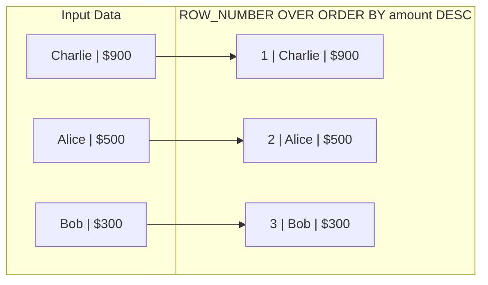

# What does ROW_NUMBER() do

---

## 🟢 Junior Level

**`ROW_NUMBER()`** is an analytical SQL window ranking function that assigns a **unique, contiguous sequential integer** (beginning at 1) to each row within its window partition, ordered strictly according to the specified `ORDER BY` clause.



### Simple Real-World Analogy
Imagine a queuing ticketing machine at a bank:
Every visitor presses a button upon entering and receives a ticket stamped with a unique, monotonically increasing number: 1, 2, 3, 4... Even if two customers walk through the front door at the exact same millisecond and request the exact same service, their ticket numbers are **strictly unique** and will never collide.

### Basic SQL Example
```sql
-- Number customer orders from highest amount to lowest:
SELECT 
    id,
    user_id,
    amount,
    ROW_NUMBER() OVER (ORDER BY amount DESC) AS row_num
FROM orders;

-- Result:
-- id | user_id | amount | row_num
-- 42 | 10      | 9500   | 1
-- 15 | 20      | 4200   | 2
-- 89 | 10      | 1500   | 3
```

### Primary Production Use Cases
1. **Top-N Records per Group:** Selecting the 3 most recent orders for each customer.
2. **Data Deduplication:** Deleting duplicate rows while keeping exactly one copy (`rn = 1`).
3. **Sequential Reporting:** Displaying numbered invoice line items or leaderboard rankings.

---

## 🟡 Middle Level

### Syntax and Partitioning (`PARTITION BY`)

```sql
ROW_NUMBER() OVER (
    PARTITION BY group_column       -- Optional: resets numbering counter to 1 per group
    ORDER BY sort_column [ASC|DESC] -- Mandatory: defines deterministic sorting sequence
)
```

#### Pattern 1: Top-N per Group
A classic interview question: *"Find the most recent order placed by every customer"*:

```sql
WITH RankedOrders AS (
    SELECT 
        id,
        user_id,
        amount,
        created_at,
        ROW_NUMBER() OVER (
            PARTITION BY user_id 
            ORDER BY created_at DESC, id DESC
        ) AS rn
    FROM orders
)
SELECT id, user_id, amount, created_at
FROM RankedOrders
WHERE rn = 1; -- Exactly one latest order per user
```

#### Pattern 2: Table Deduplication
Cleaning duplicate records while retaining the single newest entry:

```sql
WITH RankedDuplicates AS (
    SELECT 
        ctid, -- PostgreSQL physical tuple identifier
        ROW_NUMBER() OVER (
            PARTITION BY email 
            ORDER BY updated_at DESC, id DESC
        ) AS rn
    FROM users
)
DELETE FROM users
WHERE ctid IN (
    SELECT ctid FROM RankedDuplicates WHERE rn > 1
);
```

### The Non-Determinism Trap

If the sorting column in `ORDER BY` contains identical values (e.g., multiple accounts created at the exact same millisecond), the SQL standard **does not guarantee** which row receives `1` and which receives `2`. The database engine may return different rankings on subsequent runs or across query plan changes:

```sql
-- ❌ DANGEROUS: Flapping order on timestamp collisions
ROW_NUMBER() OVER (ORDER BY created_at DESC)

-- ✅ DETERMINISTIC: Append Primary Key as an unambiguous tie-breaker!
ROW_NUMBER() OVER (ORDER BY created_at DESC, id DESC)
```

### Function Comparison: `ROW_NUMBER()` vs. `RANK()` vs. `DENSE_RANK()`

| Function | Sequence on Duplicate Sort Keys | Gap Behavior | Primary Use Case |
|---|---|---|---|
| **`ROW_NUMBER()`** | `1, 2, 3, 4, 5` | **Zero gaps** (strictly unique integers) | Selecting single Top-1 item, deduplication |
| **`RANK()`** | `1, 2, 2, 4, 5` | **Leaves gaps** after ties | Sports tournaments (two silvers, next is 4th) |
| **`DENSE_RANK()`** | `1, 2, 2, 3, 4` | **Zero gaps** after ties | Salary bands, consecutive performance tiers |

### Java & Spring Data JPA Integration (Hibernate 6+)

In Spring Boot 3+ (Hibernate 6+), window functions are natively supported in HQL and map directly into Java Records:

```java
// Spring Data JPA DTO Projection via Java Record
public record UserLatestOrderDto(Long orderId, Long userId, BigDecimal amount, Long rowNum) {}

public interface OrderRepository extends JpaRepository<Order, Long> {

    @Query("""
        SELECT new com.example.dto.UserLatestOrderDto(
            o.id, 
            o.user.id, 
            o.amount, 
            ROW_NUMBER() OVER (PARTITION BY o.user.id ORDER BY o.createdAt DESC, o.id DESC)
        )
        FROM Order o
    """)
    List<UserLatestOrderDto> findAllOrdersWithRank();
}
```

---

## 🔴 Senior Level

### Physical Execution Optimization: Sort Elimination

Computing `ROW_NUMBER()` is computationally trivial ($O(1)$ memory counter increment inside the `WindowAgg` executor node). The primary CPU and I/O cost comes from the **`Sort`** node that arranges tuples prior to numbering.

By creating a composite B-tree index covering `(PARTITION BY cols, ORDER BY cols)`, the optimizer **completely eliminates the `Sort` node**:

```sql
-- Composite B-tree index matching partition and sort keys:
CREATE INDEX idx_orders_user_created ON orders(user_id, created_at DESC, id DESC);

EXPLAIN (ANALYZE, BUFFERS)
SELECT user_id, amount, created_at,
       ROW_NUMBER() OVER (PARTITION BY user_id ORDER BY created_at DESC, id DESC) AS rn
FROM orders;

-- Execution Plan:
-- WindowAgg  (cost=0.43..18500.00 rows=500000 width=24) (actual time=0.080..420.10 rows=500000 loops=1)
--   ->  Index Scan using idx_orders_user_created on orders
--       Buffers: shared hit=42150
-- VERIFICATION: Sort node is completely eliminated! Streaming execution at index scan speeds.
```

### Bounded Heap Sort (Top-K Priority Queue)

When a query filters an ordered window calculation with an outer limit or threshold (`WHERE rn <= K`):

```sql
SELECT * FROM (
    SELECT id, amount, ROW_NUMBER() OVER (ORDER BY amount DESC) AS rn
    FROM orders
) sub
WHERE rn <= 10;
```

PostgreSQL avoids sorting all 10,000,000 records in `work_mem` ($O(N \log N)$). Instead, the planner deploys a **Bounded Heap Sort**:
- It maintains an in-memory binary min-heap capped at exactly $K = 10$ elements.
- Each incoming tuple is compared against the root of the heap in $O(\log K)$ time.
- Memory consumption is capped at $O(K)$ rather than $O(N)$, completely preventing temporary disk spills (`spill to disk`).

### Keyset Pagination vs. `ROW_NUMBER()` Deep Pagination

A critical architectural pitfall in web APIs is implementing deep pagination using `ROW_NUMBER() BETWEEN 50001 AND 50020` or `LIMIT 20 OFFSET 50000`:

```sql
-- ❌ CATASTROPHIC AT SCALE (Deep Offset):
-- Scans, sorts, and numbers all 50,020 preceding rows before returning 20!
SELECT * FROM (
    SELECT id, title, ROW_NUMBER() OVER (ORDER BY id) AS rn
    FROM articles
) sub
WHERE rn BETWEEN 50001 AND 50020;

-- ✅ PRODUCTION STANDARD: Keyset Pagination (Seek Method / Cursor-based)
-- Instant B-tree seek directly to target boundary in O(log N)
SELECT id, title
FROM articles
WHERE id > 50000 -- Primary key of the last record from the preceding page
ORDER BY id ASC
LIMIT 20;
```
In Spring Data 3.1+, this pattern is standardized via the **Keyset Scrolling API (`ScrollPosition.keyset()`)**.

### The `COUNT(*) OVER()` Pagination Anti-Pattern

When APIs require returning total matching records alongside paginated results:
```sql
SELECT id, name,
       ROW_NUMBER() OVER (ORDER BY id) AS rn,
       COUNT(*) OVER () AS total_count -- ⚠️ PERFORMANCE KILLER!
FROM users
LIMIT 20;
```
Even with `LIMIT 20`, `COUNT(*) OVER ()` forces PostgreSQL to **scan and count every row across the entire table into memory**, completely disabling short-circuit execution. In high-traffic systems, retrieve counts asynchronously, estimate via `reltuples` in `pg_class`, or omit total page counts.

---

## 4 Tricky Questions

### 1. How can you retrieve the single latest order for each customer in PostgreSQL without using window functions, and how does its performance compare?
**Answer:**  
Using the PostgreSQL-specific **`DISTINCT ON`** clause:
```sql
SELECT DISTINCT ON (user_id) 
    id, user_id, amount, created_at
FROM orders
ORDER BY user_id, created_at DESC, id DESC;
```
**Performance:** When backed by a composite B-tree index on `(user_id, created_at DESC, id DESC)`, `DISTINCT ON` utilizes a `Unique` node over an `Index Scan`. It reads only the very first tuple for each `user_id` and can be substantially faster and use less memory than `ROW_NUMBER()` because it discards subsequent rows immediately without passing them through `WindowAgg`.

### 2. Why does `SELECT id, ROW_NUMBER() OVER () FROM t WHERE ROW_NUMBER() OVER () <= 5` produce an error, and how is it resolved?
**Answer:**  
SQL strictly prohibits window functions in the `WHERE` clause (`ERROR: window functions are not allowed in WHERE`).  
In SQL logical query execution:
$$\text{FROM} \longrightarrow \text{WHERE} \longrightarrow \text{GROUP BY} \longrightarrow \text{HAVING} \longrightarrow \mathbf{SELECT \ (WindowAgg)} \longrightarrow \text{ORDER BY} \longrightarrow \text{LIMIT}$$
`WHERE` executes at Step 2 to filter incoming rows. `WindowAgg` executes at Step 5. At Step 2, the window numbering does not yet exist. The solution is wrapping the window function in a **CTE** or **derived subquery**, allowing an outer `WHERE` to filter the projected column.

### 3. What is Bounded Heap Sort, and how does PostgreSQL prevent disk spilling for queries like `WHERE rn <= 10`?
**Answer:**  
Normally, sorting requires $O(N \log N)$ operations and can exceed `work_mem`, spilling temporary files to disk. When PostgreSQL detects that an outer filter restricts the output to $K$ rows (`WHERE rn <= K`), the planner replaces quicksort with **Bounded Heap Sort**:
1. It allocates a fixed-size priority heap of size $K$ in memory.
2. It streams rows sequentially: if an incoming tuple ranks higher than the minimum item currently in the heap, the minimum item is evicted and the new tuple is inserted in $O(\log K)$ time.
3. Total memory stays strictly $O(K)$, eliminating disk I/O completely.

### 4. Why is Keyset Pagination fundamentally superior to `ROW_NUMBER()` pagination for infinite scrolling feeds?
**Answer:**  
- **`ROW_NUMBER()` / `OFFSET` ($O(N)$):** Fetching page 5,000 requires the engine to traverse and rank all 100,000 preceding rows. Page 1 takes 1 ms, but page 5,000 takes 1,500 ms.
- **Keyset Pagination ($O(\log N)$):** By passing the last seen key (`WHERE id > :lastSeenId ORDER BY id ASC LIMIT 20`), the B-tree index performs a point seek directly to the 100,001st row in $O(\log N)$ operations, scanning exactly 20 tuples. Page 5,000 executes in 0.5 ms—the exact same speed as Page 1.

---

## 🎯 Interview Cheat Sheet

### Core Concepts (First 30 Seconds)
- **Primary Function:** Assigns a strictly unique, contiguous integer (`1, 2, 3...`) to every row in its window partition.
- **Mandatory ORDER BY:** Requires an explicit `ORDER BY` clause; otherwise, sequential numbering is meaningless.
- **Tie-Breaker Rule:** If the sort column has duplicates, always append the primary key (`id`) to ensure deterministic output across runs.
- **Filtering Requirement:** Must be wrapped in a CTE or subquery to filter (`WHERE rn = 1`); cannot filter window functions directly in `WHERE`.
- **Comparison:**
  - `ROW_NUMBER()`: `1, 2, 3, 4` (unique, no ties, no gaps).
  - `RANK()`: `1, 2, 2, 4` (ties share rank, leaves gaps).
  - `DENSE_RANK()`: `1, 2, 2, 3` (ties share rank, no gaps).

### Key Architectural Optimizations
- **Index Elimination:** An index on `(PARTITION BY cols, ORDER BY cols)` eliminates the physical `Sort` node, streaming tuples directly into `WindowAgg`.
- **Top-K Bounded Sort:** Queries with `WHERE rn <= K` utilize an in-memory priority queue ($O(K)$ space), avoiding disk spills.
- **PostgreSQL Alternative:** Use `DISTINCT ON (col)` as a fast native alternative to `ROW_NUMBER() = 1`.
- **Hibernate 6+:** Native HQL window function support with Java Record projection.

### Red Flags (What NOT to Say)
- ❌ *"ROW_NUMBER() assigns the same number to identical rows."* (That is `RANK()`/`DENSE_RANK()`; `ROW_NUMBER()` is strictly unique).
- ❌ *"Use ROW_NUMBER() BETWEEN 100000 AND 100020 for pagination on large tables."* (Forces scanning 100k rows; use Keyset Pagination).
- ❌ *"You can put ROW_NUMBER() in the WHERE clause."* (Syntax error; window functions execute in SELECT).
- ❌ *"ROW_NUMBER() is non-deterministic by definition."* (It is 100% deterministic when a unique key is appended to ORDER BY).

### Related Topics
- [What does RANK() and DENSE_RANK() do](16.%20What%20does%20RANK%28%29%20and%20DENSE_RANK%28%29%20do.md) — Comparison of ranking functions with duplicate keys
- [What are Window Functions](14.%20What%20are%20Window%20Functions.md) — Window frame syntax and WindowAgg mechanics
- [When should you create an index](4.%20When%20should%20you%20create%20an%20index.md) — Index order for sorting elimination
- [What is Explain plan](20.%20What%20is%20Explain%20plan.md) — Inspecting WindowAgg and Bounded Sort plan nodes
