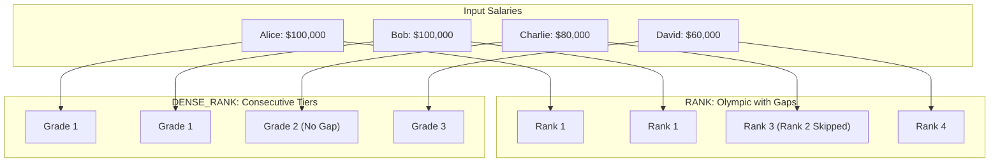

# What does RANK() and DENSE_RANK() do

---

## 🟢 Junior Level

Both **`RANK()`** and **`DENSE_RANK()`** are SQL analytical window functions designed to assign an ordinal ranking position to each row based on a specified `ORDER BY` clause. When multiple rows share identical sort values (a **tie**), both functions assign them the **same rank**, but they differ in how they number subsequent rows:

- **`RANK()` (Olympic Podium System):** Leaves **gaps** in the ranking sequence after ties. If two contestants share 1st place, the next contestant receives 3rd place (rank 2 is skipped: `1, 1, 3, 4`).
- **`DENSE_RANK()` (Consecutive Tier System):** Leaves **no gaps** after ties. If two contestants share 1st place, the next contestant receives 2nd place (`1, 1, 2, 3`).



### Basic SQL Example
```sql
SELECT 
    name,
    salary,
    ROW_NUMBER() OVER (ORDER BY salary DESC) AS row_num,
    RANK()       OVER (ORDER BY salary DESC) AS olympic_rank,
    DENSE_RANK() OVER (ORDER BY salary DESC) AS salary_dense_rank
FROM employees;

-- Result:
-- name    | salary | row_num | olympic_rank | salary_dense_rank
-- Alice   | 100000 | 1       | 1            | 1
-- Bob     | 100000 | 2       | 1            | 1
-- Charlie | 80000  | 3       | 3            | 2   <-- Difference appears here!
-- David   | 60000  | 4       | 4            | 3
```

### Simple Mnemonic Rule
- **Leaderboards / Tournaments** where you need to know how many competitors are strictly ahead $\longrightarrow$ Use **`RANK()`**.
- **Salary Grades / Price Brackets / N-th Highest Value** where tiers must be consecutive without missing levels $\longrightarrow$ Use **`DENSE_RANK()`**.
- **Strict Unique Row Identification / Pagination** where ties must be uniquely ordered $\longrightarrow$ Use **`ROW_NUMBER()`**.

---

## 🟡 Middle Level

### Behavior on Multiple Duplicate Values (Ties)

Consider a dataset with three tied top values: `[100, 100, 100, 80, 60]`:

```sql
SELECT 
    score,
    ROW_NUMBER() OVER (ORDER BY score DESC) AS row_num,
    RANK()       OVER (ORDER BY score DESC) AS rank,
    DENSE_RANK() OVER (ORDER BY score DESC) AS dense_rank
FROM scores;

-- Result:
-- score | row_num | rank | dense_rank
-- 100   | 1       | 1    | 1
-- 100   | 2       | 1    | 1
-- 100   | 3       | 1    | 1
-- 80    | 4       | 4    | 2   <-- RANK jumps to 4; DENSE_RANK advances to 2
-- 60    | 5       | 5    | 3
```

| Criterion | `ROW_NUMBER()` | `RANK()` | `DENSE_RANK()` |
|---|---|---|---|
| **Tie Handling** | Arbitrary distinct integers | Identical rank | Identical rank |
| **Gaps After Ties** | None | **Yes** ($\text{Gap} = \text{Ties} - 1$) | **No** (Subsequent rank = Current + 1) |
| **Maximum Rank** | Always equals total row count $N$ | Always $\le N$ | Equals count of *distinct* values |
| **Guaranteed Unique**| Yes | No | No |

### Classic Interview Problem: Finding the N-th Highest Salary

A standard technical interview question: *"Find all employees who earn the 2nd highest salary in the company"*:

```sql
-- ❌ FLAWED with LIMIT/OFFSET:
-- If 3 employees share the 1st highest salary, OFFSET 1 returns another 1st-place earner!
SELECT salary FROM employees ORDER BY salary DESC LIMIT 1 OFFSET 1;

-- ❌ FLAWED with RANK():
-- If 2 employees tie for 1st place, RANK() assigns them rank 1 and skips to rank 3!
-- Query returns 0 rows:
WITH Ranked AS (
    SELECT salary, RANK() OVER (ORDER BY salary DESC) AS r FROM employees
)
SELECT salary FROM Ranked WHERE r = 2;

-- ✅ CANONICAL SOLUTION with DENSE_RANK():
WITH DenseRanked AS (
    SELECT 
        employee_id,
        salary,
        DENSE_RANK() OVER (ORDER BY salary DESC NULLS LAST) AS salary_rank
    FROM employees
)
SELECT employee_id, salary
FROM DenseRanked
WHERE salary_rank = 2; -- Reliably returns all employees at the 2nd distinct salary level!
```

### The PostgreSQL `NULL` Sorting Trap

In the SQL standard and PostgreSQL, `NULL` is considered **greater than any non-NULL value**:
- In `ORDER BY salary ASC`, `NULL` values sort to the end by default (`NULLS LAST`).
- In `ORDER BY salary DESC`, `NULL` values sort to the **very beginning** by default (`NULLS FIRST`)!

```sql
-- ❌ PRODUCTION HAZARD: Employees with salary = NULL will accidentally be awarded Rank 1!
SELECT name, salary, RANK() OVER (ORDER BY salary DESC) AS r FROM employees;

-- ✅ BEST PRACTICE: Always specify NULLS LAST explicitly
SELECT name, salary, 
       RANK() OVER (ORDER BY salary DESC NULLS LAST) AS r 
FROM employees;
```

### Related Statistical Window Functions: NTILE, PERCENT_RANK, CUME_DIST

1. **`NTILE(N)`** divides an ordered partition as evenly as possible into $N$ buckets:
   ```sql
   -- Segment customers into revenue quartiles (1 = Top 25%, 4 = Bottom 25%):
   SELECT customer_id, total_spent,
          NTILE(4) OVER (ORDER BY total_spent DESC) AS revenue_quartile
   FROM customer_totals;
   ```

2. **`PERCENT_RANK()`** computes relative percentile rank from `0.0` (highest) to `1.0` (lowest):
   $$\text{PERCENT\_RANK} = \frac{\text{RANK} - 1}{N - 1}$$
   where $N$ is the total row count in the partition.

3. **`CUME_DIST()`** (Cumulative Distribution) computes the proportion of partition rows with values less than or equal to the current row value.

### Java & Spring Boot 3 Integration (Hibernate 6+)

In modern Spring Boot 3+, window ranking functions map directly to Java Records via HQL:

```java
public record PlayerLeaderboardDto(Long playerId, String username, Integer score, Long rank) {}

public interface PlayerRepository extends JpaRepository<Player, Long> {

    @Query("""
        SELECT new com.example.dto.PlayerLeaderboardDto(
            p.id,
            p.username,
            p.score,
            RANK() OVER (ORDER BY p.score DESC NULLS LAST)
        )
        FROM Player p
    """)
    List<PlayerLeaderboardDto> getGlobalLeaderboard();
}
```

---

## 🔴 Senior Level

### Physical Execution Cost: Peer Checking and Engine Mechanics

Different ranking functions incur distinct computational overhead inside PostgreSQL's `WindowAgg` execution node:

1. **`ROW_NUMBER()` ($O(N)$):**
   - Requires zero comparison logic.
   - Simply increments an internal 64-bit integer counter as each tuple streams through the node.

2. **`RANK()` and `DENSE_RANK()` ($O(N \cdot \text{attribute comparison})$):**
   - Requires a **Peer Check**: the executor must buffer the previous row's sort attributes and compare them with the active tuple.
   - For `RANK()`, if sort values match, the rank counter is unchanged while an internal physical row counter continues incrementing. On value divergence, the rank jumps to the physical row counter.
   - For `DENSE_RANK()`, the rank counter increments strictly by 1 only when sort values diverge.

On tables containing 50M–100M rows, `ROW_NUMBER()` executes approximately **1.5x–2x faster** than `RANK()` or `DENSE_RANK()` due to bypassing peer value comparisons.

### Eliminating the `Sort` Node via B-Tree Indexing

Ranking functions require inputs to be sorted. By constructing a composite B-tree index matching `(PARTITION BY cols, ORDER BY cols [DESC NULLS LAST])`, PostgreSQL transforms the plan into `WindowAgg -> Index Scan`, **completely eliminating the `Sort` node**:

```sql
-- Optimal composite index matching partition and sort keys:
CREATE INDEX idx_emp_dept_salary ON employees(department_id, salary DESC NULLS LAST);

EXPLAIN (ANALYZE, BUFFERS)
SELECT department_id, name, salary,
       DENSE_RANK() OVER (
           PARTITION BY department_id 
           ORDER BY salary DESC NULLS LAST
       ) AS dept_salary_rank
FROM employees;

-- Execution Plan:
-- WindowAgg  (cost=0.43..22100.00 rows=600000 width=28) (actual time=0.040..510.20 rows=600000 loops=1)
--   ->  Index Scan using idx_emp_dept_salary on employees
-- VERIFICATION: The Sort node is completely bypassed!
```

### Fair Top-N Leaderboards vs. Non-Deterministic `LIMIT`

In competitions, financial scoring, and reward allocations, using `LIMIT K` introduces a critical business defect:

```sql
-- ❌ UNFAIR ARBITRARY TRUNCATION (Unfair Top-3):
SELECT user_id, points 
FROM contest_participants 
ORDER BY points DESC 
LIMIT 3;
-- Scenario: Alice (100 pts), Bob (100 pts), Charlie (90 pts), David (90 pts).
-- LIMIT 3 arbitrarily discards David, even though David earned the EXACT same score as Charlie!

-- ✅ PRODUCTION STANDARD: Fair Top-N with RANK():
WITH RankedContestants AS (
    SELECT user_id, points,
           RANK() OVER (ORDER BY points DESC) AS r
    FROM contest_participants
)
SELECT user_id, points, r
FROM RankedContestants
WHERE r <= 3;
-- Correctly emits all 4 deserving winners!
```

---

## 4 Tricky Questions

### 1. How do you find the 3rd highest salary in each department, and why does `RANK()` fail if two employees share 1st place?
**Answer:**  
Use `DENSE_RANK()` partitioned by department:
```sql
WITH Ranked AS (
    SELECT department_id, employee_id, salary,
           DENSE_RANK() OVER (PARTITION BY department_id ORDER BY salary DESC NULLS LAST) AS dr
    FROM employees
)
SELECT department_id, employee_id, salary 
FROM Ranked 
WHERE dr = 3;
```
If you used `RANK()` and two employees in a department tied for the top salary of $200,000, both would receive rank 1, and the next employee earning $150,000 would receive rank 3. Filtering by `WHERE dr = 2` would return zero rows, erroneously indicating that no second-tier salary exists. `DENSE_RANK()` guarantees consecutive tiers (`1, 1, 2, 3`).

### 2. Why does PostgreSQL place `NULL` values first by default when sorting `DESC`, and what are the production consequences if `NULLS LAST` is omitted?
**Answer:**  
The SQL standard specifies that `NULL`s must sort either before or after all normal values. PostgreSQL defines `NULL` as greater than any non-NULL value. Consequently:
- `ASC` ordering defaults to `NULLS LAST` (smallest to largest, ending at NULL).
- `DESC` ordering defaults to `NULLS FIRST` (NULL at the very top, descending to smallest).  
**Production Consequence:** If you calculate a leaderboard or salary rank with `ORDER BY score DESC`, any participant with a `NULL` score will be assigned **Rank 1**, usurping the actual top performers. Always specify `DESC NULLS LAST`.

### 3. How does the engine's internal peer comparison differ between `ROW_NUMBER()` and `DENSE_RANK()`, and why is `ROW_NUMBER()` faster on 100M rows?
**Answer:**  
- `ROW_NUMBER()` simply increments an internal integer variable for each processed row. It never examines or compares the column values of the active row against adjacent rows.
- `DENSE_RANK()` must execute a **Peer Check**: for every single row, it compares the current row's sorting columns against the buffered attributes of the previous row. Only when a value difference is detected does it increment its rank counter. On 100M rows, performing 100M column comparisons in CPU memory introduces substantial CPU cycle overhead.

### 4. What is the difference between `NTILE(4)` and manually bucketing data using `CASE WHEN salary > 100000`?
**Answer:**  
- `CASE WHEN` constructs **value-based bins**: the distribution of rows per bin is variable and depends entirely on underlying data values (one bin could contain 99% of all rows).
- `NTILE(4)` constructs **frequency-based bins (quartiles)**: it splits the dataset into 4 groups containing an approximately equal count of rows ($\approx 25\%$ per bucket) regardless of absolute value dispersion.

---

## 🎯 Interview Cheat Sheet

### Core Concepts (First 30 Seconds)
- **`RANK()`:** Olympic ranking. Ties receive identical ranks; leaves gaps in the sequence (`1, 1, 3, 4`).
- **`DENSE_RANK()`:** Consecutive grading. Ties receive identical ranks; leaves **no gaps** (`1, 1, 2, 3`).
- **`ROW_NUMBER()`:** Strictly unique sequential numbering; no ties, no gaps (`1, 2, 3, 4`).
- **N-th Highest Value:** Always solve using `DENSE_RANK()` to prevent gaps from skipping target tiers.
- **NULL Placement:** In PostgreSQL, `DESC` orders `NULL`s first by default; always declare `DESC NULLS LAST`.

### Architectural Best Practices
- **Index Optimization:** A composite B-tree index on `(PARTITION BY cols, ORDER BY cols DESC NULLS LAST)` bypasses the `Sort` node entirely.
- **Fair Leaderboards:** Replace arbitrary `LIMIT N` with `RANK() OVER (ORDER BY score DESC) <= N` to prevent dropping tied winners.
- **Performance Hierarchy:** `ROW_NUMBER()` executes faster than `RANK()` / `DENSE_RANK()` because it avoids peer value checks.
- **Spring Boot 3 / Hibernate 6+:** Fully supports window functions directly in HQL with Java Record projection.

### Red Flags (What NOT to Say)
- ❌ *"RANK() and DENSE_RANK() behave identically unless there are three or more duplicates."* (Any single tie causes `RANK()` to skip rank 2; they diverge immediately on any tie).
- ❌ *"In PostgreSQL, NULLs sort to the bottom by default during descending order."* (Fatal error: they sort FIRST by default in `DESC`).
- ❌ *"Use LIMIT 1 OFFSET 1 to find the second highest salary."* (Breaks when multiple people tie for the highest salary).

### Related Topics
- [What does ROW_NUMBER() do](15.%20What%20does%20ROW_NUMBER%28%29%20do.md) — Unique sequential numbering and pagination
- [What are Window Functions](14.%20What%20are%20Window%20Functions.md) — General window framing and execution nodes
- [What does GROUP BY do](12.%20What%20does%20GROUP%20BY%20do.md) — Group aggregation vs window distribution
- [When should you create an index](4.%20When%20should%20you%20create%20an%20index.md) — Index order for window sorting elimination
