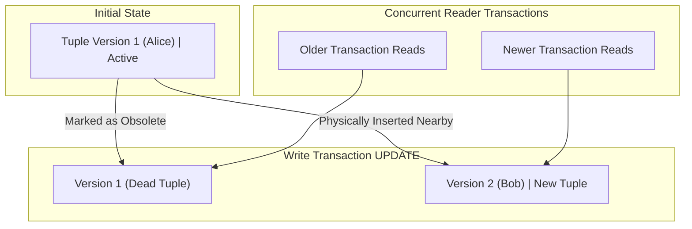

# How does MVCC work in PostgreSQL

---

## 🟢 Junior Level

**MVCC (Multi-Version Concurrency Control)** is PostgreSQL's architectural engine for handling concurrent data access. It allows multiple transactions to read and modify the same data simultaneously without locking each other out.

The golden rule of MVCC is: **Readers never block writers, and writers never block readers**.



### Simple Real-World Analogy
Imagine a notary office handling contracts:
Instead of taking the single master paper contract and erasing clauses with a pencil (which would force all clients in the waiting room to freeze and wait), the notary makes a **photocopy** with the requested amendments and stamps the new effective timestamp. Existing clients who arrived earlier continue reviewing their certified copy of the original draft, completely undisturbed, while new clients review the updated draft once officially executed.

### PostgreSQL vs. MySQL (InnoDB) and Oracle Architecture

- **Oracle / MySQL (InnoDB):** Store only the single latest version of the row in the table data pages. Previous row versions are written to separate rollback segments (**Undo Log**). If a reader requires an earlier version, the engine reconstructs it on-the-fly by applying undo deltas.
- **PostgreSQL:** Stores **all tuple versions (both live and dead) directly in the table data pages (Heap)**. This makes writes faster and simplifies engine recovery, but introduces row version accumulation (**Table Bloat**) and requires periodic background cleaning (**`VACUUM`**).

---

## 🟡 Middle Level

### System Tuple Attributes: `xmin`, `xmax`, and `ctid`

Every physical row (tuple) in a PostgreSQL table contains a 23-byte header (`HeapTupleHeaderData`) storing visibility metadata:

| System Column | Type | Purpose |
|---|---|---|
| **`xmin`** | 32-bit XID | The Transaction ID that **inserted / created** this tuple version |
| **`xmax`** | 32-bit XID | The Transaction ID that **deleted or updated** this tuple version (`0` if currently alive) |
| **`t_ctid`** | `(page, offset)` | Physical disk pointer to the current tuple, or points to the newer version in an update chain |

```sql
-- Inspect hidden MVCC system columns directly in SQL:
SELECT xmin, xmax, ctid, id, name FROM users WHERE id = 1;
-- Output:
-- xmin: 10523 | xmax: 0 | ctid: (0, 1) | id: 1 | name: 'Alice'
```

### The Anatomy of an `UPDATE`: `DELETE` + `INSERT`

In PostgreSQL, an `UPDATE` **never modifies bytes in-place**:
1. **Old Tuple:** The engine writes the active transaction's XID into `xmax` (logically deleting it).
2. **New Tuple:** A brand-new physical row is inserted on the heap page with `xmin` equal to the current XID and `xmax = 0`.
3. The old tuple's `ctid` pointer is updated to point directly to the physical address of the new tuple.

```
+--------------------------------------------------------------------------+
| Heap Page (8 KB)                                                         |
|                                                                          |
| [Tuple 1] xmin: 100, xmax: 105, ctid: (0, 2), data: "Alice" (DEAD)       |
|              │                                                           |
|              ▼ (ctid points to the next tuple in the chain)              |
| [Tuple 2] xmin: 105, xmax: 0,   ctid: (0, 2), data: "Bob"   (LIVE)       |
+--------------------------------------------------------------------------+
```

### Snapshots & Tuple Visibility Rules

At statement execution (in `READ COMMITTED`) or transaction inception (in `REPEATABLE READ`), PostgreSQL captures an in-memory **Snapshot**:

$$\text{Snapshot} = \text{xmin} : \text{xmax} : [\text{xip\_list}]$$

- **`snapshot.xmin`:** The lowest XID of transactions still in progress. All transactions with $\text{XID} < \text{snapshot.xmin}$ are guaranteed committed and their tuples are visible.
- **`snapshot.xmax`:** The first unassigned XID at the time of the snapshot. All transactions with $\text{XID} \ge \text{snapshot.xmax}$ started in the future and their tuples are **invisible**.
- **`xip_list`:** The active transaction array (XIDs in progress when the snapshot was taken). Any tuple created by these transactions is **invisible**.

### The Spring Boot / Java Antipattern: Pinning the Visibility Horizon

A frequent production failure in backend Java development is executing external network calls inside `@Transactional`:

```java
// ❌ CRITICAL PRODUCTION ANTIPATTERN:
@Service
public class OrderService {

    @Transactional
    public void processPayment(Long orderId) {
        Order order = orderRepository.findById(orderId).orElseThrow();
        order.setStatus(OrderStatus.PROCESSING);
        orderRepository.save(order); // UPDATE -> xmin assigned

        // ⚠️ SLOW EXTERNAL HTTP CALL (e.g. 10–30 seconds):
        paymentGatewayClient.chargeCreditCard(order.getAmount());

        order.setStatus(OrderStatus.PAID);
        orderRepository.save(order);
    }
}
```

**Production Consequences for PostgreSQL:**
1. The Java database connection holds an open transaction for 30 seconds.
2. In PostgreSQL, this transaction's XID becomes the **`oldest active xmin`** across the entire database cluster.
3. **`VACUUM` is completely paralyzed:** PostgreSQL cannot remove *any* dead tuples generated anywhere in the database if their `xmax` is newer than this transaction's `xmin`.
4. High-throughput write tables accumulate millions of un-vacuumable dead tuples, causing severe **table bloat**, shared buffer pollution, and HikariCP connection starvation.

---

## 🔴 Senior Level

### Hint Bits: Eliminating the CLOG (`pg_xact`) Bottleneck

When a transaction evaluates a tuple, it must know whether `xmin` committed or aborted.  
Commit statuses are stored in the commit log array: **CLOG (`pg_xact`)**. Checking `pg_xact` on disk or shared memory for millions of rows would cause severe CPU bus contention and I/O bottlenecks.

To eliminate this overhead, PostgreSQL uses **Hint Bits** stored in the tuple's `t_infomask` header:
- `HEAP_XMIN_COMMITTED` / `HEAP_XMIN_INVALID` (Aborted)
- `HEAP_XMAX_COMMITTED` / `HEAP_XMAX_INVALID`

```
Lazy Hinting Protocol:
1. The very first reader of a tuple queries pg_xact (CLOG) to verify transaction status.
2. The reader sets the HEAP_XMIN_COMMITTED bit directly into the tuple header in shared memory.
3. All subsequent readers inspect the tuple header bitmask directly, completely bypassing CLOG!
```

> [!NOTE]
> Setting Hint Bits modifies the 8 KB page in memory, turning it into a **dirty buffer**. Because of Hint Bits, a pure read-only **`SELECT` query can trigger physical disk writes** when the Checkpointer flushes dirty buffers to storage!

### HOT (Heap-Only Tuples) Optimization

Under standard MVCC, an `UPDATE` creates a new tuple and must insert a new index pointer into **every index** on the table, even if indexed columns were not modified. This causes massive write amplification.

**HOT updates bypass index maintenance entirely** when two conditions are met:
1. **No indexed columns are modified** by the `UPDATE`.
2. **Sufficient free space exists on the exact same 8 KB heap page** to accommodate the new tuple version.

Instead of writing to B-tree indexes, the old tuple is chained to the new tuple via `ctid` on the same page. Existing indexes continue pointing to the root tuple. During index scans, PostgreSQL traverses the root tuple and follows the internal HOT chain in memory.

```sql
-- Preserve 25% free space on pages to maximize HOT updates:
ALTER TABLE orders SET (fillfactor = 75);
```

### The Transaction ID (XID) Wraparound Catastrophe

PostgreSQL uses a 32-bit unsigned integer for Transaction IDs ($2^{32} \approx 4.29 \text{ billion}$ values).  
To evaluate transaction precedence, PostgreSQL uses circular modulo-$2^{32}$ arithmetic: the past 2 billion transactions are considered in the past, and the subsequent 2 billion transactions are considered in the future.

**The Wraparound Threat:**
If a database runs past 2 billion transactions without maintenance, circular arithmetic inverts: ancient historical rows suddenly appear to be in the "future" and become **completely invisible**, resulting in catastrophic data loss.

**Defense via Freezing:**
`VACUUM` scans aged pages and converts old `xmin` values to a special sentinel identifier: **`FrozenTransactionId` (2)**, setting the `HEAP_XMIN_FROZEN` flag. Frozen rows are hardcoded as committed in the infinitely distant past, visible to all transactions forever.

```sql
-- Monitor database distance to catastrophic wraparound:
SELECT datname, age(datfrozenxid), 
       ROUND(100.0 * age(datfrozenxid) / 2147483648, 2) AS percent_towards_wraparound
FROM pg_database
ORDER BY age(datfrozenxid) DESC;
-- Critical Alert: If age exceeds 1.5 billion (75%), emergency vacuum is urgently needed.
-- At 2.0 billion transactions, PostgreSQL forcefully shuts down into emergency single-user recovery mode!
```

### The Visibility Map (`_vm`)

Each table maintains a secondary bit-mapped fork called the **Visibility Map (`_vm`)**:
- **All-Visible Bit:** Indicates that all tuples on the heap page are visible to all current and future transactions (contains zero dead tuples).
  - Enables **Index Only Scans**: The engine reads rows directly from the B-tree index without touching heap pages to verify MVCC visibility (`Heap Fetches: 0`).
- **All-Frozen Bit:** Indicates that all tuples on the page have been frozen by `VACUUM FREEZE`, allowing future freeze passes to skip the page entirely.

---

## 4 Tricky Questions

### 1. Why does a pure read-only `SELECT` query in PostgreSQL sometimes cause physical disk writes?
**Answer:**  
Due to the **Hint Bits** mechanism. When tuples are newly created or updated, their commit status is recorded only in CLOG (`pg_xact`), while the tuple header bits (`HEAP_XMIN_COMMITTED`) remain uninitialized.  
The first `SELECT` query that reads these rows must consult `pg_xact` to determine visibility. Upon confirming the transaction committed, the reader writes the commit flag directly into the tuple's header on the 8 KB page in `shared_buffers`. This modifies the in-memory page, turning it into a **dirty buffer**. Later, background checkpointer or bgwriter processes write this dirty page to disk.

### 2. What happens if a production PostgreSQL instance approaches 2 billion transactions without running autovacuum?
**Answer:**  
The database approaches **Transaction ID Wraparound**.  
1. When `age(datfrozenxid)` reaches `autovacuum_freeze_max_age` (default 200M transactions), PostgreSQL triggers aggressive, anti-wraparound autovacuum workers that cannot be cancelled.
2. If autovacuum fails to keep up and age reaches 2 billion transactions (3 million transactions before wraparound), PostgreSQL halts normal operations and emits critical errors:
   `FATAL: database is not accepting commands to avoid wraparound data loss in database "mydb"`
3. The cluster forcefully shuts down and refuses client connections, requiring manual recovery via single-user mode `vacuumdb --freeze` to salvage data visibility.

### 3. How can an unoptimized `@Transactional` method in Spring Boot containing a 10-second external HTTP call degrade query performance across unrelated tables?
**Answer:**  
A Spring transaction holding a database connection holds an open PostgreSQL snapshot with an active `xmin`. This `xmin` becomes the **global visibility horizon (`oldestActiveXid`)**.  
PostgreSQL's `VACUUM` process cannot clean up *any* dead tuples whose `xmax` is greater than or equal to this oldest active `xmin`. As a result, every other write-heavy table in the database accumulates millions of dead tuples that cannot be vacuumed. Tables experience severe **Table Bloat**, sequential scans take longer, indexes grow larger, and memory buffer hit ratios plummet across completely unrelated business domains.

### 4. How does an `Index Only Scan` guarantee MVCC correctness without checking `xmin` and `xmax` in the table heap?
**Answer:**  
PostgreSQL B-tree index entries do not store `xmin` or `xmax` visibility headers.  
To avoid fetching the heap tuple for every index entry, the engine consults the **Visibility Map (`_vm`)**. The Visibility Map maintains one bit per 8 KB heap page indicating whether the page is **all-visible** (meaning all tuples on the page are older than any running transaction and there are zero dead tuples). If the bit is set, the tuple found in the index is guaranteed visible, resulting in `Heap Fetches: 0`. If the bit is not set, the engine must visit the heap page to inspect tuple header flags.

---

## 🎯 Interview Cheat Sheet

### Core Concepts (First 30 Seconds)
- **Principle:** Multi-Version Concurrency Control: Readers never block writers, and writers never block readers.
- **Heap Storage:** Unlike MySQL/Oracle which use an Undo Log, PostgreSQL stores all row versions (live and dead) directly in the table heap.
- **System Attributes:** Every tuple has `xmin` (creating XID), `xmax` (deleting/updating XID), and `ctid` (physical disk pointer).
- **`UPDATE` Operation:** Physically executed as `DELETE` of the old tuple + `INSERT` of the new tuple.
- **Dead Tuples & Bloat:** Obsolete row versions must be cleared by `VACUUM`; long-running transactions freeze the cleanup horizon.
- **HOT Updates:** Heap-Only Tuples allow updates on the same 8 KB page without modifying indexes if non-indexed columns are updated.

### Key Architectural Gotchas
- **Hint Bits:** Read queries set commit flags on tuple headers, dirtying shared buffer pages and causing disk writes.
- **XID Wraparound:** 32-bit transaction IDs wrap around every 2.1 billion transactions; `VACUUM FREEZE` sets `FrozenTransactionId = 2` to prevent data invisibility.
- **Visibility Map:** Bitmask tracking `all-visible` and `all-frozen` pages; essential for `Index Only Scans`.
- **Spring Boot Anti-Pattern:** Never run external HTTP or long compute tasks inside `@Transactional`.

### Red Flags (What NOT to Say)
- ❌ *"PostgreSQL rolls back transactions by reading the Undo Log."* (PostgreSQL has no Undo Log; it stores versions in the heap and marks commit status in `pg_xact`).
- ❌ *"VACUUM immediately shrinks the physical file on disk and returns space to the OS."* (Standard `VACUUM` only marks space as reusable within the page; use `VACUUM FULL` or `pg_repack` to reclaim disk space).
- ❌ *"Turning off autovacuum is a safe way to speed up bulk inserts in production."* (It leads to catastrophic downtime via XID wraparound).
- ❌ *"A SELECT query never dirties memory buffers."* (Setting Hint Bits on un-hinted tuples dirties buffers).

### Related Topics
- [What is VACUUM in PostgreSQL](18.%20What%20is%20VACUUM%20in%20PostgreSQL.md) — Dead tuple cleanup, freezing mechanics, and bloat elimination
- [Why is ANALYZE needed](19.%20Why%20is%20ANALYZE%20needed.md) — Query planner statistics and data distributions
- [What are the disadvantages of indexes](5.%20What%20are%20the%20disadvantages%20of%20indexes.md) — Index write amplification and HOT update breakdown
- [What is Explain plan](20.%20What%20is%20Explain%20plan.md) — Heap fetches, visibility maps, and shared buffer hits
