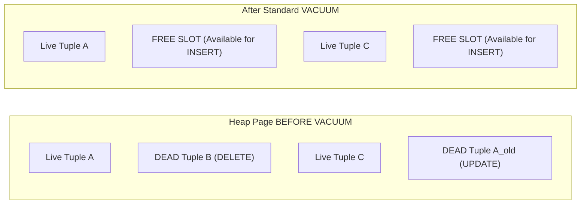

# What is VACUUM in PostgreSQL

---

## 🟢 Junior Level

**`VACUUM`** is PostgreSQL's built-in garbage collection and storage maintenance engine. Because PostgreSQL's MVCC architecture handles data modifications out-of-place, rows updated or deleted are not physically overwritten; they remain inside 8 KB database pages as **dead tuples**.

`VACUUM` scans tables to locate dead tuples and mark their physical space as available for future `INSERT` and `UPDATE` operations.



### Simple Real-World Analogy
Imagine a hotel with electronic keycards:
When a guest checks out (`DELETE`), the hotel does not demolish the room with a wrecking ball. Instead, the housekeeping staff (**`VACUUM`**) cleans the room, changes the linens, and marks the room as "available for occupancy" in the front desk software. The physical footprint of the hotel building does not shrink, but new incoming guests (`INSERT`) can immediately be checked into the vacant rooms.

### Primary Functions of VACUUM
1. **Reclaims Space:** Frees dead tuple slots inside 8 KB pages, preventing uncontrolled table file expansion (**Table Bloat**).
2. **Freezes Aging Transaction IDs:** Prevents database paralyzation caused by **32-bit XID Wraparound**.
3. **Updates the Visibility Map:** Marks pages where all rows are committed and visible to all transactions, accelerating **Index Only Scans**.

### Standard `VACUUM` vs. `VACUUM FULL`

```sql
-- 1. Standard VACUUM (Production Safe, Non-blocking):
VACUUM users;
-- Reclaims space internally within existing pages. Allows concurrent reads and writes.
-- Does NOT return disk space to the OS (file size on disk remains unchanged).

-- 2. VACUUM FULL (Blocking, Offline Compaction):
VACUUM FULL users;
-- Rewrites the entire table into a brand new, compact file on disk and returns free space to the OS.
-- ⚠️ WARNING: Acquires an AccessExclusiveLock, completely blocking ALL reads and writes!
```

---

## 🟡 Middle Level

### The Life Cycle of Dead Tuples

In PostgreSQL, deleted or updated rows cannot be cleaned immediately because concurrent read transactions may still be observing them through an active **Snapshot**.

Only when **all transactions** older than the row's deletion moment (`xmax`) complete does `VACUUM` have permission to reclaim the dead tuple:

```
Internal VACUUM Execution Pipeline:
1. Scanning Heap: Scans table pages, skipping all-visible pages via the Visibility Map.
2. Vacuuming Indexes: Sweeps all table B-tree indexes to remove index pointers pointing to dead tuples.
3. Vacuuming Heap: Marks dead tuple line pointers as LP_UNUSED inside heap pages.
4. Truncating: (Optional) Truncates completely empty pages from the physical end of the file back to the OS.
```

### Autovacuum Trigger Formula & Large Table Pitfalls

The background daemon `autovacuum` periodically wakes up (every `autovacuum_naptime`, default: 1 minute) and triggers cleanup on tables exceeding a calculated dead tuple threshold:

$$\text{Trigger Threshold} = \text{autovacuum\_vacuum\_threshold} + (\text{autovacuum\_vacuum\_scale\_factor} \times \text{reltuples})$$

- **Default Parameters:** `threshold = 50` rows, `scale_factor = 0.2` (20% of total rows).

**The Scale Factor Bottleneck on Large Tables:**
- Table with 1,000 rows: $50 + (0.2 \times 1,000) = \mathbf{250}$ dead rows triggers cleanup.
- Table with 50,000,000 rows: $50 + (0.2 \times 50,000,000) = \mathbf{10,000,050}$ dead rows!  
On a 50M-row table, autovacuum will not activate until **10 million dead rows** accumulate. By that time, the table will suffer tens of gigabytes of bloat.

**Production Solution: Table-Level Tuning:**
```sql
ALTER TABLE orders SET (
    autovacuum_vacuum_scale_factor = 0.02, -- Trigger at 2% dead tuples instead of 20%
    autovacuum_vacuum_cost_limit = 1000,   -- Allocate higher I/O quota for faster sweeps
    autovacuum_vacuum_cost_delay = 2       -- Minimize sleep delay
);
```

### Application-Level Root Causes of Stalled Vacuuming in Java / Spring

Even an optimally configured autovacuum engine can be completely neutralized by backend application flaws:

1. **Long-Running `@Transactional` Methods with External Calls:**
   If a Java method holds an open transaction while calling third-party HTTP gateways, it pins its `xmin`. `VACUUM` is strictly forbidden from removing *any* dead tuple created after this transaction started across the **entire database**.
2. **Unchunked Batch Processing:**
   Inserting or updating 1,000,000 records in a single `@Transactional` method generates massive amounts of dead tuples that cannot be cleared until the final commit.
   *Remedy:* Use Spring Batch or programmatic transaction templates with chunk sizes of 500–1,000 records.
3. **Leaked Database Connections:**
   Connections leaked from HikariCP that remain in the `idle in transaction` state halt garbage collection cluster-wide.

---

## 🔴 Senior Level

### Cost-Based Vacuuming Internals

To prevent background maintenance from consuming entire disk bandwidth and causing user-facing latency spikes, PostgreSQL enforces **Cost-Based Vacuum Throttling**:

Each low-level storage operation incurs a defined credit cost:
- Buffer hit in `shared_buffers` (`vacuum_cost_page_hit`): **1**
- Cache miss read from OS kernel buffer (`vacuum_cost_page_miss`): **2**
- Dirty page write to disk (`vacuum_cost_page_dirty`): **20**

When accumulated costs reach **`autovacuum_vacuum_cost_limit`** (default: `200`), the worker process sleeps for **`autovacuum_vacuum_cost_delay`** (default: `2ms`).

```
Modern NVMe SSD Optimization:
Default settings (cost_limit = 200, delay = 2ms) were engineered for slow mechanical HDDs.
On modern NVMe SSDs, autovacuum spends 90% of its time sleeping while tables bloat.
Production Best Practice: Increase autovacuum_vacuum_cost_limit to 2000-5000 and keep delay <= 2ms.
```

### Zero-Downtime Table Compaction: `pg_repack`

Because `VACUUM FULL` acquires a table-wide `AccessExclusiveLock` (blocking all queries), running it on live systems causes service outages. Production environments use the open-source **`pg_repack`** extension to reclaim disk space online:

```mermaid
graph TD
    A["Bloated Table T"] -->|1. Initial Full Copy| B["New Compact Table T_new"]
    A -->|2. Trigger logs concurrent INSERT/UPDATE/DELETE| L["Delta Log Table"]
    L -->|3. Continuously replays changes| B
    B -->|4. Instant swap of catalog files (Sub-second lock)| A_final["Compacted Table T"]
```

**`pg_repack` Operational Workflow:**
1. Creates an empty shadow table structured identically to the target table.
2. Attaches a trigger to the original table to record all concurrent write operations into a temporary log table.
3. Copies existing rows into the shadow table and builds all indexes.
4. Replays logged changes onto the shadow table.
5. Acquires an `AccessExclusiveLock` for a fraction of a second to swap catalog file nodes, and drops the bloated table.

### Anti-Wraparound Emergency Freezing

When the age of the oldest unfrozen transaction in a database (`age(datfrozenxid)`) exceeds `autovacuum_freeze_max_age` (default: **200,000,000 transactions**), PostgreSQL triggers an **aggressive anti-wraparound autovacuum**:
- It cannot be canceled via `pg_cancel_backend()`.
- It bypasses cost throttling to finish as quickly as possible.
- If neglected until `age` approaches 2,000,000,000, PostgreSQL forcefully shuts down and enters emergency single-user read-only mode to prevent silent data corruption.

### Parallel Index Vacuuming (PostgreSQL 13+)

Starting with PostgreSQL 13, `VACUUM` can clean multiple B-tree indexes simultaneously using parallel background workers:

```sql
VACUUM (PARALLEL 4, VERBOSE) large_table;
-- Spawns up to 4 parallel workers to sweep distinct indexes simultaneously!
```

### Real-Time Vacuum Progress Monitoring

```sql
-- 1. Track live VACUUM progress:
SELECT 
    p.pid,
    c.relname AS table_name,
    p.phase,
    p.heap_blks_scanned,
    p.heap_blks_vacuumed,
    ROUND(100.0 * p.heap_blks_scanned / NULLIF(p.heap_blks_total, 0), 2) AS progress_pct
FROM pg_stat_progress_vacuum p
JOIN pg_class c ON c.oid = p.relid;

-- 2. Detect long-running transactions blocking VACUUM:
SELECT pid, usename, now() - xact_start AS duration, state, query
FROM pg_stat_activity
WHERE (state = 'idle in transaction' OR state = 'active')
  AND xact_start < now() - INTERVAL '15 minutes'
ORDER BY xact_start ASC;
```

---

## 4 Tricky Questions

### 1. Why didn't the physical disk file size decrease after running `VACUUM` on a table where 10 million rows were deleted?
**Answer:**  
Standard `VACUUM` does not defragment or relocate live tuples within the table file; it simply updates the internal line pointers inside each 8 KB heap page to `LP_UNUSED` and records available space in the Free Space Map (`_fsm`). This space is reserved for future `INSERT` and `UPDATE` operations within the same table. The only time standard `VACUUM` releases space to the OS is when completely empty pages happen to be situated at the very physical end (tail) of the table file. To return all freed space to the operating system, you must run `VACUUM FULL` or online compaction via `pg_repack`.

### 2. How can a Java backend developer accidentally paralyze autovacuum across an entire PostgreSQL cluster?
**Answer:**  
By allowing an application transaction to remain open for an extended period (e.g., executing a slow third-party REST API call inside a Spring `@Transactional` method, or leaking an uncommitted connection in the `idle in transaction` state).  
The transaction's `xmin` becomes the global visibility horizon (`oldestActiveXid`). PostgreSQL's MVCC rules prohibit `VACUUM` from purging *any* dead tuple whose `xmax` is greater than or equal to this oldest active `xmin`. Consequently, dead tuples accumulate across every write-heavy table in the entire database, causing massive table bloat, buffer cache eviction, and storage exhaustion.

### 3. What is Cost-Based Vacuuming, and why does default autovacuum often fall behind on modern NVMe SSD storage?
**Answer:**  
Cost-Based Vacuuming throttles I/O by calculating a cumulative cost score for page operations (`page_hit = 1`, `page_miss = 2`, `page_dirty = 20`). Once the accumulated cost reaches `autovacuum_vacuum_cost_limit`, the worker sleeps for `autovacuum_vacuum_cost_delay` (2 ms).  
Default PostgreSQL configurations set `cost_limit = 200`, which was designed decades ago for slow spinning HDDs. On modern NVMe SSDs capable of hundreds of thousands of IOPS, the worker reaches the 200-cost limit in microseconds and spends virtually all its time sleeping, processing only ~10–20 MB/s while incoming write throughput generates hundreds of megabytes of dead tuples per minute.

### 4. How does `pg_repack` achieve zero-downtime table compaction, and why is it preferred over `VACUUM FULL`?
**Answer:**  
`VACUUM FULL` acquires an `AccessExclusiveLock` on the target table for the entire duration of the rewrite, blocking all incoming `SELECT`, `INSERT`, `UPDATE`, and `DELETE` queries, which causes application downtime.  
`pg_repack` works online:
1. It creates a new shadow table and builds all indexes in the background.
2. It sets an audit trigger on the original table to record all concurrent write activity into a temporary log table.
3. It replays these changes into the shadow table until synchronized.
4. Only at the final swap does it take an `AccessExclusiveLock` for a fraction of a second to swap table file references in the system catalog and drop the bloated relation, keeping the database fully available.

---

## 🎯 Interview Cheat Sheet

### Core Concepts (First 30 Seconds)
- **Primary Function:** `VACUUM` purges dead tuple versions (`dead tuples`) left by `UPDATE` and `DELETE`, marking page slots as reusable for future `INSERT`s.
- **Disk Space Behavior:** Standard `VACUUM` **does not shrink** the table file on disk; it reclaims space internally. Physical disk reclamation requires `pg_repack` or `VACUUM FULL`.
- **Locking:** Standard `VACUUM` runs concurrently with reads and writes (`ShareUpdateExclusiveLock`). `VACUUM FULL` takes an exclusive lock (`AccessExclusiveLock`), freezing application traffic.
- **Autovacuum Trigger:** Automatically runs when $\text{dead\_tuples} > \text{threshold} + (\text{scale\_factor} \times \text{rows})$.
- **Operational Danger:** Long open transactions freeze the cleanup horizon, causing table bloat and XID wraparound risk.

### Advanced Architectural Knowledge
- **Throttling Tuning:** On NVMe SSDs, raise `autovacuum_vacuum_cost_limit` from 200 to `2000`–`5000` to prevent worker sleep starvation.
- **Table-Level Tuning:** Lower `autovacuum_vacuum_scale_factor` to `0.01`–`0.05` on tables with millions of rows.
- **Visibility Map:** VACUUM updates the VM to enable `Index Only Scans` and skip clean pages during subsequent runs.
- **Emergency Freezing:** Anti-wraparound autovacuum cannot be canceled and ignores throttling when transaction age exceeds 200M XIDs.

### Red Flags (What NOT to Say)
- ❌ *"Standard VACUUM frees disk space back to the operating system."* (It only frees slots inside 8 KB pages).
- ❌ *"Running VACUUM FULL every night in a cron job is recommended for maintenance."* (Takes an exclusive lock, causing production outages).
- ❌ *"Disabling autovacuum is a safe way to boost write throughput."* (Guarantees database shutdown via 32-bit XID Wraparound).
- ❌ *"VACUUM deletes all historical row versions immediately."* (It can only delete tuples older than the oldest active transaction snapshot).

### Related Topics
- [How does MVCC work in PostgreSQL](17.%20How%20does%20MVCC%20work%20in%20PostgreSQL.md) — Dead tuple generation and snapshot visibility rules
- [Why is ANALYZE needed](19.%20Why%20is%20ANALYZE%20needed.md) — Cost optimizer statistics collection
- [What are the disadvantages of indexes](5.%20What%20are%20the%20disadvantages%20of%20indexes.md) — Write amplification and index bloat
- [What is Explain plan](20.%20What%20is%20Explain%20plan.md) — Spotting heap fetches and table scan overhead
