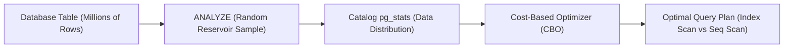

# Why is ANALYZE needed

---

## 🟢 Junior Level

**`ANALYZE`** is a PostgreSQL administrative command that inspects table data and populates internal statistical catalogs (primarily the **`pg_statistic`** table and **`pg_stats`** view).

Based on these statistics, PostgreSQL's **Cost-Based Query Optimizer (CBO)** calculates the relative execution cost of different query strategies and selects the most efficient execution plan:
- Deciding whether to execute an **Index Scan**, **Bitmap Index Scan**, or **Sequential Scan** (`Seq Scan`).
- Choosing the optimal join algorithm: **Nested Loop**, **Hash Join**, or **Merge Join**.
- Determining the join order of multiple tables.



### Simple Real-World Analogy
Imagine a GPS navigation app planning a road trip:
If the GPS map lacks real-time traffic data, speed limits, and road closure updates, it will blindly calculate a route along a straight line, steering you directly into a narrow dead-end or a gridlocked highway. The `ANALYZE` command acts as a traffic survey: it updates the GPS map with real-time congestion and road conditions so the navigation algorithm can guide you along the fastest path.

### Basic Syntax

```sql
-- 1. Analyze the entire current database:
ANALYZE;

-- 2. Analyze a specific table:
ANALYZE orders;

-- 3. Analyze specific columns:
ANALYZE orders (status, created_at);

-- 4. Execute with detailed verbose progress logging:
ANALYZE VERBOSE orders;
```

> [!NOTE]
> `ANALYZE` **does not purge dead tuples** and does not reclaim disk space (unlike `VACUUM`). The combined command **`VACUUM ANALYZE`** executes both tasks sequentially: first garbage-collecting dead rows, then updating optimizer statistics.

---

## 🟡 Middle Level

### The Reservoir Sampling Algorithm

A crucial architectural principle: **`ANALYZE` never performs a full table scan!**  
Regardless of whether a table is 100 MB or 10 TB, PostgreSQL gathers statistics using a randomized **Reservoir Sampling** algorithm:

$$\text{Sampled Rows} = 300 \times \text{default\_statistics\_target}$$

By default, `default_statistics_target = 100`. Therefore, for any table, PostgreSQL samples exactly:
$$300 \times 100 = \mathbf{30,000}\text{ rows}$$

Because the sample is uniformly distributed across random physical 8 KB pages, `ANALYZE` completes in **seconds**, even on billion-row tables, placing virtually zero contention on disk I/O.

### Key Metrics Inside `pg_stats`

The collected distribution statistics are exposed through the `pg_stats` view:

```sql
SELECT attname, n_distinct, most_common_vals, most_common_freqs, correlation
FROM pg_stats
WHERE tablename = 'orders';
```

| Column | Optimizer Purpose |
|---|---|
| **`n_distinct`** | Estimated number of distinct values. A positive integer (e.g., `10`) indicates an absolute count; a negative float (e.g., `-1.0`) indicates 100% uniqueness (Primary Key, UUID). |
| **`most_common_vals` (MCV)** | Array of the most frequently occurring values in the column (e.g., `['COMPLETED', 'PENDING']`). |
| **`most_common_freqs` (MCF)** | Frequency ratio for each MCV item (e.g., `[0.85, 0.12]`). If `status = 'COMPLETED'` represents 85% of rows, the planner chooses `Seq Scan`; for rare statuses, it chooses `Index Scan`. |
| **`histogram_bounds`** | Equi-depth histogram boundaries used to calculate selectivity for range predicates (`BETWEEN`, `<`, `>`) for values outside the MCV array. |
| **`correlation`** | Statistical correlation between physical disk storage order and logical value ordering ($-1.0$ to $+1.0$). A correlation close to $1.0$ makes an **Index Scan** significantly cheaper. |

### Autoanalyze Trigger Formula

The background `autovacuum` daemon automatically schedules statistics collection whenever the count of modified rows exceeds the autoanalyze threshold:

$$\text{Autoanalyze Threshold} = \text{autovacuum\_analyze\_threshold} + (\text{autovacuum\_analyze\_scale\_factor} \times \text{reltuples})$$

- **Default Parameters:** `threshold = 50` rows, `scale_factor = 0.1` (10% of total rows).

### Critical Java / Spring Boot Scenario: Post-Deployment CPU Spike

A notorious production incident in Java backend engineering:

1. **Database Migration (Flyway / Liquibase):** A new deployment creates a table and imports 10,000,000 reference or historical records.
2. The service boots up and user traffic hits the new endpoints.
3. **The Incident:** `autoanalyze` has not yet triggered. The query planner assumes the new table contains **0 rows** (or default placeholder estimates).
4. The optimizer selects **Sequential Scans** or unindexed **Nested Loops** instead of B-tree Index Scans.
5. Database CPU spikes to 100%, REST API response times jump from 15 ms to 20 seconds, and applications crash due to HikariCP connection pool exhaustion.

**Production Golden Rule:** Always append an explicit `ANALYZE target_table;` statement at the end of any Flyway/Liquibase migration script that inserts bulk data. In Spring Batch jobs, execute `jdbcTemplate.execute("ANALYZE " + tableName)` immediately following large chunk imports.

---

## 🔴 Senior Level

### Data Skew and Column-Level Statistics Tuning

If a column has an extreme data skew (e.g., 99.5% of rows have `status = 'DELIVERED'`, while 0.02% represent rare failure states like `PAYMENT_DISPUTED`), the default 100-bucket histogram may misestimate row counts by orders of magnitude.

To fix this, increase the statistics sample size specifically for the skewed column:

```sql
-- Increase statistics target from 100 to 1,000 for the skewed attribute:
ALTER TABLE orders ALTER COLUMN status SET STATISTICS 1000;

-- ANALYZE now samples 300 * 1,000 = 300,000 rows for this column:
ANALYZE orders;
```

### Extended Multivariate Statistics (`CREATE STATISTICS`)

By default, PostgreSQL assumes **strict statistical independence** between distinct columns:

$$\text{Selectivity} = P(\text{make} = \text{'Audi'}) \times P(\text{model} = \text{'A6'}) = 0.02 \times 0.01 = \mathbf{0.0002}$$

In reality, the model `A6` is produced *only* by `Audi`. The actual selectivity is $0.01$—a **50x underestimation**! The optimizer expects 5 rows instead of 250, mistakenly choosing a disastrous Nested Loop instead of a Hash Join.

**Solution: Extended Statistics**
```sql
-- 1. Functional Dependencies (knowing 'model' determines 'make')
CREATE STATISTICS stat_cars_make_model (dependencies) 
ON make, model FROM cars;

-- 2. Multivariate Distinct Counts (joint n_distinct for multi-column GROUP BY)
CREATE STATISTICS stat_users_city_zip (ndistinct) 
ON city, zip_code FROM users;

-- 3. Multivariate Most Common Values (PostgreSQL 13+: joint MCV frequencies)
CREATE STATISTICS stat_orders_status_priority (mcv) 
ON status, priority FROM orders;

-- Apply and populate extended statistics:
ANALYZE cars, users, orders;
```

### Expression Index Statistics

When evaluating queries with functional transformations (such as `WHERE LOWER(email) = ?` or `WHERE created_at::date = ?`), the planner cannot determine selectivity using standard column statistics.

Creating an expression index causes `ANALYZE` to automatically compute and maintain statistics for the **functional output expression**:

```sql
CREATE INDEX idx_users_email_lower ON users(LOWER(email));
ANALYZE users;
-- The pg_statistic catalog now contains exact n_distinct and MCVs for LOWER(email)!
```

### Monitoring Stale Statistics in Production

Identify tables whose underlying data has changed substantially since the last statistics run:

```sql
SELECT 
    schemaname,
    relname AS table_name,
    n_live_tup,
    n_mod_since_analyze,
    ROUND(100.0 * n_mod_since_analyze / NULLIF(n_live_tup, 0), 2) AS mod_ratio_pct,
    last_analyze,
    last_autoanalyze
FROM pg_stat_user_tables
WHERE n_mod_since_analyze > 50000
ORDER BY n_mod_since_analyze DESC;
```

---

## 4 Tricky Questions

### 1. Why does query performance completely collapse immediately following a massive `COPY` or batch `INSERT`, and how is it resolved?
**Answer:**  
Because table statistics in `pg_stats` are stale or non-existent. After loading millions of rows, the planner still considers the table empty or tiny (based on outdated `reltuples` in `pg_class`). It consequently picks **Sequential Scans** over newly created indexes or forces **Nested Loop** joins with huge outer tables.  
**Resolution:** Explicitly run `ANALYZE table_name;` immediately after the batch load finishes. This completes in seconds via reservoir sampling and immediately generates accurate execution plans.

### 2. How can you teach the optimizer to recognize cross-column correlations (e.g., `country` and `city`, or `make` and `model`)?
**Answer:**  
Using **Extended Statistics** via the `CREATE STATISTICS` command.  
By default, the optimizer assumes columns are statistically independent ($P(A \cap B) = P(A) \times P(B)$). By creating an extended statistics object:
```sql
CREATE STATISTICS s_geo (dependencies) ON country, city FROM addresses;
ANALYZE addresses;
```
PostgreSQL computes the functional dependency coefficient between the two columns, preventing disastrous row underestimations when filtering by both attributes simultaneously.

### 3. What is the fundamental difference between `ANALYZE` and `EXPLAIN ANALYZE`?
**Answer:**  
- **`ANALYZE`** is an administrative maintenance command. It inspects table data via reservoir sampling, computes distribution metrics (`n_distinct`, MCV, histograms), and writes them to the `pg_statistic` system catalog to guide future queries.
- **`EXPLAIN ANALYZE`** is a query profiling tool. It actually **executes** a specific SQL query, measures real CPU execution time and memory buffer hits at each plan node, and compares estimated row counts (`rows=X`) against actual emitted rows (`actual rows=Y`).

### 4. Why does `autovacuum` fail to analyze temporary tables, and what are the architectural consequences in complex ETL pipelines?
**Answer:**  
Temporary tables exist in backend-private memory sessions and are completely invisible to the shared background `autovacuum` daemon.  
If an ETL pipeline or stored procedure creates and populates a temporary table with hundreds of thousands of rows, the table has **zero optimizer statistics**. Subsequent joins with this temp table will assume a default row count of 10 or 1,000, causing the optimizer to pick disastrous plan shapes (such as Cartesian products or unindexed nested loops). Developers **must explicitly run `ANALYZE temp_table_name;`** within the session immediately after populating temporary tables.

---

## 🎯 Interview Cheat Sheet

### Core Concepts (First 30 Seconds)
- **Primary Function:** Collects statistical data distribution metrics (`n_distinct`, MCVs, histograms, correlation) and stores them in `pg_stats`.
- **Purpose:** Enables the Cost-Based Optimizer (CBO) to make accurate cost calculations between Index Scans, Seq Scans, and Join algorithms.
- **Sampling Algorithm:** Employs randomized Reservoir Sampling ($300 \times \text{target} \approx 30,000$ rows), completing in seconds on tables of any size.
- **Locking:** Takes a lightweight `ShareUpdateExclusiveLock`, running fully concurrently with `SELECT`, `INSERT`, `UPDATE`, and `DELETE`.
- **Temporary Tables:** Autovacuum **ignores** temporary tables; manual `ANALYZE` is mandatory in batch scripts.

### Advanced Architectural Knowledge
- **Post-Migration Spike:** Always run `ANALYZE` after Flyway/Liquibase data migrations or bulk `COPY` operations.
- **Extended Statistics:** Use `CREATE STATISTICS ... (dependencies, ndistinct, mcv)` to resolve cross-column correlation estimation bugs.
- **Data Skew:** Use `ALTER TABLE t ALTER COLUMN col SET STATISTICS 1000` to expand histogram buckets for skewed status columns.
- **Expression Indexes:** Creating functional indexes automatically triggers `ANALYZE` to track expression output distributions.

### Red Flags (What NOT to Say)
- ❌ *"ANALYZE scans every single row in the database table from start to finish."* (It uses randomized page reservoir sampling of ~30,000 rows).
- ❌ *"ANALYZE purges dead tuples like VACUUM."* (ANALYZE collects statistics only; VACUUM cleans dead tuples).
- ❌ *"Autovacuum will automatically update statistics on temporary tables."* (Autovacuum cannot see session-private temporary tables).
- ❌ *"ANALYZE locks out active application reads and writes."* (It runs fully concurrently with application queries).

### Related Topics
- [What is index cardinality](6.%20What%20is%20index%20cardinality.md) — Selectivity, `n_distinct`, and `pg_stats` metrics
- [What is VACUUM in PostgreSQL](18.%20What%20is%20VACUUM%20in%20PostgreSQL.md) — Dead tuple cleanup and `VACUUM ANALYZE`
- [What is Explain plan](20.%20What%20is%20Explain%20plan.md) — Comparing estimated rows vs actual rows in execution plans
- [How to optimize slow queries](21.%20How%20to%20optimize%20slow%20queries.md) — Fixing plan regressions caused by stale statistics
