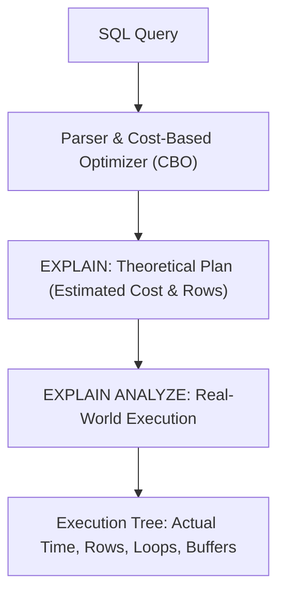

# What is Explain plan

---

## 🟢 Junior Level

**`EXPLAIN`** is a diagnostic PostgreSQL command that displays the **query execution plan** selected by the Cost-Based Optimizer (CBO): the sequence of relational operators, join algorithms, and indexes chosen to retrieve data **without actually executing the query**.

**`EXPLAIN ANALYZE`** actually **executes the query** on the database server, measuring real-world stopwatch timing and resource consumption alongside the optimizer's theoretical estimates.



### Simple Real-World Analogy
Imagine a GPS navigation app on your smartphone:
- **Standard `EXPLAIN`:** The app previews the route on your screen: *"Take Highway 101, distance 50 miles, estimated travel time 55 minutes"*. You are still parked in your driveway; no fuel has been burned.
- **`EXPLAIN ANALYZE`:** You turn on the ignition and **physically drive the route** with a stopwatch running. Upon arrival, the GPS reports: *"Actual travel time was 1 hour 15 minutes due to an unexpected roadblock; 2.5 gallons of fuel consumed"*.

### Basic Syntax and Metric Interpretation

```sql
EXPLAIN SELECT * FROM users WHERE email = 'alex@example.com';

-- Execution Plan Output:
-- Index Scan using idx_users_email on users (cost=0.42..8.44 rows=1 width=72)
--   Index Cond: (email = 'alex@example.com'::text)
```

**Key Estimated Metrics:**
- **`cost=0.42..8.44`:** Cost units (dimensionless, proportional to I/O and CPU work):
  - `0.42` (**Startup Cost**): Work required before the node can emit its very first row.
  - `8.44` (**Total Cost**): Total work required to return all matching rows.
- **`rows=1`:** Estimated cardinality (number of rows the optimizer expects this node to produce).
- **`width=72`:** Estimated average byte width of each emitted row.

---

## 🟡 Middle Level

### The Production Diagnostic Gold Standard: `EXPLAIN (ANALYZE, BUFFERS)`

When diagnosing slow queries in staging or production environments, always invoke `EXPLAIN` with the `BUFFERS` option:

```sql
EXPLAIN (ANALYZE, BUFFERS, SETTINGS)
SELECT u.name, COUNT(o.id) AS orders_count
FROM users u
LEFT JOIN orders o ON u.id = o.user_id
WHERE u.city = 'Chicago'
GROUP BY u.name;
```

```text
QUERY PLAN:
HashAggregate  (cost=12540.00..12550.00 rows=1000 width=40) (actual time=45.210..47.340 rows=850 loops=1)
  Group Key: u.name
  Batches: 1  Memory Usage: 120kB
  Buffers: shared hit=4210 read=180
  ->  Hash Right Join  (cost=3500.00..11800.00 rows=120000 width=36) (actual time=12.100..38.450 rows=115000 loops=1)
        Hash Cond: (o.user_id = u.id)
        Buffers: shared hit=3800 read=180
        ->  Seq Scan on orders o  (cost=0.00..6500.00 rows=350000 width=8) (actual time=0.015..15.200 rows=350000 loops=1)
              Buffers: shared hit=2500
        ->  Hash  (cost=3200.00..3200.00 rows=24000 width=32) (actual time=10.150..10.150 rows=23500 loops=1)
              Buckets: 32768  Batches: 1  Memory Usage: 1520kB
              Buffers: shared hit=1300 read=180
              ->  Bitmap Heap Scan on users u  (cost=420.00..3200.00 rows=24000 width=32) (actual time=2.100..7.800 rows=23500 loops=1)
                    Recheck Cond: (city = 'Chicago'::text)
                    Rows Removed by Index Recheck: 0
                    Buffers: shared hit=1300 read=180
                    ->  Bitmap Index Scan on idx_users_city  (cost=0.00..414.00 rows=24000 width=0) (actual time=1.850..1.850 rows=23500 loops=1)
                          Index Cond: (city = 'Chicago'::text)
                          Buffers: shared hit=45
Planning Time: 0.420 ms
Execution Time: 48.110 ms
```

### How to Read the Execution Tree: Bottom-Up Traversal

PostgreSQL plans are structured as a tree of operations. The engine evaluates **from the deepest indented leaf nodes upwards**:
1. **`Bitmap Index Scan on idx_users_city`:** Scans the B-tree index and builds an in-memory bitmap of qualifying page IDs for Chicago users (1.85 ms).
2. **`Bitmap Heap Scan on users u`:** Visited table pages sequentially according to the bitmap, retrieving 23,500 user rows (7.8 ms).
3. **`Hash` Node:** Builds an in-memory hash table of these 23,500 Chicago users in `work_mem` (1.5 MB).
4. **`Seq Scan on orders o`:** Sequentially scans 350,000 orders.
5. **`Hash Right Join`:** Streams orders against the in-memory hash table of users to join matching rows.
6. **`HashAggregate`:** Aggregates and counts orders per user, producing 850 final groups.
7. **`Execution Time`:** Total wall-clock time was 48.11 ms.

### Memory & I/O Breakdown via `BUFFERS`

The `Buffers` metric reveals physical storage interactions:
- **`shared hit`:** Count of 8 KB pages read directly from RAM (`shared_buffers`). Nanosecond-level latency.
- **`shared read`:** Count of 8 KB pages missing from shared buffers, requiring reads from OS kernel cache or physical NVMe/SSD storage. Millisecond-level latency!
- **`temp read / written`:** Overflow indicator. The node exceeded `work_mem` and spilled temporary partitions to disk!

$$\text{Cache Hit Ratio} = \frac{\text{shared hit}}{\text{shared hit} + \text{shared read}} \times 100\%$$
For healthy OLTP workloads, the Cache Hit Ratio should consistently exceed **99%**.

---

## 🔴 Senior Level

### The Generic vs. Custom Plan Dilemma in Java / Spring Boot

A notoriously baffling production bug in Spring Boot / Hibernate applications:  
*A query runs in 3 ms inside DBeaver or psql, but takes 4,000 ms when invoked from the Java application service!*

**The Root Cause: The PostgreSQL JDBC Driver (`pgjdbc`) Plan Cache:**
1. The driver defaults to `prepareThreshold = 5`.
2. **Executions 1–4:** The driver generates a **Custom Plan** for each call. The planner knows the exact literal parameter values (`$1 = 42`) and leverages the index.
3. **Execution 5+:** The driver switches to a server-side generic prepared statement (`PREPARE`), generating a **Generic Plan** reusable for *any* argument.
4. If the table exhibits **Data Skew** (e.g., ID 42 has 2 rows, but ID 1 has 500,000 rows):
   - The generic plan calculates the *average* cost across all possible values.
   - The planner concludes that an average lookup touches 50,000 rows and switches the generic plan to a **`Seq Scan`**!

```sql
-- Diagnostic session override to force custom plans:
SET plan_cache_mode = 'force_custom_plan';

-- In Spring Boot application.yml / HikariCP JDBC URL:
-- jdbc:postgresql://localhost:5432/mydb?prepareThreshold=0
-- (Setting prepareThreshold=0 forces custom plans on every execution, eliminating generic plan regressions)
```

### Capturing Production Plans via `auto_explain`

In high-throughput microservices, developers cannot manually run `EXPLAIN` on production user sessions. PostgreSQL provides the **`auto_explain`** module to log plans of real queries that exceed latency budgets:

```ini
# postgresql.conf
shared_preload_libraries = 'auto_explain'
auto_explain.log_min_duration = '250ms'   # Automatically log any query slower than 250ms
auto_explain.log_analyze = true           # Log real execution times
auto_explain.log_buffers = true           # Log buffer hits and disk reads
auto_explain.log_nested_statements = true # Capture queries inside PL/pgSQL functions
```

### DML Safety Warning: `EXPLAIN ANALYZE` Executes Real Modifications!

> [!CAUTION]
> `EXPLAIN ANALYZE` **actually executes the underlying SQL statement**!  
> If executed on an `UPDATE`, `DELETE`, or `INSERT`, the data modifications are permanently written to disk.

```sql
-- ❌ CATASTROPHIC PRODUCTION MISTAKE:
EXPLAIN ANALYZE DELETE FROM users WHERE active = false;
-- All inactive users are permanently deleted from production!

-- ✅ SAFE PRODUCTION PATTERN: Wrap in an uncommitted transaction
BEGIN;
EXPLAIN (ANALYZE, BUFFERS) 
DELETE FROM users WHERE active = false;
ROLLBACK; -- Safely reverts all modifications while inspecting execution stats!
```

### JIT (Just-In-Time) Compilation Latency in OLTP

PostgreSQL 11+ uses LLVM to JIT-compile complex SQL expressions into native machine instructions:

```text
JIT:
  Functions: 12
  Options: Inlining true, Optimization true, Expressions true
  Timing: Generation 3.210 ms, Inlining 4.120 ms, Optimization 8.450 ms, Emission 5.120 ms, Total 20.900 ms
```

**The OLTP JIT Trap:**
LLVM spent **20.9 ms** compiling the query, whereas physical tuple retrieval took only **0.8 ms**!  
For high-frequency OLTP workloads with short transactions, JIT compilation is pure wasted overhead. Disable it globally or per-session:
```sql
SET jit = off;
```

---

## 4 Tricky Questions

### 1. What does the `loops` parameter mean in `EXPLAIN ANALYZE`, and how does it affect `actual time` and `actual rows`?
**Answer:**  
The `loops` metric indicates how many times that specific plan node was executed by its parent node (most commonly in the inner loop of a `Nested Loop` join).  
**Crucial Calculation:** The values for `actual time` and `actual rows` are reported **as an average per single loop iteration**!  
To calculate the total cumulative rows produced by that node, you must multiply:
$$\text{Total Rows} = \text{actual rows} \times \text{loops}$$
$$\text{Total Time Spent} = \text{actual time (total)} \times \text{loops}$$
If a node shows `(actual time=0.050 rows=2 loops=500000)`, it actually returned 1,000,000 rows and consumed 25 seconds of CPU time.

### 2. Why does a query execute in 2 ms in `psql` or DBeaver but hang for 5 seconds in Spring Boot / Hibernate?
**Answer:**  
Because of the PostgreSQL JDBC driver's **Generic Plan** mechanism.  
In `psql` or DBeaver, queries are sent as raw text with embedded literals, forcing PostgreSQL to generate a **Custom Plan** tailored to that specific value.  
In Spring Data JPA, queries use parameterized Prepared Statements (`?`). After 5 executions (`prepareThreshold=5`), the driver instructs PostgreSQL to compile a reusable generic plan. If data is skewed, the generic plan averages row distribution across all possible values, abandoning the index scan in favor of a catastrophic full table sequential scan.

### 3. What is the fundamental difference between an `Index Scan` and a `Bitmap Index Scan`, and when does the planner choose each?
**Answer:**  
- **`Index Scan`:** Traverses the B-tree to find a matching leaf tuple and immediately fetches the corresponding heap page from disk. Optimal when retrieving a tiny number of rows (1–10), but causes expensive random I/O if rows are scattered across thousands of heap pages.
- **`Bitmap Index Scan` + `Bitmap Heap Scan`:** Scans the index first to collect physical heap block pointers into an in-memory bitmask. It then sorts the page pointers by physical disk order before reading heap pages sequentially. The optimizer chooses Bitmap Scans when fetching hundreds or thousands of rows to convert random I/O into sequential I/O.

### 4. How can you detect from an `EXPLAIN` output that query degradation is caused by outdated table statistics?
**Answer:**  
By comparing the optimizer's estimated cardinality against the real emitted row count:
$$\text{Estimated: } \mathbf{rows=X} \quad \text{vs.} \quad \text{Actual: } \mathbf{actual\ rows=Y}$$
If the estimated rows and actual rows diverge by orders of magnitude (for example, `rows=1` estimated, but `actual rows=350000` measured), the planner is operating on stale statistics from `pg_stats`. This miscalculation causes the optimizer to inappropriately select Nested Loops instead of Hash Joins. Running `ANALYZE table_name;` resolves the plan regression.

---

## 🎯 Interview Cheat Sheet

### Core Concepts (First 30 Seconds)
- **`EXPLAIN`:** Visualizes the optimizer's theoretical plan (`cost`, `rows`, `width`) **without executing** the statement.
- **`EXPLAIN ANALYZE`:** **Actually executes** the query, reporting stopwatch timings (`actual time`), actual row counts (`actual rows`), and execution cycles (`loops`).
- **Cost Units:** Dimensionless relative units (1 unit $\approx$ reading one sequential 8 KB page). Syntax: `startup_cost..total_cost`.
- **`BUFFERS` Option:** Reveals RAM vs Disk usage: `shared hit` (RAM / shared buffers) and `shared read` (disk I/O).
- **DML Warning:** Never run `EXPLAIN ANALYZE` on `UPDATE`/`DELETE` in production without enclosing inside `BEGIN; ... ROLLBACK;`.

### Key Diagnostic Red Flags
- **`rows` vs `actual rows` Mismatch:** Indicates stale statistics; resolve by running `ANALYZE`.
- **`Rows Removed by Filter: High`:** Database scanned rows only to discard them; missing index on the filter column.
- **`temp read / written`:** Insufficient `work_mem`; Sort or HashAggregate spilled to disk.
- **`prepareThreshold=5` Issue:** JDBC prepared statements switching to slow Generic Plans; disable via `prepareThreshold=0` or `SET plan_cache_mode = 'force_custom_plan'`.
- **JIT Compilation Overhead:** Disable LLVM JIT (`SET jit = off`) for sub-millisecond OLTP queries.

### Red Flags (What NOT to Say)
- ❌ *"The cost numbers in EXPLAIN represent execution time in milliseconds."* (Cost is an arbitrary unit of computational and I/O work, not time).
- ❌ *"EXPLAIN ANALYZE is safe to run on DELETE because it only simulates the query."* (It physically executes the DELETE and destroys table data).
- ❌ *"If an execution plan shows an Index Scan, the query is guaranteed to be fast."* (An Index Scan inside a Nested Loop with `loops=1000000` will freeze the database).
- ❌ *"Actual rows is the total rows returned by the query."* (Actual rows is an average per loop; must multiply by `loops`).

### Related Topics
- [Why is ANALYZE needed](19.%20Why%20is%20ANALYZE%20needed.md) — How table statistics feed into planner cost calculations
- [What are indexes and why are they needed](1.%20What%20are%20indexes%20and%20why%20are%20they%20needed.md) — Index Scan vs Bitmap Scan mechanics
- [How to optimize slow queries](21.%20How%20to%20optimize%20slow%20queries.md) — Complete query optimization methodology
- [What is a correlated subquery](10.%20What%20is%20a%20correlated%20subquery.md) — Recognizing SubPlan and InitPlan executor nodes
