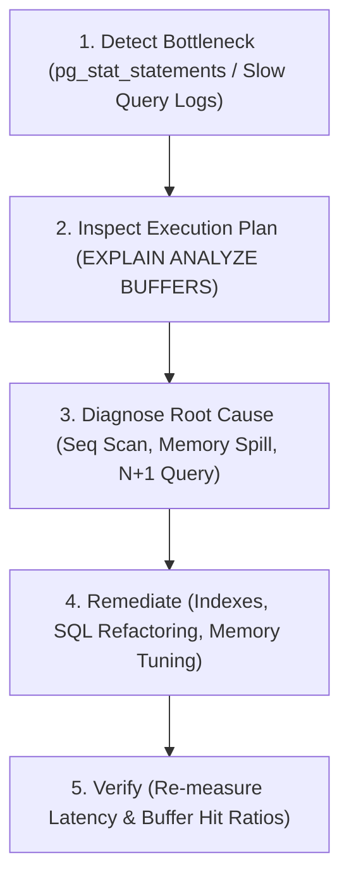

# How to optimize slow queries

---

## 🟢 Junior Level

**Query optimization** is the systematic engineering process of detecting, diagnosing, and eliminating performance bottlenecks across the database engine and application data access layers to minimize latency and hardware resource consumption.



### Simple Real-World Analogy
Imagine locating a specific book in a massive university library containing millions of volumes:
- **Unoptimized Query (`Seq Scan`):** The librarian starts at Shelf 1 and inspects every single book title one by one until finding the requested title. It takes 3 hours.
- **Optimized Query (B-Tree Index):** The librarian consults the alphabetical card catalog (**B-Tree Index**), identifies the exact aisle, shelf, and call number in 5 seconds, walks directly to the location, and retrieves the book in 15 seconds.

### The 4-Step Practical Optimization Loop

1. **Identify the Slow Query:** Capture the slow statement using application APM tools (Datadog, OpenTelemetry) or the `pg_stat_statements` catalog.
2. **Inspect the Plan:** Run `EXPLAIN (ANALYZE, BUFFERS) <query>;` to capture real wall-clock timing and memory metrics.
3. **Diagnose the Primary Culprit:**
   - A sequential scan (`Seq Scan`) reading millions of rows to return a handful of tuples.
   - An in-memory sort or hash aggregation spilling temporary files to disk (`Disk: XX kB`).
   - A vast discrepancy between estimated rows (`rows=1`) and actual emitted rows (`actual rows=500000`).
4. **Remediate and Verify:** Add an index, rewrite the SQL query, run `ANALYZE` to update statistics, or allocate `work_mem`.

---

## 🟡 Middle Level

### 5 Most Common Performance Pitfalls and Direct Solutions

#### 1. Missing Index or Sequential Scan on Large Tables
```sql
-- ❌ SLOW: Scans 10,000,000 rows from disk for a single record
SELECT * FROM users WHERE email = 'alex@company.com';

-- ✅ SOLUTION: Dedicated B-Tree Index
CREATE INDEX idx_users_email ON users(email);
-- Drops query execution time from 150 ms to 0.05 ms!
```

#### 2. Function Wrapping in Predicates (The B-Tree Killer)
Wrapping an indexed column inside a SQL or custom function prevents PostgreSQL from using a standard B-tree index:
```sql
-- ❌ ANTI-PATTERN: Standard B-tree index on 'email' is completely bypassed!
SELECT * FROM users WHERE LOWER(email) = 'alex@company.com';

-- ✅ SOLUTION: Functional / Expression Index
CREATE INDEX idx_users_email_lower ON users(LOWER(email));
```

#### 3. Implicit Type Casting
If the data type of a parameter does not match the column definition, PostgreSQL applies an implicit type conversion function across every row in the table, disabling index scans:
```sql
-- Column 'phone' is VARCHAR(32)
-- ❌ Passing a numeric literal forces PostgreSQL to cast the entire table to numeric!
SELECT * FROM clients WHERE phone = 18005550199;
-- Filter in plan: (phone::numeric = 18005550199::numeric) -> Full Table Scan!

-- ✅ SOLUTION: Strict parameter typing
SELECT * FROM clients WHERE phone = '18005550199';
```

#### 4. Insufficient Memory for Sorting and Hashing (Disk Spills)
```sql
EXPLAIN (ANALYZE, BUFFERS) 
SELECT * FROM transactions ORDER BY created_at DESC;
-- In Plan: Sort Method: external merge Disk: 45000kB (50x slower due to disk I/O!)

-- ✅ SOLUTION: Allocate adequate work_mem for the session:
SET work_mem = '128MB';
-- In Plan: Sort Method: quicksort Memory: 48000kB (Pure RAM execution!)
```

#### 5. The ORM N+1 Query Cascade in Spring Data / Hibernate
In Java enterprise applications, lazy loading (`FetchType.LAZY`) is the leading cause of database performance degradation:
```java
// ❌ CRITICAL ANTI-PATTERN: 1 query for customers + 1,000 separate queries for orders!
List<Customer> customers = customerRepository.findAll();
for (Customer c : customers) {
    System.out.println(c.getOrders().size()); // Fires an individual SELECT orders query per customer!
}

// ✅ PRODUCTION SOLUTION 1: JPQL JOIN FETCH
@Query("SELECT DISTINCT c FROM Customer c LEFT JOIN FETCH c.orders")
List<Customer> findAllWithOrders();

// ✅ PRODUCTION SOLUTION 2: Spring Data @EntityGraph
@EntityGraph(attributePaths = {"orders"})
List<Customer> findAll();
```

---

## 🔴 Senior Level

### The 4-Tier Optimization Pyramid

Senior database architects approach performance systematically, moving from application queries down to physical infrastructure:

```
┌────────────────────────────────────────────────────────┐
│  Tier 1: SQL & ORM Level (Indexes, JOIN FETCH, DTOs)   │
├────────────────────────────────────────────────────────┤
│  Tier 2: DB Config Level (work_mem, random_page_cost)  │
├────────────────────────────────────────────────────────┤
│  Tier 3: Architecture Level (Partitioning, Views, Pool)│
├────────────────────────────────────────────────────────┤
│  Tier 4: Infrastructure Level (NVMe SSDs, RAM, OS IO) │
└────────────────────────────────────────────────────────┘
```

### Architectural Scalability Patterns

#### 1. Declarative Table Partitioning
For high-volume append tables exceeding 50M–100M rows (audit logs, financial ledgers, time-series data):
```sql
CREATE TABLE payment_events (
    id bigserial,
    event_time timestamptz NOT NULL,
    amount numeric
) PARTITION BY RANGE (event_time);

CREATE TABLE payment_events_2026_01 PARTITION OF payment_events
    FOR VALUES FROM ('2026-01-01') TO ('2026-02-01');

-- The optimizer uses Partition Pruning:
SELECT * FROM payment_events WHERE event_time >= '2026-01-15';
-- Scans ONLY the January 2026 partition, skipping gigabytes of older years!
```

#### 2. Materialized Views with Concurrent Refresh
For analytical dashboards executing complex multi-table aggregations:
```sql
CREATE MATERIALIZED VIEW mv_daily_revenue AS
SELECT store_id, DATE(created_at) AS day, SUM(total_amount) AS revenue
FROM orders
GROUP BY store_id, DATE(created_at);

-- Add unique index to unlock non-blocking concurrent refreshes:
CREATE UNIQUE INDEX idx_mv_daily_revenue ON mv_daily_revenue(store_id, day);

-- Zero read-downtime background refresh:
REFRESH MATERIALIZED VIEW CONCURRENTLY mv_daily_revenue;
```

#### 3. Connection Pooling Architecture (PgBouncer & HikariCP)
Every client connection in PostgreSQL is a separate operating system process consuming 5–10 MB of RAM. Allocating 500 direct client connections causes CPU cache thrashing due to continuous OS **context switching**.

The canonical connection sizing formula:
$$\text{Optimal Pool Size} = (\text{CPU Cores} \times 2) + \text{Spindle Count}$$
For a 16-core server, the optimal pool size is **32–40 connections**. For large-scale microservice clusters, place **PgBouncer in Transaction Pooling Mode** between applications and PostgreSQL to multiplex thousands of microservice sockets into a small, fixed pool of backend workers.

### PostgreSQL Configuration Tuning for Modern NVMe SSDs

Default settings in `postgresql.conf` are tuned conservatively for legacy spinning hard drives:

```ini
# postgresql.conf optimization for modern NVMe SSD servers:
shared_buffers = 16GB                  # 25% of total server RAM
effective_cache_size = 48GB            # 75% of total server RAM (estimated OS cache)
random_page_cost = 1.1                 # Crucial! Default 4.0 assumes HDDs; 1.1 reflects NVMe random read speed!
work_mem = 64MB                        # Memory per sort/hash operation
maintenance_work_mem = 2GB             # Memory for CREATE INDEX and VACUUM
jit = off                              # Disable LLVM JIT for low-latency OLTP systems
```

### Cumulative Workload Discovery via `pg_stat_statements`

```sql
-- Top 5 queries consuming the most cumulative database CPU time:
SELECT 
    ROUND(total_exec_time::numeric, 2) AS total_time_ms,
    calls,
    ROUND(mean_exec_time::numeric, 2) AS avg_time_ms,
    ROUND((100.0 * total_exec_time / SUM(total_exec_time) OVER())::numeric, 2) AS pct_cluster_load,
    query
FROM pg_stat_statements
ORDER BY total_exec_time DESC
LIMIT 5;
```

---

## 4 Tricky Questions

### 1. Why didn't adding a B-tree index on `status` accelerate `SELECT * FROM users WHERE status = 'ACTIVE'`?
**Answer:**  
Due to **low selectivity (low cardinality)**.  
If 90% of the table rows have `status = 'ACTIVE'`, using an index requires reading 90% of the index pages followed by 90% of the heap pages via random, non-sequential I/O. A sequential scan (`Seq Scan`) reads the heap pages contiguously in order, which is significantly faster. The optimizer correctly rejects the index.  
**Solutions:**
1. Create a **Partial Index** for the rare values (`CREATE INDEX idx_users_inactive ON users(id) WHERE status != 'ACTIVE'`).
2. Construct a **Composite Index** combining `status` with a highly selective column (`CREATE INDEX idx_users_status_created ON users(status, created_at DESC)`).

### 2. What is a Generic Plan in the PostgreSQL JDBC driver, and how can it cause severe production latency spikes?
**Answer:**  
When an application uses parameterized Prepared Statements via `pgjdbc`, the driver tracks invocation count. After 5 executions (`prepareThreshold=5`), the driver switches from compiling **Custom Plans** (with bound literals) to a server-side **Generic Plan** (`$1`).  
If the data distribution is heavily skewed (for example, tenant ID 42 has 5 rows, while tenant ID 1 has 1,000,000 rows), the generic plan calculates the *average cost* across all values. It concludes that the average lookup touches hundreds of thousands of rows and locks in a **`Seq Scan`** for all subsequent calls.  
**Remediation:** Set `prepareThreshold=0` in the JDBC connection string or run `SET plan_cache_mode = 'force_custom_plan'`.

### 3. Why is reducing `random_page_cost` from 4.0 to 1.1 critical on modern SSD storage?
**Answer:**  
The parameter `random_page_cost` tells the planner how expensive it is to read an 8 KB page at a random disk offset relative to a sequential page read (`seq_page_cost = 1.0`).  
The default value of `4.0` was designed for mechanical hard drives with spinning platters and physical seek heads. On modern NVMe SSDs, random reads have virtually the exact same latency as sequential reads. Leaving `random_page_cost = 4.0` severely biases the optimizer against B-tree Index Scans, causing it to unnecessarily choose slow full table scans. Setting it to `1.1` allows the optimizer to properly favor index scans.

### 4. How does setting a connection pool (e.g. HikariCP) too large degrade query execution throughput?
**Answer:**  
In PostgreSQL, each client connection is backed by a separate OS process, not a lightweight thread.  
If an application allocates 200–500 connections to an 8-core or 16-core database server, hundreds of processes compete concurrently for CPU cores. The operating system spends massive amounts of time performing **CPU context switching** and managing process memory structures, while PostgreSQL processes contend for shared buffer spinlocks and latches. Reducing the pool to the optimal formula ($2 \times \text{cores} + \text{disks} \approx 20\text{--}35$ connections) eliminates latch contention, improves L1/L2/L3 CPU cache residency, and drastically lowers average query latency.

---

## 🎯 Interview Cheat Sheet

### Core Concepts (First 30 Seconds)
- **Methodology:** Identify via `pg_stat_statements` $\longrightarrow$ Analyze via `EXPLAIN (ANALYZE, BUFFERS)` $\longrightarrow$ Fix at the lowest appropriate tier $\longrightarrow$ Verify with metrics.
- **Top Culprits:** Missing indexes, functions wrapping indexed columns (`LOWER(email)`), implicit type casting, and ORM N+1 queries.
- **SSD Optimization:** Lower `random_page_cost` to `1.1` to reflect NVMe storage speeds and prevent erroneous Seq Scans.
- **Memory Tuning:** Increase `work_mem` to prevent sorts and hash tables from spilling to disk (`external merge Disk`).
- **Connection Sizing:** Cap connection pools to $(\text{Cores} \times 2)$ to eliminate CPU context switching; use PgBouncer for microservices.

### Advanced Architectural Knowledge
- **Hibernate N+1:** Fix with `JOIN FETCH`, `@EntityGraph`, or DTO projections (`Record` types).
- **Data Skew & Generic Plans:** Prevent slow generic plans on prepared statements using `SET plan_cache_mode = 'force_custom_plan'`.
- **Large Tables ($>100\text{M}$ rows):** Implement Declarative Partitioning to enable Partition Pruning.
- **Analytical Dashboards:** Leverage Materialized Views with `REFRESH MATERIALIZED VIEW CONCURRENTLY`.

### Red Flags (What NOT to Say)
- ❌ *"Optimization is just adding indexes to every single column in the WHERE clause."* (Causes severe write amplification, index bloat, and slows down DML).
- ❌ *"If queries are slow, increase the HikariCP connection pool to 500 connections."* (Causes severe CPU context switching and latch contention).
- ❌ *"Restarting PostgreSQL is a good first step to solve slow queries."* (Destroys the shared buffers cache and resets performance diagnostics).
- ❌ *"EXPLAIN ANALYZE is safe to run on production DELETE queries."* (It executes the DELETE and permanently destroys data).

### Related Topics
- [What is Explain plan](20.%20What%20is%20Explain%20plan.md) — Comprehensive plan analysis and diagnostics
- [What are indexes and why are they needed](1.%20What%20are%20indexes%20and%20why%20are%20they%20needed.md) — Scan types and index mechanics
- [Why is ANALYZE needed](19.%20Why%20is%20ANALYZE%20needed.md) — Refreshing statistics to fix bad query plans
- [What is VACUUM in PostgreSQL](18.%20What%20is%20VACUUM%20in%20PostgreSQL.md) — Table bloat remediation and autovacuum tuning
