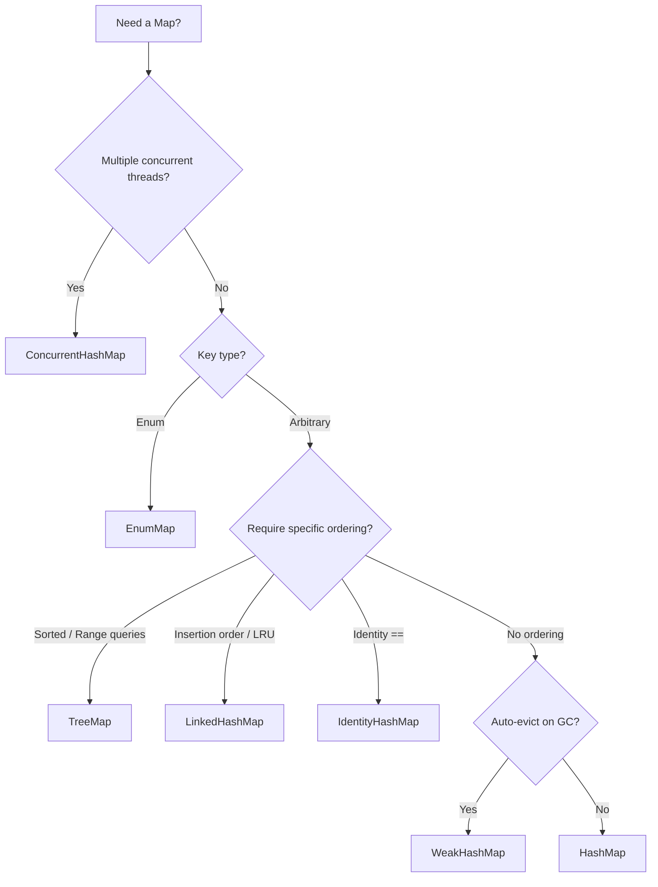

# Which Map Implementation to Choose

---

## 🟢 Junior Level

The Java Collections Framework provides an extensive family of implementations of the `java.util.Map` interface. Each implementation is engineered for specific performance profiles, memory constraints, ordering guarantees, and concurrency models.

### Quick Selection Cheatsheet:

* **`HashMap`** — The default general-purpose choice. The fastest general-purpose associative collection for single-threaded code. Provides no ordering guarantees.
* **`LinkedHashMap`** — Used when predictable iteration ordering is essential (either insertion order or access order for building LRU caches).
* **`TreeMap`** — Used when keys must remain strictly sorted (via `Comparable` or `Comparator`), or when range queries (`subMap`, `headMap`) are required.
* **`ConcurrentHashMap`** — The industry standard for high-throughput, thread-safe concurrent applications. Provides fine-grained locking and lock-free reads.
* **`EnumMap`** — A specialized, ultra-fast, compact map used whenever keys are `Enum` instances.
* **`WeakHashMap`** — Automatically evicts entries when keys lose external strong references and are collected by the Garbage Collector.
* **`IdentityHashMap`** — Compares keys strictly by reference identity (`==`) rather than `.equals()`.

```java
import java.util.*;
import java.util.concurrent.ConcurrentHashMap;

public class MapChoiceDemo {
    public static void main(String[] args) {
        // 1. General-purpose single-threaded map
        Map<String, String> standard = new HashMap<>();

        // 2. Predictable insertion order
        Map<String, String> ordered = new LinkedHashMap<>();

        // 3. Automatically sorted keys
        Map<String, String> sorted = new TreeMap<>();

        // 4. Thread-safe concurrent access
        Map<String, String> threadSafe = new ConcurrentHashMap<>();
    }
}
```

> **Analogy:** Selecting a `Map` is like selecting transportation: `HashMap` is a personal sedan for everyday driving; `ConcurrentHashMap` is a multi-track subway handling millions of commuters simultaneously; `TreeMap` is a scheduled passenger train running strictly on timetable order; and `EnumMap` is a Formula-1 racecar designed to operate exclusively on a specialized, fixed track.

---

## 🟡 Middle Level

### Architectural Comparison Matrix

| Implementation | Internal Structure | Iteration Ordering | Thread Safety | Time Complexity (`get`/`put`) | Null Support |
| :--- | :--- | :--- | :--- | :--- | :--- |
| **`HashMap`** | Hash table (array + linked list / Red-Black Tree) | None | ❌ No | $\mathcal{O}(1)$ avg | Key: 1 / Value: unlimited |
| **`LinkedHashMap`** | `HashMap` + doubly-linked list across entries | Insertion or Access (LRU) | ❌ No | $\mathcal{O}(1)$ avg | Key: 1 / Value: unlimited |
| **`TreeMap`** | Red-Black Tree | Natural order or `Comparator` | ❌ No | $\mathcal{O}(\log N)$ | Key: ❌ (NPE)* / Value: unlimited |
| **`ConcurrentHashMap`** | Hash table + CAS + synchronized bucket heads | None | ✅ Yes | $\mathcal{O}(1)$ avg | Key: ❌ / Value: ❌ (NPE) |
| **`EnumMap`** | Flat array `Object[]` indexed by `ordinal()` | Natural declaration order | ❌ No | $\mathcal{O}(1)$ (1 CPU cycle) | Key: ❌ (NPE) / Value: unlimited |
| **`WeakHashMap`** | Hash table with `WeakReference<K>` keys | None | ❌ No | $\mathcal{O}(1)$ avg | Key: 1 / Value: unlimited |
| **`IdentityHashMap`** | Open addressing flat array with linear probing (`==`) | None | ❌ No | $\mathcal{O}(1)$ avg | Key: 1 / Value: unlimited |

*\*Note: `TreeMap` permits a `null` key only if configured with an explicit custom comparator handling nulls (e.g. `Comparator.nullsFirst`).*

### Specialized Implementations in Detail

#### 1. `LinkedHashMap` and LRU Cache Construction
`LinkedHashMap` extends `HashMap`, maintaining a doubly-linked list (`before`/`after` pointers) running through all entries.
When instantiated with `accessOrder = true`, every `get()` invocation moves the accessed entry to the tail:

```java
public class SimpleLruCache<K, V> extends LinkedHashMap<K, V> {
    private final int maxCapacity;

    public SimpleLruCache(int maxCapacity) {
        super(maxCapacity, 0.75f, true /* access-order */);
        this.maxCapacity = maxCapacity;
    }

    @Override
    protected boolean removeEldestEntry(Map.Entry<K, V> eldest) {
        return size() > maxCapacity; // Evicts eldest accessed entry when limit exceeded
    }
}
```

#### 2. `TreeMap` and Navigable Range Queries
Implementing `NavigableMap`, `TreeMap` enables efficient boundary and range lookups:

```java
NavigableMap<Integer, String> scores = new TreeMap<>();
scores.put(100, "UserA");
scores.put(250, "UserB");
scores.put(500, "UserC");

scores.subMap(100, true, 300, true); // Keys within [100, 300]
scores.floorEntry(200);              // Highest key <= 200 (100)
scores.ceilingEntry(200);            // Lowest key >= 200 (250)
```

#### 3. `EnumMap`: Extreme Performance Optimization
When keys belong to an `enum`, using `HashMap` is an anti-pattern.
`EnumMap` is backed by a compact `Object[] vals` array sized to `Enum.values().length`:
- **No hashing:** The array index is calculated directly from `key.ordinal()`.
- **Zero collisions:** Hash collisions are structurally impossible.
- **Cache locality:** Contiguous memory layout maximizes CPU L1 data cache hits.

---

## 🔴 Senior Level

### Memory Footprint & Cache Locality Breakdown (1,000,000 Entries)

Heap memory consumed on a 64-bit HotSpot JVM with Compressed OOPs enabled:

```text
EnumMap           [~8 MB]   (single values array + enum class metadata)
HashMap           [~48 MB]  (table array + 1M Node objects: 32 bytes each)
ConcurrentHashMap [~56 MB]  (table array + 1M Nodes: 32 bytes + CounterCell[] + volatile overhead)
LinkedHashMap     [~64 MB]  (table array + 1M Entry objects with before/after pointers: 48 bytes each)
TreeMap           [~80 MB]  (1M Entry objects: parent, left, right, value, key, color: 48-56 bytes each)
```

1. **`EnumMap` & CPU Cache:** Flat array indexing via `ordinal()` allows CPU hardware prefetchers to load values directly into CPU L1 cache lines with $\sim 1\text{ ns}$ latency.
2. **`LinkedHashMap` Iteration:** Iterating over `map.entrySet()` is strictly $\mathcal{O}(N)$ (traversing the doubly-linked list), outperforming `HashMap`'s $\mathcal{O}(\text{capacity} + N)$ (which must scan all empty bucket slots). However, each node requires 16 additional bytes for list pointers.
3. **`IdentityHashMap` Architecture:** Uses **linear probing open addressing** inside a single flat `Object[] table` array, alternating keys and values: `[key0, val0, key1, val1, ...]`. It avoids separate node objects entirely.

### Architectural Decision Tree



---

## 4 Tricky Questions

### 1. Why does calling `get()` on a `LinkedHashMap` with `accessOrder = true` throw `ConcurrentModificationException` during a for-each loop?

**Answer:**
In standard collections, `get()` is a read-only operation that leaves `modCount` untouched.
In `LinkedHashMap` with `accessOrder = true`, calling `get(key)` on an existing entry **mutates the underlying doubly-linked list** by unlinking the node and appending it to the tail. This list re-linking is a structural modification that increments `modCount++`.
If `get()` is invoked while iterating over `map.entrySet()` in a for-each loop, the iterator's next step detects `modCount != expectedModCount` and immediately throws `ConcurrentModificationException`.

---

### 2. When is `IdentityHashMap` used in practice, and why does it formally violate the `Map` contract?

**Answer:**
The `Map` interface specification mandates that key equality is determined via `(k1 == null ? k2 == null : k1.equals(k2))`.
`IdentityHashMap` **intentionally breaks this contract** by checking reference identity (`k1 == k2`). It uses `System.identityHashCode(k1)` instead of `k1.hashCode()`.

**Practical Use Cases:**
1. **Serialization & Graph Traversal Frameworks (Jackson, Kryo, Java Serialization):** When walking an object graph, `IdentityHashMap` tracks visited instances to prevent infinite loops from circular references. Reference identity is required because two objects might be equal by `.equals()` yet represent distinct instances in the graph.
2. **Object Profilers & Dependency Injection Containers:** Tracking physical memory allocations and proxy instances.

---

### 3. If you need a sorted, thread-safe map, what implementation should you choose since `ConcurrentTreeMap` does not exist?

**Answer:**
Use **`java.util.concurrent.ConcurrentSkipListMap`**.
Wrapping a `TreeMap` via `Collections.synchronizedSortedMap(new TreeMap<>())` introduces a coarse-grained global lock that serializes all threads, destroying scalability.
`ConcurrentSkipListMap` implements `ConcurrentMap` and `NavigableMap` using a concurrent **SkipList (probabilistic multi-level linked list)** data structure. It delivers lock-free concurrent reads and scalable concurrent writes with $\mathcal{O}(\log N)$ average time complexity while preserving sorted key ordering.

---

### 4. Why do immutable maps created with `Map.of()` (Java 9+) randomize iteration order across JVM restarts?

**Answer:**
In `Map.of()` and `Map.ofEntries()`, iteration order is intentionally randomized using a JVM-startup salt:
1. **Preventing Implicit Dependencies:** Developers often accidentally rely on iteration order in unit tests. Randomization prevents applications from depending on unspecified iteration sequences.
2. **Security Hardening (HashDoS):** Eliminates predictable bucket collision patterns for small configuration maps.
3. **Compact Internal Layouts:** For small maps ($\le 2$ entries), the JDK instantiates compact classes (`Map1`, `Map2`) containing inline fields `k0, v0, k1, v1` without allocating backing arrays at all.

---

## 🎯 Interview Cheat Sheet

- **Selection Summary:**
  - Default: `HashMap` ($\mathcal{O}(1)$, no order).
  - Insertion Order / LRU: `LinkedHashMap` ($\mathcal{O}(1)$, doubly-linked list).
  - Sorted / Range Queries: `TreeMap` ($\mathcal{O}(\log N)$, Red-Black Tree).
  - Multi-threaded: `ConcurrentHashMap` ($\mathcal{O}(1)$, CAS + bucket locking).
  - Sorted Multi-threaded: `ConcurrentSkipListMap` ($\mathcal{O}(\log N)$, SkipList).
  - Enum Keys: `EnumMap` ($\mathcal{O}(1)$, single CPU cycle array index).
  - Reference Identity (`==`): `IdentityHashMap` (flat open-addressing array).
- **`LinkedHashMap` Pitfall:** With `accessOrder = true`, `get()` mutates `modCount++` and triggers `ConcurrentModificationException` during iterations.
- **Memory Footprint Hierarchy:** `EnumMap` < `HashMap` < `ConcurrentHashMap` < `LinkedHashMap` < `TreeMap`.

### Related Topics
- [How HashMap Works Internally](01.%20How%20HashMap%20Works%20Internally.md)
- [What is ConcurrentHashMap and How Does It Differ from HashMap](23.%20What%20is%20ConcurrentHashMap%20and%20How%20Does%20It%20Differ%20from%20HashMap.md)
- [What is WeakHashMap](27.%20What%20is%20WeakHashMap.md)
- [What is the Difference Between HashMap and Hashtable](26.%20What%20is%20the%20Difference%20Between%20HashMap%20and%20Hashtable.md)
