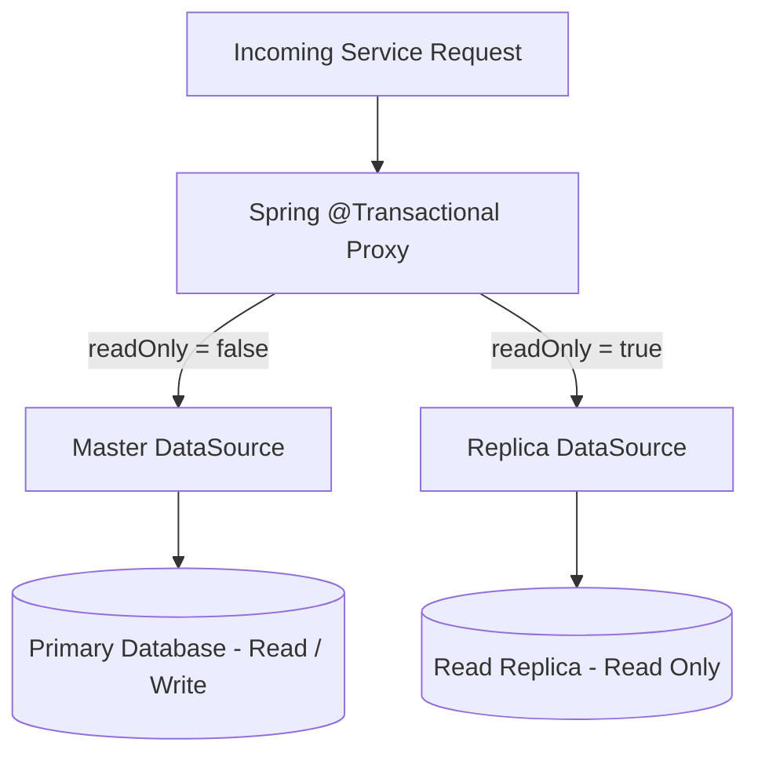

# What is a ReadOnly Transaction

---

## 🟢 Junior Level

A **`readonly` transaction** is a transaction configured with the `readOnly = true` attribute:
```java
@Transactional(readOnly = true)
```
It explicitly signals to the Spring Framework, the persistence provider (Hibernate/JPA), and the database JDBC driver that only **read operations** (`SELECT`) will be executed within this execution scope, and **no data modifications** (`INSERT`, `UPDATE`, `DELETE`, DDL) will take place.

### The Essence in 30 Seconds
Key advantages of annotating methods with `readOnly = true`:
1. **Major Memory & CPU Optimization (Hibernate):** Hibernate disables the **Dirty Checking** mechanism. It no longer creates memory snapshots of loaded entities upon hydration or traverses/compares entity fields during commit.
2. **Database Engine Optimizations:** The JDBC driver switches the connection into `READ ONLY` mode (`SET TRANSACTION READ ONLY`), allowing the DBMS engine to skip allocating transaction write logs (Undo/WAL write segments) and optimize query execution plans.
3. **Dynamic Read Replica Routing:** In distributed architectures, queries executed within `readOnly = true` are routed to read replicas, significantly offloading the primary write master.
4. **Safety Against Accidental Mutations:** If application code inadvertently executes modifying SQL statements, the database engine aborts the transaction with an error.

```java
package com.example.service;

import com.example.dto.UserProfileDto;
import com.example.repository.UserRepository;
import lombok.RequiredArgsConstructor;
import org.springframework.stereotype.Service;
import org.springframework.transaction.annotation.Transactional;

@Service
@RequiredArgsConstructor
public class UserQueryService {

    private final UserRepository userRepository;

    // Recommended enterprise standard for all query methods:
    @Transactional(readOnly = true)
    public UserProfileDto getUserProfile(Long userId) {
        var user = userRepository.findById(userId)
                .orElseThrow(() -> new IllegalArgumentException("User not found: " + userId));
        return new UserProfileDto(user.getId(), user.getUsername(), user.getEmail());
    }
}
```

---

## 🟡 Middle Level

### Hibernate Optimizations: FlushMode.MANUAL

When a method is annotated with `@Transactional(readOnly = true)`, Spring switches the current Hibernate Session to **`FlushMode.MANUAL`** (historically `FlushMode.NEVER`):
- **Standard Transaction (`readOnly = false`):** Operating under `FlushMode.AUTO`, Hibernate is required before executing queries and before transaction commit to scan every managed entity in the first-level cache (`PersistenceContext`), compare every field against its original hydration snapshot (*dirty checking*), and issue queued SQL `UPDATE` statements to the database.
- **Read-Only Transaction (`readOnly = true`):** Hibernate completely disables automated dirty checking. The commit phase completes almost instantaneously because Hibernate wastes zero CPU cycles on diff comparisons and skips executing any SQL `flush()`.

```mermaid
flowchart TD
    subgraph StandardTransaction["Standard Transaction (readOnly = false)"]
        A1[SELECT Query] --> B1[Load into PersistenceContext]
        B1 --> C1[Create Entity Snapshot in Memory]
        C1 --> D1[Execute Business Logic]
        D1 --> E1[Perform Dirty Checking Scan across all entities]
        E1 --> F1[Generate & Flush SQL UPDATE statements]
        F1 --> G1[COMMIT to Database]
    end

    subgraph ReadOnlyTransaction["Read-Only Transaction (readOnly = true)"]
        A2[SELECT Query] --> B2[Load into PersistenceContext]
        B2 --> C2[Execute Business Logic]
        C2 --> D2[Dirty Checking DISABLED]
        D2 --> E2[Flush SKIPPED]
        E2 --> F2[Instant COMMIT]
    end
```



> [!WARNING]
> **Subtle Trap:** If an application modifies an entity field via a setter inside a `readOnly = true` method:
> ```java
> user.setEmail("new@example.com");
> ```
> Hibernate **does not throw any exception**. It silently retains the mutated state in JVM memory and ignores it during commit, meaning no `UPDATE` statement is issued to the database.

### DBMS & JDBC Driver Optimizations

Upon entering a `readOnly` transaction boundary, Spring calls the standard JDBC method:
```java
connection.setReadOnly(true);
```
The exact behavior depends on the database engine and JDBC driver implementation:

| Database Engine | Action Taken by Driver / Engine | Consequence |
| :--- | :--- | :--- |
| **PostgreSQL** | Executes `SET TRANSACTION READ ONLY`. | Any attempt to perform DML (`INSERT`, `UPDATE`, `DELETE`, `TRUNCATE`, DDL) immediately throws a fatal exception: `ERROR: cannot execute UPDATE in a read-only transaction`. |
| **MySQL (InnoDB)** | Optimizes internal engine accounting. | InnoDB skips allocating a transaction identifier (`TRX_ID`), saving internal rollback segment slots and lock manager overhead. |
| **Oracle** | Enforces transaction-level read consistency. | All queries within the transaction see data as of the moment the transaction started (consistent multiversion read view). |

---

## 🔴 Senior Level

### Dynamic Read Replica Routing Architecture

In high-throughput enterprise systems with Primary-Replica (Master-Slave) topologies, `@Transactional(readOnly = true)` acts as the routing trigger to steer incoming database queries away from the primary writer to read replicas using Spring's `AbstractRoutingDataSource`.



#### Spring Implementation:
```java
package com.example.datasource;

import org.springframework.jdbc.datasource.lookup.AbstractRoutingDataSource;
import org.springframework.transaction.support.TransactionSynchronizationManager;

public class DynamicRoutingDataSource extends AbstractRoutingDataSource {

    @Override
    protected Object determineCurrentLookupKey() {
        // Inspect current thread-local transaction attributes:
        boolean isReadOnly = TransactionSynchronizationManager.isCurrentTransactionReadOnly();
        return isReadOnly ? "REPLICA" : "MASTER";
    }
}
```

### The Critical Pitfall: LazyConnectionDataSourceProxy

If you simply configure `DynamicRoutingDataSource` directly as your application `DataSource`, read replica routing **fails silently**:
- **Why It Fails:** By default, Spring's transaction manager claims a physical database `Connection` from the pool **before** the transaction interceptor sets the `currentTransactionReadOnly` flag in `TransactionSynchronizationManager`. When `determineCurrentLookupKey()` is called, it executes too early, observes `readOnly = false`, and perpetually routes to the `MASTER` pool!
- **Senior Solution:** Wrap the routing datasource in a **`LazyConnectionDataSourceProxy`**:

```java
@Configuration
public class DataSourceConfig {

    @Bean
    public DataSource dataSource(DynamicRoutingDataSource routingDataSource) {
        // Defers fetching a physical connection from the pool until the
        // first actual JDBC Statement or SQL query is executed!
        return new LazyConnectionDataSourceProxy(routingDataSource);
    }
}
```
With `LazyConnectionDataSourceProxy`, the physical connection lookup is deferred until `SELECT` execution, by which time `isCurrentTransactionReadOnly() == true` is guaranteed to be set in `ThreadLocal`.

### Mitigating Replica Lag (Read-Your-Own-Writes)

Asynchronous database replication introduces **Replica Lag** (typically 20–500 ms):
1. A user updates their profile: `POST /profile` (`@Transactional` $\rightarrow$ commits to Primary/Master).
2. The UI immediately redirects to view the profile: `GET /profile` (`@Transactional(readOnly = true)` $\rightarrow$ queries Read Replica).
3. **Problem:** If the replica has not yet replayed the primary's binlog/WAL, the user observes stale data!
4. **Resolution Pattern (Read-Your-Own-Writes Consistency):** Store a timestamp of the last write in a user session or signed client cookie (`last_write_timestamp`). If an incoming read request arrives within the synchronization window (e.g., within 2 seconds of the write), force the routing layer to direct the read query to the Master database, bypassing the read replica despite `readOnly = true`.

---

## 4 Tricky Interview Questions

### 1. Does Hibernate throw an exception if an entity field is mutated via setter inside `@Transactional(readOnly = true)`?
**Answer:**  
**No, Hibernate will not throw any exception.**  
Under `readOnly = true`, Hibernate sets `FlushMode.MANUAL`. The entity object's fields in JVM heap memory are modified, but Hibernate completely bypasses dirty checking and skips the automatic `flush()` phase during transaction commit. The modified values are simply discarded from persistence context synchronization without errors.  
However, if the developer explicitly calls `entityManager.flush()`, Hibernate is forced to generate and execute the SQL `UPDATE` statement. At that exact point, the database engine (e.g., PostgreSQL with `SET TRANSACTION READ ONLY`) aborts with an exception: `PSQLException: ERROR: cannot execute UPDATE in a read-only transaction`.

### 2. What happens if an outer method with `@Transactional(readOnly = true)` calls an inner method on another service annotated with plain `@Transactional` (default `REQUIRED`) that executes writes?
**Answer:**  
The write operation fails with a database exception:
- PostgreSQL throws: `PSQLException: ERROR: cannot execute UPDATE in a read-only transaction`.
- Spring Data JPA throws: `TransactionRequiredException` or data integrity failure on `@Modifying` queries.

**Root Cause:** With `Propagation.REQUIRED`, the child method joins the already opened parent physical transaction. The parent has already configured the underlying JDBC connection to `readOnly = true`. Because no new transaction is created, the child inherits the read-only constraint. To allow the inner method to perform independent writes, it must declare **`@Transactional(propagation = Propagation.REQUIRES_NEW)`** to suspend the parent transaction and open a distinct physical database connection without the read-only flag.

### 3. Does `@Transactional(readOnly = true)` provide any noticeable performance improvement when using pure `JdbcTemplate` or jOOQ (without Hibernate)?
**Answer:**  
The performance gain in raw JDBC or `JdbcTemplate` is **negligible or practically nonexistent**.  
The massive performance improvement in Spring applications comes from Hibernate bypassing entity snapshot creation and JVM heap dirty checking scans. Pure `JdbcTemplate` or jOOQ has no persistence context or dirty checking overhead.  
The only effect of `readOnly = true` in pure JDBC is passing the hint `connection.setReadOnly(true)` to the driver (which executes `SET TRANSACTION READ ONLY` in PostgreSQL). While this may slightly reduce engine lock management overhead in some databases, single `SELECT` execution latency remains essentially unchanged. The primary value for `JdbcTemplate` is **architectural safety** (blocking accidental DML) and enabling **read replica routing**.

### 4. Why is `SET TRANSACTION READ ONLY DEFERRABLE` recommended in PostgreSQL for heavy analytical reports under `Repeatable Read` or `Serializable` isolation?
**Answer:**  
In PostgreSQL, long-running analytical read-only transactions running under `Repeatable Read` or `Serializable` can fail with serialization errors (`SQLSTATE 40001: serialization_failure`) if they conflict with concurrent writing transactions.  
Specifying the **`DEFERRABLE`** modifier (`SET TRANSACTION READ ONLY DEFERRABLE`):
- Delays the actual initiation of the read-only transaction until a clean snapshot state is reached where no concurrent writing transactions can cause a serialization conflict.
- Once the deferrable transaction starts, it is **guaranteed never to abort with a serialization failure** and cannot cause any concurrent writer transactions to abort due to SSI (Serializable Snapshot Isolation) conflicts.

---

## 🎯 Interview Cheat Sheet

### 30-Second Summary
> "`@Transactional(readOnly = true)` informs Spring, Hibernate, and the database driver that a method performs strictly read operations. Its biggest performance win occurs in Hibernate, where it switches the session to `FlushMode.MANUAL` and completely disables **dirty checking**, eliminating snapshot comparisons on commit. At the JDBC level, it invokes `connection.setReadOnly(true)` (`SET TRANSACTION READ ONLY`), safeguarding against accidental writes. In distributed systems, this flag is leveraged by `AbstractRoutingDataSource` in combination with `LazyConnectionDataSourceProxy` to seamlessly direct query traffic to **read replicas**."

### Key Concepts Checklist
1. **Hibernate Optimization:** Disables dirty checking, switches to `FlushMode.MANUAL`, skips auto-flush.
2. **JDBC Driver Behavior:** Calls `connection.setReadOnly(true)` $\rightarrow$ `SET TRANSACTION READ ONLY` on PostgreSQL.
3. **Read Replica Routing:** `AbstractRoutingDataSource` checks `TransactionSynchronizationManager.isCurrentTransactionReadOnly()`.
4. **Mandatory Companion:** `LazyConnectionDataSourceProxy` is required to defer physical connection acquisition until query execution.
5. **Memory Mutation Trap:** Entity setters modify heap objects without throwing exceptions, but changes are never persisted unless `entityManager.flush()` is called explicitly.

### Common Pitfalls & Red Flags
- ❌ *"Setting `readOnly = true` makes Java entity objects immutable in JVM memory."* (False: setters work fine; Hibernate simply skips dirty checking).
- ❌ *"Spring automatically routes queries to read replicas out of the box when you set `readOnly = true`."* (False: requires explicit `AbstractRoutingDataSource` and `LazyConnectionDataSourceProxy` configuration).
- ❌ *"A write method with `REQUIRED` called from a `readOnly = true` method will succeed."* (False: it joins the read-only transaction and crashes on DML).

### Related Topics
- [At What Level Can Transactional Be Used](17.%20At%20What%20Level%20Can%20Transactional%20Be%20Used.md) — Class vs. method semantics
- [What is the Transactional Annotation](16.%20What%20is%20the%20Transactional%20Annotation.md) — Transaction attributes
- [What is Transaction Propagation in Spring](13.%20What%20is%20Transaction%20Propagation%20in%20Spring.md) — Propagation behaviors
- [What Happens When Calling a Transactional Method from Another Method in the Same Class](22.%20What%20Happens%20When%20Calling%20a%20Transactional%20Method%20from%20Another%20Method%20in%20the%20Same%20Class.md) — Self-invocation proxy bypass
