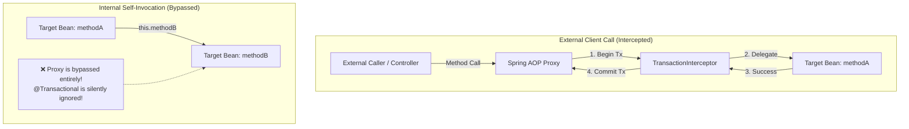

# What Happens When Calling a Transactional Method from Another Method in the Same Class

---

## 🟢 Junior Level

When a method calls another method annotated with `@Transactional` within the **same class** (using an explicit or implicit `this` reference), the **`@Transactional` annotation on the target method is completely ignored, and no new transaction boundary is established**.

In the Spring ecosystem, this architectural phenomenon is known as the **Self-Invocation Problem**.

### The Essence in 30 Seconds
Spring Framework manages declarative transactions using **AOP Dynamic Proxies (wrapper objects)**:
1. When an external caller (e.g., an HTTP Controller or another Service) invokes a bean method, the call first arrives at the **Spring AOP Proxy**, which initiates the transaction (`TransactionInterceptor.invoke`) before delegating to the target instance.
2. When a method inside a bean calls another method on the same bean (`this.innerMethod()`), the call executes **directly inside the JVM target instance**, bypassing the proxy wrapper entirely.
3. The `TransactionInterceptor` never intercepts the call. All transactional attributes (including `propagation = Propagation.REQUIRES_NEW`, `isolation`, `timeout`, and rollback rules) are completely bypassed.



### Code Demonstration of the Problem

```java
package com.example.service;

import com.example.entity.Order;
import com.example.repository.OrderRepository;
import lombok.RequiredArgsConstructor;
import org.springframework.stereotype.Service;
import org.springframework.transaction.annotation.Propagation;
import org.springframework.transaction.annotation.Transactional;

@Service
@RequiredArgsConstructor
public class OrderService {

    private final OrderRepository orderRepository;

    // Non-transactional public entry point:
    public void processOrder(Order order) {
        // BUG: Calling this.saveOrderInNewTx() bypasses the Spring AOP Proxy!
        saveOrderInNewTx(order);
    }

    // Developer intends to start an independent, isolated transaction:
    @Transactional(propagation = Propagation.REQUIRES_NEW)
    public void saveOrderInNewTx(Order order) {
        // ACTUAL BEHAVIOR: Executes with NO transaction (raw JDBC autocommit mode).
        // The @Transactional annotation is completely ignored!
        orderRepository.save(order);
    }
}
```

---

## 🟡 Middle Level

### Production Failure Scenarios

In production systems, self-invocation bugs typically cause critical data inconsistencies or silent data loss under two primary scenarios:

#### Scenario 1: Outer Method in Transaction, Inner Demands `REQUIRES_NEW`
```java
@Service
public class BillingService {

    @Autowired private AuditRepository auditRepo;

    @Transactional // Transaction #1
    public void executePayment() {
        debitAccount();
        
        // Developer expects audit to persist even if payment fails:
        this.logAuditInNewTx(); 
        
        throw new RuntimeException("Payment Gateway Timeout");
    }

    @Transactional(propagation = Propagation.REQUIRES_NEW)
    public void logAuditInNewTx() {
        auditRepo.save(new AuditEntry("Payment processing initiated"));
    }
}
```
**Failure Consequence:**  
The call `this.logAuditInNewTx()` skips the proxy. `REQUIRES_NEW` is ignored, and the audit record is saved inside **Transaction #1**. When `RuntimeException` is thrown, Transaction #1 rolls back entirely, **erasing the critical audit entry from the database!**

#### Scenario 2: Outer Method Non-Transactional, Inner Runs Batch Operations
If an unannotated outer method `public void importBatch(List<Row> rows)` loops through records and calls `this.saveRow(row)` (annotated with `@Transactional`), each record runs in standard JDBC `autoCommit = true` mode. If row 500 out of 1000 fails, the first 499 rows remain committed in the database, leaving corrupt, half-processed data without atomicity.

---

## 🔴 Senior Level

### Four Enterprise Solutions to Self-Invocation

A Senior Engineer evaluates trade-offs between architectural cleanliness, maintainability, and complexity:

#### 1. Extract to a Dedicated Service Bean (Recommended Best Practice)
Adheres strictly to the **Single Responsibility Principle (SRP)** and provides clean architectural boundaries:
```java
@Service
@RequiredArgsConstructor
public class OrderService {

    private final OrderAuditService auditService; // Separate Spring bean proxy!

    @Transactional
    public void executeOrder() {
        // Invocation routes through the external bean's AOP Proxy:
        auditService.logAuditInNewTx(); // REQUIRES_NEW executes in a separate transaction!
    }
}
```

#### 2. Self-Injection with `@Lazy`
When splitting into multiple beans creates unnecessary architectural noise, the bean can inject its own proxy:
```java
@Service
public class OrderService {

    @Autowired
    @Lazy // Prevents circular dependency (BeanCurrentlyInCreationException)
    private OrderService self;

    public void processOrder(Order order) {
        // Explicitly invokes through the Spring CGLIB proxy:
        self.saveOrderInNewTx(order); // @Transactional is intercepted cleanly!
    }

    @Transactional(propagation = Propagation.REQUIRES_NEW)
    public void saveOrderInNewTx(Order order) {
        orderRepository.save(order);
    }
}
```

#### 3. Programmatic Control via `TransactionTemplate`
Bypasses AOP dynamic proxying altogether in favor of explicit transactional closures:
```java
@Service
@RequiredArgsConstructor
public class OrderService {

    private final TransactionTemplate transactionTemplate;
    private final OrderRepository orderRepository;

    public void processOrder(Order order) {
        // Programmatic transaction boundary without proxy reflection overhead:
        transactionTemplate.execute(status -> {
            orderRepository.save(order);
            return true;
        });
    }
}
```

#### 4. AspectJ Compile-Time / Load-Time Bytecode Weaving (CTW/LTW)
- Bypasses runtime CGLIB/JDK dynamic proxy creation by modifying class bytecode directly at compile-time (`ajc`) or during class loading via a Java agent.
- AspectJ instruments bytecode instructions directly into `this.method()` calls and even `private`/`protected` methods. However, it introduces build system complexity and steeper maintenance overhead.

---

## 4 Tricky Interview Questions

### 1. What happens if an outer method `outer()` is already inside a `@Transactional` boundary, and calls `this.inner()` with `@Transactional(propagation = Propagation.REQUIRES_NEW)`?
**Answer:**  
The `inner()` method executes **inside the existing outer transaction**, behaving identically to `Propagation.REQUIRED`.  
Because the invocation is made through `this`, Spring's AOP proxy is completely bypassed. `TransactionInterceptor` never reads the `REQUIRES_NEW` configuration on `inner()`. No suspension (`suspend`) of the parent transaction occurs, and no new physical database connection is opened. If the outer method subsequently throws an unhandled exception and rolls back, all database changes made inside `inner()` are rolled back as well.

### 2. Why do standard unit tests using Mockito (e.g., `@ExtendWith(MockitoExtension.class)`) routinely fail to catch this critical bug?
**Answer:**  
Standard Mockito unit tests execute against raw Java instances in memory without bootstrapping the Spring `ApplicationContext` or generating CGLIB/JDK dynamic proxies.  
When the test calls `orderService.processOrder()`, the internal `this.saveOrderInNewTx()` method executes directly in JVM memory. Mocked repositories (`@Mock OrderRepository`) record the calls and return mock data, causing the test suite to pass green. The self-invocation proxy bypass defect only surfaces during Spring integration tests (`@SpringBootTest` / `@DataJpaTest`) with real database transaction rollback assertions, or under production load.

### 3. How can you systematically detect and prevent self-invocation of `@Transactional` methods across an entire enterprise codebase using ArchUnit?
**Answer:**  
By enforcing an automated architectural linting rule in the CI/CD pipeline via ArchUnit:
```java
package com.example.architecture;

import com.tngtech.archunit.junit.AnalyzeClasses;
import com.tngtech.archunit.junit.ArchTest;
import com.tngtech.archunit.lang.ArchRule;
import org.springframework.transaction.annotation.Transactional;

import static com.tngtech.archunit.lang.syntax.ArchRuleDefinition.noClasses;

@AnalyzeClasses(packages = "com.example")
public class TransactionArchitectureTest {

    @ArchTest
    public static final ArchRule no_self_invocation_of_transactional_methods =
        noClasses().should().callMethodWhere(
            target -> target.isAnnotatedWith(Transactional.class) 
                   && target.getOwner().equals(target.getDeclaringClass())
        ).because("Calling @Transactional methods on 'this' bypasses the Spring AOP Proxy!");
}
```
This test performs static bytecode analysis on compiled `.class` files, immediately failing the Maven/Gradle build if any method makes an internal self-call to a `@Transactional` target.

### 4. What is the fundamental difference in `@Transactional` handling between Spring CGLIB dynamic proxying and AspectJ Bytecode Weaving regarding `this` calls?
**Answer:**  
- **CGLIB / JDK Dynamic Proxy:** Operates using the Decorator / Proxy pattern. Spring creates a synthetic child class (e.g., `OrderService$$SpringCGLIB$$0`) that intercepts calls from external callers. Inside target methods, the `this` pointer evaluates strictly to the target instance itself, making it structurally impossible for runtime proxies to intercept internal calls.
- **AspectJ Bytecode Weaving (CTW / LTW):** Does not use runtime wrappers. Instead, AspectJ modifies the actual compiled bytecode of the class. Calls to `this.innerMethod()` are rewritten at the bytecode level to invoke the `TransactionAspect.aj` advice directly. As a result, AspectJ successfully applies transaction management to `this` calls, self-invocations, and even `private` or `protected` methods.

---

## 🎯 Interview Cheat Sheet

### 30-Second Summary
> "When a method invokes a `@Transactional` method within the same class, the annotation is **silently ignored and no transaction boundary is established**. Spring manages transactions through **AOP Proxies**; calls through `this` execute directly on the raw JVM instance, completely bypassing the `TransactionInterceptor`. The industry-standard solution is to **extract the transactional method into a dedicated service bean** (Single Responsibility Principle). Alternative fixes include self-injection with `@Lazy`, using programmatic `TransactionTemplate`, or configuring AspectJ bytecode weaving."

### Key Concepts Checklist
1. **Root Cause:** Invocations via `this` bypass Spring's CGLIB/JDK dynamic proxy wrapper.
2. **Ignored Parameters:** All `@Transactional` attributes (`REQUIRES_NEW`, `readOnly`, `timeout`, `isolation`) are skipped during self-invocation.
3. **Recommended Remedy:** Extract the method to a separate `@Service` bean.
4. **Self-Injection Fix:** Inject the bean into itself using `@Autowired @Lazy private MyService self;`.
5. **Architectural Guard:** Use ArchUnit to statically catch self-invocation violations in CI/CD.

### Common Pitfalls & Red Flags
- ❌ *"Adding `propagation = Propagation.REQUIRES_NEW` fixes the self-invocation issue."* (False: `REQUIRES_NEW` still requires the proxy to intercept the call and is equally ignored).
- ❌ *"Using `AopContext.currentProxy()` is the cleanest way to fix self-invocation."* (False: it is an anti-pattern that tightly couples business logic to Spring AOP internals and requires `exposeProxy = true`).
- ❌ *"CGLIB proxies solve self-invocation because they generate subclasses."* (False: the `this` reference inside method bodies still references the target instance).
- ❌ *"Self-invocation only affects `@Transactional`."* (False: it equally breaks `@Async`, `@Cacheable`, `@PreAuthorize`, and `@Retryable`).

### Related Topics
- [What is the Transactional Annotation](16.%20What%20is%20the%20Transactional%20Annotation.md) — How AOP proxies intercept calls
- [At What Level Can Transactional Be Used](17.%20At%20What%20Level%20Can%20Transactional%20Be%20Used.md) — Method vs class placement
- [What is Transaction Propagation in Spring](13.%20What%20is%20Transaction%20Propagation%20in%20Spring.md) — Propagation types and behavior
- [What is the Difference Between REQUIRED and REQUIRES_NEW](15.%20What%20is%20the%20Difference%20Between%20REQUIRED%20and%20REQUIRES_NEW.md) — Transaction boundaries
