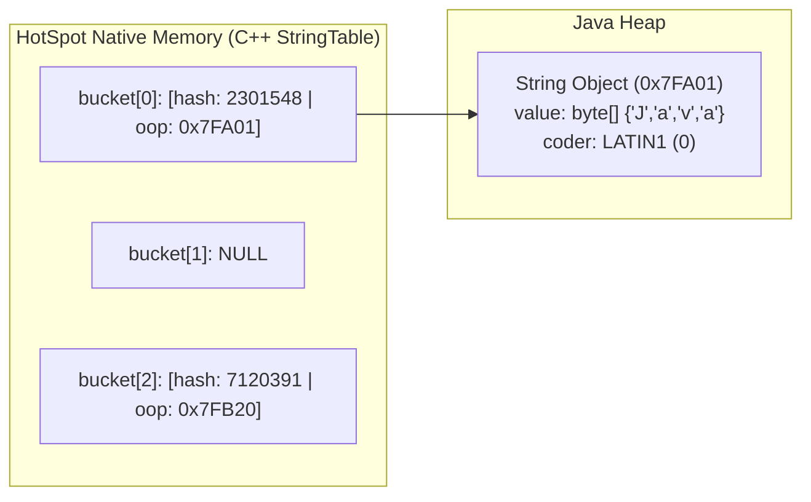

# How String Pool Works

---

## 🟢 Junior Level

The **String Pool** (also referred to as the *String Intern Pool*) is a dedicated storage and deduplication structure maintained by the Java Virtual Machine (JVM) designed to optimize memory utilization by sharing immutable `String` instances.

### The Essence in 30 Seconds
Because strings in Java are immutable, storing thousands of identical strings (such as `"USD"`, `"ACTIVE"`, or `"SUCCESS"`) throughout the heap is redundant and memory-inefficient:
1. When declaring a string using a **string literal** (`String s = "Hello";`), the JVM first checks whether an identical string already exists within the String Pool.
2. If the string exists in the pool, the JVM does not allocate a new object; it simply **returns a reference to the existing instance**.
3. If the string is not present in the pool, a new `String` object is allocated on the Java Heap, registered in the pool, and its reference is returned.

```java
// String Pool mechanics demonstration:
String s1 = "Java";
String s2 = "Java";

// s1 and s2 point to the EXACT SAME physical object in memory:
System.out.println(s1 == s2);      // true (reference equality!)
System.out.println(s1.equals(s2)); // true (value equality)

// Explicit allocation via 'new' bypasses direct pool reuse:
String s3 = new String("Java");
System.out.println(s1 == s3);      // false (different heap instances!)
System.out.println(s1.equals(s3)); // true  (identical character sequence)
```

### Why the String Pool Matters
In typical enterprise Java applications, `String` objects account for **25% to 40% of all heap memory allocations**. The String Pool drastically reduces an application's memory footprint by preventing the creation of hundreds of thousands of redundant duplicate character arrays.

---

## 🟡 Middle Level

### Internal Architecture: The HotSpot `StringTable`

At the HotSpot JVM level, the String Pool is implemented in native C++ as a hash table called **`StringTable`**:
- The entries in the table store pointers (`oop`, Ordinary Object Pointer) to `java.lang.String` objects residing in the **Java Heap**.
- `StringTable` resolves lookups using a hash computed from the string's characters.



### Two Paths into the String Pool

| Ingress Mechanism | Execution Timing | JVM Mechanism |
| :--- | :--- | :--- |
| **String Literals (`"text"`)** | Class Loading & Linking | The `javac` compiler emits string constants into the `.class` file's `Constant_Utf8_info` table within the bytecode Constant Pool. Upon class loading, the JVM resolves these constants via the `ldc` (*load constant*) bytecode instruction, registering references into the `StringTable`. |
| **Manual Interning (`str.intern()`)** | Dynamic Runtime | The native method `public native String intern()` queries `StringTable`: if a string with identical content exists, the pooled canonical reference is returned; otherwise, the calling `String` reference is registered into `StringTable` and returned. |

```java
// Dynamic runtime interning:
String dynamicString = new StringBuilder("Ja").append("va").toString(); // Plain Heap object (outside pool)
String internedString = dynamicString.intern(); // Registered or retrieved from pool

String literalString = "Java"; // Retrieved from pool
System.out.println(internedString == literalString); // true!
```

---

## 🔴 Senior Level

### Memory Area Evolution Across JVM Versions

The physical memory placement of the String Pool has undergone fundamental architectural changes:

| Java Version | Memory Area | Characteristics & Operational Hazards |
| :--- | :--- | :--- |
| **Java 6 and earlier** | **PermGen** (Permanent Generation) | Fixed size configured via `-XX:MaxPermSize`. PermGen garbage collection was infrequent and expensive. Heavy runtime interning frequently crashed the JVM with `java.lang.OutOfMemoryError: PermGen space`. |
| **Java 7** | **Java Heap** (Old / Tenured Gen) | The String Pool was relocated to the main **Java Heap**. Pooled strings became subject to standard Garbage Collection cycles and bounded by standard `-Xmx` heap constraints. |
| **Java 8+ to Java 21+** | **Java Heap** (NOT Metaspace!) | **Critical Interview Trap:** When PermGen was removed in Java 8, class metadata moved to off-heap native memory (**Metaspace**). However, **the String Pool remained firmly in the Java Heap**. It is never stored in Metaspace. |

### `StringTable` Evolution: From Fixed Buckets to ConcurrentHashTable

Prior to Java 11, HotSpot's `StringTable` was implemented as a fixed-size bucket array with collision chaining (singly linked lists):
- Bucket capacity was configured via `-XX:StringTableSize=N` (default was $1,009$ in Java 6, and $60,013$ in Java 7u40 through Java 8).
- **The Scalability Bottleneck:** Pre-Java 11 `StringTable` could not resize dynamically. If an application interned several million strings into a 60,013-bucket table, collision chains averaged ~80 elements per bucket. Lookup complexity degraded from $O(1)$ to $O(N)$, causing severe CPU spikes during `String.intern()` calls.

**The Java 11 Breakthrough (JEP 341):**
In Java 11, the native `StringTable` was re-engineered using a scalable **`ConcurrentHashTable`**:
- **Dynamic Resizing:** Supports lock-free concurrent resizing when the load factor exceeds thresholds.
- **Lock-Free Reads:** Parallel worker threads query the table concurrently without global spinlock contention.
- **GC Integration:** Cooperates with Safepoints and concurrent marking phases for clean unreferenced entry purging.

### Garbage Collection Lifecycle of Pooled Strings

Strings stored in the String Pool **are not immortal** (starting from Java 7+):
1. **Dynamic Interns:** If a string is added to the pool via `s.intern()`, and no active **Strong References** remain reachable from any GC Root, the Garbage Collector reclaims the string object during GC cycles and evicts the corresponding native entry from `StringTable`.
2. **Class Literals:** Literals embedded in compiled classes remain reachable as long as their defining `ClassLoader` remains alive. For standard applications, system-loaded literals persist for the lifetime of the JVM.

### Modern Alternative: G1 String Deduplication

In modern enterprise architectures, calling `String.intern()` manually is considered an anti-pattern due to CPU overhead and table contention. Modern JVMs (G1, Shenandoah, ZGC) offer transparent, asynchronous string deduplication:
```bash
-XX:+UseStringDeduplication -XX:StringDeduplicationAgeThreshold=3
```
- **How It Works:** During concurrent background GC phases, the collector inspects `String` candidates that survive beyond the age threshold.
- If two strings contain identical characters, the GC **does not merge the `String` objects themselves** (`s1 != s2`), but rewires the internal backing `byte[] value` array of the second string to point to the first string's array.
- The redundant byte array is collected, cutting string heap footprint by 10%–25% in production without modifying application code or stressing `StringTable`.

---

## 4 Tricky Interview Questions

### 1. Can calling `String.intern()` cause an `OutOfMemoryError`, and in which memory area does it occur on Java 17/21?
**Answer:**  
**Yes, it can.** On modern JVMs (Java 8, 17, 21+), it produces **`java.lang.OutOfMemoryError: Java heap space`**.  
Since Java 7, the String Pool resides inside the standard **Java Heap** (not in PermGen or Metaspace). If an application continuously generates unique dynamic strings (e.g., `UUID.randomUUID().toString().intern()`) and retains references to them in long-lived data structures, the heap fills up, the GC cannot collect them, and standard heap exhaustion occurs.

### 2. What is the evaluation result of `s1 == s2` in the following code, and what happens under the hood:
```java
String s1 = new String("hello").intern();
String s2 = "hello";
```
**Answer:**  
The expression evaluates to **`true`**.  
**Under the hood:**
1. During class loading, the string literal `"hello"` is compiled into the constant pool and registered in the `StringTable`.
2. `new String("hello")` allocates a new distinct `String` instance on the Java Heap containing a copy of `"hello"`.
3. Invoking `.intern()` on that new instance looks up `"hello"` in the `StringTable`, finds the pre-existing literal entry, and returns the reference to that pooled canonical instance. Thus, `s1` points to the pooled literal.
4. `String s2 = "hello"` resolves directly to the exact same pooled literal reference.
5. Because `s1` and `s2` hold identical memory addresses, reference comparison `==` evaluates to `true`.

### 3. Are strings inside the String Pool collected by the Garbage Collector if there are no live references to them?
**Answer:**  
**Yes, they are collected.**  
Starting with Java 7, the String Pool is in the Java Heap. The native HotSpot `StringTable` holds weak references (`OopStorage` in modern OpenJDK) to pooled strings. If a string was placed into the pool via `intern()` and no thread stacks, static fields, or live objects hold strong references to it, the Garbage Collector will reclaim the object and clear its corresponding entry from `StringTable` during collection phases.

### 4. What is the fundamental difference between memory optimization via `String.intern()` and the JVM flag `-XX:+UseStringDeduplication`?
**Answer:**  
- **`String.intern()`:**
  - Operates **synchronously** in application threads.
  - Unifies the **`java.lang.String` object instances** (references become equal: `s1 == s2`).
  - Imposes runtime CPU overhead on every invocation due to native `StringTable` hash lookups and concurrency locks.
- **`-XX:+UseStringDeduplication` (G1 / Shenandoah / ZGC):**
  - Operates **asynchronously and transparently** in background GC threads.
  - **Does NOT unify `String` instances** (references remain distinct: `s1 != s2`, but `s1.equals(s2) == true`).
  - De-duplicates only the internal backing `byte[] value` array, freeing memory without touching application code or `StringTable`.

---

## 🎯 Interview Cheat Sheet

### 30-Second Summary
> "The **String Pool** is a specialized cache in the **Java Heap**, implemented in HotSpot C++ as `StringTable`. It eliminates string duplicates by sharing immutable instances. String literals enter the pool automatically during class loading via `ldc` bytecode instructions, while runtime strings can be pooled manually with `String.intern()`. Since Java 7, the pool resides in the Heap (not Metaspace) and is garbage-collected when references vanish. In Java 11+, `StringTable` uses a lock-free `ConcurrentHashTable` with dynamic resizing, while G1 GC provides transparent background deduplication via `-XX:+UseStringDeduplication`."

### Key Concepts Checklist
1. **Memory Location:** Resides in the **Java Heap** across all modern Java versions (7, 8, 11, 17, 21+). Never in Metaspace.
2. **`String.intern()` Contract:** Returns canonical pooled reference; adds to pool if absent.
3. **Garbage Collection:** Unreferenced pooled strings are collected by normal GC cycles.
4. **JVM Architecture:** HotSpot `StringTable` C++ hash table (`ConcurrentHashTable` since Java 11).
5. **G1 Deduplication:** `-XX:+UseStringDeduplication` unifies backing `byte[]` arrays in background GC threads without changing string references.

### Common Pitfalls & Red Flags
- ❌ *"The String Pool was moved to Metaspace in Java 8."* (Fatal blunder: Metaspace stores class metadata; the String Pool is in the Java Heap).
- ❌ *"Objects inside the String Pool are permanent and can never be garbage collected."* (False: dynamically interned strings without strong roots are collected by the GC).
- ❌ *"Calling `String.intern()` has zero performance cost."* (False: it performs native hash table queries that can cause severe CPU bottlenecks under high concurrency).

### Related Topics
- [Difference Between Creating String via Literal and via new](02.%20Difference%20Between%20Creating%20String%20via%20Literal%20and%20via%20new.md) — Allocation mechanics
- [When to Use intern()](03.%20When%20to%20Use%20intern().md) — Practical tradeoffs
- [Where is String Pool Stored (Which Memory Area)](11.%20Where%20is%20String%20Pool%20Stored%20(Which%20Memory%20Area).md) — Deep memory layout
- [Can String Pool Cause OutOfMemoryError](12.%20Can%20String%20Pool%20Cause%20OutOfMemoryError.md) — OOM scenarios
- [What is String Deduplication in G1 GC](22.%20What%20is%20String%20Deduplication%20in%20G1%20GC.md) — Background array sharing
