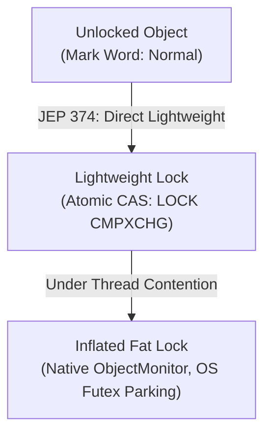

# Why StringBuffer is Slower than StringBuilder

---

## 🟢 Junior Level

The **`StringBuffer`** class is significantly slower than **`StringBuilder`** because almost every public method in `StringBuffer` is declared with the **`synchronized`** keyword. This forces the Java Virtual Machine (JVM) to perform monitor acquisition and release operations on every single method call (`append`, `insert`, `delete`, `length`), even when running in a strictly single-threaded environment.

### The Essence in 30 Seconds
- **`StringBuilder` (Java 5):** Operates without any synchronization. Access to the underlying byte array and count pointer occurs directly in memory. The CPU executes instructions sequentially at maximum register and cache speeds.
- **`StringBuffer` (Java 1.0):** Guarantees thread safety via mutual exclusion (`synchronized`). Before executing any action, a thread must verify and acquire the monitor lock of the object, and subsequently release it. In single-threaded execution, this imposes parasitic overhead from atomic CPU instructions and memory barriers, making operations **1.5x to 2.5x slower**. Under real multi-threaded contention, throughput collapses by 10x–20x due to thread parking and OS context switching.

```java
// Performance benchmark: 1,000,000 append operations in a single thread
long start = System.nanoTime();
StringBuilder sb = new StringBuilder();
for (int i = 0; i < 1_000_000; i++) {
    sb.append("a"); // ~8–15 ms (direct array writes)
}
long timeSb = System.nanoTime() - start;

start = System.nanoTime();
StringBuffer sbf = new StringBuffer();
for (int i = 0; i < 1_000_000; i++) {
    sbf.append("a"); // ~20–35 ms (1,000,000 monitor acquisitions)
}
long timeSbf = System.nanoTime() - start;
```

---

## 🟡 Middle Level

### The Anatomy of Synchronization Overhead

Why is invoking a `synchronized` method expensive even without thread competition?

1. **Bytecode Instructions (`monitorenter` / `monitorexit`):**  
   Every method invocation in `StringBuffer` is bracketed by bytecode instructions that define the boundary of a critical section. This restricts compiler and processor instruction reordering.
2. **Atomic CPU Instructions (CAS):**  
   To acquire an uncontended lock, the processor must execute an atomic instruction (e.g., `LOCK CMPXCHG` on x86/x64). This instruction locks the CPU L1/L2 cache line via cache coherency protocols, preventing concurrent access from other processor cores.
3. **Hardware Memory Barriers (Fences):**  
   Under the Java Memory Model (JMM), monitor release forms a *happens-before* relationship with subsequent acquisitions. The JVM must flush CPU store buffers and invalidate speculative load caches, inhibiting instruction pipeline optimizations.
4. **Cache Invalidation (`toStringCache`):**  
   In `StringBuffer`, every mutating call must invalidate the cached string field (`toStringCache = null`), adding an extra memory write operation.

### Performance Breakdown

| Metric / Scenario | `StringBuilder` | `StringBuffer` (Uncontended) | `StringBuffer` (4 Contending Threads) |
| :--- | :--- | :--- | :--- |
| **Synchronization** | None | `synchronized` per method | `synchronized` per method |
| **CPU Instructions** | Standard `MOV` | Atomic `LOCK CMPXCHG` (CAS) | CAS + thread parking (`futex` / kernel mutex) |
| **1M Appends Latency** | ~8–12 ms | ~20–30 ms (+150%) | ~150–300 ms (+2000%) |
| **OS Context Switches** | 0 | 0 | Thousands of kernel context switches |
| **Recommendation** | Default for 100% of local code | Anti-pattern in modern code | Anti-pattern (use thread-local buffers) |

### Compiler Compensations: Lock Elision & Lock Coarsening

The HotSpot C2 JIT compiler attempts to mitigate `StringBuffer` latency through two optimizations:
- **Lock Elision:** If **Escape Analysis** proves an object is strictly method-local (`NoEscape`), the compiler strips `monitorenter` and `monitorexit` instructions from generated assembly.
- **Lock Coarsening:** If sequential synchronized methods are called on the same object (`sb.append("a").append("b")`), C2 may merge adjacent monitor blocks into a single outer critical section.

**Why Compiler Optimizations Are Insufficient:**  
Escape analysis frequently fails in real-world applications: passing `StringBuffer` to a method that exceeds inlining limits, or storing a reference in an object field, immediately classifies it as `ArgEscape` or `GlobalEscape`, disabling lock elision.

---

## 🔴 Senior Level

### Monitor Evolution in HotSpot and JEP 374 (Java 15)

To understand performance at the hardware level, we must trace monitor transitions in the object header (**Mark Word**, 64 bits on x86-64):

1. **Biased Locking (Removed in Java 15 via JEP 374):**  
   - *Prior to Java 15:* The JVM recorded the thread's `ThreadID` directly into the object header. Repeated acquisitions by that thread required only a bitwise check without atomic instructions.  
   - *Why It Was Removed:* Revoking biased locks required Stop-The-World safepoint pauses that crippled modern low-latency garbage collectors (ZGC, Shenandoah).
2. **Lightweight Locking (Thin Lock):**  
   - In modern Java (17, 21+), every `StringBuffer` method invocation executes an atomic CAS (`LOCK CMPXCHG`) to update the Mark Word with a pointer to the thread's stack (`BasicObjectLock`).  
   - The hardware `LOCK` prefix serializes the CPU pipeline, forces store buffer drains, and flushes out-of-order execution queues.
3. **Heavyweight Locking (Inflated / Fat Lock):**  
   - When multiple threads contend for the buffer, CAS attempts fail. Following a brief spin-lock phase, the monitor **inflates**: HotSpot allocates a native C++ `ObjectMonitor` structure in C-Heap.  
   - Contending threads are parked via OS kernel system calls (`futex` on Linux, `pthread_mutex_lock`).  
   - Each OS thread context switch costs **1 to 5 microseconds**, causing application throughput to plummet.



### CPU Cache Thrashing & False Sharing

When multiple threads concurrently invoke methods on a shared `StringBuffer`, processor cores continuously contend for the 64-byte cache line containing the object's Mark Word and `count` field:
- Each atomic CAS changes the cache line to `Modified` (M) in the MESI/MOESI cache coherence protocol.
- All other CPU cores receive Invalidation (RFO) requests and must reload the cache line over the inter-socket interconnect (QPI/UPI).
- This results in **Cache Thrashing**, severely saturating the server's memory bus.

---

## 4 Tricky Interview Questions

### 1. Why can't the C2 JIT compiler simply lift locks outside a loop containing 10,000 `sb.append()` calls (Lock Coarsening across loops)?
**Answer:**  
The compiler is **strictly prohibited** from hoisting synchronization outside loops containing **Safepoint Polls**.  
In Java, loop iterations (with the exception of unrolled counted loops) contain safepoint polling checks where threads must be capable of pausing for Stop-The-World GC phases.  
If C2 broadened the lock around the entire 10,000-iteration loop, the thread would hold the monitor continuously across multiple safepoints. If the thread stalled on a GC safepoint inside the loop, all other threads waiting for that monitor would remain blocked indefinitely, triggering massive GC latency spikes and risking deadlocks. Consequently, Lock Coarsening operates only over short, linear, safepoint-free code blocks.

### 2. Why does Escape Analysis frequently fail to elide locks on locally created `StringBuffer` instances?
**Answer:**  
Escape Analysis (EA) in HotSpot C2 is intentionally conservative. An instance escapes (`GlobalEscape` or `ArgEscape`) whenever:
1. The buffer is passed as a parameter into a method that C2 **fails to inline** (e.g., inlining depth exceeds `-XX:MaxInlineLevel=9`, method bytecode exceeds `-XX:MaxInlineSize=35`, or the call site is megamorphic with >2 target implementations). Because the called body cannot be analyzed, C2 must assume the foreign method could leak the reference to another thread.
2. The buffer reference is written to an instance field of another object whose lifecycle is not strictly method-local.  
In either scenario, Lock Elision is completely disabled, and full atomic CAS locking instructions are executed.

### 3. What happens at the CPU hardware level when `LOCK CMPXCHG` executes on an uncontended `StringBuffer`?
**Answer:**  
1. The CPU core asserts exclusive ownership over the target 64-byte cache line (containing the object's Mark Word) by broadcasting a Request For Ownership (RFO) to all other cores via MESI/MOESI cache coherence.
2. The processor serializes execution: all pending writes in the CPU Store Buffer are drained into L1D cache before the instruction completes.
3. Speculative and out-of-order execution past the instruction boundary is temporarily halted.  
This pipeline stall costs **15 to 40 CPU clock cycles**, compared to just **1 cycle** for an unsynchronized `MOV` instruction executed by `StringBuilder`.

### 4. What is the physical memory footprint difference between `StringBuilder` and `StringBuffer` on 64-bit HotSpot?
**Answer:**  
On a 64-bit JVM with Compressed OOPs enabled:
- **`StringBuilder`:**
  - Object Header: 12 bytes (8 bytes Mark Word + 4 bytes Compressed Klass Pointer).
  - `byte[] value` reference: 4 bytes.
  - `byte coder`: 1 byte.
  - 8-byte alignment padding: 3 bytes.
  - `int count`: 4 bytes.
  - **Total: Exactly 24 bytes on the Java Heap** (+ `byte[]` array size).
- **`StringBuffer`:**
  - Includes an additional `private transient String toStringCache` pointer (4 bytes).
  - Aligned to an 8-byte boundary, its instance size expands to **32 bytes** (33% larger heap overhead).
  - Upon monitor inflation (Fat Lock), an additional native C++ `ObjectMonitor` structure is allocated in C-Heap (off-heap native memory), consuming an extra **128 to 200+ bytes** per contended object.

---

## 🎯 Interview Cheat Sheet

### 30-Second Summary
> "`StringBuffer` is slower than `StringBuilder` because all of its public mutating methods are decorated with `synchronized`. Even in single-threaded execution, the JVM executes atomic CAS instructions (`LOCK CMPXCHG`), memory barriers, and monitor state checks. Following the removal of Biased Locking in Java 15 (JEP 374), this uncontended synchronization penalty increased. Under multi-threaded contention, performance degrades drastically due to monitor inflation and OS thread parking. `StringBuilder` has no synchronization, writing directly to memory without locking overhead."

### Key Concepts Checklist
1. **Root Cause:** Public mutating methods in `StringBuffer` are synchronized on `this`.
2. **Single-Thread Cost:** Atomic CAS instructions, store buffer flushes, and pipeline stalls.
3. **Multi-Thread Cost:** Monitor inflation into native `ObjectMonitor` and OS kernel context switches (1–5 $\mu$s penalty).
4. **JEP 374 Impact:** Removal of Biased Locking in Java 15 makes uncontended synchronization measurably slower in Java 17/21+.
5. **Escape Analysis Limits:** Lock Elision fails if methods cannot be inlined or if references escape local scope.

### Common Pitfalls & Red Flags
- ❌ *"StringBuffer is slower because it allocates more intermediate objects."* (False: both use the identical `AbstractStringBuilder` dynamic byte buffer).
- ❌ *"The JIT compiler always eliminates StringBuffer locks via Escape Analysis."* (False: inlining limits frequently disable lock elision in real code).
- ❌ *"Biased locking makes StringBuffer free in single-threaded Java 17/21."* (False: Biased Locking was removed in Java 15).

### Related Topics
- [When to Use StringBuilder vs StringBuffer](05.%20When%20to%20Use%20StringBuilder%20vs%20StringBuffer.md) — Architectural selection
- [Why String is Immutable](04.%20Why%20String%20is%20Immutable.md) — Immutability rationale
- [What Happens When Concatenating Strings with + Operator](07.%20What%20Happens%20When%20Concatenating%20Strings%20with%20%2B%20Operator.md) — Compiler concatenation mechanics
- [What are Compact Strings in Java 9+](19.%20What%20are%20Compact%20Strings%20in%20Java%209%2B.md) — Compact string encoding
