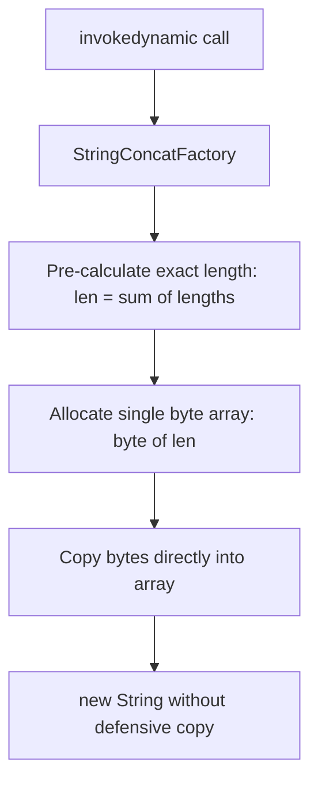

# What Happens When Concatenating Strings with + Operator

---

## 🟢 Junior Level

In Java, the **`+` operator** is the only overloaded operator available for reference types. When at least one operand of binary `+` is a `String`, Java performs a **string concatenation** operation.

Because `String` is immutable, the `+` operator **never modifies the existing strings**. Instead, it computes and allocates a **brand new `String` object** on the Java Heap containing the combined character sequence.

### The Essence in 30 Seconds
The behavior of the `+` operator differs fundamentally depending on whether the operand values are known at compile time:
1. **Compile-Time Evaluation (Constants):** If all operands are string literals or `final` compile-time constants (e.g., `"A" + "B"`), the `javac` compiler merges them ahead of time during compilation (**Constant Folding**). The compiled `.class` bytecode contains the pre-merged string `"AB"`, incurring zero concatenation overhead at runtime.
2. **Runtime Evaluation (Dynamic Variables):** If any operand is a variable (`str1 + str2`), concatenation occurs dynamically at runtime. Starting with **Java 9 (JEP 280)**, `javac` emits an **`invokedynamic`** bytecode instruction invoking the high-performance **`StringConcatFactory`** (prior to Java 9, the compiler generated a `StringBuilder` instance with `.append()` calls).

```java
// 1. Compile-Time Concatenation (Constant Folding)
String s1 = "Hello " + "World"; // Emitted directly into bytecode constant pool as "Hello World"

// 2. Runtime Concatenation (Evaluated dynamically via invokedynamic)
String name = "Alice";
String greeting = "Hello, " + name + "!"; 

// 3. Catastrophic Anti-Pattern: Using '+' inside loops (O(N^2) allocations!)
String result = "";
for (int i = 0; i < 1000; i++) {
    result += i; // AVOID: Allocates 1,000 intermediate String objects on the heap!
}

// 4. Recommended Pattern for Loops:
StringBuilder sb = new StringBuilder(1000 * 4);
for (int i = 0; i < 1000; i++) {
    sb.append(i);
}
String fastResult = sb.toString();
```

---

## 🟡 Middle Level

### Type Conversion Rules & Operator Precedence

Under the Java Language Specification (JLS §15.18.1):
1. If either operand of binary `+` is of type `String`, string concatenation is performed, and the non-string operand is automatically converted to a string.
2. Primitive types are converted to their standard string representations (`42` $\to$ `"42"`).
3. Reference types are converted via `String.valueOf(obj)`. If the reference is `null`, it converts to the literal string `"null"`.
4. The `+` operator is **left-associative** (evaluates left-to-right) and shares identical precedence between arithmetic addition and string concatenation.

```java
// Precedence & Associativity Traps:
System.out.println("Sum: " + 10 + 20);   // "Sum: 1020"  ("Sum: 10" then "Sum: 10" + 20)
System.out.println("Sum: " + (10 + 20)); // "Sum: 30"    (Parentheses evaluated first)
System.out.println(10 + 20 + " is sum"); // "30 is sum"  (10 + 20 = 30, then 30 + " is sum")
```

### Compile-Time Constant Folding (JLS §15.28)

When operands qualify as **Compile-Time Constant Expressions**, evaluation occurs entirely during compilation:
```java
final String prefix = "user_";
final int id = 42;
String key = prefix + id; // Folds directly into `ldc "user_42"` in bytecode!
```
*Crucial Constraint:* Variables must be declared `final` and initialized with constant expressions. If a `final` variable is initialized via a method call (`final String a = getPrefix();`), the constant folding optimization cannot be applied.

### Common Production Concatenation Traps

1. **Loop Accumulation (`+=`):**  
   Each loop iteration creates a new string allocation and copies all previously accumulated characters. Algorithm complexity explodes to **$O(N^2)$** in time and memory allocation.
2. **Accidental `null` Masking:**  
   `"User ID: " + user.getId()` evaluates to `"User ID: null"` when `user.getId() == null`. This silently masks missing data and can propagate invalid data into databases or downstream APIs.
3. **Eager String Concatenation in Logging:**  
   ```java
   // BAD: Concatenation executes on every call even when DEBUG level is disabled!
   logger.debug("Processing order: " + order.getDetails());
   
   // GOOD: Evaluated lazily only if DEBUG is enabled:
   logger.debug("Processing order: {}", order.getDetails());
   ```

---

## 🔴 Senior Level

### Bytecode Evolution: Java 8 vs. Java 9+ (JEP 280)

Prior to Java 9, `javac` rigidly desugared concatenation into bytecode that instantiated `StringBuilder`:
```java
// Original Java source:
String msg = "User: " + name + " age: " + age;

// Desugared bytecode emitted in Java 5 through 8:
new StringBuilder()
    .append("User: ")
    .append(name)
    .append(" age: ")
    .append(age)
    .toString();
```
**Drawbacks of the Java 8 Model:**
- **Redundant Resizing:** The default constructor `new StringBuilder()` allocates 16 characters. If the combined message exceeds 16 characters, 1–2 array reallocations and memory copies occur.
- **Bytecode Rigidity:** The concatenation strategy was hardcoded into compiled `.class` files. Improvements to runtime concatenation required recompiling all Java bytecode globally.

**The Java 9 Breakthrough (JEP 280: Indify String Concatenation):**  
In Java 9+, `javac` emits an **`invokedynamic`** instruction pointing to `StringConcatFactory`:
```bytecode
0: aload_1                         // Load 'name' variable
1: iload_2                         // Load 'age' primitive
2: invokedynamic #7, 0             // InvokeDynamic #0:makeConcatWithConstants:(Ljava/lang/String;I)Ljava/lang/String;
```
The `.class` file includes a Bootstrap Method (BSM) pointing to `java.lang.invoke.StringConcatFactory.makeConcatWithConstants`.

### `StringConcatFactory` Architecture & Recipe Strings

The bootstrap method accepts a static **Recipe String**:
- The character `\1` designates a dynamic argument passed at runtime.
- The character `\2` designates a constant extracted from the constant pool.

For `"User: " + name + " age: " + age`, the recipe evaluates to:
$$\text{Recipe} = \text{"User: \textbackslash 1 age: \textbackslash 1"}$$

Upon the first execution of `invokedynamic`:
1. HotSpot invokes `StringConcatFactory.makeConcatWithConstants`.
2. The factory inspects argument types (`String`, `int`, etc.) and generates an optimal `MethodHandle` (leveraging internal bytecode generators or direct field access to `byte[] value`).
3. The call site is linked (CallSite Linkage). Subsequent executions invoke compiled machine code directly without reflection or bootstrap overhead.

### HotSpot Runtime Concatenation Strategies

The JVM supports multiple runtime strategies (configured via `-Djava.lang.invoke.stringConcat=<strategy>`):
1. **`INLINE_SIZED_EXACT` (Default Strategy):**
   - Calculates the **exact byte length** of the resulting string based on the lengths of all arguments *before* allocation.
   - Allocates a single `byte[]` array of the precise required size (honoring Latin-1 or UTF-16 coder flags).
   - Copies parameter bytes directly into the target array without intermediate buffers.
   - Instantiates `String` directly via the package-private zero-copy constructor `String(byte[] value, byte coder)`.
2. **`METHOD_HANDLE_INLINE_SIZED_EXACT`:** Chains method handle combinators.
3. **`BC_SB` (Bytecode StringBuilder):** Fallback mode generating traditional `StringBuilder` bytecode.



### Why `invokedynamic` Cannot Optimize Loops

A loop containing `for (...) { s += x; }` compiles the `invokedynamic` opcode **inside the loop body**.  
On every iteration, the call site executes anew:
1. Calculates the size of the two current operands.
2. Allocates a new byte array.
3. Allocates a new `String` object.  
Thus, `invokedynamic` optimizes atomic multi-operand expressions on a single line, but cannot optimize loop accumulations.

---

## 4 Tricky Interview Questions

### 1. What does `System.out.println("Result: " + 1 + 2 * 3)` output, and how does the compiler parse operator precedence?
**Answer:**  
It outputs: `"Result: 16"`.  
**Analysis:** The multiplication operator `*` has higher precedence than addition/concatenation `+`.  
1. `2 * 3` evaluates first to `6`.  
2. The remaining expression is `"Result: " + 1 + 6`.  
3. Operators of equal precedence evaluate strictly left-to-right:  
   - `"Result: " + 1` concatenates to `"Result: 1"`.  
   - `"Result: 1" + 6` concatenates to `"Result: 16"`.

### 2. Does concatenation of `final` variables optimize via Constant Folding if one value is returned by a method?
```java
public class Test {
    public static final String A = "Hello";
    public static final String B = getSuffix();
    public static final String C = A + B;
    
    private static String getSuffix() { return " World"; }
}
```
**Answer:**  
**No, Constant Folding does not apply to variable `C`.**  
Under JLS §15.28, a compile-time constant expression can only contain literals, primitive operators, and other compile-time constant variables. A method invocation (`getSuffix()`) is never a compile-time constant expression, even if the method simply returns a literal.  
Because `B` cannot be evaluated at compile time, `A + B` is compiled to an `invokedynamic` call and evaluated at runtime during class initialization (`<clinit>`).

### 3. Why does `((String) null) + "abc"` execute successfully, while `((String) null).concat("abc")` throws `NullPointerException`?
**Answer:**  
- The `+` operator translates under JLS §15.18.1 via `String.valueOf(obj)`. Inside `String.valueOf()`, the method explicitly checks `return (obj == null) ? "null" : obj.toString()`. Hence, `((String) null) + "abc"` converts to `"null" + "abc"` $\to$ `"nullabc"`.  
- In contrast, `.concat(String str)` is an instance method. Calling any method on a `null` reference results in an `invokevirtual` bytecode opcode attempting to dereference a null pointer, immediately throwing `NullPointerException`. Furthermore, `.concat()` validates its argument and throws `NPE` if `str` is `null`.

### 4. Why is concatenating five variables via `+` in Java 17 faster and consumes less memory than manually writing `new StringBuilder().append(...)`?
**Answer:**  
Because Java 17 leverages `StringConcatFactory` (JEP 280):
1. **Pre-Sized Allocation:** The runtime pre-calculates the exact aggregate byte length of all five variables and determines the correct Compact Strings `coder` (Latin-1 vs. UTF-16).
2. **Zero Resize Overhead:** It allocates exactly one `byte[]` array of the required capacity. A manual `StringBuilder` with default capacity (16 characters) would trigger multiple array expansions and `System.arraycopy` calls.
3. **No Intermediate Objects:** The `StringBuilder` object header (24 bytes) is not allocated on the heap.
4. **Zero-Copy Construction:** The package-private constructor `String(byte[] value, byte coder)` packages the byte array directly into the `String` without the defensive copy required by `StringBuilder.toString()`.

---

## 🎯 Interview Cheat Sheet

### 30-Second Summary
> "The `+` operator in Java produces a new immutable `String` object. For compile-time literals and `final` constants, the compiler evaluates the result during compilation via **Constant Folding**, embedding a single string in the constant pool. For dynamic variables, Java 9+ emits an **`invokedynamic`** call to `StringConcatFactory` (JEP 280), which pre-calculates the exact required byte array size, eliminates intermediate `StringBuilder` allocations, and constructs the string faster than manual code. However, `+` inside loops is strictly prohibited because `invokedynamic` executes per iteration, causing $O(N^2)$ heap allocation churn."

### Key Concepts Checklist
1. **Constant Folding (JLS §15.28):** Literal concatenations resolve at compile time with zero runtime cost.
2. **JEP 280 (Java 9+):** `javac` replaces `StringBuilder` desugaring with `invokedynamic`.
3. **`INLINE_SIZED_EXACT` Strategy:** Pre-calculates exact byte length $\to$ single `byte[]` allocation $\to$ zero-copy `String` construction.
4. **Null Handling:** `+` converts `null` to `"null"` via `String.valueOf()`, whereas `.concat()` throws `NullPointerException`.
5. **Loop Accumulation:** `+=` inside loops is never optimized into a single buffer; always use `StringBuilder` with capacity.

### Common Pitfalls & Red Flags
- ❌ *"In Java 17, the compiler converts string `+` into `StringBuilder`."* (False: it generates `invokedynamic` pointing to `StringConcatFactory`).
- ❌ *"The compiler automatically optimizes `+=` inside loops into a single StringBuilder."* (False: each iteration executes a separate allocation, resulting in $O(N^2)$ complexity).
- ❌ *"A `final` variable initialized from a method is constant-folded."* (False: method calls are evaluated at runtime, disabling compile-time folding).

### Related Topics
- [How Java Compiler Optimizes String Concatenation](08.%20How%20Java%20Compiler%20Optimizes%20String%20Concatenation.md) — JEP 280 deep dive
- [When to Use StringBuilder vs StringBuffer](05.%20When%20to%20Use%20StringBuilder%20vs%20StringBuffer.md) — Mutable string builders
- [Why String is Immutable](04.%20Why%20String%20is%20Immutable.md) — Immutability core principles
- [What are Compact Strings in Java 9+](19.%20What%20are%20Compact%20Strings%20in%20Java%209%2B.md) — `byte[]` memory optimization
