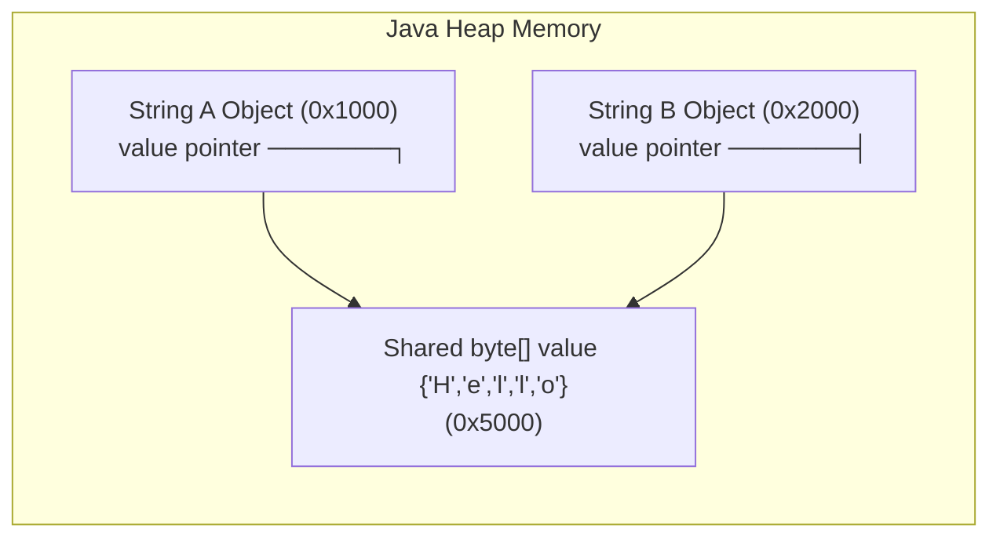

# Can You Use == to Compare Strings

---

## 🟢 Junior Level

Technically, the `==` operator can be applied to `String` objects (the code compiles and executes without compilation errors), but for comparing the textual contents of strings, it **must never be used**. In 99.9% of application scenarios, doing so is a severe logical bug.

### The Essence in 30 Seconds
- **The `==` Operator Compares Memory References (Addresses):** It evaluates to `true` **only if both variables point to the exact same physical object** on the Java Heap.
- **The `.equals()` Method Compares Character Sequences (Values):** It verifies character-by-character equivalence regardless of where, how, or when the objects were allocated.

The only idiomatic and safe use case for `==` with strings is **testing for `null` references**: `if (str == null)` or `if (str != null)`.

```java
// 1. Two separate objects containing identical characters:
String s1 = new String("Java");
String s2 = new String("Java");

System.out.println(s1 == s2);      // false (different memory addresses on Heap)
System.out.println(s1.equals(s2)); // true  (identical character content)

// 2. The String Pool illusion:
String s3 = "Java";
String s4 = "Java";

System.out.println(s3 == s4); // true (both references point to the same pooled literal)
// WARNING: External data (from databases, files, or network calls) does not enter the pool automatically!
```

---

## 🟡 Middle Level

### The String Pool Trap & The Illusion of Correctness

The danger of `==` lies in the fact that simple unit tests with hardcoded string literals return `true`, creating a false sense of security:
```java
// Passes in local unit tests:
String status = "ACTIVE";
if (status == "ACTIVE") { // true! Both point to the canonical String Pool literal
    System.out.println("Status OK");
}
```
However, as soon as the string originates from an external source (e.g., Jackson JSON deserialization, HTTP request headers, JDBC `ResultSet`, or file I/O), a **new object is allocated on the Heap**. The comparison `status == "ACTIVE"` evaluates to `false`, causing critical production bugs.

### String Comparison Truth Matrix

| Scenario | Expression | Result `==` | Result `.equals()` | Technical Explanation |
| :--- | :--- | :--- | :--- | :--- |
| **Literals** | `"test" == "test"` | `true` | `true` | Both references resolve to the same canonical String Pool entry. |
| **Literal vs. `new`** | `"test" == new String("test")` | `false` | `true` | The `new` keyword allocates an unpooled object on the Regular Heap. |
| **Two `new` Instances** | `new String("A") == new String("A")` | `false` | `true` | Two independent Heap objects with distinct memory addresses. |
| **Constant Folding** | `"AB" == ("A" + "B")` | `true` | `true` | The `javac` compiler merges constant literals at build time (JLS §15.28). |
| **Dynamic Concatenation** | `String a = "A"; "AB" == (a + "B")` | `false` | `true` | Concatenation with non-final variables occurs at runtime via `invokedynamic`. |
| **After `.intern()`** | `s1.intern() == s2.intern()` | `true` | `true` | The `intern()` method returns the canonical reference from the String Pool. |

### Safe String Comparison Patterns

1. **Yoda Condition (Literal on the Left):**
   ```java
   // Null-safe: returns false without throwing NullPointerException if userInput is null
   if ("ADMIN".equals(userInput)) {
       grantAccess();
   }
   ```
2. **Standard Utility `Objects.equals()`:**
   ```java
   // Handles all null combinations safely (both null, either null, or neither null)
   if (Objects.equals(str1, str2)) {
       process();
   }
   ```

---

## 🔴 Senior Level

### HotSpot `String.equals()` Implementation & Fast-Path

In HotSpot JVM, `String.equals()` is designed with multiple short-circuiting exit paths:

```java
public boolean equals(Object anObject) {
    // 1. Fast Path: Identity check
    if (this == anObject) {
        return true;
    }
    // 2. Type validation & coder check
    return (anObject instanceof String aString)
            && (!COMPACT_STRINGS || this.coder == aString.coder)
            && StringLatin1.equals(value, aString.value); // or StringUTF16
}
```

1. **`this == anObject` Identity Fast-Path:** `equals()` **uses `==` as its very first step**. If two references point to the same physical object (or identical pooled literals), `equals()` resolves in a single CPU cycle ($O(1)$).
2. **Encoding Check (`coder`):** If one string is `LATIN1` (0) and the other is `UTF16` (1), they cannot be equal; array traversal is skipped entirely.
3. **SIMD Vectorized Intrinsics:** The HotSpot C2 compiler replaces `StringLatin1.equals` with a hardware intrinsic. On modern x86/ARM processors, byte arrays are compared in 32-byte (AVX-2) or 64-byte (AVX-512) chunks per CPU cycle. The execution latency difference between `==` and `.equals()` for typical strings is negligible (sub-nanosecond).

### Bytecode Analysis: `if_acmpeq` vs. `invokevirtual`

- The `==` operator on references compiles to the `if_acmpeq` (branch if reference compare equal) or `if_acmpne` opcode, comparing 32-bit (under `-XX:+UseCompressedOops`) or 64-bit pointers directly in CPU registers.
- The `str == null` check compiles to `ifnull` / `ifnonnull`, comparing against the zero pointer (`0x0`).
- The `equals()` method compiles to `invokevirtual`, which the C2 compiler aggressively inlines into the calling method body.

### Why `intern()` + `==` is an Anti-Pattern (Even in Low-Latency Systems)

An outdated high-frequency trading (HFT) pattern recommended calling `str.intern()` on all incoming strings to enable $O(1)$ reference comparisons via `==`.  
**Why This Pattern Has Been Abandoned:**
1. **Extreme Architectural Fragility:** If a single developer forgets to call `.intern()` on an incoming string, the `==` check returns `false` without throwing an exception, introducing silent business-logic bugs.
2. **`StringTable` Contention:** Global JVM `StringTable` lookups introduce native locking/synchronization overhead and inflate GC safepoint pause times.
3. **Modern Alternatives:** Constrained sets of values should be represented as Java `Enum` types, numeric identifiers, or off-heap byte buffers (e.g., Agrona `DirectBuffer`).

### The G1 GC String Deduplication Trap

When running with G1 GC and `-XX:+UseStringDeduplication`, the garbage collector unifies the internal `byte[] value` arrays of identical strings:



**Senior Trap:** Deduplication unifies **only the backing byte array**, while the `String` object headers remain separate instances at distinct heap addresses:
$$\text{s1} == \text{s2} \implies \text{false}$$
$$\text{s1.equals(s2)} \implies \text{true}$$

---

## 4 Tricky Interview Questions

### 1. Why does a unit test containing `status == "SUCCESS"` pass in JUnit, but fail catastrophically in production?
**Answer:**  
In the unit test, `status` was initialized with a hardcoded compile-time string literal (`"SUCCESS"`). Both operands referenced the identical canonical instance from the **String Pool**, causing `==` to evaluate to `true`.  
In production, `status` is populated dynamically from external I/O (e.g., deserialized from an incoming HTTP JSON payload via Jackson or read from a database via JDBC). In these scenarios, the JVM allocates a **new, unpooled `String` instance on the Heap**. Because its heap address differs from the pooled literal, `==` evaluates to `false`.

### 2. What is the output of `("Java " + 21) == ("Java " + 21)`, and what happens if `21` is extracted into `int ver = 21`?
**Answer:**  
- The expression `("Java " + 21) == ("Java " + 21)` evaluates to **`true`**. Both operands consist exclusively of compile-time constants (the literal `"Java "` and the literal `21`). Under JLS §15.28, the `javac` compiler applies **Constant Folding**, replacing both sides with a single pooled literal `"Java 21"` (`ldc #X`).
- If written as `int ver = 21; ("Java " + ver) == ("Java " + ver);`, the result is **`false`**. Because `ver` is a non-final variable, concatenation occurs dynamically at runtime via `invokedynamic`, allocating two separate `String` objects on the heap.

### 3. Does the JVM flag `-XX:+UseStringDeduplication` guarantee that duplicate strings will evaluate to `true` when compared with `==`?
**Answer:**  
**No, it never makes them equal under `==`.**  
G1 String Deduplication operates exclusively on the internal `byte[] value` array. The garbage collector modifies the internal `value` pointers of distinct `String` objects so they share a single array in memory. The `String` object wrappers themselves (their Mark Word, Klass Word, and heap addresses) remain distinct objects. Comparing them via `==` compares the object references, which remain different (`false`).

### 4. Why is `str == null` preferred over `Objects.isNull(str)` in performance-critical code?
**Answer:**  
At the bytecode level, `str == null` translates directly into a single processor instruction (`ifnull` / `ifnonnull`) that performs an immediate zero-pointer comparison in a CPU register.  
`Objects.isNull(str)` generates an `invokestatic` bytecode instruction. While HotSpot C2 will eventually inline this method once warm, during cold execution (interpreter and C1 tiers) it incurs method dispatch overhead. Therefore, `str == null` remains the idiomatic and most performant standard in core Java libraries.

---

## 🎯 Interview Cheat Sheet

### 30-Second Summary
> "`==` must never be used to compare string text because it compares memory references (heap addresses), not character contents. Strings with identical text can exist at different heap addresses. For value comparisons, always use `.equals()` or `Objects.equals()`. The `==` operator returns `true` only when comparing identical references (such as String Pool literals). The sole valid use case for `==` with strings is testing for `null` (`str == null`)."

### Key Concepts Checklist
1. **Reference vs. Value:** `==` compares memory pointers (`if_acmpeq`); `.equals()` compares character contents.
2. **Fast-Path Optimization:** `.equals()` begins with `if (this == anObject) return true;` ($O(1)$ on identical references).
3. **SIMD Vectorization:** Modern C2 compiles `.equals()` into hardware vector intrinsics (AVX-512) comparing up to 64 bytes per clock cycle.
4. **String Deduplication Trap:** G1 deduplication unifies backing `byte[]` arrays, but leaves `String` object references distinct (`==` is still `false`).
5. **Null Safety:** Use `"CONSTANT".equals(var)` (Yoda condition) or `Objects.equals(a, b)` to prevent `NullPointerException`.

### Common Pitfalls & Red Flags
- ❌ *"Short strings are compared by value with `==`, while long strings use `.equals()`."* (False: `==` always compares memory addresses).
- ❌ *"String Deduplication makes duplicate strings equal under `==`."* (False: it only shares internal byte arrays).
- ❌ *"Using `.intern()` and `==` is recommended for high performance."* (Dangerous anti-pattern: causes severe fragility and `StringTable` pollution).

### Related Topics
- [Difference Between == and equals() for String](10.%20Difference%20Between%20%3D%3D%20and%20equals()%20for%20String.md) — Detailed comparison
- [How String Pool Works](01.%20How%20String%20Pool%20Works.md) — String pool mechanics
- [When to Use intern()](03.%20When%20to%20Use%20intern().md) — Manual pool registration
- [What is String Deduplication in G1 GC](22.%20What%20is%20String%20Deduplication%20in%20G1%20GC.md) — G1 GC optimization
