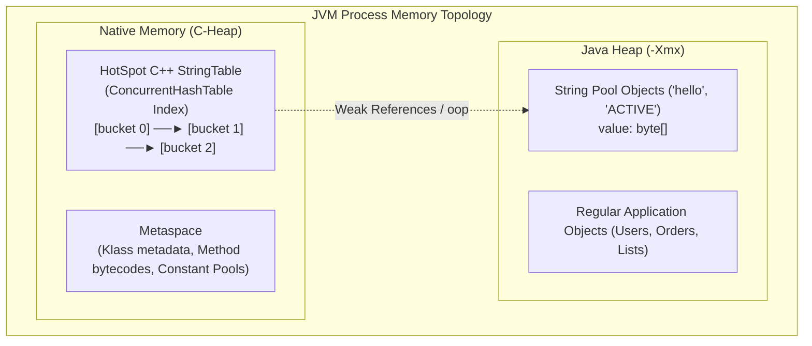

# Where is String Pool Stored (Which Memory Area)

---

## 🟢 Junior Level

The **String Pool** (or *String Constant Pool*) is a specialized JVM caching mechanism engineered to optimize memory consumption by storing and sharing unique immutable string instances.

The physical placement of the String Pool has evolved across major Java releases:
- **Java 6 and earlier:** The String Pool was located in **PermGen (Permanent Generation)** — a fixed-size memory area reserved for class metadata. Heavy string interning frequently resulted in fatal `java.lang.OutOfMemoryError: PermGen space` crashes.
- **Starting from Java 7 (Java 7u6) through all modern versions (Java 8, 11, 17, 21+):** The String Pool was relocated to and resides permanently within the **main Java Heap**.

### The Essence in 30 Seconds
In modern Java, **the String Pool is located in the Java Heap**. It shares the exact same memory space as standard application domain objects and is constrained by the maximum heap limit (`-Xmx`).  
The Garbage Collector (GC) automatically sweeps unreferenced pooled strings whenever they are no longer strongly referenced by application threads.

> [!WARNING]
> **Common Fallacy:** Many engineers assume that when Java 8 removed PermGen, the String Pool moved to `Metaspace`. This is incorrect: `Metaspace` stores class metadata off-heap, while the String Pool remains firmly in the **Java Heap**.

---

## 🟡 Middle Level

### Architectural Separation: Heap Objects vs. Native Index

When examining the JVM at an architectural level, the "String Pool" consists of two distinct components:
1. **The String Objects (`java.lang.String` and `byte[] value` arrays):** Reside inside the **Java Heap** (typically promoted to the Old Generation if long-lived).
2. **The Lookup Hash Table (`StringTable` in HotSpot C++):** A native hash table that resides in **Native Memory (C-Heap)** of the JVM operating system process.

### Why the String Pool Moved from PermGen to Java Heap

In Java 6, housing the String Pool in PermGen caused severe production stability hazards:
1. **Inflexible Memory Quota:** PermGen had a small, fixed upper bound (defaulting to 64–256 MB via `-XX:MaxPermSize`). Runtime interning quickly triggered `OutOfMemoryError: PermGen space`.
2. **Infrequent GC Sweeps:** Garbage collection in PermGen ran almost exclusively during Full GC pauses, and weak reference tracking for interned strings was inefficient.
3. **Dynamic Heap Scalability:** Relocating the pool to the Java Heap removed the hard memory ceiling—the pool can now scale dynamically to gigabytes under `-Xmx`, and unreferenced strings are swept during routine Young/Old GC cycles.

### Version-by-Version Comparison

| Characteristic | Java 6 and earlier | Java 7 (7u6+) | Java 8 to 21+ |
| :--- | :--- | :--- | :--- |
| **Object Storage Location** | `PermGen` | `Java Heap` | `Java Heap` |
| **Memory Constraint** | `-XX:MaxPermSize` (64–256 MB) | `-Xmx` (Main Heap limit) | `-Xmx` (Main Heap limit) |
| **OOM Error on Saturation** | `OOM: PermGen space` | `OOM: Java heap space` | `OOM: Java heap space` |
| **GC Collection Behavior** | Full GC only (infrequent) | Routine GC cycles (Young/Old) | Concurrent GC thread sweeps |
| **Class Metadata Location** | `PermGen` | `PermGen` | `Metaspace` (Native Memory) |
| **HotSpot C++ Table Type** | Fixed-size synchronized `Hashtable` | Fixed-size synchronized `Hashtable` | `ConcurrentHashTable` (Java 11+, lock-free) |

---

## 🔴 Senior Level

### HotSpot C++ `StringTable` Internals

Inside the OpenJDK HotSpot codebase, the String Pool is managed as an off-heap native index:
- **Prior to Java 11:** Implemented as `StringTable : public Hashtable`. Access was synchronized via a global mutex (`StringTable_lock`). Intensive interning across multiple threads caused severe lock contention and CPU bottlenecks.
- **Java 11+ (JEP 341: Concurrent StringTable):** Rewritten as a lock-free native **`ConcurrentHashTable`**:
  - Concurrent worker threads execute lock-free lookups and fine-grained insertions.
  - Supports dynamic resizing: the JVM automatically increases bucket counts when the load factor exceeds thresholds.

### Garbage Collection Lifecycle: Weak Roots & `OopStorage`

Strings in the String Pool **are not permanent** (unless tied to a loaded class constant pool):
1. Pointers from `StringTable` to Java Heap objects are treated by the Garbage Collector as **Weak Roots**.
2. In modern HotSpot versions, these pointers are managed through the **`OopStorage`** (Weak Processor) subsystem.
3. During the GC Marking Phase, the collector traces live object graphs from Strong Roots (thread stacks, JNI handles, static fields).
4. If a pooled `String` object has **no strong incoming references** from live application objects, the GC marks it as eligible for reclamation.
5. During the Weak Processing phase, HotSpot invokes `StringTable::unlink()`, removing the native table entry, after which the `String` object and its `byte[] value` are freed.

### Runtime Constant Pool (Metaspace) vs. String Pool (Java Heap)

It is crucial to distinguish between a class's **Runtime Constant Pool** and the global **String Pool**:
- **Class Runtime Constant Pool:** Stored in **Metaspace** inside the C++ `InstanceKlass` structure. In bytecode, string constants are stored as `CONSTANT_String_info` entries pointing to UTF-8 symbol entries.
- **Literal Resolution:** When the `ldc` (Load Constant) instruction executes for the first time, HotSpot reads UTF-8 characters from Metaspace, queries the global `StringTable` in Native Memory, and locates or allocates a `java.lang.String` in the **Java Heap**. The resulting heap pointer is cached in the class's `Constant Pool Cache` in Metaspace.

---

## 4 Tricky Interview Questions

### 1. Where are pooled string objects stored versus where the `StringTable` hash table itself is stored in Java 17/21?
**Answer:**  
There is a distinct memory bifurcation:
- The actual `java.lang.String` object wrappers and their internal backing `byte[] value` arrays reside in the **Java Heap** (typically promoted to Old Generation if long-lived).
- The indexing structure—the native HotSpot C++ hash table `StringTable` (bucket pointer arrays and `ConcurrentHashTable` metadata)—resides in **Native Memory (C-Heap)** of the OS process outside the Java Heap.

### 2. Can the Garbage Collector reclaim an interned string from the String Pool if `dynamicString.intern()` was called?
**Answer:**  
**Yes, it can.**  
Entries in the native `StringTable` are held as **Weak Roots** via `OopStorage`. If the local reference `String s = new String("data").intern()` goes out of scope and no other live objects, static fields, or thread stacks hold a strong reference to that string, the Garbage Collector will reclaim the object during a subsequent GC cycle and unlink its native entry from `StringTable`.  
The only pooled strings that persist indefinitely are compile-time literals tied to classes loaded by the root system classloaders (which are never unloaded).

### 3. Why do many developers mistakenly believe the String Pool moved to Metaspace in Java 8, and why is this wrong?
**Answer:**  
In Java 8, PermGen was removed and replaced with Metaspace in off-heap native memory for class metadata. Because PermGen historically held both class metadata and the String Pool in Java 6, many assumed everything in PermGen migrated to Metaspace.  
This is historically and architecturally incorrect: the String Pool was relocated from PermGen to the **Java Heap in Java 7 (Update 6)**, years before Java 8. When Java 8 debuted, only class metadata moved to Metaspace; the String Pool remained in the Java Heap, where it resides today.

### 4. What happens if you start the JVM with `-XX:StringTableSize=1009` and intern 1,000,000 unique strings in Java 8 versus Java 17?
**Answer:**  
- **In Java 8:** The bucket count is fixed at 1,009. Interning 1,000,000 strings results in bucket collision chains averaging ~1,000 items. Because Java 8 synchronizes `StringTable` with the global `StringTable_lock` mutex, every `.intern()` call degenerates into an $O(N)$ linear linked-list traversal under a global lock. The JVM encounters massive CPU saturation and thread stalling.
- **In Java 17:** Under JEP 341, `StringTable` is a `ConcurrentHashTable`. The JVM dynamically monitors table load factor and automatically resizes bucket arrays in background threads without blocking concurrent readers. The performance degradation is negligible compared to Java 8.

---

## 🎯 Interview Cheat Sheet

### 30-Second Summary
> "In modern Java (Java 7u6+ through Java 8, 11, 17, and 21+), the **String Pool resides inside the Java Heap**. Pooled `String` objects share standard heap memory bounded by `-Xmx` and are garbage-collected when unreferenced. The native index `StringTable` resides in Native Memory (C-Heap). The common belief that Java 8 placed the String Pool in Metaspace is a myth: Metaspace holds class metadata off-heap, while the String Pool remains firmly in the Java Heap."

### Key Concepts Checklist
1. **Memory Evolution:** Java 6 (PermGen) $\to$ Java 7u6+ (Java Heap) $\to$ Java 8 (Metaspace for classes, String Pool stays in Heap).
2. **Memory Layout:** `String` objects & `byte[]` arrays live in Java Heap; `StringTable` hash index lives in Native Memory.
3. **GC Reclaimability:** Pooled strings without strong roots are collected via `OopStorage` weak root unlinking.
4. **JEP 341 (Java 11+):** HotSpot `StringTable` converted from a synchronized fixed-size table to lock-free `ConcurrentHashTable`.
5. **Diagnostics:** Native table density can be inspected via `jcmd <pid> VM.stringtable -verbose`.

### Common Pitfalls & Red Flags
- ❌ *"The String Pool is stored in Metaspace in Java 8 and later."* (Critical architectural error: it is in the Java Heap).
- ❌ *"Strings in the String Pool can never be garbage collected."* (False: dynamically interned strings without strong roots are collected).
- ❌ *"The String Pool has its own dedicated memory quota flag."* (False: it shares standard heap memory bounded by `-Xmx`).

### Related Topics
- [How String Pool Works](01.%20How%20String%20Pool%20Works.md) — Pool architecture
- [Can String Pool Cause OutOfMemoryError](12.%20Can%20String%20Pool%20Cause%20OutOfMemoryError.md) — OOM mechanics
- [When to Use intern()](03.%20When%20to%20Use%20intern().md) — Manual interning
- [What are Compact Strings in Java 9+](19.%20What%20are%20Compact%20Strings%20in%20Java%209%2B.md) — Compact string encoding
