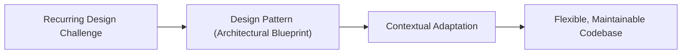

# What are design patterns

---

## 🟢 Junior Level

A **design pattern** is a time-tested, reusable, and documented architectural solution to a recurring design problem in object-oriented software engineering.

A design pattern is **not a finished library or framework**, nor is it a piece of copy-paste code. It is an architectural blueprint, concept, and structural strategy describing how classes and interfaces should collaborate to achieve flexibility, maintainability, and loose coupling.



### Simple Real-World Analogy
Imagine constructing a residential building:
An architect does not reinvent how a reinforced concrete foundation, load-bearing exterior wall, or pitched roof operates. Standard engineering blueprints and building codes (patterns) already exist. The architect selects the appropriate proven blueprint and adapts its dimensions, load parameters, and materials to the specific plot of land and soil conditions.

### Why Design Patterns Matter
1. **Accelerates Development:** Reuses proven architectural mechanics vetted by millions of developers, saving countless hours of trial-and-error debugging.
2. **Establishes a Common Vocabulary (Ubiquitous Language):** Instead of explaining a complex object interaction for 20 minutes, a developer can simply say: *"Let's use a Strategy here"* or *"Wrap this in a Decorator"*, instantly conveying the design intent to the entire team.
3. **Enforces SOLID Principles:** Design patterns are direct practical implementations of core object-oriented principles, ensuring systems remain extensible without regression.

### Minimal Example: The Singleton Pattern

```java
// Classic Singleton: guarantees exactly one instance exists across the application runtime
public class DatabaseConnectionPool {

    // Static field holding the single instance
    private static final DatabaseConnectionPool INSTANCE = new DatabaseConnectionPool();

    // Private constructor prohibits direct instantiation via 'new'
    private DatabaseConnectionPool() {
        System.out.println("Initializing database connection pool...");
    }

    // Global static access point
    public static DatabaseConnectionPool getInstance() {
        return INSTANCE;
    }
}
```

---

## 🟡 Middle Level

### The Hierarchy of Software Abstraction

In professional software engineering, it is vital to distinguish design patterns from adjacent levels of abstraction:

| Abstraction Level | Scope & Description | Examples in Java Ecosystem |
|---|---|---|
| **Language Idioms** | Low-level syntax conventions specific to a programming language | `try-with-resources`, `Optional`, `Records`, Pattern Matching |
| **GoF Design Patterns** | Mid-level class and object relationships and delegation mechanics | `Strategy`, `Decorator`, `Observer`, `Factory Method`, `Proxy` |
| **Enterprise Patterns** | Architectural structuring of business logic, persistence, and transactions | `Repository`, `Unit of Work`, `Data Mapper`, `Data Transfer Object (DTO)` |
| **Distributed / Cloud Patterns** | Resilience, data consistency, and communication across microservices | `Circuit Breaker`, `Saga`, `CQRS`, `Transactional Outbox`, `Sidecar` |

> [!NOTE]
> **GoF (Gang of Four):** Erich Gamma, Richard Helm, Ralph Johnson, and John Vlissides published the seminal book *Design Patterns: Elements of Reusable Object-Oriented Software* in 1994, formalizing 23 foundational patterns.

### The 3 Core GoF Pattern Categories

1. **Creational Patterns:** Abstract the instantiation process, decoupling client code from concrete object creation (`Singleton`, `Factory Method`, `Abstract Factory`, `Builder`, `Prototype`).
2. **Structural Patterns:** Organize class hierarchies and object composition into larger, flexible structures (`Adapter`, `Decorator`, `Proxy`, `Facade`, `Composite`, `Bridge`, `Flyweight`).
3. **Behavioral Patterns:** Standardize the assignment of responsibilities and runtime algorithm delegation between interacting objects (`Strategy`, `Observer`, `Command`, `Template Method`, `Iterator`, `State`, `Chain of Responsibility`, `Visitor`, `Mediator`, `Memento`).

### GoF Patterns Inside the Java Standard Library (JDK)

Design patterns are foundational to `java.base`:
- **`Decorator`:** Cascading I/O stream wrapping: `new BufferedInputStream(new FileInputStream("data.bin"))`.
- **`Factory Method`:** Collection static factory methods: `List.of("A", "B", "C")` and `Collections.singletonList(...)`.
- **`Strategy`:** Comparator algorithms: `Collections.sort(users, Comparator.comparing(User::getAge))`.
- **`Adapter`:** Adapting native arrays to the List interface: `Arrays.asList("Alpha", "Beta")`.
- **`Prototype`:** The `Cloneable` interface and `Object.clone()` method.

### Modern Java Evolution (Java 8–21+)

Modern Java features have eliminated the boilerplate of many classic Gang of Four patterns:

#### 1. Strategy via Standard Functional Interfaces
```java
// ❌ Pre-Java 8: Required dedicated interface + multiple boilerplate concrete classes
// public interface DiscountStrategy { BigDecimal apply(BigDecimal price); }
// public class BlackFridayDiscount implements DiscountStrategy { ... }

// ✅ Modern Java: Built-in Function or UnaryOperator
public BigDecimal calculatePrice(BigDecimal originalPrice, UnaryOperator<BigDecimal> discountStrategy) {
    return discountStrategy.apply(originalPrice);
}

// Inline invocation via lambda or method reference:
BigDecimal finalPrice = calculatePrice(price, p -> p.multiply(BigDecimal.valueOf(0.80)));
```

#### 2. Replacing Visitor via Sealed Interfaces & Pattern Matching (Java 17–21+)
Classic `Visitor` required double dispatch (`accept()` and `visit()`) across class hierarchies. Modern Java accomplishes this natively without altering domain models:

```java
public sealed interface OrderEvent permits OrderCreated, OrderPaid, OrderCancelled {}
public record OrderCreated(Long orderId) implements OrderEvent {}
public record OrderPaid(Long orderId, BigDecimal amount) implements OrderEvent {}
public record OrderCancelled(Long orderId, String reason) implements OrderEvent {}

// Clean exhaustive pattern matching without Visitor boilerplate:
public void handle(OrderEvent event) {
    switch (event) {
        case OrderCreated c   -> System.out.println("Created: " + c.orderId());
        case OrderPaid p      -> System.out.println("Paid: " + p.amount());
        case OrderCancelled r -> System.out.println("Cancelled: " + r.reason());
    }
}
```

---

## 🔴 Senior Level

### Patterns as Concrete Enforcers of SOLID Principles

Design patterns do not exist in a vacuum; they are practical vehicles for implementing the **SOLID** principles:
- **Open/Closed Principle (OCP):** `Strategy`, `Decorator`, and `Observer` allow system capabilities to expand by introducing new classes without altering existing, verified classes.
- **Dependency Inversion Principle (DIP):** `Factory Method`, `Abstract Factory`, and `Dependency Injection` decouple high-level business domains from low-level infrastructure implementations.
- **Single Responsibility Principle (SRP):** `Proxy` isolates non-functional cross-cutting concerns (auditing, transaction management, caching) from pure domain logic.

### JVM HotSpot JIT Compiler Impact: Polymorphic Call Sites

In ultra-low-latency, high-throughput systems, dynamic polymorphism introduced by design patterns directly impacts HotSpot JIT optimization:

1. **Monomorphic Call Site (1 loaded implementation):**
   If a `Strategy` or `State` interface has exactly one concrete implementation actively invoked at runtime, the JIT C2 compiler executes **Direct Method Inlining**. The abstraction overhead drops to **zero nanoseconds** (the machine code is embedded directly at the call site).
2. **Bimorphic Call Site (Exactly 2 implementations):**
   The JIT compiler emits an optimized inline cache with a conditional branch: `if (type == A) ... else if (type == B) ...`.
3. **Megamorphic Call Site (> 2 active implementations):**
   Method inlining is completely aborted. The JVM must perform an indirect virtual method table lookup (**vtable lookup**) on every call, disrupting CPU instruction pipelining and cache line locality.

```
Hot-Path Optimization:
If the number of algorithm variations is finite and small (3–5 items), replacing dynamic 
polymorphic classes with an enum containing abstract methods or a sealed interface switch 
enables the JIT compiler to generate a compact tableswitch machine instruction, beating interface calls.
```

### Delegation of Patterns to IoC Containers (Spring Framework)

In enterprise microservices, pattern lifecycle management is largely delegated to the framework:
- **Singleton & Prototype:** Managed declaratively via Spring Bean scopes (`@Scope("singleton")`, `@Scope("prototype")`). Manual GoF Singletons are considered an anti-pattern in modern Spring because they prevent mock injection during unit testing.
- **Dynamic Proxy:** Declarative annotations (`@Transactional`, `@Cacheable`, `@Async`, `@Retryable`) are implemented transparently using the `Proxy` pattern via JDK Dynamic Proxies or ByteBuddy / CGLIB bytecode generation.

### The Dangers of Pattern Misuse: Overengineering & Golden Hammer

```
                    ┌────────────────────────────┐
                    │      Simple Business Need  │
                    └─────────────┬──────────────┘
                                  │
                  ┌───────────────┴───────────────┐
                  ▼                               ▼
       Pragmatic Senior Engineer        Cargo-Cult Overengineer
       ┌────────────────────────┐       ┌─────────────────────────┐
       │ Simple function        │       │ AbstractFactory         │
       │ + if-else / switch     │       │ StrategyRegistry        │
       │ 15 readable lines      │       │ ValidationProxyDecorator│
       │ Understood in 30 sec   │       │ 14 classes & interfaces │
       │ Instant maintainability│       │ Weeks of debugging      │
       └────────────────────────┘       └─────────────────────────┘
```

1. **Golden Hammer (Maslow's Hammer):** Applying a newly learned pattern to every trivial problem, introducing 10 classes where a 3-line `if-else` block is vastly cleaner.
2. **Excessive Indirection:** Creating deep layers of factories, proxies, and adapters that result in 60-frame stack traces, hindering maintainability and observability.
3. **YAGNI (You Aren't Gonna Need It):** Introducing complex patterns speculatively for future requirements that may never materialize.

---

## 4 Tricky Questions

### 1. What is the fundamental difference between an Architectural Pattern and a Design Pattern?
**Answer:**  
- **Architectural Patterns** (e.g., Microservices, Event-Driven Architecture, Hexagonal / Ports & Adapters, CQRS) govern the global topology and fundamental organization of entire software systems, operating across multiple services, networks, and databases.
- **Design Patterns** (e.g., GoF: Strategy, Decorator, Factory Method) operate locally within a single process and codebase, solving specific class design, object composition, and algorithmic delegation challenges.

### 2. Why is the classic GoF Singleton often considered an anti-pattern in modern Java development?
**Answer:**  
The classic GoF Singleton (with a static `getInstance()` method and private constructor) exhibits critical design flaws:
1. **Violates Dependency Inversion (DIP):** Hardcodes a concrete dependency inside client classes rather than depending on an abstraction.
2. **Destroys Testability:** Cannot be easily replaced with mock objects during unit testing without heavy reflection or specialized tools like PowerMock.
3. **Hidden Global State:** Introduces mutable global state that can cause subtle cross-test pollution and multi-threading concurrency bugs.  
**Modern Standard:** Rely on Dependency Injection containers (such as Spring) where the container manages a single instance of a standard POJO bean.

### 3. How did lambda expressions in Java 8 transform the GoF Strategy pattern?
**Answer:**  
Prior to Java 8, implementing the Strategy pattern required declaring a dedicated interface file and creating a separate concrete class file for every single variation of the algorithm.  
In modern Java, any functional interface (`Function<T, R>`, `Predicate<T>`, `Consumer<T>`, `UnaryOperator<T>`) serves as a Strategy contract. Algorithms can be passed inline as lightweight lambda expressions or method references without creating new class files, reducing boilerplate by 90%.

### 4. What is a Megamorphic Call Site, and how does dynamic pattern polymorphism affect JVM HotSpot JIT optimization?
**Answer:**  
A call site is **megamorphic** when more than two distinct concrete implementation classes are invoked at the exact same interface call location during runtime.  
When a call site becomes megamorphic, the JIT C2 compiler can no longer apply **Method Inlining** or Inline Caching. Instead, the CPU must perform an indirect **vtable lookup** on every method dispatch. In high-frequency loops (millions of calls per second), megamorphic calls degrade CPU instruction pipeline efficiency.

---

## 🎯 Interview Cheat Sheet

### Core Concepts (First 30 Seconds)
- **Definition:** Documented, reusable architectural solutions to recurring object-oriented design problems.
- **3 GoF Categories (23 Patterns):**
  - **Creational:** Object instantiation mechanisms (`Builder`, `Factory Method`, `Singleton`).
  - **Structural:** Object composition and interface adaptation (`Adapter`, `Decorator`, `Proxy`).
  - **Behavioral:** Runtime communication and algorithm distribution (`Strategy`, `Observer`, `Command`).
- **Modern Java Shift:** Lambdas replace Strategy/Command classes; Sealed Interfaces replace Visitor; Spring IoC manages Singletons.
- **Pragmatism Rule:** Never introduce a pattern speculatively; introduce patterns during refactoring when concrete complexity demands it.

### Key Architectural Gotchas
- **Megamorphic Call Sites:** Avoid excessive dynamic polymorphism in ultra-hot JVM loops.
- **Singletons:** Avoid classic static GoF Singletons; use Spring `@Scope("singleton")` to preserve mockability.
- **Overengineering:** Prefer a simple `switch` or `if-else` over a full pattern hierarchy until requirements branch beyond 3–4 variants.

### Red Flags (What NOT to Say)
- ❌ *"I always design the entire pattern hierarchy before writing any business logic."* (Indicates premature overengineering; patterns emerge during refactoring).
- ❌ *"A design pattern is a pre-built library or framework component."* (A pattern is an architectural blueprint, not code).
- ❌ *"Using design patterns always makes the application execute faster."* (Patterns add indirection and memory allocation; their purpose is maintainability, not raw CPU speed).

### Related Topics
- [What pattern categories exist](02.%20What%20pattern%20categories%20exist.md) — Comprehensive GoF classification and taxonomy
- [What is Singleton](03.%20What%20is%20Singleton.md) — Thread-safe creation, reflection attacks, and serialization
- [When to use Strategy](10.%20When%20to%20use%20Strategy.md) — Practical implementation with Spring and lambdas
- [What anti-patterns do you know](16.%20What%20anti-patterns%20do%20you%20know.md) — Golden Hammer, Spaghetti Code, and God Object
