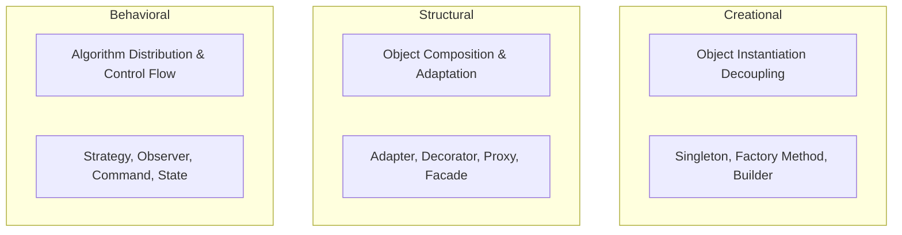

# What pattern categories exist

---

## 🟢 Junior Level

The 23 classic Gang of Four (GoF) design patterns are divided into **three primary categories** based on their architectural intent:

1. **Creational Patterns:** Abstract the instantiation process. They decouple the client application from direct `new` operators, isolating *how* objects are constructed, composed, and represented.
   - *Core Examples:* `Singleton`, `Factory Method`, `Abstract Factory`, `Builder`, `Prototype`.

2. **Structural Patterns:** Organize classes and objects into larger, flexible structures. They emphasize composition over rigid inheritance hierarchies to prevent combinatoric subclass explosion.
   - *Core Examples:* `Adapter`, `Decorator`, `Proxy`, `Facade`, `Composite`, `Bridge`, `Flyweight`.

3. **Behavioral Patterns:** Standardize the assignment of responsibilities, runtime control flow, and communication algorithms between independent objects.
   - *Core Examples:* `Strategy`, `Observer`, `Command`, `Iterator`, `State`, `Chain of Responsibility`, `Template Method`, `Visitor`.



### Simple Real-World Analogy (Building a House)
- **Creational (The Factory):** The concrete plant and prefabricated timber workshop that manufacture modular bricks, windows, and roof trusses according to exact specifications.
- **Structural (The Infrastructure):** The plumbing adapters bridging pipes of differing diameters (`Adapter`), external thermal cladding wrapped around walls (`Decorator`), and the central breaker panel concealing complex electrical wiring (`Facade`).
- **Behavioral (The Automation):** A motion sensor activating lights when a resident enters (`Observer`), a climate thermostat switching heating algorithms according to schedule (`Strategy`), and a wall switch issuing operational commands to ventilation units (`Command`).

### Practical Example: All Three Categories in One Scenario

```java
// === 1. Creational: Factory Method abstracts object creation ===
interface MessageSender {
    void send(String msg);
}

class EmailSender implements MessageSender {
    @Override
    public void send(String msg) {
        System.out.println("Email: " + msg);
    }
}

class SenderFactory {
    public static MessageSender createEmailSender() {
        return new EmailSender();
    }
}

// === 2. Structural: Decorator wraps an object to attach logging ===
class LoggingSenderDecorator implements MessageSender {
    private final MessageSender target;

    public LoggingSenderDecorator(MessageSender target) {
        this.target = target;
    }

    @Override
    public void send(String msg) {
        System.out.println("[AUDIT LOG] Dispatching message: " + msg);
        target.send(msg);
    }
}

// === 3. Behavioral: Strategy parameterizes text transformation ===
@FunctionalInterface
interface FormatStrategy {
    String format(String text);
}

public class PatternCategoriesDemo {
    public static void main(String[] args) {
        // Creational: Instantiate
        MessageSender baseSender = SenderFactory.createEmailSender();

        // Structural: Wrap and compose
        MessageSender decoratedSender = new LoggingSenderDecorator(baseSender);

        // Behavioral: Configure algorithm dynamically
        FormatStrategy strategy = text -> text.toUpperCase();

        String payload = strategy.format("Hello, Architecture!");
        decoratedSender.send(payload);
    }
}
```

---

## 🟡 Middle Level

### 1. Creational Patterns Deep-Dive

**Primary Goal:** Enforce the **Open/Closed Principle (OCP)** and **Dependency Inversion Principle (DIP)** by removing direct instantiation dependencies from business services.

| Pattern | Architectural Intent | JDK / Spring Example |
|:---|:---|:---|
| **Singleton** | Ensures a class has only one instance across the runtime/ClassLoader. | `Runtime.getRuntime()`, Spring `@Scope("singleton")` |
| **Factory Method** | Delegates object instantiation to subclasses or static factory methods. | `List.of()`, `Integer.valueOf()`, `Calendar.getInstance()` |
| **Abstract Factory** | Produces families of related or dependent objects without specifying concrete classes. | `DocumentBuilderFactory.newInstance()`, `Connection.createStatement()` |
| **Builder** | Constructs complex objects step-by-step, separating construction from representation. | `StringBuilder`, `HttpRequest.newBuilder()`, Lombok `@Builder` |
| **Prototype** | Creates new objects by copying an existing instance. | `Object.clone()`, Spring `@Scope("prototype")` |

#### Modern Java Evolution
- Traditional factories are often replaced by static factory methods directly on interfaces (`Map.of()`, `Set.of()`).
- In functional programming, factory abstractions are naturally implemented using `Supplier<T>`:
```java
public Order processOrder(Supplier<Order> orderSupplier) {
    Order order = orderSupplier.get();
    order.validate();
    return order;
}
```

---

### 2. Structural Patterns Deep-Dive

**Primary Goal:** Assemble classes and objects into flexible systems while avoiding the combinatoric explosion of subclass inheritance.

| Pattern | Architectural Intent | JDK / Spring Example |
|:---|:---|:---|
| **Adapter** | Converts the interface of a class into another interface clients expect. | `Arrays.asList()`, `InputStreamReader(InputStream)` |
| **Decorator** | Dynamically attaches additional responsibilities to an object at runtime. | `BufferedInputStream(new FileInputStream(...))`, Servlet Filters |
| **Proxy** | Provides a surrogate or placeholder for another object to control access to it. | `java.lang.reflect.Proxy`, Spring AOP (`@Transactional`, `@Cacheable`) |
| **Facade** | Provides a simplified, high-level interface to a complex subsystem. | `DriverManager.getConnection()`, Spring `JdbcTemplate` |
| **Composite** | Composes objects into tree structures to represent part-whole hierarchies. | Jackson `JsonNode` tree, `java.awt.Container` |
| **Bridge** | Decouples an abstraction from its implementation so that both can vary independently. | JDBC API (`DriverManager` vs vendor-specific drivers) |
| **Flyweight** | Shares common state to support large numbers of fine-grained objects efficiently. | JVM String Pool, `Integer.valueOf(-128..127)` cache |

#### Crucial Distinctions: Adapter vs. Decorator vs. Proxy
- **`Adapter`** changes the **interface** of an object to make it compatible with an incompatible API.
- **`Decorator`** preserves the original **interface**, but dynamically enhances its **behavior** (e.g., adding encryption, compression, or logging).
- **`Proxy`** preserves the original **interface**, but controls, guards, or intercepts **access** to the underlying object (e.g., lazy loading, security checks, transaction boundaries).

---

### 3. Behavioral Patterns Deep-Dive

**Primary Goal:** Standardize algorithms and communication protocols, eliminating monolithic procedural branching (`if-else` and `switch` spaghetti).

| Pattern | Architectural Intent | JDK / Spring Example |
|:---|:---|:---|
| **Strategy** | Defines a family of algorithms, encapsulates each one, and makes them interchangeable. | `Comparator.comparing()`, Spring `AuthenticationProvider` |
| **Observer** | Defines a one-to-many dependency so that when one object changes state, all dependents are notified. | `Flow.Publisher`/`Subscriber`, Spring `ApplicationEventPublisher` |
| **Template Method** | Defines the skeleton of an algorithm in a superclass, deferring specific steps to subclasses. | `AbstractList.get()`, Spring `JdbcTemplate.execute()` |
| **Chain of Resp.** | Passes a request along a dynamic chain of handlers until one handles it. | Spring Security `FilterChain`, Logback filters |
| **Command** | Encapsulates a request as an object, enabling parameterization, queuing, and undo operations. | `Runnable`, `Callable`, `ForkJoinTask` |
| **Iterator** | Sequentially accesses elements of an aggregate object without exposing its underlying representation. | `java.util.Iterator`, `Spliterator` |
| **State** | Allows an object to alter its behavior when its internal state changes (State Machine). | Spring Bean Lifecycle, TCP connection states, `SSLEngine` |

---

### 4. Extended Categories in Modern Enterprise Architecture

The classic 1994 GoF taxonomy was designed for single-process desktop applications. Modern distributed Java architectures introduce two additional categories:

1. **Concurrency Patterns:**
   - **Producer-Consumer:** Decouples work generation from task execution via thread-safe queues (`BlockingQueue`).
   - **Read-Write Lock:** Allows concurrent readers while enforcing exclusive writes (`ReentrantReadWriteLock`).
   - **Worker Thread / Thread Pool:** Reuses pooled OS threads via `ThreadPoolExecutor`.
   - **Double-Checked Locking:** Optimizes lazy initialization with thread-safe `volatile` semantics.

2. **Cloud-Native & Distributed Patterns:**
   - **Circuit Breaker:** Halts downstream requests when a microservice fails, preventing cascading cluster outages (Resilience4j).
   - **Saga Pattern:** Coordinates distributed transactions across microservices via choreographed or orchestrated compensating steps.
   - **Transactional Outbox:** Guarantees atomic database persistence and message broker publishing without distributed two-phase commits (2PC).
   - **Bulkhead:** Isolates thread pools and connection quotas so that failure in one domain does not exhaust cluster capacity.

---

## 🔴 Senior Level

### Architectural Decoupling: Categories as Dimensions of Separation

Each GoF category addresses a distinct dimension of coupling in software architecture:

```
[Coupling Dimension]                 [GoF Category]             [Architectural Solution]
1. Instantiation Coupling      ───>  Creational Patterns    ───> Inversion of Control (IoC), DI
2. Type & Composition Coupling ───>  Structural Patterns    ───> Composition over Inheritance
3. Algorithmic Coupling        ───>  Behavioral Patterns    ───> Polymorphism & Single Responsibility
```

- **Creational patterns** isolate knowledge of an object's lifecycle. Violating this leads to widespread `new` invocations, hardcoded dependencies, and untestable code.
- **Structural patterns** prevent combinatoric class explosion. With rigid inheritance, adding $N$ independent features requires $2^N$ subclass variations. Composition via `Decorator` or `Bridge` requires only $N$ classes.
- **Behavioral patterns** decompose monolithic business procedures into discrete, single-responsibility components.

---

### Polymorphism and JIT Inlining in the HotSpot JVM

Heavy reliance on Structural and Behavioral patterns introduces dynamic polymorphism via interface dispatch. In ultra-high-throughput systems, this directly influences HotSpot JIT C2 optimization:

```
                      HotSpot Method Invocation Inline Cache
                      
   [Call Site] ──(1 class loaded)──> Monomorphic ──> JIT Inlining (0 ns overhead, direct jump)
        │
        ├───(2 classes)──────────> Bimorphic   ──> Inline Cache (conditional branch, inlining possible)
        │
        └───(> 2 classes)─────────> Megamorphic ──> V-Table / I-Table Lookup (Indirect call,
                                                    inlining aborted, branch misprediction risk)
```

1. **Monomorphic Call Site:** If a `Strategy` interface has only one concrete class loaded at runtime, the JIT C2 compiler applies **Direct Method Inlining**, completely eliminating virtual method call overhead.
2. **Bimorphic Call Site:** If exactly two classes exist, the JIT emits a fast type-check branch (`if-else`) and inlines both code branches.
3. **Megamorphic Call Site:** If three or more implementations are actively invoked at the same call site, inlining is abandoned. The JVM must perform an indirect table lookup (**vtable / itable lookup**) on every invocation, causing CPU branch mispredictions.

> [!TIP]
> **Hot-Path Optimization:** In high-frequency loops processing millions of operations per second, avoid megamorphic strategy interfaces. An `enum` with a `switch` expression or a `sealed interface` generates a compact `tableswitch` bytecode instruction, executing significantly faster than megamorphic interface dispatch.

---

### Modern Java (Java 17–21+) Transformations

Modern language features have superseded many verbose classic GoF patterns:

#### 1. Replacing Visitor & Strategy via Sealed Types + Pattern Matching
```java
public sealed interface PaymentMethod permits CreditCard, BankTransfer, Crypto {}

public record CreditCard(String pan, String cvv) implements PaymentMethod {}
public record BankTransfer(String iban) implements PaymentMethod {}
public record Crypto(String wallet) implements PaymentMethod {}

// Exhaustive compiler-verified dispatching without Visitor or Strategy class boilerplate:
public static void processPayment(PaymentMethod method, BigDecimal amount) {
    switch (method) {
        case CreditCard cc     -> chargeCard(cc.pan(), amount);
        case BankTransfer bank -> initiateWire(bank.iban(), amount);
        case Crypto crypto     -> transferTokens(crypto.wallet(), amount);
    }
}
```

#### 2. Replacing Builder via Records
For simple data transfer objects, Java `record` types provide immutable, thread-safe structures with built-in compact constructors, eliminating the need for external Builder classes.

#### 3. Virtual Threads (Project Loom)
Eliminate the necessity of complex reactive and asynchronous patterns for standard I/O-bound microservices, restoring clean synchronous programming models.

---

### Spring Framework as the Unified Integrator

Every Spring application integrates all three GoF categories into a cohesive lifecycle pipeline:

```
[Creational Phase]
BeanFactory / ApplicationContext
  ├─ Parses configuration (Factory Method, Abstract Factory)
  └─ Instantiates beans (Singleton / Prototype Scope)
          │
          ▼
[Structural Phase]
BeanPostProcessor & Dynamic Proxies (ByteBuddy / CGLIB)
  ├─ Wraps beans in dynamic proxies (Structural: Proxy / Decorator)
  └─ Injects cross-cutting aspects (@Transactional, @Cacheable, @Async)
          │
          ▼
[Behavioral Phase]
Runtime Interception & Event Routing
  ├─ Request processing pipeline (Chain of Responsibility: HandlerInterceptor)
  ├─ Event messaging (Observer: ApplicationEventPublisher)
  └─ Algorithm selection (Strategy: HttpMessageConverter, AuthenticationProvider)
```

---

## 4 Tricky Questions

### 1. What is the fundamental architectural difference between Proxy and Decorator if their class diagrams and method signatures can be identical?
**Answer:**  
The distinction lies entirely in **Architectural Intent**:
- **`Decorator`** focuses on **extending behavior**. It dynamically adds new operational responsibilities (such as encryption, compression, or metric calculation) to an existing object. The decorator is typically constructed by the client and passed the target instance.
- **`Proxy`** focuses on **controlling access**. It intercepts requests to the target object to perform non-functional management (lazy initialization, access control, caching, transaction boundaries, or remote RPC). The proxy often manages the creation and lifecycle of the real subject internally.

### 2. How can excessive use of the Strategy pattern degrade performance in high-throughput JVM applications?
**Answer:**  
Through the creation of **Megamorphic Call Sites**.  
If a `Strategy` interface has more than two concrete implementations invoked at the exact same call site during runtime, the HotSpot JIT compiler cannot perform **Method Inlining**. The JVM is forced to perform an indirect virtual method table lookup (`itable`/`vtable`) on every call. In tight loops executing millions of times per second, this introduces CPU branch misprediction penalties and instruction cache misses.

### 3. Which category does the Repository pattern belong to, and is it part of the GoF catalog?
**Answer:**  
The `Repository` pattern is **not** part of the original 1994 Gang of Four catalog. It is an **Enterprise Application Pattern** formalized by Martin Fowler in *Patterns of Enterprise Application Architecture (PoEAA)*.  
Architecturally, it functions as a structural abstraction: it acts as a **Facade and Data Mapper** between the domain model layer and the database infrastructure, providing an in-memory collection-like interface to access domain aggregates.

### 4. Why was `java.util.Observable` deprecated in Java 9, and what modern mechanisms replace it?
**Answer:**  
`java.util.Observable` suffered from critical design defects:
1. **Class, Not Interface:** Because `Observable` was a concrete class, classes wishing to be observed could not extend any other class, violating flexible composition.
2. **Not Thread-Safe:** Its internal notification and observer registration methods lacked adequate concurrency guarantees.
3. **No Generics / Type Safety:** It passed plain `Object` arguments, requiring risky downcasting.
4. **No Backpressure Support:** It could easily overwhelm slow consumers.  
**Replacements:** Modern Java uses the **Reactive Streams API (`java.util.concurrent.Flow`)**, Project Reactor, Spring `ApplicationEventPublisher`, or asynchronous message brokers.

---

## 🎯 Interview Cheat Sheet

### Core Concepts (First 30 Seconds)
- **3 GoF Categories (23 Patterns):**
  - **Creational (5):** Abstract instantiation (`Builder`, `Factory Method`, `Singleton`, `Abstract Factory`, `Prototype`).
  - **Structural (7):** Abstract object composition (`Adapter`, `Decorator`, `Proxy`, `Facade`, `Composite`, `Bridge`, `Flyweight`).
  - **Behavioral (11):** Abstract algorithm delegation and communication (`Strategy`, `Observer`, `Command`, `State`, `Template Method`, `Chain of Responsibility`, `Iterator`).
- **Enterprise Extensions:** Concurrency patterns (`Producer-Consumer`, `Read-Write Lock`) and Cloud-Native patterns (`Circuit Breaker`, `Saga`, `Outbox`).
- **Modern Java Idioms:** Lambdas replace Strategy/Command classes; Sealed Interfaces replace Visitor; Records replace DTO Builders.

### Key Architectural Gotchas
- **Adapter vs. Decorator vs. Proxy:** Adapter converts interfaces; Decorator adds behavior to an interface; Proxy controls access to an interface.
- **Megamorphic Dispatch:** Avoid $>2$ strategy implementations in tight CPU loops to enable JIT method inlining.
- **Spring Architecture:** Spring uses all three categories: `ApplicationContext` (Creational Factory), AOP (Structural Proxy), and Interceptors (Behavioral Chain).

### Red Flags (What NOT to Say)
- ❌ *"Design patterns are obsolete because Spring handles everything with annotations."* (Spring is built directly on GoF patterns: AOP is Proxy, JdbcTemplate is Template Method, Context is Factory).
- ❌ *"Adapter and Decorator are just two names for the same thing."* (Adapter alters an interface for compatibility; Decorator preserves the interface and attaches behavior).
- ❌ *"Singleton guarantees a single instance across an entire enterprise cluster."* (A Java Singleton only guarantees one instance per JVM ClassLoader; distributed uniqueness requires distributed locking like Redis or ZooKeeper).

### Related Topics
- [What are design patterns](01.%20What%20are%20design%20patterns.md) — Fundamentals, evolution, and JIT inlining
- [What is Singleton](03.%20What%20is%20Singleton.md) — Thread-safe creation, double-checked locking, and enums
- [Difference between Factory Method and Abstract Factory](07.%20Difference%20between%20Factory%20Method%20and%20Abstract%20Factory.md) — Creational comparison
- [When to use Strategy](10.%20When%20to%20use%20Strategy.md) — Behavioral pattern implementation
- [Advantage of Decorator over inheritance](12.%20Advantage%20of%20Decorator%20over%20inheritance.md) — Structural composition mechanics
- [What Proxy types exist](14.%20What%20Proxy%20types%20exist.md) — Dynamic proxies and bytecode generation in Spring
