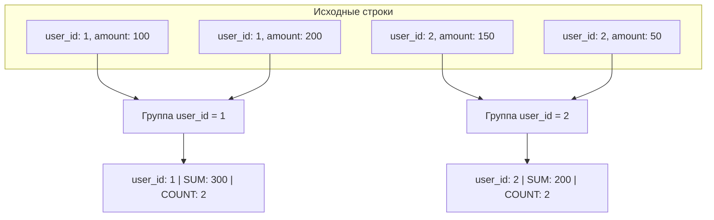
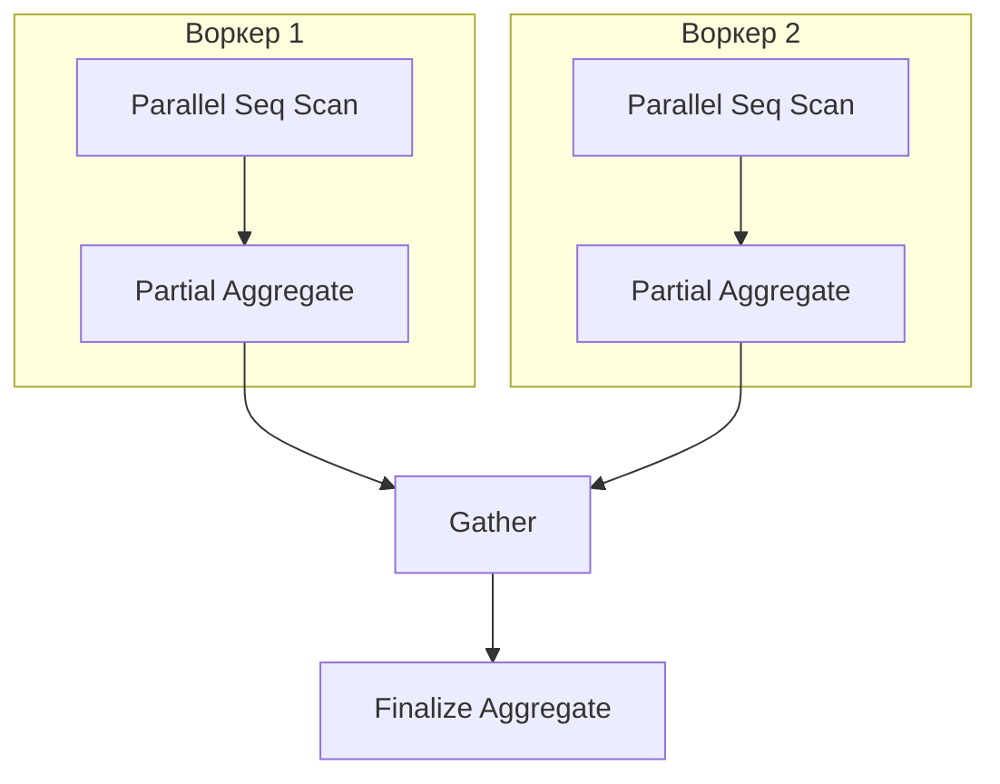

# Что делает GROUP BY?

---

## 🟢 Junior Level

**GROUP BY** — это предложение языка SQL, которое схлопывает (агрегирует) множество строк таблицы с одинаковыми значениями в указанных колонках в одну результирующую строку для каждой уникальной комбинации, позволяя применять к каждой группе агрегатные функции (`COUNT`, `SUM`, `AVG`, `MIN`, `MAX`).



### Наглядная бытовая аналогия

Представьте гору монет разного номинала (1, 2, 5 и 10 рублей):
1. **GROUP BY номинал:** Вы раскладываете монеты по четырём стопкам согласно их достоинству.
2. **Агрегация:** Вы считаете количество монет в каждой стопке (`COUNT(*)`) или суммарную ценность каждой стопки (`SUM(nominal)`).
3. Каждая стопка в отчёте превращается ровно в **одну** строчку.

### Базовый пример

```sql
-- Таблица orders:
-- id | user_id | amount | status
-- 1  | 10      | 500    | PAID
-- 2  | 10      | 300    | PAID
-- 3  | 20      | 1200   | PAID
-- 4  | 20      | 800    | CANCELLED

SELECT 
    user_id,
    COUNT(*) AS orders_count,
    SUM(amount) AS total_spent
FROM orders
WHERE status = 'PAID'
GROUP BY user_id;

-- Результат:
-- user_id | orders_count | total_spent
-- 10      | 2            | 800
-- 20      | 1            | 1200
```

### Главное синтаксическое правило (Single-Value Rule)

Все колонки, перечисленные в секции `SELECT`, обязаны:
1. Либо явно входить в блок `GROUP BY`.
2. Либо находиться внутри агрегатной функции (`SUM()`, `AVG()`, `COUNT()` и т.д.).
3. *(Исключение)* Быть функционально зависимыми от первичного ключа, указанного в `GROUP BY` (стандарт SQL:1999, поддерживается в PostgreSQL).

Любая колонка «сама по себе» без агрегата вызовет ошибку СУБД: `column must appear in the GROUP BY clause or be used in an aggregate function`.

---

## 🟡 Middle Level

### Как PostgreSQL выполняет группировку под капотом

Для выполнения `GROUP BY` планировщик PostgreSQL выбирает одну из двух фундаментальных физических стратегий:

```
                    ┌────────────────────────┐
                    │ Входной поток строк    │
                    └───────────┬────────────┘
                                │
              ┌─────────────────┴─────────────────┐
       Данные не отсортированы             Данные отсортированы 
       и помещаются в work_mem             (по B-tree индексу или Sort)
              ▼                                   ▼
    ┌──────────────────┐                ┌──────────────────┐
    │  HashAggregate   │                │  GroupAggregate  │
    │ (Хэш-таблица     │                │ (Потоковая       │
    │  в памяти)       │                │  агрегация O(1)) │
    └──────────────────┘                └──────────────────┘
```

#### 1. HashAggregate (Хэш-агрегация)
- СУБД инициализирует в оперативной памяти хэш-таблицу.
- Для каждой входящей строки вычисляется хэш от ключей группировки.
- Если корзина найдена — аккумуляторы агрегатов (`sum`, `count`) обновляются на месте.
- Если записи нет — в хэш-таблицу добавляется новый ключ и начальное состояние агрегата.
- **Требования к ресурсам:** Требует оперативную память в рамках лимита `work_mem`.
- **Порядок вывода:** Не гарантирует порядок строк на выходе (зависит от хэш-функции).

#### 2. GroupAggregate (Сортировочная потоковая агрегация)
- Требует, чтобы входной поток был строго упорядочен по ключам группировки (через B-tree индекс или предварительный узел `Sort`).
- СУБД последовательно считывает строки: пока ключ совпадает с текущим, накапливается агрегат. Как только ключ изменился — итоговая строка отдаётся клиенту, а аккумулятор сбрасывается для следующего ключа.
- **Требования к ресурсам:** Потребляет константный объём памяти $O(1)$ на группу.

| Характеристика | `HashAggregate` | `GroupAggregate` |
|---|---|---|
| **Требование к сортировке** | ❌ Не требуется | ✅ Обязательна (индекс или узел `Sort`) |
| **Расход памяти** | Пропорционален числу уникальных групп | Минимальный ($O(1)$ памяти на группу) |
| **Когда выбирается** | Небольшое/среднее число групп, нет подходящего индекса | Есть B-tree индекс по ключам группировки или данных слишком много для `work_mem` |
| **Устойчивость к нехватке памяти** | В PG 13+ делает `spill to disk`; до PG 13 — `out of memory` | Стабилен, если сортировка укладывается в память или идёт по индексу |

### Обработка значений NULL при группировке

В стандарте SQL и в PostgreSQL все значения `NULL` при группировке считаются **равными друг другу** и объединяются в **одну общую группу**:

```sql
SELECT status, COUNT(*) AS cnt
FROM orders
GROUP BY status;

-- Результат:
-- status  | cnt
-- PAID    | 120
-- PENDING | 45
-- NULL    | 12   <-- Все 12 строк с NULL попали в одну общую группу
```

> [!NOTE]
> Агрегатная функция `COUNT(column)` игнорирует `NULL` внутри группы, тогда как `COUNT(*)` считает абсолютно все строки, включая содержащие `NULL`.

### Функциональная зависимость от первичного ключа (Functional Dependency)

Начиная с PostgreSQL 9.1 (согласно стандарту SQL:1999), если в секции `GROUP BY` указан первичный ключ (`PRIMARY KEY`) таблицы, то остальные колонки этой же таблицы можно указывать в `SELECT` **без агрегатных функций**:

```sql
-- ✅ ВАЛИДНЫЙ ЗАПРОС в PostgreSQL:
SELECT u.id, u.name, u.email, COUNT(o.id) AS total_orders
FROM users u
LEFT JOIN orders o ON u.id = o.user_id
GROUP BY u.id; 
-- Так как u.id — PRIMARY KEY, значения name и email однозначно 
-- определяются u.id. Перечислять u.name и u.email в GROUP BY не требуется!
```

### Конструкция FILTER (WHERE ...) для параллельной условной агрегации

Вместо устаревшего и громоздкого синтаксиса `SUM(CASE WHEN ... THEN 1 ELSE 0 END)` современный стандарт SQL предоставляет предложение `FILTER`:

```sql
SELECT 
    department_id,
    COUNT(*) AS total_employees,
    COUNT(*) FILTER (WHERE salary > 100000) AS high_earners,
    AVG(salary) FILTER (WHERE gender = 'F') AS female_avg_salary
FROM employees
GROUP BY department_id;
```

### Проекция в Java: Spring Data JPA и DTO Projections

В корпоративных приложениях на Spring Boot результаты `GROUP BY` категорически не рекомендуется мапить на JPA-сущности (Entity), так как агрегированные строки не имеют идентичности в Persistence Context. Вместо этого используются DTO-проекции:

```java
// 1. DTO Record для агрегированных данных
public record DepartmentSalaryDto(Long departmentId, Long employeeCount, Double averageSalary) {}

// 2. Spring Data JPA Repository с JPQL-запросом и конструктором DTO:
public interface EmployeeRepository extends JpaRepository<Employee, Long> {
    
    @Query("""
        SELECT new com.example.dto.DepartmentSalaryDto(
            e.department.id, 
            COUNT(e.id), 
            AVG(e.salary)
        )
        FROM Employee e
        WHERE e.active = true
        GROUP BY e.department.id
        HAVING COUNT(e.id) >= :minTeamSize
    """)
    List<DepartmentSalaryDto> findDepartmentStats(@Param("minTeamSize") long minTeamSize);
}
```

**Опасная ошибка в Java:** переносить группировку на сторону Java через `stream().collect(Collectors.groupingBy(...))` при объёмах данных более нескольких тысяч строк. Это приводит к передаче гигабайт по сети, вымыванию кэша Hibernate и риску `OutOfMemoryError`.

---

## 🔴 Senior Level

### Глубокий анализ HashAggregate: Spilling на диск (PostgreSQL 13+)

До версии PostgreSQL 13 алгоритм `HashAggregate` не умел работать с диском: если хэш-таблица превышала `work_mem`, планировщик либо на этапе планирования выбирал медленный `GroupAggregate` с внешней сортировкой, либо запрос аварийно завершался ошибкой `out of memory`.

Начиная с PostgreSQL 13, в узел `HashAggregate` внедрён механизм **дискового сброса (Spill to Disk)**:
1. Память делится на логические разделы (Partitions / Batches).
2. При исчерпании `work_mem` часть хэш-таблицы сериализуется во временные файлы на диске (`temp_files`).
3. Обработка оставшихся разделов повторяется итеративно.

```text
EXPLAIN (ANALYZE, BUFFERS)
SELECT client_id, COUNT(*), SUM(payload_size)
FROM raw_events
GROUP BY client_id;

QUERY PLAN:
HashAggregate  (cost=450000.00..510000.00 rows=2500000 width=24) 
               (actual time=1820.10..2450.40 rows=2480000 loops=1)
  Group Key: client_id
  Batches: 8  Memory Usage: 32801kB  Disk Usage: 94520kB
  Buffers: shared hit=85000 read=120000, temp read=11815 written=11820
  ->  Seq Scan on raw_events  (...)
```

> [!WARNING]
> Если в выводе плана вы видите `Disk Usage: XX kB` или `Batches > 1`, это сигнал о дисковом сбросе. Увеличение параметра `SET work_mem = '128MB'` для сессии отчёта может ускорить запрос в 10–20 раз за счёт удержания всей хэш-таблицы в RAM.

### Оптимизация группировки B-Tree индексами: Index Only Scan

Если запрос группирует данные по колонкам составного индекса и выбирает только проиндексированные колонки, PostgreSQL может полностью исключить обращение к таблице (Heap):

```sql
-- Составной индекс, покрывающий группировку и агрегацию
CREATE INDEX idx_orders_status_amount ON orders(status, amount);

-- Запрос:
SELECT status, SUM(amount), COUNT(*)
FROM orders
GROUP BY status;

-- План выполнения:
-- GroupAggregate  (cost=0.43..1240.50 rows=4 width=16)
--   ->  Index Only Scan using idx_orders_status_amount on orders
--       Heap Fetches: 0
```
В этом сценарии:
- `Heap Fetches: 0` — обращений к основной таблице на диске нет, всё читается из кэша индекса.
- `GroupAggregate` выполняется потоково без сортировки, так как индекс гарантирует упорядоченность `status`.

### Параллельная агрегация (Parallel Aggregation)

При группировке больших таблиц планировщик задействует параллельные фоновые процессы (`parallel workers`):



```text
QUERY PLAN:
Finalize HashAggregate  (cost=18500.00..18600.00 rows=50 width=16)
  Group Key: department_id
  ->  Gather  (cost=17500.00..18200.00 rows=150 width=16)
        Workers Planned: 2
        ->  Partial HashAggregate  (cost=16500.00..16550.00 rows=50 width=16)
              Group Key: department_id
              ->  Parallel Seq Scan on employees  (...)
```
- **Partial Aggregate:** Каждый воркер читает свой диапазон страниц таблицы и формирует локальную промежуточную хэш-таблицу.
- **Gather:** Узел сбора пересылает частично агрегированные данные лидер-процессу.
- **Finalize Aggregate:** Лидер объединяет промежуточные состояния аккумуляторов (например, суммирует локальные `count` и `sum` для вычисления глобального `AVG`) и формирует окончательный результат.

### Продвинутые агрегации: ROLLUP, CUBE и GROUPING SETS

Стандартные запросы бизнес-аналитики часто требуют агрегации данных на нескольких уровнях иерархии (по филиалам, по годам, общий итог). Вместо объединения нескольких тяжелых запросов через `UNION ALL` (что требует $N$ проходов по таблице) используются расширения `GROUP BY`, выполняющие расчет за **один проход**:

```sql
-- 1. ROLLUP: иерархические подытоги (детализация -> отдел -> общий итог)
SELECT department, city, COUNT(*)
FROM employees
GROUP BY ROLLUP(department, city);
-- Генерирует группы: (department, city), (department), ()

-- 2. CUBE: расчет всех возможных декартовых комбинаций подмножеств
SELECT department, city, COUNT(*)
FROM employees
GROUP BY CUBE(department, city);
-- Генерирует группы: (department, city), (department), (city), ()

-- 3. GROUPING SETS: точный перечень требуемых срезов данных
SELECT department, city, COUNT(*)
FROM employees
GROUP BY GROUPING SETS (
    (department, city),
    (department),
    ()
);
```

#### Идентификация строк подытогов через функцию GROUPING()
Когда `ROLLUP` возвращает `NULL` в колонке, как отличить настоящий `NULL` в данных от сгенерированного итогового значения? Для этого служит функция `GROUPING()`:
```sql
SELECT 
    CASE WHEN GROUPING(department) = 1 THEN '=== ВСЕ ОТДЕЛЫ ===' ELSE department END AS dept_label,
    CASE WHEN GROUPING(city) = 1 THEN '=== ВСЕ ГОРОДА ===' ELSE city END AS city_label,
    COUNT(*) AS total_count
FROM employees
GROUP BY ROLLUP(department, city);
```

### Инкрементальная сортировка (Incremental Sort, PG 13+)

Если таблица имеет индекс по колонке `(department)`, но запрос требует группировки по `(department, project_id)`, начиная с PG 13 оптимизатор применяет **Incremental Sort**: СУБД сортирует `project_id` только локально внутри каждой уже упорядоченной индексом группы `department`, исключая глобальную сортировку всей таблицы.

---

## 🎯 Шпаргалка для интервью

### Обязательно знать (Первые 30 секунд ответа)
- **Суть:** `GROUP BY` объединяет строки с совпадающими значениями ключей в единые группы для вычисления агрегатов (`COUNT`, `SUM`, `AVG`, `MIN`, `MAX`).
- **Два физических алгоритма:**
  1. `HashAggregate` — хэш-таблица в оперативной памяти `work_mem` (быстро, O(N), не требует упорядоченности).
  2. `GroupAggregate` — потоковое вычисление по отсортированным данным (O(1) памяти на группу, идеально при наличии B-Tree индекса).
- **Поведение NULL:** Все `NULL`-значения трактуются как равные и сворачиваются в одну общую группу.
- **Single-Value Rule:** Колонки в `SELECT` должны входить в `GROUP BY`, либо быть обёрнуты в агрегат, либо зависеть от `PRIMARY KEY`.
- **Многоуровневые итоги:** `GROUPING SETS`, `ROLLUP`, `CUBE` вычисляют подытоги за один проход, заменяя медленные цепочки `UNION ALL`.

### Частые уточняющие вопросы на засыпку

1. **«Что произойдёт, если HashAggregate не помещается в work_mem?»**
   *Ответ:* В PostgreSQL до 13 версии запрос аварийно падал с OOM либо планировщик принудительно переключался на `GroupAggregate` с внешней сортировкой на диске. Начиная с PostgreSQL 13, `HashAggregate` поддерживает `Spill to disk`: сбрасывает переполненные разделы хэш-таблицы во временные файлы (`temp_files`) и обрабатывает их пакетами (`batches`), что сохраняет работоспособность, но замедляет запрос.

2. **«Почему запрос SELECT id, name, COUNT(*) FROM users GROUP BY id валиден в Postgres, но падает в Oracle/старых MySQL?»**
   *Ответ:* По стандарту SQL:1999 поддерживается функциональная зависимость (Functional Dependency): если в `GROUP BY` указан первичный ключ таблицы (`id`), СУБД гарантирует, что каждому `id` соответствует ровно одно значение `name`. PostgreSQL реализует это правило, позволяя опускать `name` в `GROUP BY`.

3. **«В чём разница между COUNT(*) и COUNT(column_name) при наличии GROUP BY?»**
   *Ответ:* `COUNT(*)` подсчитывает абсолютное количество строк, попавших в данную группу, включая строки, где все поля равны `NULL`. `COUNT(column_name)` подсчитывает количество строк в группе, где значение указанной колонки **не равно NULL**.

4. **«Как параллельный GROUP BY объединяет результаты между воркерами?»**
   *Ответ:* Через двухфазную агрегацию: каждый параллельный воркер формирует локальные агрегаты (`Partial Aggregate`) над своей порцией строк. Затем узел `Gather` передаёт частичные аккумуляторы лидер-процессу, который узлом `Finalize Aggregate` объединяет их в единый результат.

### Красные флаги (НЕ говорить на интервью)
- ❌ *«GROUP BY всегда физически сортирует данные»* — нет, по умолчанию для несортированных данных Postgres использует `HashAggregate`, не выполняющий никакой сортировки.
- ❌ *«Каждый NULL создаёт свою отдельную группу»* — грубая ошибка: все строки с `NULL` попадают ровно в одну общую группу.
- ❌ *«Чтобы посчитать итоги по отделам и общий итог, нужно написать два запроса и объединить их через UNION ALL»* — признак незнания SQL; для этого существуют `ROLLUP` и `GROUPING SETS`, работающие за один проход.
- ❌ *«Группировку лучше всегда делать в Java через Stream API, чтобы разгрузить базу данных»* — фатальная архитектурная ошибка, приводящая к передаче терабайт данных по сети и падению JVM по `OutOfMemoryError`.

### Связанные темы
- [В чём разница между WHERE и HAVING](11.%20В%20чём%20разница%20между%20WHERE%20и%20HAVING.md) → фильтрация до и после группировки
- [Когда использовать HAVING](13.%20Когда%20использовать%20HAVING.md) → практические сценарии применения фильтров к группам
- [Что такое оконные функции (Window Functions)](14.%20Что%20такое%20оконные%20функции%20(Window%20Functions).md) → агрегация данных без схлопывания строк
- [Что такое explain plan](20.%20Что%20такое%20explain%20plan.md) → анализ узлов HashAggregate, GroupAggregate и Spill to Disk
