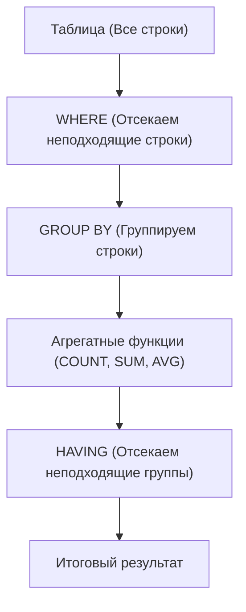

# Когда использовать HAVING?

---

## 🟢 Junior Level

**HAVING** используется исключительно в тех случаях, когда необходимо отфильтровать данные по результатам вычисления **агрегатных функций** (`COUNT`, `SUM`, `AVG`, `MIN`, `MAX`) после объединения строк в группы (`GROUP BY`).



### Наглядная аналогия

Представьте спортивный турнир по баскетболу:
1. **WHERE:** Сначала отбираются игроки с действующей медсправкой (`WHERE medical_check = true`).
2. **GROUP BY:** Игроки объединяются в команды по клубам (`GROUP BY club_id`).
3. **HAVING:** К участию в плей-офф допускаются только те команды, которые в сумме набрали более 100 очков (`HAVING SUM(points) > 100`) и у которых в составе не менее 5 человек (`HAVING COUNT(*) >= 5`).

### Базовые практические сценарии

#### 1. Поиск дубликатов в таблице
```sql
-- Найти email-адреса, которые встречаются в базе более одного раза
SELECT email, COUNT(*) AS occurrences
FROM users
GROUP BY email
HAVING COUNT(*) > 1;
```

#### 2. Фильтрация по бизнес-порогам агрегатов
```sql
-- Найти постоянных клиентов (более 5 успешных заказов)
SELECT customer_id, COUNT(*) AS orders_count
FROM orders
WHERE status = 'COMPLETED'
GROUP BY customer_id
HAVING COUNT(*) >= 5;
```

#### 3. Фильтрация по средним показателям
```sql
-- Отделы со средней зарплатой выше 120 000 ₽
SELECT department_id, AVG(salary) AS avg_salary
FROM employees
GROUP BY department_id
HAVING AVG(salary) > 120000;
```

---

## 🟡 Middle Level

### Архитектурный паттерн: Синергия WHERE + HAVING

В высоконагруженных системах `WHERE` и `HAVING` работают в тандеме, строго разделяя зоны ответственности:

```sql
SELECT 
    seller_id,
    COUNT(*) AS total_sales,
    SUM(sale_amount) AS revenue
FROM sales
WHERE sale_date >= '2026-01-01'           -- 1. WHERE: фильтр строк (активно использует индекс!)
  AND refund_status IS NULL                -- 2. WHERE: отсекает возвраты ДО попадания в память
GROUP BY seller_id                         -- 3. GROUP BY: формирует группы в памяти
HAVING COUNT(*) >= 50                      -- 4. HAVING: бизнес-порог по количеству сделок
   AND SUM(sale_amount) >= 1000000;        -- 5. HAVING: бизнес-порог по объёму выручки
```

**Почему разделение критично:**
- `WHERE` выполняется **до** группировки. Он использует индексы и сокращает объём строк, поступающих на вход процессора агрегации (`HashAggregate` или `GroupAggregate`).
- `HAVING` выполняется **после** группировки над уже сжатым набором данных.

### Сценарии использования HAVING продвинутого уровня

#### 1. Проверка состава группы через FILTER (WHERE ...)
Нахождение групп, удовлетворяющих сложному качественному условию:
```sql
-- Найти проекты, где более 10 задач, и при этом более 3 задач заблокированы:
SELECT project_id, COUNT(*) AS total_tasks
FROM tasks
GROUP BY project_id
HAVING COUNT(*) >= 10
   AND COUNT(*) FILTER (WHERE status = 'BLOCKED') >= 3;
```

#### 2. Поиск групп со 100% выполнением условия (Relational Division)
```sql
-- Найти заказы, у которых АБСОЛЮТНО ВСЕ позиции уже доставлены:
SELECT order_id
FROM order_items
GROUP BY order_id
HAVING COUNT(*) = COUNT(*) FILTER (WHERE item_status = 'DELIVERED');
```

#### 3. Глобальный страж (HAVING без GROUP BY)
Если `HAVING` указан без предложения `GROUP BY`, вся таблица агрегируется как одна группа:
```sql
-- Проверка условия целостности: вернуть флаг, если в системе обнаружены аномалии
SELECT 'CRITICAL: High average response time!' AS alert
FROM http_access_logs
WHERE request_timestamp >= NOW() - INTERVAL '5 minutes'
HAVING AVG(response_time_ms) > 1500;
```

### Проекция в Java: Criteria API и JPQL в Spring Data JPA

В корпоративных Java-приложениях фильтрация групп реализуется через метод `having()` в `CriteriaBuilder` или явный JPQL-запрос:

```java
// 1. Использование Spring Data JPA JPQL:
public interface OrderRepository extends JpaRepository<Order, Long> {

    @Query("""
        SELECT o.customer.id, COUNT(o.id), SUM(o.totalPrice)
        FROM Order o
        WHERE o.createdAt >= :startDate
        GROUP BY o.customer.id
        HAVING COUNT(o.id) >= :minOrders AND SUM(o.totalPrice) >= :minSpent
    """)
    List<CustomerStatsDto> findVipCustomers(
        @Param("startDate") LocalDateTime startDate,
        @Param("minOrders") long minOrders,
        @Param("minSpent") BigDecimal minSpent
    );
}

// 2. Использование JPA Criteria API:
CriteriaBuilder cb = em.getCriteriaBuilder();
CriteriaQuery<CustomerStatsDto> cq = cb.createQuery(CustomerStatsDto.class);
Root<Order> order = cq.from(Order.class);

cq.multiselect(order.get("customer").get("id"), cb.count(order), cb.sum(order.get("totalPrice")));
cq.where(cb.greaterThanOrEqualTo(order.get("createdAt"), startDate));
cq.groupBy(order.get("customer").get("id"));
cq.having(
    cb.and(
        cb.ge(cb.count(order), minOrders),
        cb.ge(cb.sum(order.get("totalPrice")), minSpent)
    )
);

List<CustomerStatsDto> results = em.createQuery(cq).getResultList();
```

---

## 🔴 Senior Level

### Проблема взрывного роста числа групп (Cardinality Explosion)

Если предикат в `WHERE` обладает низкой селективностью (например, возвращает 100 млн строк), а колонка группировки имеет высокую кардинальность (например, 10 млн уникальных `user_id`), секция `HAVING` **не спасает** от переполнения оперативной памяти.

```sql
-- ⚠️ ОПАСНО ДЛЯ ПАМЯТИ:
SELECT user_id, SUM(amount)
FROM transactions
WHERE created_at >= '2024-01-01'  -- 100 000 000 строк
GROUP BY user_id                   -- 10 000 000 групп!
HAVING SUM(amount) > 100000;       -- Фильтрует уже готовые 10 млн групп!
```

**Что происходит внутри PostgreSQL:**
1. Планировщик строит хэш-таблицу на 10 млн слотов в пределах `work_mem`.
2. При превышении `work_mem` наступает **Spill to Disk**: СУБД сбрасывает разделы хэша во временные файлы `temp_files`, генерируя десятки гигабайт дискового I/O.
3. Время выполнения деградирует с нескольких секунд до десятков минут.

**Архитектурные решения проблемы:**

1. **Предварительная фильтрация по агрегатам (Pre-Aggregation CTE):**
   Если возможно заранее отсечь транзакции с незначительными суммами:
   ```sql
   WITH large_tx AS (
       SELECT user_id, amount
       FROM transactions
       WHERE created_at >= '2024-01-01'
         AND amount >= 1000 -- Отсекаем мелкие транзакции ДО агрегации
   )
   SELECT user_id, SUM(amount)
   FROM large_tx
   GROUP BY user_id
   HAVING SUM(amount) > 100000;
   ```

2. **Материализованные представления (Materialized Views):**
   Для периодических отчётов агрегированные данные рассчитываются инкрементально в фоновом режиме:
   ```sql
   CREATE MATERIALIZED VIEW mv_user_turnover AS
   SELECT user_id, SUM(amount) AS total_amount, COUNT(*) AS tx_count
   FROM transactions
   GROUP BY user_id;

   CREATE INDEX idx_mv_user_turnover ON mv_user_turnover(total_amount);
   -- Теперь выборка мгновенна через B-Tree Index Scan:
   SELECT user_id, total_amount FROM mv_user_turnover WHERE total_amount > 100000;
   ```

### Когда HAVING категорически неприменим: Window Functions

Частая ошибка даже на уровне Senior — попытка использовать `HAVING` для фильтрации результатов оконных функций:

```sql
-- ❌ СИНТАКСИЧЕСКАЯ ОШИБКА:
-- Window functions are not allowed in HAVING
SELECT 
    department_id, 
    employee_id, 
    salary,
    DENSE_RANK() OVER (PARTITION BY department_id ORDER BY salary DESC) AS rank
FROM employees
HAVING DENSE_RANK() OVER (PARTITION BY department_id ORDER BY salary DESC) <= 3;
```

**Фундаментальная причина:**
`HAVING` выполняется над агрегатными аккумуляторами в момент завершения `GROUP BY`. Оконные функции (`WindowAgg`) рассчитываются **позже**, на этапе формирования оконных рамок над уже сгруппированными строками.

**Правильный паттерн решения:** Оборачивание в CTE или производную таблицу (Derived Table):
```sql
WITH RankedEmployees AS (
    SELECT 
        department_id, 
        employee_id, 
        salary,
        DENSE_RANK() OVER (PARTITION BY department_id ORDER BY salary DESC) AS salary_rank
    FROM employees
)
SELECT department_id, employee_id, salary, salary_rank
FROM RankedEmployees
WHERE salary_rank <= 3;
```

### Подзапросы в секции HAVING

SQL допускает использование скалярных подзапросов внутри `HAVING`. Это полезно, когда порог фильтрации группы зависит от глобального агрегата:

```sql
-- Найти категории товаров, средний чек которых выше общего среднего чека по всем заказам
SELECT category_id, AVG(order_sum) AS cat_avg
FROM order_lines
GROUP BY category_id
HAVING AVG(order_sum) > (
    SELECT AVG(order_sum) FROM order_lines
);
-- Подзапрос в HAVING вычисляется один раз (как InitPlan) и кэшируется!
```

---

## 🎯 Шпаргалка для интервью

### Обязательно знать (Первые 30 секунд ответа)
- **Назначение:** `HAVING` применяется **исключительно** для фильтрации сгруппированных данных по значениям **агрегатных функций** (`COUNT`, `SUM`, `AVG`, `MIN`, `MAX`).
- **Разделение с WHERE:** Условия на обычные колонки обязаны находиться в `WHERE` (чтобы отсечь строки до группировки с помощью индексов). Условия на результат вычислений — в `HAVING`.
- **Влияние на ресурсы:** `HAVING` не снижает объём строк, поступающих в хэш-таблицу агрегации; при миллионах групп `HAVING` не предотвращает дисковый сброс (`spill to disk`).
- **Синтаксис без GROUP BY:** `HAVING` допустим без `GROUP BY` — в этом случае агрегируется вся таблица как единая группа.
- **Оконные функции:** Оконные функции в `HAVING` запрещены стандартом SQL, так как фаза `WindowAgg` следует строго после `HAVING`.

### Частые уточняющие вопросы на засыпку

1. **«Можно ли в HAVING написать условие HAVING id = 10, если колонка id входит в GROUP BY?»**
   *Ответ:* Технически синтаксис SQL это разрешает, но архитектурно это считается грубой ошибкой (Code Smell). Условие `id = 10` необходимо вынести в `WHERE id = 10`, что позволит СУБД применить B-tree индекс по `id` и прочитать ровно одну строку вместо полного сканирования таблицы и последующей группировки.

2. **«Как вычисляется скалярный подзапрос внутри HAVING (SubPlan или InitPlan)?»**
   *Ответ:* Если подзапрос внутри `HAVING` не коррелирует со строками внешней таблицы (например, `HAVING AVG(salary) > (SELECT AVG(salary) FROM employees)`), оптимизатор выполняет его один раз в самом начале выполнения как `InitPlan` и переиспользует скалярное значение для проверки каждой группы.

3. **«В чём различие между HAVING COUNT(*) > 0 и предикатом EXISTS(...) во внешнем запросе?»**
   *Ответ:* `HAVING COUNT(*) > 0` требует полной агрегации и вычисления точного числа всех связанных строк. Оператор `EXISTS` реализует семантику Semi-Join и прекращает чтение сразу после обнаружения **первой** совпадающей записи, что на несколько порядков быстрее.

4. **«Как отличить настоящую группу с NULL от строки общих итогов при использовании GROUP BY ROLLUP с фильтром HAVING?»**
   *Ответ:* С помощью стандартной функции `GROUPING(column_name)`: она возвращает `1`, если `NULL` сгенерирован оператором `ROLLUP/CUBE` как подытог, и `0`, если в исходных данных действительно хранилось значение `NULL`.

### Красные флаги (НЕ говорить на интервью)
- ❌ *«HAVING нужен для того, чтобы быстрее отфильтровать строки после JOIN»* — строки после JOIN фильтруются в `WHERE`.
- ❌ *«В HAVING можно передать ROW_NUMBER() или RANK()»* — запрещено синтаксисом SQL, оконные функции вычисляются после HAVING.
- ❌ *«HAVING оптимизирует использование памяти work_mem»* — нет, `HAVING` оценивается уже после построения хэш-таблицы в `work_mem`.
- ❌ *«Для поиска дубликатов лучше загрузить сущности в Java и отфильтровать через stream().filter()»* — грубая ошибка масштабируемости, чреватая `OutOfMemoryError`.

### Связанные темы
- [В чём разница между WHERE и HAVING](11.%20В%20чём%20разница%20между%20WHERE%20и%20HAVING.md) → фундаментальный порядок выполнения
- [Что делает GROUP BY](12.%20Что%20делает%20GROUP%20BY.md) → операторы HashAggregate и GroupAggregate
- [Что такое оконные функции (Window Functions)](14.%20Что%20такое%20оконные%20функции%20(Window%20Functions).md) → агрегация с сохранением исходных строк
- [Что такое explain plan](20.%20Что%20такое%20explain%20plan.md) → обнаружение Hash Spill и анализ работы фильтров
