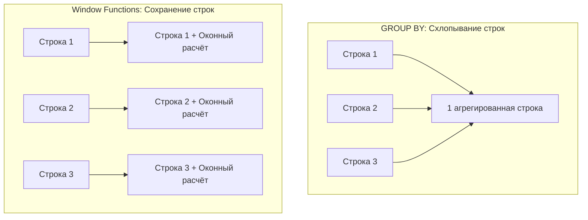

# Что такое оконные функции (Window Functions)?

---

## 🟢 Junior Level

**Оконные функции (Window Functions)** — это специальные аналитические функции SQL, которые выполняют вычисления над набором связанных строк (окном), но при этом **сохраняют исходную детализацию каждой строки**, в отличие от `GROUP BY`, который схлопывает строки группы в одну.



### Наглядная бытовая аналогия

Представьте школьный класс:
- **GROUP BY:** Учитель собирает дневники учеников и выдаёт директору одну записку: «Средний балл по классу — 4.2». Все индивидуальные оценки учеников потеряны.
- **Оконная функция:** Учитель возвращает дневник **каждому** ученику, но рядом с его личной оценкой ставит печать: «Средний балл по твоему классу — 4.2». Каждый ученик видит и свою оценку, и показатель своего класса.

### Базовый пример

```sql
-- Для каждого сотрудника вывести его зарплату, а также среднюю зарплату его отдела:
SELECT 
    name,
    department,
    salary,
    AVG(salary) OVER (PARTITION BY department) AS dept_avg_salary
FROM employees;

-- Результат:
-- name    | department | salary | dept_avg_salary
-- Иван    | IT         | 150000 | 140000
-- Алексей | IT         | 130000 | 140000
-- Ольга   | HR         | 90000  | 85000
-- Дарья   | HR         | 80000  | 85000
```

### Основные категории оконных функций

1. **Агрегатные:** `SUM() OVER(...)`, `AVG() OVER(...)`, `COUNT() OVER(...)`, `MIN() / MAX() OVER(...)`.
2. **Ранжирующие:** `ROW_NUMBER()`, `RANK()`, `DENSE_RANK()`, `NTILE()`.
3. **Функции смещения (навигационные):** `LAG()` (предыдущая строка), `LEAD()` (следующая строка), `FIRST_VALUE()`, `LAST_VALUE()`.

---

## 🟡 Middle Level

### Анатомия оконного выражения (OVER Clause)

Любая оконная функция определяется конструкцией `OVER (...)`, состоящей из трёх опциональных элементов:

```sql
FUNCTION() OVER (
    PARTITION BY column_name      -- 1. Разделение на партиции (окна)
    ORDER BY sort_column          -- 2. Сортировка строк внутри окна
    ROWS BETWEEN ... AND ...      -- 3. Рамка окна (Window Frame)
)
```

1. **`PARTITION BY`** — логически разделяет набор данных на независимые группы. Если `PARTITION BY` опущен, окном является вся результирующая выборка.
2. **`ORDER BY`** — задаёт порядок обхода строк внутри окна (критически важен для ранжирования и накопительных итогов).
3. **`ROWS / RANGE / GROUPS`** — определяет границы подмножества строк (фрейма) относительно текущей строки.

### Сравнение GROUP BY и Window Functions

| Характеристика | `GROUP BY` | `Window Functions` |
|---|---|---|
| **Результирующее число строк** | Уменьшается (одна строка на группу) | Не изменяется (строка-в-строку) |
| **Доступ к детальным данным** | Теряется (только агрегаты и ключи группировки) | Сохраняется для каждого исходного поля |
| **Место в конвейере SQL** | До `HAVING` и `SELECT` | Строго в момент формирования `SELECT` |
| **Сочетаемость в одном запросе** | Нельзя смешать детальные строки с группой | Можно комбинировать с `GROUP BY` (окна над агрегатами) |

### Режимы фреймов: ROWS vs RANGE vs GROUPS

Если указан `ORDER BY`, но фрейм опущен, по умолчанию применяется:
`RANGE BETWEEN UNBOUNDED PRECEDING AND CURRENT ROW`.

```sql
-- 1. ROWS: считает физические строки (наиболее производительный)
SELECT date, amount,
       AVG(amount) OVER (
           ORDER BY date 
           ROWS BETWEEN 6 PRECEDING AND CURRENT ROW
       ) AS moving_avg_7_rows
FROM sales;

-- 2. RANGE: считает логические значения (учитывает дубликаты и интервалы)
SELECT date, amount,
       SUM(amount) OVER (
           ORDER BY date 
           RANGE BETWEEN INTERVAL '7 days' PRECEDING AND CURRENT ROW
       ) AS weekly_revenue
FROM sales;
```

> [!WARNING]
> Разница между `ROWS` и дефолтным `RANGE`: при наличии повторяющихся значений в `ORDER BY` (например, несколько заказов совершены в одну секунду), `RANGE` объединит их все в один шаг и посчитает агрегат сразу для всей группы совпадений (`peer rows`), а `ROWS` будет строго идти поштучно. `ROWS` практически всегда работает быстрее `RANGE`.

### Навигационные функции LAG() и LEAD()

Позволяют анализировать временные ряды без тяжелых `SELF JOIN`:

```sql
-- Расчет помесячного прироста выручки (Growth MoM)
SELECT 
    report_month,
    revenue,
    LAG(revenue, 1) OVER (ORDER BY report_month) AS prev_month_revenue,
    revenue - LAG(revenue, 1) OVER (ORDER BY report_month) AS growth_amount
FROM monthly_financials;
```

### Поддержка в Java, JPA и Hibernate

Исторически оконные функции были больным местом в Java-разработке:

- **До Hibernate 6:** Стандартный JPQL/HQL **не поддерживал** оконные функции. Разработчикам приходилось использовать либо `createNativeQuery()`, либо создавать в базе SQL View, либо переходить на jOOQ.
- **В Hibernate 6+ (Spring Boot 3+):** Оконные функции стали **полноправной частью HQL/JPQL**:

```java
// ✅ Валидный HQL в Spring Boot 3 / Hibernate 6:
@Query("""
    SELECT new com.example.dto.EmployeeRankDto(
        e.id,
        e.name,
        e.salary,
        DENSE_RANK() OVER (PARTITION BY e.department.id ORDER BY e.salary DESC)
    )
    FROM Employee e
""")
List<EmployeeRankDto> findEmployeeSalariesRanked();
```

---

## 🔴 Senior Level

### Физический конвейер выполнения в PostgreSQL: Узел WindowAgg

Оконные функции вычисляются в плане запроса специальным исполнительным узлом **`WindowAgg`**:

```text
QUERY PLAN:
WindowAgg  (cost=125000.00..145000.00 rows=1000000 width=32) (actual time=820.10..1120.30 rows=1000000 loops=1)
  ->  Sort  (cost=125000.00..127500.00 rows=1000000 width=24) (actual time=610.15..720.40 rows=1000000 loops=1)
        Sort Key: department_id, salary DESC
        Sort Method: quicksort  Memory: 78000kB
        ->  Seq Scan on employees  (...)
```

1. СУБД считывает строки после этапов `WHERE`, `GROUP BY` и `HAVING`.
2. Строки **сортируются** узлом `Sort` по ключам `(PARTITION BY, ORDER BY)`.
3. Узел `WindowAgg` последовательно сканирует упорядоченный поток, удерживая в памяти активный фрейм строк и инкрементально обновляя агрегаты.

### Индексация для исключения узла Sort

Сортировка миллионов строк для оконной функции — дорогая операция, требующая `work_mem`. Её можно полностью устранить, создав B-tree индекс, порядок колонок в котором в точности совпадает с `PARTITION BY` + `ORDER BY`:

```sql
-- Составной индекс под окно (department, created_at)
CREATE INDEX idx_orders_dept_date ON orders(department_id, created_at);

-- Запрос:
SELECT 
    department_id, 
    created_at, 
    amount,
    SUM(amount) OVER (PARTITION BY department_id ORDER BY created_at) AS running_total
FROM orders;

-- План:
-- WindowAgg  (cost=0.43..8500.00 rows=200000 width=20)
--   ->  Index Scan using idx_orders_dept_date on orders
--       (Узел Sort ПОЛНОСТЬЮ ОТСУТСТВУЕТ!)
```

### Проблема множественных окон и оптимизация через WINDOW clause

Если в одном запросе используются разные `PARTITION BY` или разные `ORDER BY`, PostgreSQL вынужден выполнять **несколько независимых сортировок**:

```sql
-- ❌ КАТАСТРОФА ДЛЯ ПРОИЗВОДИТЕЛЬНОСТИ: 3 разные сортировки
SELECT 
    AVG(amount) OVER (PARTITION BY user_id) AS u_avg,
    AVG(amount) OVER (PARTITION BY store_id) AS s_avg,
    AVG(amount) OVER (PARTITION BY region_id ORDER BY date) AS r_avg
FROM orders;
```

**Оптимизация:** Переиспользование окон через именованное предложение `WINDOW`:
```sql
SELECT 
    user_id,
    amount,
    AVG(amount) OVER w AS avg_spent,
    SUM(amount) OVER w AS total_spent,
    COUNT(*) OVER w AS orders_count
FROM orders
WINDOW w AS (PARTITION BY user_id ORDER BY created_at ROWS BETWEEN UNBOUNDED PRECEDING AND CURRENT ROW);
```

### Incremental Sort (PostgreSQL 13+)

Если таблица уже частично отсортирована по префиксу ключа (например, B-tree индекс есть только по `department_id`), начиная с PostgreSQL 13 оптимизатор применяет **Incremental Sort**:
- PostgreSQL не сортирует весь массив заново.
- Сортировка по второму полю (`created_at`) выполняется небольшими порциями строго внутри каждого значения `department_id`.
- Это снижает расход `work_mem` и в 5–10 раз сокращает задержку до получения первых строк (`first rows latency`).

### Исключение строк из расчета через EXCLUDE (PostgreSQL 11+)

Конструкция `EXCLUDE` позволяет тонко управлять содержимым фрейма:
- `EXCLUDE CURRENT ROW` — исключает из расчёта саму текущую строку (идеально для поиска аномалий: сравнение зарплаты сотрудника со средней зарплатой всех *остальных* коллег отдела).
- `EXCLUDE GROUP` — исключает текущую строку и все строки с одинаковым значением ключа сортировки.
- `EXCLUDE TIES` — исключает дубликаты ключа сортировки, но оставляет саму текущую строку.

```sql
SELECT name, department_id, salary,
       AVG(salary) OVER (
           PARTITION BY department_id 
           ORDER BY salary
           ROWS BETWEEN UNBOUNDED PRECEDING AND UNBOUNDED FOLLOWING
           EXCLUDE CURRENT ROW
       ) AS peers_average_salary
FROM employees;
```

---

## 🎯 Шпаргалка для интервью

### Обязательно знать (Первые 30 секунд ответа)
- **Что это:** Оконные функции производят агрегатные и ранжирующие вычисления над набором связанных строк (`OVER`), **не схлопывая** результат и сохраняя каждую исходную строку.
- **Синтаксис:** `FUNCTION() OVER (PARTITION BY ... ORDER BY ... ROWS/RANGE BETWEEN ...)`.
- **Типы функций:**
  - Агрегаты: `SUM()`, `AVG()`, `COUNT()`, `MIN()`, `MAX()`.
  - Ранжирование: `ROW_NUMBER()` (сквозной номер), `RANK()` (с пропусками при равенстве), `DENSE_RANK()` (без пропусков).
  - Навигация: `LAG()` (предыдущая), `LEAD()` (следующая).
- **Порядок выполнения в SQL:** Оконные функции выполняются **после** `WHERE`, `GROUP BY` и `HAVING`, но **до** `DISTINCT`, `ORDER BY` и `LIMIT`.
- **Фильтрация:** Фильтровать строки по значению оконной функции в том же запросе через `WHERE` или `HAVING` **нельзя** — требуется обёртка в CTE или подзапрос.

### Частые уточняющие вопросы на засыпку

1. **«Почему в WHERE нельзя отфильтровать ROW_NUMBER() = 1?»**
   *Ответ:* Фаза `WHERE` выполняется на шаге 2 логического пайплайна (фильтрация строк таблицы), а узел `WindowAgg` рассчитывается на шаге 5 (в момент формирования проекции `SELECT`). Чтобы отфильтровать топ-1 запись, оконную функцию вычисляют в CTE или подзапросе, а фильтр накладывают во внешнем `WHERE`.

2. **«В чём разница между ROWS и RANGE при расчете накопительного итога?»**
   *Ответ:* `ROWS` работает с физическими смещениями строк, а `RANGE` — с логическими диапазонами значений. Если в колонке сортировки есть дубликаты (одинаковые даты), `RANGE` прибавит к накопительному итогу сразу все строки с совпадающей датой, а `ROWS` будет инкрементировать итог по одной строке. Кроме того, `ROWS` существенно быстрее, так как не требует проверок равенства значений.

3. **«Поддерживает ли Hibernate оконные функции в запросах HQL?»**
   *Ответ:* До версии Hibernate 6 оконные функции не поддерживались в HQL, требуя Native SQL или views. В Hibernate 6+ (Spring Boot 3+) оконные функции стали стандартной частью синтаксиса HQL/JPQL и могут мапиться напрямую в Java Records и DTO.

4. **«Как составить идеальный индекс под оконную функцию?»**
   *Ответ:* B-tree составной индекс по полям `(PARTITION BY columns, ORDER BY columns)`. При таком индексе СУБД считывает строки уже в идеальном порядке, и планировщик исключает ресурсоёмкую операцию `Sort` перед узлом `WindowAgg`.

### Красные флаги (НЕ говорить на интервью)
- ❌ *«Оконные функции заменяют GROUP BY во всех случаях»* — если вам нужна только сводная строка на категорию без детализации, `GROUP BY` работает быстрее и потребляет меньше памяти.
- ❌ *«Можно вложить одну оконную функцию внутрь другой (e.g. SUM(ROW_NUMBER()) OVER())»* — вложенные оконные функции строго запрещены стандартом SQL (требуется CTE).
- ❌ *«Оконные функции можно отфильтровать в секции HAVING»* — `HAVING` фильтрует группы `GROUP BY`, а оконные функции рассчитываются позже.
- ❌ *«COUNT(*) OVER() ничего не стоит при пагинации»* — для подсчета общего числа строк `COUNT(*) OVER()` заставит СУБД материализовать и прочитать весь набор данных, что разрушает оптимизацию пагинации с `LIMIT`.

### Связанные темы
- [Что делает ROW_NUMBER()](15.%20Что%20делает%20ROW_NUMBER().md) → детальный разбор сквозной нумерации строк
- [Что делает RANK() и DENSE_RANK()](16.%20Что%20делает%20RANK()%20и%20DENSE_RANK().md) → алгоритмы ранжирования с дубликатами
- [Что делает GROUP BY](12.%20Что%20делает%20GROUP%20BY.md) → сравнение агрегации со схлопыванием строк
- [В чём разница между WHERE и HAVING](11.%20В%20чём%20разница%20между%20WHERE%20и%20HAVING.md) → порядок исполнения фаз SQL-запроса
