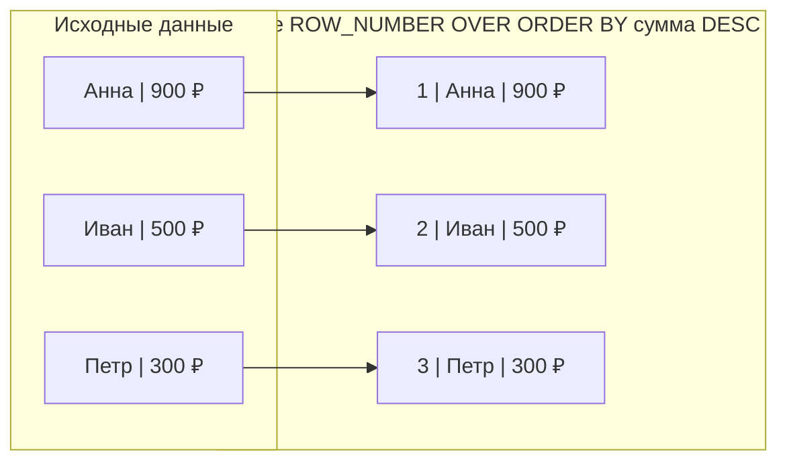

# Что делает ROW_NUMBER()?

---

## 🟢 Junior Level

**ROW_NUMBER()** — это аналитическая оконная функция SQL, которая присваивает уникальный сквозной порядковый номер (начиная с 1) каждой строке внутри заданного окна или результирующего набора данных.



### Наглядная бытовая аналогия

Представьте электронную очередь в банке:
Каждый входящий клиент нажимает кнопку на терминале и получает талон с порядковым номером: 1, 2, 3... Даже если два клиента пришли в одну секунду и хотят одну и ту же услугу, их номера талонов будут **строго уникальными** и никогда не совпадут.

### Базовый пример

```sql
-- Пронумеровать заказы от самых дорогих к самым дешёвым:
SELECT 
    id,
    user_id,
    amount,
    ROW_NUMBER() OVER (ORDER BY amount DESC) AS row_num
FROM orders;

-- Результат:
-- id | user_id | amount | row_num
-- 42 | 10      | 9500   | 1
-- 15 | 20      | 4200   | 2
-- 89 | 10      | 1500   | 3
```

### Главные практические применения
1. **Топ-N в каждой категории:** получение последних 3 заказов каждого пользователя.
2. **Дедупликация данных:** удаление повторных записей, оставляя только строку с `rn = 1`.
3. **Пагинация результатов:** нумерация строк для отображения страниц в UI.

---

## 🟡 Middle Level

### Синтаксис и разделение на партиции (PARTITION BY)

```sql
ROW_NUMBER() OVER (
    PARTITION BY group_column       -- Опционально: сброс счётчика на 1 для каждой группы
    ORDER BY sort_column [ASC|DESC] -- Обязательно: порядок присвоения номеров
)
```

#### Паттерн 1: Нахождение Топ-N записей в каждой группе (Top-N per Group)
Классическая задача собеседований: «Найти последний заказ каждого пользователя»:
```sql
WITH RankedOrders AS (
    SELECT 
        id,
        user_id,
        amount,
        created_at,
        ROW_NUMBER() OVER (
            PARTITION BY user_id 
            ORDER BY created_at DESC, id DESC
        ) AS rn
    FROM orders
)
SELECT id, user_id, amount, created_at
FROM RankedOrders
WHERE rn = 1; -- Ровно один самый свежий заказ на каждого пользователя
```

#### Паттерн 2: Дедупликация строк (Deduplication)
Удаление дубликатов с сохранением самой актуальной записи:
```sql
WITH RankedDuplicates AS (
    SELECT 
        ctid, -- Внутренний физический идентификатор строки в PostgreSQL
        ROW_NUMBER() OVER (
            PARTITION BY email 
            ORDER BY updated_at DESC, id DESC
        ) AS rn
    FROM users
)
DELETE FROM users
WHERE ctid IN (
    SELECT ctid FROM RankedDuplicates WHERE rn > 1
);
```

### Проблема недетерминизма (Non-Deterministic Ordering)

Если колонка в `ORDER BY` содержит одинаковые значения (например, одинаковое время `created_at`), стандарт SQL **не регламентирует**, какая из совпадающих строк получит номер 1, а какая 2. При повторных запусках запроса или изменении плана порядок может произвольно меняться.

```sql
-- ❌ ОПАСНО: недетерминированная нумерация
ROW_NUMBER() OVER (ORDER BY created_at DESC)

-- ✅ ЭТАЛОН: добавление первичного ключа в качестве tie-breaker (разрешения коллизий)
ROW_NUMBER() OVER (ORDER BY created_at DESC, id DESC)
```

### ROW_NUMBER() vs RANK() vs DENSE_RANK()

| Функция | Дубликаты в ключе сортировки | Пример последовательности | Назначение |
|---|---|---|---|
| **`ROW_NUMBER()`** | Присваивает уникальные номера произвольно | `1, 2, 3, 4, 5` | Сквозная нумерация, выбор топ-1 строки |
| **`RANK()`** | Одинаковые ранги + пропуск номеров | `1, 2, 2, 4, 5` | Спортивный рейтинг (две бронзы, 4-е место) |
| **`DENSE_RANK()`** | Одинаковые ранги **без** пропусков номеров | `1, 2, 2, 3, 4` | Плотный рейтинг (зарплатные вилки, грейды) |

### Проекция в Java и Spring Data JPA (Hibernate 6+)

Начиная с Hibernate 6 (Spring Boot 3+), оконная функция `ROW_NUMBER()` полностью поддерживается в HQL:

```java
// Spring Data JPA Repository с маппингом в Java Record
public record UserLatestOrderDto(Long orderId, Long userId, BigDecimal amount, Long rowNum) {}

public interface OrderRepository extends JpaRepository<Order, Long> {

    @Query("""
        SELECT new com.example.dto.UserLatestOrderDto(
            o.id, 
            o.user.id, 
            o.amount, 
            ROW_NUMBER() OVER (PARTITION BY o.user.id ORDER BY o.createdAt DESC)
        )
        FROM Order o
    """)
    List<UserLatestOrderDto> findAllOrdersWithRank();
}
```

---

## 🔴 Senior Level

### Физическая оптимизация: Исключение фазы сортировки (Sort Elimination)

Вычисление `ROW_NUMBER()` само по себе крайне дешёвое ($O(1)$ на строку — просто инкремент счётчика в узле `WindowAgg`). Главная нагрузка ложится на предварительную **сортировку** строк.

Если под запрос создан правильный B-tree индекс, узел `Sort` **полностью исключается** из плана выполнения:

```sql
-- Составной индекс, в точности покрывающий (PARTITION BY, ORDER BY)
CREATE INDEX idx_orders_user_created ON orders(user_id, created_at DESC);

EXPLAIN (ANALYZE, BUFFERS)
SELECT user_id, amount, created_at,
       ROW_NUMBER() OVER (PARTITION BY user_id ORDER BY created_at DESC) AS rn
FROM orders;

-- План выполнения:
-- WindowAgg  (cost=0.43..18500.00 rows=500000 width=24) (actual time=0.080..420.10 rows=500000 loops=1)
--   ->  Index Scan using idx_orders_user_created on orders
--       Buffers: shared hit=42150
-- ВЫВОД: Сортировка полностью отсутствует! Запрос работает со скоростью чтения индекса.
```

### Bounded Heap Sort при использовании LIMIT

Если запрос с `ROW_NUMBER()` ограничен внешним условием `rn <= K`:
```sql
SELECT * FROM (
    SELECT id, amount, ROW_NUMBER() OVER (ORDER BY amount DESC) AS rn
    FROM orders
) sub
WHERE rn <= 10;
```
Оптимизатор PostgreSQL применяет алгоритм **Bounded Heap Sort (Top-N Sort)**:
- Вместо сортировки всей таблицы на 10 млн строк строится двоичная куча размером всего в $K = 10$ элементов.
- Каждая прочитанная строка сравнивается с вершиной кучи.
- Расход оперативной памяти составляет $O(K)$ вместо $O(N)$, исключая дисковый сброс (`work_mem spill`).

### Keyset Pagination против ROW_NUMBER Pagination

В веб-приложениях частая ошибка — реализация пагинации через `ROW_NUMBER() BETWEEN 50001 AND 50020` или `LIMIT 20 OFFSET 50000`:

```sql
-- ❌ ПЛОХО ДЛЯ БОЛЬШИХ OFFSET (глубокая пагинация):
-- СУБД вынуждена прочитать, отсортировать и пронумеровать ВСЕ 50 020 строк!
SELECT * FROM (
    SELECT id, title, ROW_NUMBER() OVER (ORDER BY id) AS rn
    FROM articles
) sub
WHERE rn BETWEEN 50001 AND 50020;

-- ✅ ЭТАЛОН: Keyset Pagination (Seek Method / Cursor-based Pagination)
-- B-tree индекс мгновенно переходит к нужной ветке за O(log N)
SELECT id, title
FROM articles
WHERE id > 50000 -- ID последней статьи с предыдущей страницы
ORDER BY id ASC
LIMIT 20;
```

В Spring Data 3.1+ для этого встроен интерфейс **Keyset Scrolling (`ScrollPosition.keyset()`)**.

### Ловушка COUNT(*) OVER() в пагинированных запросах

Когда UI требует отобразить «Показаны 1–20 из 1 500 000 записей», неопытные разработчики пишут:
```sql
SELECT id, name,
       ROW_NUMBER() OVER (ORDER BY id) AS rn,
       COUNT(*) OVER () AS total_count -- ⚠️ КАТАСТРОФА!
FROM users
LIMIT 20;
```
Несмотря на наличие `LIMIT 20`, функция `COUNT(*) OVER ()` **принудительно материализует и сканирует всю таблицу целиком**, убивая производительность пагинации. Для отображения общего количества в высоконагруженных системах используют приблизительные оценки (`reltuples` из `pg_class`) или отдельный кэшированный запрос.

---

## 🎯 Шпаргалка для интервью

### Обязательно знать (Первые 30 секунд ответа)
- **Функция:** `ROW_NUMBER()` генерирует уникальный инкрементальный номер строки (1, 2, 3...) внутри окна.
- **Обязательность ORDER BY:** Секция `ORDER BY` обязательна, так как без порядка понятие «первая/вторая строка» не имеет смысла.
- **Детерминизм:** Всегда добавляйте первичный ключ (`id`) в конец `ORDER BY`, чтобы исключить плавающий порядок при совпадении значений.
- **Фильтрация:** Значение `ROW_NUMBER()` рассчитывается на этапе `SELECT`, поэтому фильтрация `WHERE rn = 1` возможна **только через подзапрос или CTE**.
- **Различие с RANK:** `ROW_NUMBER()` никогда не повторяет номера и не делает пропусков (`1, 2, 3`), в то время как `RANK()` при равенстве даёт одинаковый ранг и делает пропуски (`1, 2, 2, 4`).

### Частые уточняющие вопросы на засыпку

1. **«Как найти топ-1 заказ каждого клиента без использования оконных функций?»**
   *Ответ:* В PostgreSQL существует специализированная идиома `DISTINCT ON`:
   `SELECT DISTINCT ON (user_id) user_id, amount, created_at FROM orders ORDER BY user_id, created_at DESC;`. При наличии индекса `(user_id, created_at DESC)` она может работать даже быстрее, чем `ROW_NUMBER()`.

2. **«Почему запрос SELECT id, ROW_NUMBER() OVER() FROM t WHERE ROW_NUMBER() OVER() <= 5 падает с ошибкой?»**
   *Ответ:* Оконные функции запрещены в `WHERE` стандартом SQL. Порядок выполнения: `FROM` → `WHERE` → `GROUP BY` → `HAVING` → `SELECT (WindowAgg)`. На этапе `WHERE` оконные значения ещё физически не вычислены.

3. **«Что такое Bounded Heap Sort и когда Postgres его применяет для ROW_NUMBER?»**
   *Ответ:* Когда выборка с оконной сортировкой ограничена небольшим `LIMIT` (или фильтром во внешнем запросе `WHERE rn <= K`), Postgres использует сортировку методом ограниченной кучи: держит в оперативной памяти $K$ элементов вместо сортировки миллионов строк, экономя `work_mem`.

4. **«Почему Keyset пагинация предпочтительнее ROW_NUMBER для бесконечной ленты?»**
   *Ответ:* `ROW_NUMBER` (или `OFFSET`) требует последовательного прохода и подсчёта всех предшествующих строк $O(N)$. Keyset пагинация (`WHERE id > :lastId ORDER BY id LIMIT 20`) использует прямой поиск по B-tree индексу $O(\log N)$, работая с одинаковой скоростью как для 1-й, так и для 1 000 000-й страницы.

### Красные флаги (НЕ говорить на интервью)
- ❌ *«ROW_NUMBER возвращает одинаковые номера для строк с одинаковыми значениями»* — путаница с `RANK()` / `DENSE_RANK()`. `ROW_NUMBER()` всегда уникален.
- ❌ *«Для постраничного вывода 100 000-й страницы лучше всего пронумеровать строки через ROW_NUMBER»* — катастрофическая деградация; для глубоких смещений необходима курсорная/keyset пагинация.
- ❌ *«Сортировка для ROW_NUMBER всегда выполняется во временных файлах на диске»* — при наличии составного B-Tree индекса сортировка вообще не требуется.

### Связанные темы
- [Что делает RANK() и DENSE_RANK()](16.%20Что%20делает%20RANK()%20и%20DENSE_RANK().md) → сравнение ранжирующих функций
- [Что такое оконные функции (Window Functions)](14.%20Что%20такое%20оконные%20функции%20(Window%20Functions).md) → устройство механизма OVER
- [Что такое explain plan](20.%20Что%20такое%20explain%20plan.md) → обнаружение узлов WindowAgg и Bounded Sort
