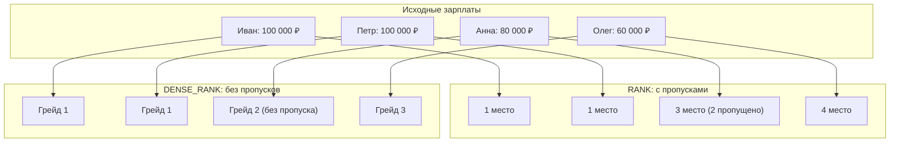

# Что делает RANK() и DENSE_RANK()?

---

## 🟢 Junior Level

**RANK()** и **DENSE_RANK()** — это аналитические оконные функции SQL, предназначенные для вычисления ранга (позиции в рейтинге) каждой строки на основе заданного порядка сортировки. Если строки имеют **одинаковые значения** ключа сортировки, обе функции присваивают им **одинаковый ранг**, но по-разному нумеруют последующие строки:

- **RANK()** — олимпийская система ранжирования с **пропуском мест**: если два участника разделили 1-е место, следующий участник получит 3-е место (место 2 пропускается: `1, 1, 3, 4`).
- **DENSE_RANK()** — плотное ранжирование без **пропусков мест**: если два участника разделили 1-е место, следующий получит 2-е место (`1, 1, 2, 3`).



### Базовый пример

```sql
SELECT 
    name,
    salary,
    ROW_NUMBER() OVER (ORDER BY salary DESC) AS row_num,
    RANK()       OVER (ORDER BY salary DESC) AS olympic_rank,
    DENSE_RANK() OVER (ORDER BY salary DESC) AS salary_dense_rank
FROM employees;

-- Результат:
-- name    | salary | row_num | olympic_rank | salary_dense_rank
-- Иван    | 100000 | 1       | 1            | 1
-- Петр    | 100000 | 2       | 1            | 1
-- Анна    | 80000  | 3       | 3            | 2   <-- Разница видна здесь!
-- Олег    | 60000  | 4       | 4            | 3
```

### Простое мнемоническое правило
- Нужна олимпийская турнирная таблица или соревнование, где важно, сколько человек было строго впереди → **`RANK()`**.
- Нужна система грейдов, тарифных разрядов, уровней цен или N-я максимальная зарплата → **`DENSE_RANK()`**.
- Нужна уникальная сквозная нумерация для пагинации или выбор ровно одной строки → **`ROW_NUMBER()`**.

---

## 🟡 Middle Level

### Сравнительный анализ поведения на одинаковых значениях (Ties)

Предположим, у нас есть набор значений с множественными совпадениями: `[100, 100, 100, 80, 60]`:

```sql
SELECT 
    score,
    ROW_NUMBER() OVER (ORDER BY score DESC) AS row_num,
    RANK()       OVER (ORDER BY score DESC) AS rank,
    DENSE_RANK() OVER (ORDER BY score DESC) AS dense_rank
FROM scores;

-- Результат:
-- score | row_num | rank | dense_rank
-- 100   | 1       | 1    | 1
-- 100   | 2       | 1    | 1
-- 100   | 3       | 1    | 1
-- 80    | 4       | 4    | 2
-- 60    | 5       | 5    | 3
```

| Критерий | `ROW_NUMBER()` | `RANK()` | `DENSE_RANK()` |
|---|---|---|---|
| **Поведение при равенстве** | Произвольно разные номера | Одинаковый ранг | Одинаковый ранг |
| **Пропуск номеров после группы равенства** | Нет | ✅ Да (размер пропуска = числу дублей - 1) | ❌ Нет (последующий ранг = текущий + 1) |
| **Связь с количеством строк** | Максимальный номер = числу строк $N$ | Максимальный ранг $\le N$ | Максимальный ранг = числу *уникальных* значений |
| **Гарантия уникальности значений** | ✅ Да (всегда строго уникален) | ❌ Нет | ❌ Нет |

### Классическая задача: Найти N-ю максимальную зарплату

На собеседованиях часто просят: «Найти сотрудников со второй по величине зарплатой в компании»:

```sql
-- ❌ ОШИБКА с LIMIT/OFFSET:
-- Если максимальную зарплату получают 3 человека, OFFSET 1 вернёт дубликат 1-го места!
SELECT salary FROM employees ORDER BY salary DESC LIMIT 1 OFFSET 1;

-- ❌ ОШИБКА с RANK():
-- Если топ-1 зарплату разделили 2 человека, ранг 2 будет отсутствовать в выдаче (пропущен)!
-- Запрос вернёт 0 строк:
WITH Ranked AS (
    SELECT salary, RANK() OVER (ORDER BY salary DESC) AS r FROM employees
)
SELECT salary FROM Ranked WHERE r = 2;

-- ✅ ЭТАЛОННОЕ РЕШЕНИЕ через DENSE_RANK():
WITH DenseRanked AS (
    SELECT 
        employee_id,
        salary,
        DENSE_RANK() OVER (ORDER BY salary DESC) AS salary_rank
    FROM employees
)
SELECT employee_id, salary
FROM DenseRanked
WHERE salary_rank = 2; -- Гарантированно вернёт всех сотрудников со 2-м уровнем зарплаты!
```

### Ловушка сортировки NULL в PostgreSQL

По стандарту SQL и в PostgreSQL значения `NULL` при сортировке считаются **больше любого не-NULL значения**:
- В `ORDER BY salary ASC` значения `NULL` по умолчанию идут **в конце** (`NULLS LAST`).
- В `ORDER BY salary DESC` значения `NULL` по умолчанию идут **в самом начале** (`NULLS FIRST`)!

```sql
-- ❌ ОПАСНО: сотрудники с salary = NULL получат 1-е место!
SELECT name, salary, RANK() OVER (ORDER BY salary DESC) AS r FROM employees;

-- ✅ ЭТАЛОН: явное указание NULLS LAST
SELECT name, salary, 
       RANK() OVER (ORDER BY salary DESC NULLS LAST) AS r 
FROM employees;
```

### Родственные статистические функции: NTILE, CUME_DIST, PERCENT_RANK

1. **`NTILE(N)`** — разбивает упорядоченное множество строк на $N$ равновеликих корзин (квартили, децили, перцентили):
   ```sql
   -- Разбить клиентов на 4 квартили по объёму покупок:
   SELECT customer_id, total_spent,
          NTILE(4) OVER (ORDER BY total_spent DESC) AS quartile
   FROM customer_totals;
   -- 1 = топ-25% самых прибыльных клиентов, 4 = наименее активные 25%
   ```

2. **`PERCENT_RANK()`** — относительный ранг строки от 0.0 до 1.0 (процент строк, находящихся строго ниже текущей):
   $$\text{PERCENT\_RANK} = \frac{\text{RANK} - 1}{N - 1}$$
   Где $N$ — общее число строк в окне.

3. **`CUME_DIST()`** — кумулятивное распределение (доля строк со значением, меньшим либо равным текущему).

### Проекция в Java и Spring Boot 3 (Hibernate 6+)

```java
// DTO Record для лидерборда игроков
public record PlayerLeaderboardDto(Long playerId, String username, Integer score, Long rank) {}

public interface PlayerRepository extends JpaRepository<Player, Long> {

    @Query("""
        SELECT new com.example.dto.PlayerLeaderboardDto(
            p.id,
            p.username,
            p.score,
            RANK() OVER (ORDER BY p.score DESC)
        )
        FROM Player p
    """)
    List<PlayerLeaderboardDto> getGlobalLeaderboard();
}
```

---

## 🔴 Senior Level

### Физическая стоимость вычисления: Peer Check и потребление ресурсов

Вычисление ранжирующих функций требует разного объёма процессорных инструкций:

1. **`ROW_NUMBER()`:** 
   - Выполняется за $O(N)$ в узле `WindowAgg`.
   - Требует только инкремента внутреннего 64-битного целочисленного счётчика для каждой строки.

2. **`RANK()`:**
   - Требует дополнительной операции **Peer Check** (проверки равенства значений).
   - СУБД сравнивает значение текущей строки с предыдущей. Если значения равны — счётчик ранга не меняется, но параллельно инкрементируется счётчик физических строк (`current_row_number`), который «выстрелит» при следующем переходе.

3. **`DENSE_RANK()`:**
   - Требует сравнения с предыдущей строкой и инкрементирует значение ранга **только** при смене значения ключа сортировки. Хранит в памяти состояние последнего уникального значения.

На объемах в 50–100 млн строк `ROW_NUMBER()` выполняется примерно в 1.5–2 раза быстрее, чем `RANK()` или `DENSE_RANK()`.

### B-Tree индексы для полного устранения фазы Sort

По аналогии с другими оконными функциями, создание составного индекса `(PARTITION BY, ORDER BY)` позволяет PostgreSQL применить план `WindowAgg -> Index Scan`, полностью избегая фазы внешней сортировки:

```sql
-- Индекс для ранжирования внутри отделов без сортировки:
CREATE INDEX idx_emp_dept_salary ON employees(department_id, salary DESC NULLS LAST);

EXPLAIN (ANALYZE, BUFFERS)
SELECT department_id, name, salary,
       DENSE_RANK() OVER (
           PARTITION BY department_id 
           ORDER BY salary DESC NULLS LAST
       ) AS dept_salary_rank
FROM employees;

-- План:
-- WindowAgg  (cost=0.43..22100.00 rows=600000 width=28) (actual time=0.040..510.20 rows=600000 loops=1)
--   ->  Index Scan using idx_emp_dept_salary on employees
-- (ВНИМАНИЕ: Сортировка отсутствует!)
```

### Честный Top-N (Fair Top-N) против недетерминированного LIMIT

В высоконагруженных системах (конкурсы, распределение бонусов, финансовые скоринги) использование `LIMIT K` является критической ошибкой бизнес-логики:

```sql
-- ❌ НЕЧЕСТНАЯ ВЫБОРКА (Unfair Top-3):
SELECT user_id, points 
FROM contest_participants 
ORDER BY points DESC 
LIMIT 3;
-- Если результаты: Иван (100), Петр (100), Анна (90), Олег (90).
-- LIMIT 3 случайно отбросит Олега, хотя его результат идентичен результату Анны!

-- ✅ ЧЕСТНЫЙ TOP-N через RANK():
WITH RankedContestants AS (
    SELECT user_id, points,
           RANK() OVER (ORDER BY points DESC) AS r
    FROM contest_participants
)
SELECT user_id, points, r
FROM RankedContestants
WHERE r <= 3;
-- Гарантированно вернёт всех 4 участников, заслуживших призовые места!
```

---

## 🎯 Шпаргалка для интервью

### Обязательно знать (Первые 30 секунд ответа)
- **Фундаментальная разница:**
  - `RANK()` присваивает одинаковый ранг равным значениям и **пропускает** последующие ранги (`1, 1, 3, 4`).
  - `DENSE_RANK()` присваивает одинаковый ранг равным значениям и **не делает пропусков** (`1, 1, 2, 3`).
  - `ROW_NUMBER()` всегда генерирует строго уникальные номера (`1, 2, 3, 4`).
- **Сортировка NULL в PostgreSQL:** По умолчанию при `DESC` значения `NULL` идут первыми (`NULLS FIRST`). Для корректного рейтинга обязательно указывать `ORDER BY ... DESC NULLS LAST`.
- **N-я зарплата:** Нахождение 2-й / N-й максимальной зарплаты всегда решается через `DENSE_RANK()`, так как `LIMIT/OFFSET` и `RANK()` ломаются на дубликатах.
- **Честный Top-N:** `RANK() <= K` возвращает всех участников с равным счетом, исключая случайное отсечение претендентов оператором `LIMIT`.

### Частые уточняющие вопросы на засыпку

1. **«Как найти 3-ю максимальную зарплату в каждом отделе?»**
   *Ответ:* Через `DENSE_RANK()` с партиционированием:
   ```sql
   WITH Ranked AS (
       SELECT department_id, employee_id, salary,
              DENSE_RANK() OVER (PARTITION BY department_id ORDER BY salary DESC NULLS LAST) AS dr
       FROM employees
   )
   SELECT * FROM Ranked WHERE dr = 3;
   ```

2. **«Почему при поиске 2-й максимальной зарплаты нельзя использовать RANK()?»**
   *Ответ:* Если две или более строк делят 1-е место (например, два сотрудника с максимальной зарплатой 500 000 ₽), функция `RANK()` присвоит им обеим ранг 1, а следующему значению — ранг 3 (пропустив 2). Условие `WHERE rank = 2` вернет пустой результат, хотя 2-й уровень зарплаты в компании существует.

3. **«В чём разница между NTILE(4) и разделением данных через предикаты WHERE?»**
   *Ответ:* `NTILE(4)` автоматически делит результирующий набор строк на 4 максимально равные по количеству строк группы (квартили) на основе их сортировки, независимо от абсолютных числовых значений колонок.

4. **«Как оптимизировать тяжелый запрос с DENSE_RANK()?»**
   *Ответ:* Созданием B-Tree индекса с точным соответствием префикса `(PARTITION BY columns, ORDER BY columns)`. Это позволяет узлу `WindowAgg` читать данные потоково без вызова блокирующего узла `Sort` в оперативной памяти.

### Красные флаги (НЕ говорить на интервью)
- ❌ *«RANK и DENSE_RANK работают одинаково, если нет дубликатов»* — формально результат совпадет, но архитектор должен сразу подчеркнуть их различное поведение на коллизиях.
- ❌ *«В PostgreSQL при сортировке DESC значения NULL оказываются в конце»* — грубая ошибка: по умолчанию в Postgres при `DESC` значения `NULL` сортируются первыми (`NULLS FIRST`).
- ❌ *«Для нахождения N-й максимальной зарплаты проще всего использовать OFFSET (N - 1)»* — фатальная ошибка на собеседовании, не учитывающая дублирование зарплат на первом месте.

### Связанные темы
- [Что делает ROW_NUMBER()](15.%20Что%20делает%20ROW_NUMBER().md) → сквозная уникальная нумерация
- [Что такое оконные функции (Window Functions)](14.%20Что%20такое%20оконные%20функции%20(Window%20Functions).md) → устройство фреймов и синтаксиса OVER
- [Что делает GROUP BY](12.%20Что%20делает%20GROUP%20BY.md) → агрегация со схлопыванием строк
