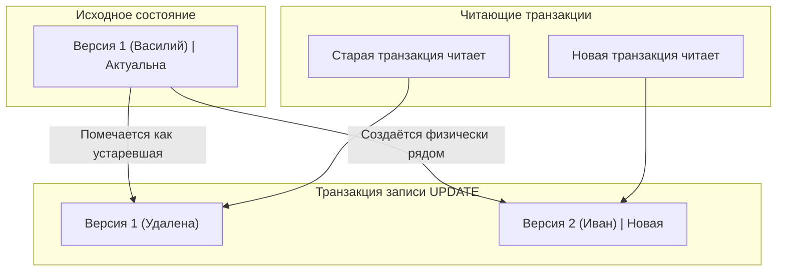

# Как работает MVCC в PostgreSQL?

---

## 🟢 Junior Level

**MVCC (Multi-Version Concurrency Control — многоверсионное управление параллелизмом)** — это архитектурный механизм PostgreSQL, позволяющий множеству транзакций одновременно читать и модифицировать одни и те же данные без взаимных блокировок.

Главный принцип MVCC: **«Читатели никогда не блокируют писателей, а писатели никогда не блокируют читателей»** (Readers never block writers, and writers never block readers).



### Наглядная бытовая аналогия

Представьте нотариальную контору с бумажными документами:
Вместо того чтобы забирать единственный оригинал договора и стирать в нём текст ластиком (блокируя доступ всем остальным клиентам), нотариус делает **новую копию** договора с правками и ставит дату вступления в силу. Старые клиенты, пришедшие раньше, продолжают изучать заверенную им версию копии, пока новая не будет официально подписана и зарегистрирована.

### В чём отличие PostgreSQL от MySQL (InnoDB) и Oracle

- **Oracle / MySQL (InnoDB):** Хранят в таблице только одну актуальную версию строки, а предыдущие версии записывают в отдельные структуры отката (**Undo Log / Undo Segments**). Если читателю нужна старая версия, она динамически собирается из Undo Log.
- **PostgreSQL:** Хранит **все версии строк (актуальные и мёртвые) непосредственно в страницах самой таблицы (Heap)**. Это ускоряет запись и упрощает архитектуру, но порождает проблему «раздувания» таблиц (**Table Bloat**) и требует периодической фоновой очистки (**VACUUM**).

---

## 🟡 Middle Level

### Системные поля кортежа: xmin, xmax и ctid

Каждая физическая строка (tuple) в таблице PostgreSQL содержит служебный заголовок (`HeapTupleHeaderData`) размером 23 байта, в котором хранятся ключевые поля видимости:

| Системное поле | Тип | Назначение |
|---|---|---|
| **`xmin`** | 32-bit XID | Идентификатор транзакции, которая **создала (INSERT)** данную версию строки |
| **`xmax`** | 32-bit XID | Идентификатор транзакции, которая **удалила (DELETE) или обновила (UPDATE)** эту строку (0, если строка жива) |
| **`t_ctid`** | `(page, offset)` | Физический указатель на текущую строку или на её новую версию (следующее звено в цепочке обновлений) |

```sql
-- Посмотреть системные поля можно в обычном SQL-запросе:
SELECT xmin, xmax, ctid, id, name FROM users WHERE id = 1;
```

### Механика UPDATE: DELETE + INSERT

В архитектуре PostgreSQL команда `UPDATE` не перезаписывает байты на диске «по месту» (in-place):
1. **Старая версия строки:** Поле `xmax` заполняется номером текущей транзакции (строка логически помечается удалённой).
2. **Новая версия строки:** Вставляется как абсолютно новая физическая запись с новым `xmin` (равным текущему XID) и `xmax = 0`.
3. Указатель `ctid` старой строки перенаправляется на физический адрес новой строки.

```
+--------------------------------------------------------------------------+
| Страница таблицы (Heap Page)                                            |
|                                                                          |
| [Tuple 1] xmin: 100, xmax: 105, ctid: (0, 2), data: "Ivan" (МЁРТВАЯ)     |
|              │                                                           |
|              ▼ (ctid указывает на новую версию)                          |
| [Tuple 2] xmin: 105, xmax: 0,   ctid: (0, 2), data: "Petr" (ЖИВАЯ)       |
+--------------------------------------------------------------------------+
```

### Снимок данных (Snapshot) и правила видимости

В момент выполнения оператора (в режиме `READ COMMITTED`) или в момент старта транзакции (в режиме `REPEATABLE READ`) PostgreSQL формирует снимок видимости (**Snapshot**):

$$\text{Snapshot} = \text{xmin} : \text{xmax} : [\text{xip\_list}]$$

- **`snapshot.xmin`:** Минимальный XID незавершённых транзакций. Все транзакции с $\text{XID} < \text{snapshot.xmin}$ гарантированно зафиксированы, их строки видны.
- **`snapshot.xmax`:** Первый ещё не выданный XID на момент создания снимка. Все транзакции с $\text{XID} \ge \text{snapshot.xmax}$ начались позже, их строки **не видны**.
- **`xip_list`:** Список идентификаторов транзакций, которые были активны (IN PROGRESS) в момент снятия снимка. Их изменения не видны.

### Опаснейшая ловушка в Java / Spring Boot: Удержание транзакции

Среди backend-разработчиков на Spring Framework распространена критическая ошибка: отправка внешних HTTP-запросов внутри метода с аннотацией `@Transactional`:

```java
// ❌ АНТИПАТТЕРН ДЛЯ POSTGRESQL MVCC:
@Service
public class OrderService {

    @Transactional
    public void processPayment(Long orderId) {
        Order order = orderRepository.findById(orderId).orElseThrow();
        order.setStatus(OrderStatus.PROCESSING);
        orderRepository.save(order); // UPDATE -> xmin зафиксирован

        // ⚠️ ДОЛГИЙ ВНЕШНИЙ HTTP ВЫЗОВ (например, 10-30 секунд):
        paymentGatewayClient.chargeCreditCard(order.getAmount());

        order.setStatus(OrderStatus.PAID);
        orderRepository.save(order);
    }
}
```

**Катастрофические последствия для PostgreSQL:**
1. Транзакция в Java остаётся открытой в течение 30 секунд.
2. В PostgreSQL её XID является старейшим активным (`oldest active xmin`).
3. **VACUUM блокируется:** фоновый процесс очистки не может удалить ни одну мёртвую строку во всей базе данных, пока жива эта транзакция!
4. В высоконагруженной системе это приводит к взрывному раздуванию таблиц (Table Bloat) на десятки гигабайт и исчерпанию пула соединений (HikariCP).

---

## 🔴 Senior Level

### Hint Bits: Устранение узкого места проверки статуса транзакций

При каждом чтении строки PostgreSQL обязан знать: зафиксирована ли транзакция `xmin` или была откатана?
Статусы транзакций хранятся в специальном массиве **CLOG (`pg_xact`)**. Чтение с диска или поиск в разделяемой памяти CLOG на миллионах строк породили бы катастрофические накладные расходы.

Для решения проблемы используются **Hint Bits** (биты-подсказки в заголовке `t_infomask` строки):
- `HEAP_XMIN_COMMITTED` / `HEAP_XMIN_INVALID` (откат)
- `HEAP_XMAX_COMMITTED` / `HEAP_XMAX_INVALID`

```
Механизм Lazy Hinting:
1. Первый читатель проверяет статус xmin в pg_xact (CLOG).
2. Читатель взводит бит HEAP_XMIN_COMMITTED прямо в заголовке строки на странице памяти.
3. Все последующие читатели мгновенно проверяют бит t_infomask без обращения к CLOG.
```

> [!NOTE]
> Простановка Hint Bits генерирует «грязные» страницы памяти (`dirty pages`). По этой причине даже обычный `SELECT` в PostgreSQL может вызывать дисковую запись при сбросе страниц фоновым процессом Checkpointer!

### HOT (Heap-Only Tuples): Спасение от раздувания индексов

При обычном `UPDATE` создаётся новая строка, что требует создания новых записей во **всех индексах** таблицы, даже если проиндексированные колонки не изменялись!

Оптимизация **HOT** исключает обновление индексов, если выполняются два условия:
1. Ни одна из обновляемых колонок **не входит ни в один индекс**.
2. На **той же самой странице памяти Heap** достаточно свободного места для размещения новой версии строки.

Вместо добавления записей в B-tree, старая строка связывается с новой через внутренний указатель `ctid` внутри одной страницы. Индекс продолжает указывать на корневую строку цепочки (`root tuple`).

```sql
-- Чтобы гарантировать место для HOT-обновлений, настраивают fillfactor:
ALTER TABLE orders SET (fillfactor = 75);
-- Оставляет 25% свободного места на каждой странице для новых версий строк
```

### Проблема переполнения XID (Transaction ID Wraparound)

В PostgreSQL идентификатор транзакции `XID` представляет собой 32-битное беззнаковое целое число ($2^{32} \approx 4.29$ млрд значений).
Для определения того, какая транзакция была раньше, используется кольцевая арифметика по модулю $2^{32}$: транзакции из первой половины круга (2 млрд) считаются прошлыми, а из второй — будущими.

**Угроза Wraparound:**
Если счётчик транзакций сделает полный оборот и превысит 2 миллиарда, старейшие исторические строки внезапно окажутся «в будущем» и станут **невидимыми**, что означает потерю данных.

**Механизм защиты (Freezing):**
Фоновый процесс `autovacuum` находит строки старше порога `vacuum_freeze_min_age` и выставляет специальный флаг `HEAP_XMIN_FROZEN` (`FrozenTransactionId = 2`). Замороженные строки трактуются как совершённые в бесконечно далёком прошлом и видны абсолютно всем транзакциям.

```sql
-- Мониторинг приближения к катастрофе Wraparound:
SELECT datname, age(datfrozenxid), 
       ROUND(100.0 * age(datfrozenxid) / 2147483648, 2) AS percent_towards_wraparound
FROM pg_database
ORDER BY age(datfrozenxid) DESC;
-- Если показатель превышает 75% (1.5 млрд) — требуется экстренное вмешательство!
-- При достижении 2 млрд PostgreSQL принудительно выключается и переходит в режим READ-ONLY аварийного восстановления.
```

### Visibility Map (Карта видимости)

Для каждого файла таблицы PostgreSQL поддерживает битовую карту **Visibility Map (`_vm`)**:
- **All-visible бит:** означает, что на странице таблицы абсолютно все строки видимы всем текущим и будущим транзакциям (нет ни одной мёртвой версии).
  - Это позволяет выполнять **Index Only Scan**: СУБД считывает данные напрямую из индекса, не обращаясь к Heap-страницам для проверки MVCC-видимости.
- **All-frozen бит:** означает, что все строки на странице заморожены (позволяет `autovacuum` пропускать страницу при поиске XID для заморозки).

---

## 🎯 Шпаргалка для интервью

### Обязательно знать (Первые 30 секунд ответа)
- **Суть:** MVCC в PostgreSQL обеспечивает параллельный доступ: читатели не блокируют писателей, а писатели не блокируют читателей.
- **Архитектура Heap:** В отличие от MySQL/Oracle с Undo Log, Postgres хранит все версии строк прямо в страницах таблицы (Heap).
- **Системные атрибуты:** Каждая строка содержит `xmin` (XID создателя) и `xmax` (XID удалившего/обновившего).
- **UPDATE:** Физически выполняется как `DELETE` старой версии + `INSERT` новой версии.
- **Очистка и Bloat:** Мёртвые строки (`dead tuples`) удаляются фоновым процессом `VACUUM`. Длинные транзакции удерживают старейший XID и блокируют очистку, вызывая раздувание таблиц.
- **HOT (Heap-Only Tuples):** Оптимизация `UPDATE`, позволяющая создавать версию строки на той же странице без перестройки индексов.

### Частые уточняющие вопросы на засыпку

1. **«Почему в PostgreSQL операция SELECT может вызывать физическую запись на диск (dirty buffers)?»**
   *Ответ:* Из-за механизма **Hint Bits**: первый читатель, проверивший статус транзакции `xmin/xmax` через CLOG, проставляет биты `HEAP_XMIN_COMMITTED` в заголовке строки. Страница в Shared Buffers становится «грязной» и сбрасывается на диск фоновым процессом Checkpointer.

2. **«Что произойдет, если база приблизится к лимиту 2 млрд транзакций без автовакуума?»**
   *Ответ:* Произойдет Transaction ID Wraparound. Чтобы предотвратить потерю видимости данных из-за кольцевой 32-битной арифметики, PostgreSQL принудительно перейдет в режим аварийной защиты: откажется принимать любые пишущие транзакции и потребует запуска `VACUUM FREEZE` в однопользовательском режиме.

3. **«Как длинный HTTP-вызов внутри @Transactional в Java может уронить всю базу данных PostgreSQL?»**
   *Ответ:* Долгая транзакция держит `xmin`, становясь якорем видимости (`oldestActiveXid`). Фоновый `autovacuum` не имеет права удалять мёртвые строки, созданные после старта этой транзакции во всей СУБД. Накопление миллионов мёртвых строк приводит к раздуванию таблиц (Bloat), деградации кэша и переполнению диска.

4. **«Как работает Index Only Scan в контексте MVCC?»**
   *Ответ:* Индексы B-tree не содержат полей `xmin/xmax`. Чтобы не обращаться к куче (Heap) за проверкой видимости каждой найденной строки, планировщик проверяет **Visibility Map**: если страница помечена битом `all-visible`, строка гарантированно видна, и обращение к Heap исключается (`Heap Fetches: 0`).

### Красные флаги (НЕ говорить на интервью)
- ❌ *«В PostgreSQL старые версии строк переносятся в Undo Log или rollback-сегменты»* — фундаментальная ошибка: в Postgres нет Undo Log, все версии лежат в общей куче (Heap).
- ❌ *«VACUUM уменьшает физический размер файла таблицы на диске и возвращает память ОС»* — нет, стандартный `VACUUM` только освобождает место внутри страниц для переиспользования новыми строками. Для сжатия файла нужен `VACUUM FULL` или утилита `pg_repack`.
- ❌ *«autovacuum можно безбоязненно отключить на проде для снижения нагрузки на CPU»* — фатальная ошибка, гарантированно приводящая к параличу СУБД из-за Transaction ID Wraparound.
- ❌ *«Порядок сортировки NULL по умолчанию одинаков для ASC и DESC»* — нет: при `ASC` значения NULL идут последними, а при `DESC` — первыми (`NULLS FIRST`).

### Связанные темы
- [Что такое VACUUM в PostgreSQL](18.%20Что%20такое%20VACUUM%20в%20PostgreSQL.md) → очистка мёртвых строк и борьба с Bloat
- [Зачем нужен ANALYZE](19.%20Зачем%20нужен%20ANALYZE.md) → обновление статистики планировщика
- [Для чего нужны индексы](1.%20Для%20чего%20нужны%20индексы.md) → HOT-обновления и Visibility Map
