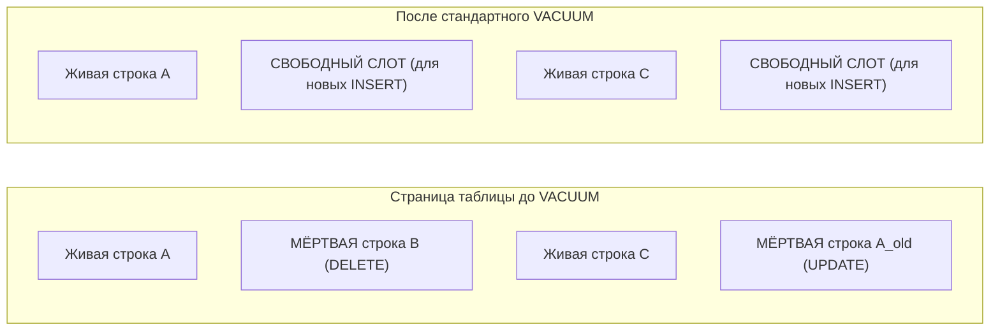

# Что такое VACUUM в PostgreSQL?

---

## 🟢 Junior Level

**VACUUM** — это служебный процесс СУБД PostgreSQL, отвечающий за сборку мусора: он находит и помечает для повторного использования «мёртвые» версии строк (**dead tuples**), которые образовались в страницах таблицы после выполнения операций `UPDATE` и `DELETE`.



### Наглядная бытовая аналогия

Представьте гостиничный номер с магнитными ключами:
Когда постоялец выписывается из номера (`DELETE`), номер физически не сносится бульдозером. Горничная (**VACUUM**) приходит, убирает постель и вешает табличку «Номер свободен для заселения». Физический размер здания отеля на улице не уменьшился, но в освободившиеся номера можно селить новых гостей (`INSERT`).

### Зачем нужен VACUUM
1. **Предотвращение раздувания таблиц (Table Bloat):** В PostgreSQL `UPDATE` не перезаписывает старую запись, а создаёт новую. Без очистки размер файлов базы данных рос бы бесконечно.
2. **Заморозка XID (Freezing):** Защита от переполнения 32-битного счетчика транзакций (Transaction ID Wraparound).
3. **Обновление карт видимости (Visibility Map):** Позволяет ускорять `Index Only Scan`.

### Стандартный VACUUM vs VACUUM FULL

```sql
-- 1. Стандартный VACUUM (безопасен для продакшена):
VACUUM users;
-- Освобождает место внутри страниц таблицы, НЕ блокирует чтение и запись.
-- НЕ уменьшает физический размер файла на диске (место операционной системе НЕ возвращается).

-- 2. Полный VACUUM FULL (блокирующий):
VACUUM FULL users;
-- Пересоздаёт файл таблицы с нуля, сжимая данные и возвращая свободные гигабайты ОС.
-- ⚠️ ВНИМАНИЕ: Накладывает полную эксклюзивную блокировку (AccessExclusiveLock). 
-- Все SELECT, INSERT, UPDATE к таблице наглухо блокируются на всё время работы!
```

---

## 🟡 Middle Level

### Жизненный цикл мёртвых строк под капотом

В архитектуре PostgreSQL удалённые строки не стираются мгновенно, потому что другие параллельные транзакции могут всё ещё читать их в рамках своего снимка видимости (Snapshot).

Только когда **завершаются все транзакции**, чей `xmin` старше момента удаления строки, `VACUUM` получает право перевести строку в статус пригодной для повторного использования:

```
Фазы работы VACUUM:
1. Scanning Heap: Сканирование страниц таблицы (пропуская All-Visible страницы по Visibility Map).
2. Vacuuming Indexes: Удаление ссылок на мёртвые строки из всех B-Tree индексов таблицы.
3. Vacuuming Heap: Очистка указателей на странице таблицы (маркировка LP_DEAD -> LP_UNUSED).
4. Truncating: (Опционально) Отрезание пустых страниц с самого конца файла и возврат их ОС.
```

### Как работает Autovacuum

PostgreSQL оснащён фоновым демоном `autovacuum`, который периодически просыпается (каждые `autovacuum_naptime`, по умолчанию 1 мин) и запускает очистку для таблиц, превысивших математический порог:

$$\text{Порог запуска} = \text{autovacuum\_vacuum\_threshold} + (\text{autovacuum\_vacuum\_scale\_factor} \times \text{reltuples})$$

```ini
# Настройки по умолчанию в postgresql.conf:
autovacuum_vacuum_threshold = 50       # Базовый порог: 50 мёртвых строк
autovacuum_vacuum_scale_factor = 0.2    # Коэффициент: 20% от общего числа строк
```

**Проблема масштаба на больших таблицах:**
- Таблица на 1 000 строк: $50 + (0.2 \times 1000) = \mathbf{250}$ мёртвых строк для старта.
- Таблица на 50 000 000 строк: $50 + (0.2 \times 50\,000\,000) = \mathbf{10\,000\,050}$ мёртвых строк!
На огромных таблицах дефолтный `autovacuum` запустится лишь тогда, когда в таблице скопится 10 млн мёртвых строк. К этому моменту таблица раздуется на десятки гигабайт!

**Решение — тонкая настройка для горячих таблиц:**
```sql
ALTER TABLE orders SET (
    autovacuum_vacuum_scale_factor = 0.02, -- Запуск при 2% мёртвых строк вместо 20%
    autovacuum_vacuum_cost_limit = 1000,   -- Увеличение квоты I/O для ускорения
    autovacuum_vacuum_cost_delay = 2       -- Минимальная пауза
);
```

### Причины блокировки VACUUM со стороны Java / Spring приложений

Даже идеально настроенный `autovacuum` оказывается бессилен перед типичными ошибками backend-разработки:

1. **Долгие транзакции с внешними HTTP/RPC вызовами:**
   Если метод `@Transactional` выполняет сетевые запросы или долгую бизнес-логику на 5 минут, он держит открытым свой `xmin`. `VACUUM` не имеет права очищать строки, изменённые после старта этой транзакции, во **всей базе данных**.
2. **Пакетная обработка данных (Batch Processing) без коммитов:**
   Обработка 1 млн записей в цикле `saveAll()` внутри одного гигантского `@Transactional` метода порождает миллионы `dead tuples`, которые невозможно вычистить до завершения всего пакета.
   *Решение:* Использование разбивки на чанки (Chunk-oriented processing) в Spring Batch с коммитом каждые 500–1000 записей.
3. **Забытые сессии в пуле соединений (Leaked Connections):**
   Соединение, взятое из пула HikariCP без закрытия транзакции (`idle in transaction`), останавливает очистку базы.

---

## 🔴 Senior Level

### Cost-based Vacuuming: Защита дисковой подсистемы от I/O троттлинга

Если запустить `VACUUM` на терабайтной таблице на полную мощность, он монополизирует дисковую подсистему, вызвав лавинообразный рост задержек (Latency Spikes) пользовательских запросов.

PostgreSQL решает это с помощью **Cost-based алгоритма**:
Каждому действию присваивается условная «стоимость»:
- Чтение страницы из Shared Buffers (`vacuum_cost_page_hit`): **1**
- Чтение страницы из ОС/кэша ядра (`vacuum_cost_page_miss`): **2**
- Чтение «холодной» страницы с диска (`vacuum_cost_page_dirty`): **20**

Когда сумма затрат воркера достигает лимита **`autovacuum_vacuum_cost_limit`** (по умолчанию 200), воркер засыпает на время **`autovacuum_vacuum_cost_delay`** (по умолчанию 2 мс).

```
На NVMe SSD дисках дефолтный лимит 200 приводит к тому, что VACUUM работает мучительно 
медленно, не успевая за входящим потоком UPDATE. 
На современных серверах cost_limit безопасно поднимают до 2000-5000.
```

### Борьба с раздуванием без простоев: утилита pg_repack

Поскольку `VACUUM FULL` требует монопольной блокировки `AccessExclusiveLock`, его запуск на боевых базах недопустим. В production-инфраструктуре для возврата места ОС применяют расширение **`pg_repack`**:

```mermaid
graph TD
    A["Основная таблица T"] -->|1. Чтение данных| B["Новая таблица T_new (Компактная)"]
    A -->|2. Триггер перехватывает новые INSERT/UPDATE| L["Лог изменений"]
    B -->|3. Применение изменений из лога| B
    B -->|4. Мгновенный SWAP таблиц (AccessExclusive на доли секунды)| A_final["Компактная таблица T"]
```

`pg_repack` копирует данные в новую таблицу, отслеживает изменения через временные триггеры, накладывает блокировку всего на доли секунды для подмены файлов и удаляет старую раздутую таблицу.

### Защита от Transaction ID Wraparound (Anti-Wraparound VACUUM)

Когда возраст старейшей незамороженной транзакции в базе `age(datfrozenxid)` превышает параметр `autovacuum_freeze_max_age` (по умолчанию 200 млн транзакций), PostgreSQL переводит `autovacuum` в **аварийный агрессивный режим**:
- Воркер невозможно отменить командой `pg_cancel_backend()`.
- Игнорируются настройки `cost_delay` — воркер работает с максимальной скоростью диска.
- Если возраст превышает 1.5 млрд, в лог сыплются панические предупреждения, а при приближении к 2 млрд PostgreSQL аварийно останавливает сервер, требуя запуска `VACUUM FREEZE` в режиме `Single-User Mode`.

### Параллельный VACUUM индексов (PostgreSQL 13+)

Начиная с PostgreSQL 13, доступна параллельная очистка индексов:
```sql
VACUUM (PARALLEL 4, VERBOSE) large_table;
```
Если у таблицы 5 индексов, PostgreSQL задействует до 4 параллельных воркеров, каждый из которых очищает ссылки на мёртвые кортежи в своём индексе независимо.

### Мониторинг прогресса через системные представления

```sql
-- 1. Мониторинг активного процесса VACUUM в реальном времени (PG 12+):
SELECT 
    p.pid,
    c.relname,
    p.phase,
    p.heap_blks_scanned,
    p.heap_blks_vacuumed,
    ROUND(100.0 * p.heap_blks_scanned / NULLIF(p.heap_blks_total, 0), 2) AS progress_pct
FROM pg_stat_progress_vacuum p
JOIN pg_class c ON c.oid = p.relid;

-- 2. Поиск зависших транзакций, блокирующих очистку:
SELECT pid, usename, now() - xact_start AS xact_duration, state, query
FROM pg_stat_activity
WHERE (state = 'idle in transaction' OR state = 'active')
  AND xact_start < now() - INTERVAL '15 minutes'
ORDER BY xact_start ASC;
```

---

## 🎯 Шпаргалка для интервью

### Обязательно знать (Первые 30 секунд ответа)
- **Функция:** `VACUUM` удаляет мёртвые версии строк (`dead tuples`), оставшиеся после `UPDATE` и `DELETE`, освобождая место внутри страниц для будущих `INSERT`.
- **Возврат места ОС:** Стандартный `VACUUM` **не уменьшает** размер файла таблицы на диске (он переиспользует блоки внутри файла). Физически сжать файл может только `VACUUM FULL` или `pg_repack`.
- **Блокировки:** `VACUUM` работает параллельно с `SELECT/INSERT/UPDATE`. `VACUUM FULL` берёт тяжелый `AccessExclusiveLock`, блокируя все операции к таблице.
- **Autovacuum:** Автоматический фоновый демон; запускается по формуле `threshold + scale_factor * rows`.
- **Критическая опасность:** Долгие транзакции блокируют `VACUUM`, приводя к раздуванию таблиц (Bloat) и риску аварийного отключения СУБД из-за Transaction ID Wraparound.

### Частые уточняющие вопросы на засыпку

1. **«Почему после массового DELETE на 10 млн строк размер файла таблицы на диске не уменьшился даже после запуска VACUUM?»**
   *Ответ:* Стандартный `VACUUM` помечает кортежи как `LP_UNUSED` внутри страниц кучи, формируя свободные слоты для новых записей, но не дефрагментирует файл и не возвращает страницы операционной системе (за исключением редких случаев, когда абсолютно пустыми оказываются страницы в самом хвосте файла). Для физического сжатия требуется `pg_repack` или `VACUUM FULL`.

2. **«Как Java-разработчик может непреднамеренно сломать autovacuum во всей БД?»**
   *Ответ:* Оставив открытую транзакцию на длительное время (например, медленный HTTP-вызов внутри `@Transactional` или зависшая сессия в HikariCP). Такой процесс держит минимальный `xmin`, а `autovacuum` не имеет права удалять ни одну мёртвую строку, появившуюся после старта этой транзакции, что приводит к раздуванию всех активно изменяемых таблиц в кластере.

3. **«Что такое Cost-based VACUUM и почему autovacuum часто не успевает за нагрузкой на современных SSD?»**
   *Ответ:* Это механизм троттлинга I/O: при накоплении лимита условной стоимости дисковых операций (`cost_limit`) воркер принудительно засыпает на `cost_delay` (2 мс). Дефолтные настройки (limit=200) рассчитывались на старые HDD; на быстрых NVMe дисках воркер тратит больше времени на сон, чем на работу, и его квоту нужно поднимать до 2000–5000.

4. **«Как работает утилита pg_repack и почему она безопаснее VACUUM FULL?»**
   *Ответ:* `pg_repack` переносит данные в новую таблицу в фоновом режиме, фиксируя входящие изменения через триггеры лога. В конце процесса блокировка `AccessExclusiveLock` берётся лишь на сотые доли секунды для атомарной подмены OID таблиц в каталоге, что исключает даунтайм сервиса.

### Красные флаги (НЕ говорить на интервью)
- ❌ *«VACUUM стирает строки с диска и уменьшает размер базы данных в операционной системе»* — грубейшая ошибка; стандартный VACUUM не возвращает дисковое пространство ОС.
- ❌ *«Чтобы освободить место, можно периодически ночью запускать скрипт с VACUUM FULL по крону»* — опаснейшая практика: блокирует доступ к таблицам, а при разрыве соединения может оставить раздутый файл.
- ❌ *«autovacuum можно отключить в продакшене для экономии ресурсов»* — прямая дорога к остановке всей базы данных из-за Transaction ID Wraparound.

### Связанные темы
- [Как работает MVCC в PostgreSQL](17.%20Как%20работает%20MVCC%20в%20PostgreSQL.md) → создание мёртвых версий строк и Visibility Map
- [Зачем нужен ANALYZE](19.%20Зачем%20нужен%20ANALYZE.md) → параллельный сбор статистики
- [Как оптимизировать медленные запросы](21.%20Как%20оптимизировать%20медленные%20запросы.md) → влияние Table Bloat на кэш и Index Scans
