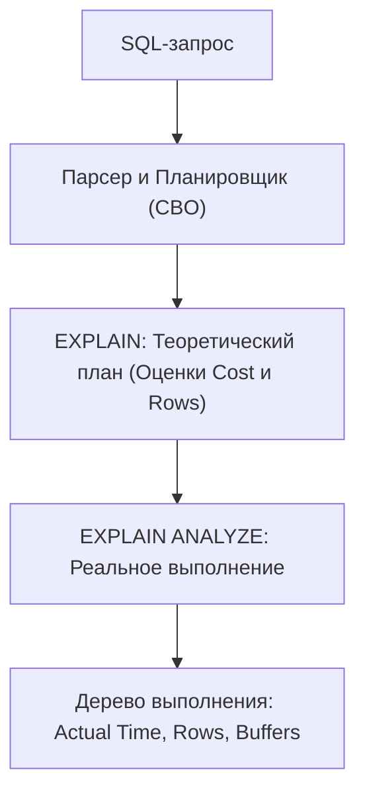

# Что такое explain plan?

---

## 🟢 Junior Level

**EXPLAIN** — это команда PostgreSQL, которая показывает **план выполнения SQL-запроса**: последовательность операций, алгоритмов и индексов, которые стоимостной оптимизатор (CBO) выбрал для извлечения данных, **без фактического выполнения самого запроса**.

**EXPLAIN ANALYZE** — реально **выполняет** запрос на сервере и сопоставляет теоретические прогнозы оптимизатора с фактическим временем и реальным количеством возвращённых строк.



### Наглядная бытовая аналогия

Представьте навигатор в автомобиле:
- **Обычный EXPLAIN:** Навигатор показывает маршрут на экране: «Поедем по шоссе M-11, расстояние 400 км, расчетное время в пути — 4 часа». Вы ещё стоите в гараже, бензин не тратится.
- **EXPLAIN ANALYZE:** Вы садитесь за руль и **реально проезжаете этот маршрут** с секундомером. На финише навигатор сообщает: «Фактическое время в пути составило 4 часа 35 минут, сожжено 38 литров топлива».

### Базовый пример

```sql
EXPLAIN SELECT * FROM users WHERE email = 'alex@example.com';

-- Результат:
-- Index Scan using idx_users_email on users  (cost=0.42..8.44 rows=1 width=72)
--   Index Cond: (email = 'alex@example.com'::text)
```

### Что означают базовые метрики
- **`cost=0.42..8.44`:** Теоретическая стоимость в условных единицах:
  - `0.42` — **Startup Cost:** Затраты до получения самой первой строки.
  - `8.44` — **Total Cost:** Затраты на получение всех строк результата.
- **`rows=1`:** Ожидаемое планировщиком количество строк (прогноз кардинальности).
- **`width=72`:** Средний размер одной возвращаемой строки в байтах.

---

## 🟡 Middle Level

### Разбор полного вывода EXPLAIN (ANALYZE, BUFFERS)

Для профессиональной диагностики медленных запросов всегда используется комбинация флагов `ANALYZE, BUFFERS`:

```sql
EXPLAIN (ANALYZE, BUFFERS, SETTINGS)
SELECT u.name, COUNT(o.id) AS orders_count
FROM users u
LEFT JOIN orders o ON u.id = o.user_id
WHERE u.city = 'Moscow'
GROUP BY u.name;
```

```text
QUERY PLAN:
HashAggregate  (cost=12540.00..12550.00 rows=1000 width=40) (actual time=45.210..47.340 rows=850 loops=1)
  Group Key: u.name
  Batches: 1  Memory Usage: 120kB
  Buffers: shared hit=4210 read=180
  ->  Hash Right Join  (cost=3500.00..11800.00 rows=120000 width=36) (actual time=12.100..38.450 rows=115000 loops=1)
        Hash Cond: (o.user_id = u.id)
        Buffers: shared hit=3800 read=180
        ->  Seq Scan on orders o  (cost=0.00..6500.00 rows=350000 width=8) (actual time=0.015..15.200 rows=350000 loops=1)
              Buffers: shared hit=2500
        ->  Hash  (cost=3200.00..3200.00 rows=24000 width=32) (actual time=10.150..10.150 rows=23500 loops=1)
              Buckets: 32768  Batches: 1  Memory Usage: 1520kB
              Buffers: shared hit=1300 read=180
              ->  Bitmap Heap Scan on users u  (cost=420.00..3200.00 rows=24000 width=32) (actual time=2.100..7.800 rows=23500 loops=1)
                    Recheck Cond: (city = 'Moscow'::text)
                    Rows Removed by Index Recheck: 0
                    Buffers: shared hit=1300 read=180
                    ->  Bitmap Index Scan on idx_users_city  (cost=0.00..414.00 rows=24000 width=0) (actual time=1.850..1.850 rows=23500 loops=1)
                          Index Cond: (city = 'Moscow'::text)
                          Buffers: shared hit=45
Planning Time: 0.420 ms
Execution Time: 48.110 ms
```

### Как читать дерево плана (снизу вверх и по отступам)

1. **Самый глубокий узел выполняется первым:**
   - `Bitmap Index Scan on idx_users_city` быстро собирает битовую карту страниц в памяти (1.85 мс).
   - `Bitmap Heap Scan on users u` читает физические страницы кучи по битовой карте (7.8 мс).
2. **Операция Hash:** 23 500 москвичей помещаются в оперативную хэш-таблицу размером 1.5 МБ.
3. **Seq Scan on orders:** Сканируются заказы.
4. **Hash Right Join:** Заказы сопоставляются с хэш-таблицей пользователей по `user_id`.
5. **HashAggregate:** Финальная группировка по имени.
6. **Execution Time:** Общее время составило 48.1 мс.

### Анализ дискового ввода-вывода через BUFFERS

Метрика `Buffers` показывает реальную работу с памятью:
- **`shared hit`:** Страницы памяти (по 8 КБ), прочитанные прямо из оперативной памяти (**Shared Buffers**). Это наносекундные операции.
- **`shared read`:** Страницы, которых не оказалось в Shared Buffers, и СУБД запросила их у операционной системы / диска. Миллисекундные задержки!
- **`shared written / temp written`:** Сброс «грязных» страниц или временных файлов на диск (сигнал о переполнении памяти `work_mem`).

$$\text{Cache Hit Ratio} = \frac{\text{shared hit}}{\text{shared hit} + \text{shared read}} \times 100\%$$
В идеале показатель Cache Hit Ratio для OLTP-запросов должен превышать **99%**.

---

## 🔴 Senior Level

### Проблема Generic vs Custom Plan в Java / JDBC приложениях

Один из сложнейших багов производительности в корпоративных Spring Boot системах:
**В консоли psql запрос выполняется за 5 мс, а из Java-приложения через Hibernate тот же запрос зависает на 5 секунд!**

```
Причина: Поведение PostgreSQL JDBC Driver (pgjdbc) и preparedThreshold
```

1. Драйвер `pgjdbc` по умолчанию использует параметр `prepareThreshold = 5`.
2. **Первые 4 выполнения:** Драйвер подставляет параметры и строит **Custom Plan** (оптимизатор знает точные значения `$1 = 42` и использует индекс).
3. **На 5-е выполнение:** Драйвер переключается на серверный `PREPARE` и строит **Generic Plan** (универсальный для любого возможного аргумента).
4. Если данные в таблице распределены неравномерно (Data Skew):
   - Для конкретного ID существует 2 строки (выгоден `Index Scan`).
   - Но в среднем на ID приходится 200 000 строк.
   - Планировщик выбирает «усреднённый безопасный» Generic Plan — **`Seq Scan`**!

```sql
-- Диагностика и принудительное управление через plan_cache_mode:
SET plan_cache_mode = 'force_custom_plan'; -- Запретить Generic планы для текущей сессии

-- В настройках JDBC URL для Spring Boot:
-- jdbc:postgresql://localhost:5432/mydb?prepareThreshold=0
-- (0 отключает создание server-side generic prepared statements)
```

### Захват реальных планов запросов Hibernate и Spring Data

Для выявления медленных запросов в Java-приложениях применяются следующие архитектурные подходы:

1. **Proxy-драйверы (DataSource-Proxy / P6Spy):** Логируют реальный скомпилированный SQL с подставленными параметрами, который можно скопировать и запустить через `EXPLAIN (ANALYZE, BUFFERS)`.
2. **Расширение `auto_explain` в PostgreSQL:**
   Автоматически пишет в системный лог PostgreSQL планы выполнения любых запросов, превысивших заданный порог длительности:
   ```ini
   # postgresql.conf
   shared_preload_libraries = 'auto_explain'
   auto_explain.log_min_duration = '200ms' # Логировать всё, что дольше 200 мс
   auto_explain.log_analyze = true
   auto_explain.log_buffers = true
   auto_explain.log_nested_statements = true # Логировать запросы из хранимых процедур
   ```

### Опасность DML с флагом ANALYZE: Непреднамеренное удаление данных

> [!CAUTION]
> Команда `EXPLAIN ANALYZE` **РЕАЛЬНО ВЫПОЛНЯЕТ ЗАПРОС**! 
> Если запустить её для команд `UPDATE`, `DELETE` или `INSERT`, данные в базе будут **безвозвратно изменены или удалены**!

```sql
-- ❌ КАТАСТРОФА НА ПРОДЕ:
EXPLAIN ANALYZE DELETE FROM users WHERE active = false;
-- Все неактивные пользователи физически удалены из базы данных!

-- ✅ БЕЗОПАСНЫЙ ЭТАЛОН: Оборачивание в транзакцию с ROLLBACK
BEGIN;
EXPLAIN (ANALYZE, BUFFERS) 
DELETE FROM users WHERE active = false;
ROLLBACK; -- Данные возвращаются на место, транзакция отменена!
```

### JIT-компиляция (Just-In-Time) и OLTP-запросы

Начиная с PostgreSQL 11, планировщик использует LLVM для JIT-компиляции сложных SQL-выражений в машинный код.
В блоке EXPLAIN появляется секция:
```text
JIT:
  Functions: 12
  Options: Inlining true, Optimization true, Expressions true
  Timing: Generation 3.210 ms, Inlining 4.120 ms, Optimization 8.450 ms, Emission 5.120 ms, Total 20.900 ms
```

**Ловушка JIT:**
На компиляцию JIT потратил **20.9 мс**, тогда как само выполнение запроса заняло 0.8 мс!
Для OLTP-приложений с короткими точечными транзакциями JIT часто является паразитной нагрузкой. Его отключают глобально или сессионно: `SET jit = off;`.

---

## 🎯 Шпаргалка для интервью

### Обязательно знать (Первые 30 секунд ответа)
- **EXPLAIN:** Показывает теоретический план планировщика CBO **без запуска** запроса (`cost`, `rows`, `width`).
- **EXPLAIN ANALYZE:** **Реально выполняет** запрос и выводит фактическое время в миллисекундах (`actual time`), количество строк (`actual rows`) и число циклов (`loops`).
- **Флаг BUFFERS:** Показывает работу с памятью (`shared hit` — чтение из RAM, `shared read` — чтение с диска).
- **Стоимость (Cost):** Измеряется не в секундах, а в условных единицах дискового ввода-вывода (1 unit $\approx$ последовательное чтение одной 8-КБ страницы). Формат: `startup_cost..total_cost`.
- **DML опасность:** Для `UPDATE/DELETE` команду `EXPLAIN ANALYZE` можно запускать **только внутри транзакции с последующим `ROLLBACK`**.

### Частые уточняющие вопросы на засыпку

1. **«Что означает Loops в выводе EXPLAIN ANALYZE?»**
   *Ответ:* Параметр `loops` показывает, сколько раз данный узел плана вызывался родительским узлом (характерно для `Nested Loop`). **Критически важно:** метрики `actual time` и `actual rows` выводятся **в расчете на 1 цикл**! Чтобы узнать суммарное число строк, нужно умножить `rows` на `loops`.

2. **«Почему в приложении на Spring Boot запрос тормозит, а в psql выполняется мгновенно?»**
   *Ответ:* Виновен драйвер PostgreSQL JDBC и механизм Generic Plans. После 5 вызовов (`prepareThreshold=5`) драйвер заменяет кастомный план на общий серверный Generic Plan. Для колонок с перекосом данных (Data Skew) Generic Plan может ошибочно выбрать `Seq Scan` вместо `Index Scan`.

3. **«В чём разница между Index Scan и Bitmap Index Scan?»**
   *Ответ:* `Index Scan` читает индекс и сразу переходит к странице кучи за строкой (эффективно для 1–10 строк). `Bitmap Index Scan` сначала собирает физические адреса всех подходящих страниц в битовую карту памяти, упорядочивает их по номерам блоков на диске и считывает кучу последовательно, минимизируя случайный дисковый I/O для средних выборок (сотни/тысячи строк).

4. **«Как понять, что в неоптимальном плане виновата устаревшая статистика?»**
   *Ответ:* Сравнить значение `rows` (оценка планировщика) со значением `actual rows` (реальный результат). Если они расходятся на порядки (например, `rows=1`, а `actual rows=250000`), планировщик оперирует ложной статистикой, и требуется выполнить `ANALYZE`.

### Красные флаги (НЕ говорить на интервью)
- ❌ *«Cost в плане запроса измеряется в миллисекундах»* — грубейшая ошибка; cost — это безразмерные условные баллы сложности I/O и CPU.
- ❌ *«EXPLAIN ANALYZE можно смело запускать на боевом DELETE для проверки плана»* — запрос удалит боевые данные!
- ❌ *«Если в плане есть Index Scan, значит запрос максимально оптимизирован»* — не обязательно: если индекс сканируется в цикле `Nested Loop` миллион раз (`loops=1000000`), запрос будет выполняться часами.
- ❌ *«JIT всегда ускоряет любые запросы в PostgreSQL»* — для коротких OLTP-запросов время компиляции JIT в разы превышает время исполнения.

### Связанные темы
- [Зачем нужен ANALYZE](19.%20Зачем%20нужен%20ANALYZE.md) → сбор статистики для формул стоимости
- [Для чего нужны индексы](1.%20Для%20чего%20нужны%20индексы.md) → типы сканирования (Seq Scan, Index Scan, Bitmap Index Scan)
- [Как оптимизировать медленные запросы](21.%20Как%20оптимизировать%20медленные%20запросы.md) → пошаговый алгоритм тюнинга
