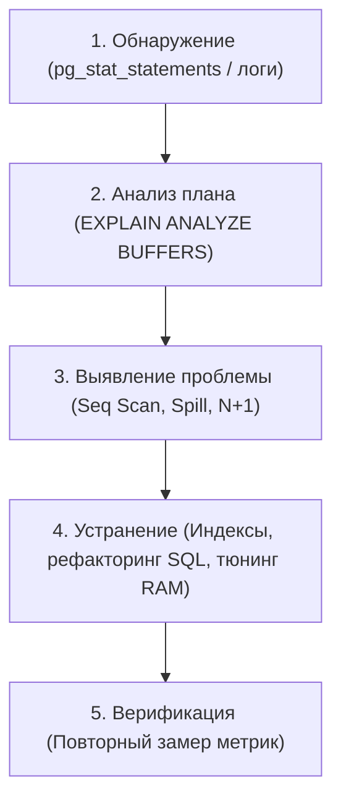

# Как оптимизировать медленные запросы?

---

## 🟢 Junior Level

**Оптимизация медленных запросов** — это процесс выявления, анализа и устранения узких мест (bottlenecks) в базе данных и коде приложения для снижения времени отклика и нагрузки на сервер.



### Наглядная бытовая аналогия

Представьте поиск книги в огромной библиотеке:
- **Медленный запрос (Seq Scan):** Библиотекарь обходит все стеллажи подряд от первой до последней полки, заглядывая в каждую книгу. Поиск занимает 2 часа.
- **Оптимизация (Индекс):** Библиотекарь обращается к алфавитному каталогу (**B-Tree Index**), за 5 секунд находит точный номер стеллажа и полки, и сразу берёт нужную книгу за 10 секунд.

### Базовый 4-шаговый алгоритм

1. **Зафиксировать проблему:** Найти медленный запрос через логи приложения или модуль `pg_stat_statements`.
2. **Получить план:** Выполнить `EXPLAIN (ANALYZE, BUFFERS) <запрос>;`.
3. **Найти самое узкое место:**
   - Чтение всей таблицы (`Seq Scan`) на миллионах строк вместо использования индекса.
   - Сброс сортировки или хэша на диск (`Disk: XX kB`).
   - Огромная разница между прогнозом (`rows`) и реальностью (`actual rows`).
4. **Устранить причину:** Добавить индекс, переписать запрос, обновить статистику командой `ANALYZE` или выделить память `work_mem`.

---

## 🟡 Middle Level

### 5 самых частых проблем производительности и их устранение

#### 1. Отсутствие индекса или Seq Scan на большой таблице
```sql
-- ❌ Медленно: чтение 5 000 000 строк с диска
SELECT * FROM users WHERE email = 'alex@company.com';

-- ✅ Решение: B-Tree индекс
CREATE INDEX idx_users_email ON users(email);
```

#### 2. Вызов функции над колонкой в условии WHERE (Убийца индекса)
Если колонка обёрнута в функцию, стандартный B-Tree индекс **перестаёт использоваться**:
```sql
-- ❌ Индекс по email НЕ используется из-за вызова LOWER():
SELECT * FROM users WHERE LOWER(email) = 'alex@company.com';

-- ✅ Решение: Функциональный индекс (Functional Index)
CREATE INDEX idx_users_email_lower ON users(LOWER(email));
```

#### 3. Неявное приведение типов (Implicit Type Casting)
Если тип переданного параметра не совпадает с типом колонки в таблице, PostgreSQL неявно применяет функцию приведения к каждой строке таблицы:
```sql
-- ❌ phone имеет тип VARCHAR, а передан INT -> Индекс выключается!
SELECT * FROM clients WHERE phone = 79991234567; 
-- В плане увидим: Filter: (phone::numeric = 79991234567::numeric)

-- ✅ Решение: строгая типизация аргументов
SELECT * FROM clients WHERE phone = '79991234567';
```

#### 4. Нехватка памяти для сортировки и группировки (Spill to Disk)
```sql
EXPLAIN (ANALYZE, BUFFERS) 
SELECT * FROM transactions ORDER BY created_at DESC;
-- В плане: Sort Method: external merge  Disk: 45000kB (Замедление в 50 раз!)

-- ✅ Решение: увеличение work_mem для сессии отчёта
SET work_mem = '128MB';
-- Теперь: Sort Method: quicksort  Memory: 48000kB (Всё в RAM!)
```

#### 5. Проблема N+1 запросов в Spring Data / Hibernate
В Java-микросервисах до 80% проблем производительности связаны с ленивой загрузкой коллекций (`FetchType.LAZY`):
```java
// ❌ АНТИПАТТЕРН: 1 запрос за клиентами + 1000 запросов за заказами каждого клиента!
List<Customer> customers = customerRepository.findAll();
for (Customer c : customers) {
    System.out.println(c.getOrders().size()); // Порождает отдельный SELECT к orders!
}

// ✅ ЭТАЛОННОЕ РЕШЕНИЕ 1: Использование JOIN FETCH в JPQL
@Query("SELECT DISTINCT c FROM Customer c LEFT JOIN FETCH c.orders")
List<Customer> findAllWithOrders();

// ✅ ЭТАЛОННОЕ РЕШЕНИЕ 2: Использование @EntityGraph
@EntityGraph(attributePaths = {"orders"})
List<Customer> findAll();
```

---

## 🔴 Senior Level

### Четырёхуровневая пирамида оптимизации (Optimization Hierarchy)

Опытный архитектор решает проблемы производительности системно, двигаясь от кода запроса к аппаратному обеспечению:

```
┌────────────────────────────────────────────────────────┐
│  1. SQL & ORM Level (Индексы, JOIN FETCH, DTO, CTE)     │
├────────────────────────────────────────────────────────┤
│  2. DB Config Level (work_mem, shared_buffers, JIT)     │
├────────────────────────────────────────────────────────┤
│  3. Architecture Level (Денормализация, MV, Partitions)│
├────────────────────────────────────────────────────────┤
│  4. Infra Level (NVMe SSD, Connection Pooling, RAM)    │
└────────────────────────────────────────────────────────┘
```

### Архитектурные паттерны оптимизации

#### 1. Партиционирование таблиц (Table Partitioning)
Для таблиц объёмом более 50–100 млн строк (логи, история платежей, аудит):
```sql
CREATE TABLE payment_events (
    id bigserial,
    event_time timestamptz NOT NULL,
    amount numeric
) PARTITION BY RANGE (event_time);

CREATE TABLE payment_events_2026_01 PARTITION OF payment_events
    FOR VALUES FROM ('2026-01-01') TO ('2026-02-01');

-- Планировщик использует Partition Pruning:
SELECT * FROM payment_events WHERE event_time >= '2026-01-15';
-- СУБД читает ТОЛЬКО одну партицию за январь 2026, полностью игнорируя терабайты остальных лет!
```

#### 2. Материализованные представления (Materialized Views)
Для сложных аналитических дашбордов с множественными JOIN:
```sql
CREATE MATERIALIZED VIEW mv_daily_revenue AS
SELECT store_id, DATE(created_at) AS day, SUM(total_amount) AS revenue
FROM orders
GROUP BY store_id, DATE(created_at);

-- Ускорение обновления без блокировки чтения:
CREATE UNIQUE INDEX idx_mv_daily_revenue ON mv_daily_revenue(store_id, day);
REFRESH MATERIALIZED VIEW CONCURRENTLY mv_daily_revenue;
```

#### 3. Настройка пула соединений (HikariCP / pgBouncer)
Частая ошибка — создание 500 соединений в приложении. Каждое соединение в PostgreSQL — это отдельный процесс операционной системы, потребляющий от 10 МБ памяти:
- 500 соединений приводят к деградации CPU из-за постоянного переключения контекста ядра ОС (Context Switching).
- Формула пула HikariCP:
  $$\text{Pool Size} = (\text{CPU Cores} \times 2) + \text{Spindle Count}$$
  Для 16-ядерного сервера базы данных оптимальный размер пула составляет всего **32–40 соединений**! Для уплотнения сотен микросервисов перед базой устанавливают **pgBouncer в режиме Transaction Pooling**.

### Тюнинг системных параметров PostgreSQL под SSD

```ini
# postgresql.conf:
shared_buffers = 16GB                  # 25% от доступной RAM сервера
effective_cache_size = 48GB            # 75% от доступной RAM (оценка кэша ядра ОС)
random_page_cost = 1.1                 # Для NVMe SSD (дефолт 4.0 рассчитан на старые HDD!)
work_mem = 64MB                        # Память на одну операцию сортировки/хэширования
maintenance_work_mem = 2GB             # Память для CREATE INDEX и VACUUM
jit = off                              # Отключение JIT для OLTP-систем (устраняет latency spikes)
```

### Мониторинг через системный дашборд pg_stat_statements

```sql
-- Топ-5 запросов, потребляющих больше всего времени базы данных:
SELECT 
    ROUND(total_exec_time::numeric, 2) AS total_time_ms,
    calls,
    ROUND(mean_exec_time::numeric, 2) AS avg_time_ms,
    ROUND((100.0 * total_exec_time / SUM(total_exec_time) OVER())::numeric, 2) AS pct_load,
    query
FROM pg_stat_statements
ORDER BY total_exec_time DESC
LIMIT 5;
```

---

## 🎯 Шпаргалка для интервью

### Обязательно знать (Первые 30 секунд ответа)
- **Золотой алгоритм оптимизации:**
  1. Выявить медленные запросы через `pg_stat_statements` (по суммарному времени или `shared_blks_read`).
  2. Проанализировать план через `EXPLAIN (ANALYZE, BUFFERS)`.
  3. Устранить причину: недостающие составные индексы, устранение неявных кастов, перенос фильтрации в `WHERE`.
  4. Проверить конфигурацию: `work_mem` (устранение Disk Spill), `random_page_cost` для SSD, оптимизация пула соединений.
- **В Java/Hibernate:** Ликвидация проблемы `N+1` через `JOIN FETCH` / `@EntityGraph`, замена сущностей на легковесные DTO Projections, включение JDBC-батчинга (`hibernate.jdbc.batch_size=50`).
- **Симптом плохой статистики:** Кардинальное расхождение оценочного числа строк `rows` с реальным `actual rows` $\to$ решение: `ANALYZE`.

### Частые уточняющие вопросы на засыпку

1. **«Почему добавление индекса не ускорило запрос SELECT * FROM users WHERE status = 'ACTIVE'?»**
   *Ответ:* Из-за низкой селективности (низкой кардинальности). Если статус `ACTIVE` имеет 90% строк таблицы, планировщик справедливо выбирает `Seq Scan`, так как последовательное чтение блоков на порядок быстрее миллионов случайных обращений к страницам через индекс. Решение: частичный индекс (`CREATE INDEX ... WHERE status = 'ACTIVE'`) или композитный индекс.

2. **«Что такое Generic Plan в JDBC и почему он может обрушить продакшен?»**
   *Ответ:* При использовании Prepared Statements после 5 запусков (`prepareThreshold=5`) драйвер PostgreSQL переключается на серверный обобщенный план, не зная точного параметра. При перекосе данных (Data Skew) Generic Plan может выбрать медленный `Seq Scan`. Решение: `SET plan_cache_mode = 'force_custom_plan'` или `prepareThreshold=0`.

3. **«Почему в PostgreSQL для SSD критично изменить random_page_cost с 4.0 до 1.1?»**
   *Ответ:* Дефолтное значение 4.0 предполагает, что чтение случайной страницы со шпиндельного HDD в 4 раза дороже последовательного. На быстрых NVMe SSD скорость случайного и последовательного чтения практически одинакова. Оставив 4.0, вы заставляете оптимизатор необоснованно избегать `Index Scan` в пользу `Seq Scan`.

4. **«Как пул соединений HikariCP влияет на скорость выполнения запросов к БД?»**
   *Ответ:* Слишком большой пул (например, 200 потоков на 8-ядерный процессор) создаёт конкуренцию за ядра процессора, переполнение кэшей L1/L2/L3 и задержки блокировок (Latch contention). Уменьшение пула до оптимума (20–30 соединений) снижает задержку выполнения запросов и предотвращает перегрузку базы.

### Красные флаги (НЕ говорить на интервью)
- ❌ *«Оптимизация базы данных — это просто развешивание индексов на все колонки подряд»* — каждый лишний индекс замедляет операции `INSERT/UPDATE/DELETE`, увеличивает Write Amplification и занимает RAM.
- ❌ *«Если запрос тормозит, нужно сразу увеличить пул HikariCP до 500 соединений»* — это гарантированно положит процессор сервера PostgreSQL.
- ❌ *«Для ускорения аналитики нужно просто отключить autovacuum»* — приведёт к остановке базы из-за Wraparound.
- ❌ *«EXPLAIN ANALYZE можно запускать на боевом UPDATE для проверки скорости»* — команда выполнит реальный апдейт данных!

### Связанные темы
- [Для чего нужны индексы](1.%20Для%20чего%20нужны%20индексы.md) → фундаментальные типы индексов
- [Что такое explain plan](20.%20Что%20такое%20explain%20plan.md) → детальное чтение планов выполнения
- [Зачем нужен ANALYZE](19.%20Зачем%20нужен%20ANALYZE.md) → обновление статистики CBO
- [Как работает MVCC в PostgreSQL](17.%20Как%20работает%20MVCC%20в%20PostgreSQL.md) → влияние раздувания таблиц на производительность
