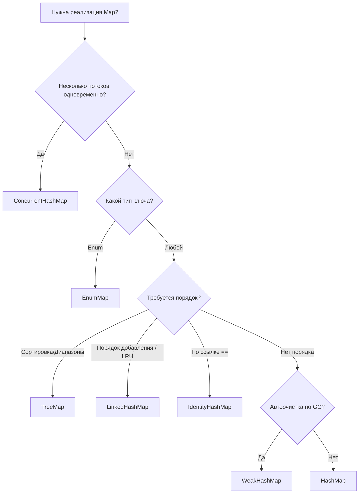

# Какую реализацию Map выбрать (сравнение)

---

## 🟢 Junior Level

В Java Standard Edition представлено обширное семейство коллекций, реализующих интерфейс `java.util.Map`. Каждая реализация спроектирована под строго определенный сценарий использования и компромисс между скоростью, потреблением памяти, порядком и потокобезопасностью.

### Экспресс-шпаргалка по выбору:

* **`HashMap`** — выбор по умолчанию. Самая быстрая универсальная коллекция для однопоточных сценариев. Порядок элементов не гарантирован.
* **`LinkedHashMap`** — когда критичен предсказуемый порядок элементов (порядок вставки `insertion-order` или порядок последнего обращения `access-order` для LRU-кэша).
* **`TreeMap`** — когда ключи должны быть строго отсортированы (по `Comparable` или `Comparator`), либо нужны диапазонные выборки (`subMap`).
* **`ConcurrentHashMap`** — стандарт для высоконагруженных многопоточных приложений. Обеспечивает безопасную параллельную запись без полной блокировки карты.
* **`EnumMap`** — специализированная сверхбыстрая карта, когда ключами служат элементы `Enum`.
* **`WeakHashMap`** — карта с автоочисткой пар по сборщику мусора (GC), когда на ключ не осталось сильных ссылок.
* **`IdentityHashMap`** — редкая реализация, сравнивающая ключи по ссылке (`==`), а не по методу `equals()`.

```java
import java.util.*;
import java.util.concurrent.ConcurrentHashMap;

public class MapChoiceDemo {
    public static void main(String[] args) {
        // 1. Стандартная работа
        Map<String, String> standard = new HashMap<>();

        // 2. С сохранением порядка добавления
        Map<String, String> ordered = new LinkedHashMap<>();

        // 3. С автоматической сортировкой по ключам
        Map<String, String> sorted = new TreeMap<>();

        // 4. Многопоточная среда
        Map<String, String> threadSafe = new ConcurrentHashMap<>();
    }
}
```

> **Аналогия:** Выбор `Map` напоминает выбор транспортного средства: `HashMap` — это легковой седан на каждый день; `ConcurrentHashMap` — это метрополитен с параллельными путями для миллионов пассажиров; `TreeMap` — это поезд строго по расписанию и маршруту; `EnumMap` — гоночный болид Formula-1, ездящий только по специальному фиксированному треку.

---

## 🟡 Middle Level

### Сводная архитектурная таблица сравнения

| Реализация | Внутренняя структура | Порядок итерации | Потокобезопасность | Сложность `get`/`put` | Допустимость `null` |
| :--- | :--- | :--- | :--- | :--- | :--- |
| **`HashMap`** | Хеш-таблица (массив + списки / RB-Tree) | Отсутствует | ❌ Нет | $O(1)$ | Ключ: 1 / Значения: любые |
| **`LinkedHashMap`** | `HashMap` + двусвязный список узлов | Вставка или Доступ (LRU) | ❌ Нет | $O(1)$ | Ключ: 1 / Значения: любые |
| **`TreeMap`** | Красно-чёрное дерево поиска | Естественный или `Comparator` | ❌ Нет | $O(\log N)$ | Ключ: ❌ (NPE)* / Значения: любые |
| **`ConcurrentHashMap`** | Массив + списки/деревья + CAS + synchronized | Отсутствует | ✅ Да | $O(1)$ | Ключ: ❌ / Значения: ❌ (NPE) |
| **`EnumMap`** | Простой компактный массив `Object[]` | Порядок объявления `Enum.ordinal()` | ❌ Нет | $O(1)$ (1 такт) | Ключ: ❌ (NPE) / Значения: любые |
| **`WeakHashMap`** | Хеш-таблица с `WeakReference` на ключи | Отсутствует | ❌ Нет | $O(1)$ | Ключ: 1 / Значения: любые |
| **`IdentityHashMap`** | Плоский массив с открытой адресацией (`==`) | Отсутствует | ❌ Нет | $O(1)$ | Ключ: 1 / Значения: любые |

*\*Примечание: `TreeMap` разрешает `null`-ключ только при передаче кастомного компаратора, обрабатывающего null.*

### Ключевые особенности специализированных реализаций

#### 1. `LinkedHashMap` и создание LRU-кэша
`LinkedHashMap` расширяет `HashMap`, связывая все узлы дополнительным двусвязным списком (`before`/`after`).
Флаг `accessOrder = true` переносит элемент в конец списка при каждом чтении `get()`:
```java
public class SimpleLruCache<K, V> extends LinkedHashMap<K, V> {
    private final int maxEntries;

    public SimpleLruCache(int maxEntries) {
        super(maxEntries, 0.75f, true); // true = access-order
        this.maxEntries = maxEntries;
    }

    @Override
    protected boolean removeEldestEntry(Map.Entry<K, V> eldest) {
        return size() > maxEntries; // Автоудаление старых при превышении лимита
    }
}
```

#### 2. `TreeMap` и диапазонная навигация
Реализует интерфейс `NavigableMap`, предоставляя эффективный поиск граничных значений:
```java
NavigableMap<Integer, String> scores = new TreeMap<>();
scores.put(100, "UserA");
scores.put(250, "UserB");
scores.put(500, "UserC");

scores.subMap(100, true, 300, true); // Диапазон от 100 до 300
scores.floorEntry(200);              // Ближайший меньший или равный (100)
scores.ceilingEntry(200);            // Ближайший больший или равный (250)
```

#### 3. `EnumMap`: Экстремальная оптимизация
Если ключом является перечисление `Enum`, использовать `HashMap` — антипаттерн.
`EnumMap` внутри представляет собой обычный массив `Object[] vals` фиксированного размера `Enum.values().length`:
- Хеширования нет — индекс ячейки вычисляется мгновенно по полю `key.ordinal()`.
- Коллизии невозможны в принципе.
- Потребление памяти минимально, а скорость доступа максимальна среди всех коллекций Java.

---

## 🔴 Senior Level

### Глубокий анализ: Memory Footprint и Cache Locality

Расход памяти в куче (64-bit HotSpot JVM, Compressed OOPs) на 1 000 000 записей:

```text
EnumMap           [~8 MB]   (1 массив ссылок на значения + enum-массив)
HashMap           [~48 MB]  (массив table + 1M объектов Node: 32B каждый)
ConcurrentHashMap [~56 MB]  (массив + 1M Node: 32B + CounterCell[] + volatile overhead)
LinkedHashMap     [~64 MB]  (массив + 1M Entry с ссылками before/after: 48B каждый)
TreeMap           [~80 MB]  (1M узлов Entry: parent, left, right, value, key, color: 48–56B)
```

1. **`EnumMap` и CPU Cache:** Благодаря хранению в непрерывном массиве по порядковому номеру `ordinal()` данные укладываются в процессорные кэш-линии (L1 Data Cache Hit $\approx 1$ нс).
2. **`LinkedHashMap`:** Итерация `map.entrySet()` имеет сложность строго $O(N)$ (обход двусвязного списка), в то время как у `HashMap` итерация занимает $O(\text{capacity} + N)$ (сканирование всех бакетов). Однако создание каждого узла требует на 16 байт больше памяти на ссылки `before` и `after`.
3. **`IdentityHashMap`:** Кардинально отличается по структуре. В ней нет связных списков и метода цепочек (Chaining). Используется **открытая адресация с линейным пробированием (Linear Probing Open Addressing)** в одном плоском массиве `Object[] table`, где ключи и значения чередуются по соседним ячейкам: `[key0, val0, key1, val1, ...]`.

### Дерево принятия решений (Decision Tree)



---

## 4 Tricky Questions

### 1. Почему в `LinkedHashMap` с `accessOrder = true` обычный вызов `get()` приводит к `ConcurrentModificationException` во время цикла `for-each`?

**Ответ:**
В стандартных коллекциях метод `get()` является операцией только для чтения и не меняет счетчик `modCount`.
Однако в `LinkedHashMap` в режиме `accessOrder = true` любой вызов `get(key)` для найденного элемента **перемещает узел в самый конец двусвязного списка**. Метод модифицирует связи `before`/`after` и инкрементирует счетчик структурных изменений: `modCount++`.
Если вызвать `get()` внутри цикла итерации `for (var e : map.entrySet())`, следующая итерация обнаружит `modCount != expectedModCount` и немедленно выбросит `ConcurrentModificationException`.

---

### 2. В каких практических задачах применяется `IdentityHashMap`, и почему она формально нарушает контракт `java.util.Map`?

**Ответ:**
Спецификация интерфейса `Map` гласит: поиск ключа должен производиться по правилу `(k1 == null ? k2 == null : k1.equals(k2))`.
`IdentityHashMap` **намеренно нарушает этот контракт**, проверяя строго идентичность ссылок в памяти: `k1 == k2`. Для хеширования используется не метод `key.hashCode()`, а системный адресный хеш `System.identityHashCode(k1)`.

**Практические сценарии применения:**
1. **Сериализаторы и фреймворки клонирования (Jackson, Kryo, Java Serialization):** При обходе графа объектов `IdentityHashMap` отслеживает уже посещенные объекты для предотвращения бесконечных циклов (Circular References), где важен конкретный экземпляр в памяти, даже если два объекта равны по `equals`.
2. **Профайлеры и графы зависимостей:** Учет уникальных физических аллокаций.

---

### 3. Если требуется отсортированная потокобезопасная карта, какую реализацию выбрать, если `ConcurrentTreeMap` не существует?

**Ответ:**
Следует использовать **`java.util.concurrent.ConcurrentSkipListMap`**.
Попытка использовать `Collections.synchronizedSortedMap(new TreeMap<>())` создает единый глобальный мьютекс и бутылочное горлышко.
`ConcurrentSkipListMap` реализует интерфейсы `ConcurrentMap` и `NavigableMap` на основе вероятностной структуры данных **SkipList (список с пропусками)**. Она обеспечивает неблокирующее Lock-Free чтение и параллельную запись со средней логарифмической сложностью $O(\log N)$ с сохранением строгого порядка сортировки ключей.

---

### 4. Почему неизменяемые карты `Map.of()` из Java 9+ рандомизируют порядок итерации при каждом перезапуске JVM?

**Ответ:**
В реализациях `Map.of()`, `Map.ofEntries()` порядок итерации намеренно детерминирован случайным фактором (солью, инициализируемой при старте JVM).
Это было сделано создателями JDK осознанно:
1. **Предотвращение неявных зависимостей:** Разработчики часто ошибочно полагались на случайный порядок итерации в тестах. Рандомизация заставляет писать код, не зависящий от порядка обхода.
2. **Безопасность:** Затрудняет подбор коллизий (HashDoS) для небольших карт конфигураций.
3. **Оптимизация памяти:** Для карт до 2 элементов (`Map1`, `Map2`) создаются специализированные компактные объекты с полями `k0, v0`, не аллоцирующие массив вообще.

---

## 🎯 Шпаргалка для интервью

* **Критерии выбора `Map`:**
  - Базовый случай: `HashMap` ($O(1)$, без порядка).
  - Нужен порядок вставки / LRU: `LinkedHashMap` ($O(1)$, двусвязный список).
  - Нужна сортировка / диапазоны: `TreeMap` ($O(\log N)$, RB-Tree).
  - Многопоточность: `ConcurrentHashMap` ($O(1)$, CAS + побакетная блокировка).
  - Отсортированная многопоточность: `ConcurrentSkipListMap` ($O(\log N)$, SkipList).
  - Ключи — это Enum: `EnumMap` ($O(1)$, плоский массив, 1 такт CPU).
  - Сравнение по ссылке `==`: `IdentityHashMap` (открытая адресация, сериализация).
* **Ловушка `LinkedHashMap`:** `accessOrder = true` превращает `get()` в мутирующую операцию (`modCount++`), вызывающую `ConcurrentModificationException` в цикле.
* **Расход памяти:** `EnumMap` < `HashMap` < `ConcurrentHashMap` < `LinkedHashMap` < `TreeMap`.

### Связанные темы
- [Как устроена HashMap внутри](1.%20Как%20устроена%20HashMap%20внутри.md)
- [Что такое ConcurrentHashMap и чем он отличается от HashMap](23.%20Что%20такое%20ConcurrentHashMap%20и%20чем%20он%20отличается%20от%20HashMap.md)
- [Что такое WeakHashMap](27.%20Что%20такое%20WeakHashMap.md)
- [В чём разница между HashMap и Hashtable](26.%20В%20чём%20разница%20между%20HashMap%20и%20Hashtable.md)
