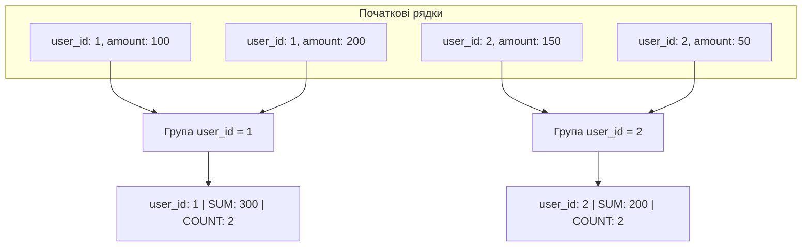
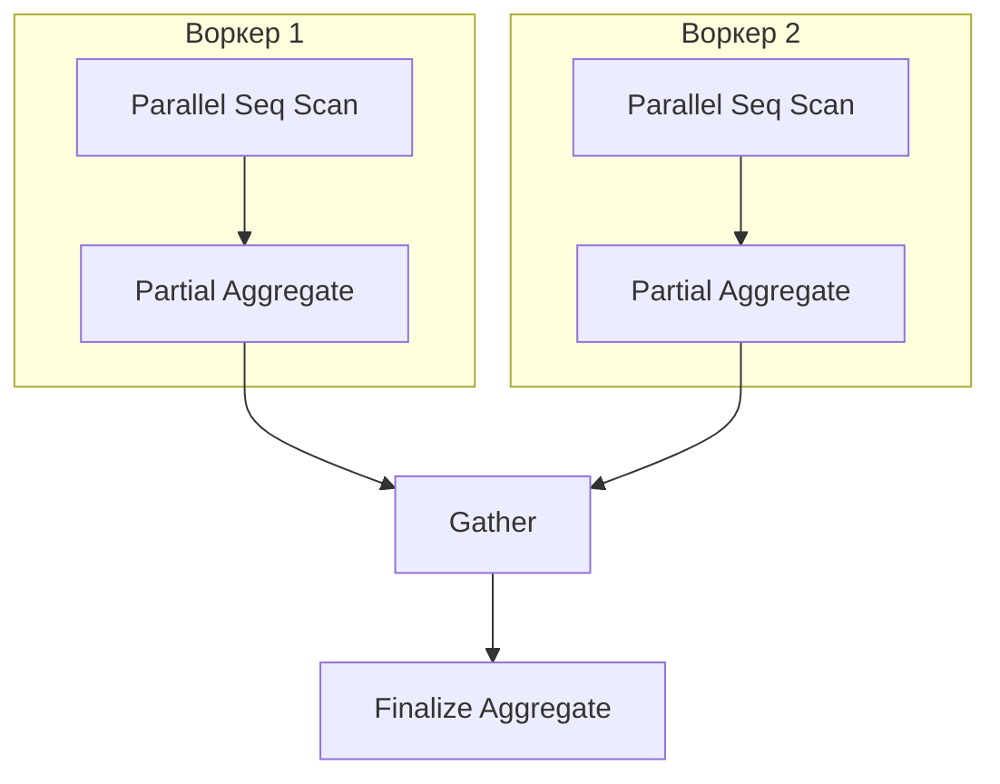

# Як працює GROUP BY?

---

## 🟢 Junior Level

**GROUP BY** — це речення мови SQL, яке схлопує (агрегує) множину рядків таблиці з однаковими значеннями у вказаних стовпцях в один підсумковий рядок для кожної унікальної комбінації, дозволяючи застосовувати до кожної групи агрегатні функції (`COUNT`, `SUM`, `AVG`, `MIN`, `MAX`).



### Наочна побутова аналогія

Уявіть купу монет різного номіналу (1, 2, 5 та 10 гривень):
1. **GROUP BY номінал:** Ви розкладаєте монети по чотирьох стопках відповідно до їхньої вартості.
2. **Агрегація:** Ви підраховуєте кількість монет у кожній стопці (`COUNT(*)`) або сумарну вартість кожної стопки (`SUM(nominal)`).
3. Кожна стопка у фінальному звіті перетворюється рівно на **один** рядок.

### Базовий приклад

```sql
-- Таблиця orders:
-- id | user_id | amount | status
-- 1  | 10      | 500    | PAID
-- 2  | 10      | 300    | PAID
-- 3  | 20      | 1200   | PAID
-- 4  | 20      | 800    | CANCELLED

SELECT 
    user_id,
    COUNT(*) AS orders_count,
    SUM(amount) AS total_spent
FROM orders
WHERE status = 'PAID'
GROUP BY user_id;

-- Результат:
-- user_id | orders_count | total_spent
-- 10      | 2            | 800
-- 20      | 1            | 1200
```

### Головне синтаксичне правило (Single-Value Rule)

Усі стовпці, перелічені в секції `SELECT`, зобов'язані:
1. Або явно входити в блок `GROUP BY`.
2. Або перебувати всередині агрегатної функції (`SUM()`, `AVG()`, `COUNT()` тощо).
3. *(Виняток)* Бути функціонально залежними від первинного ключа, вказаного в `GROUP BY` (стандарт SQL:1999, підтримується в PostgreSQL).

Будь-який стовпець «сам по собі» без агрегату викличе помилку СУБД: `column must appear in the GROUP BY clause or be used in an aggregate function`.

---

## 🟡 Middle Level

### Як PostgreSQL виконує групування під капотом

Для виконання `GROUP BY` планувальник PostgreSQL обирає одну з двох фундаментальних фізичних стратегій:

```
                    ┌────────────────────────┐
                    │  Вхідний потік рядків  │
                    └───────────┬────────────┘
                                │
              ┌─────────────────┴─────────────────┐
       Дані не відсортовані                Дані відсортовані 
       і вміщуються у work_mem             (за B-tree індексом або Sort)
              ▼                                   ▼
    ┌──────────────────┐                ┌──────────────────┐
    │  HashAggregate   │                │  GroupAggregate  │
    │  (Хеш-таблиця    │                │  (Потокова       │
    │   в пам'яті)     │                │   агрегація O(1))│
    └──────────────────┘                └──────────────────┘
```

#### 1. HashAggregate (Хеш-агрегація)
- СУБД ініціалізує в оперативній пам'яті хеш-таблицю.
- Для кожного вхідного рядка обчислюється хеш від ключів групування.
- Якщо корзину знайдено — акумулятори агрегатів (`sum`, `count`) оновлюються на місці.
- Якщо запису немає — до хеш-таблиці додається новий ключ і початковий стан агрегату.
- **Вимоги до ресурсів:** Потребує оперативну пам'ять у межах ліміту `work_mem`.
- **Порядок виведення:** Не гарантує порядок рядків на виході (залежить від хеш-функції).

#### 2. GroupAggregate (Сортувальна потокова агрегація)
- Вимагає, щоб вхідний потік був суворо впорядкований за ключами групування (через B-tree індекс або попередній вузол `Sort`).
- СУБД послідовно зчитує рядки: доки ключ збігається з поточним, накопичується агрегат. Щойно ключ змінився — підсумковий рядок віддається клієнту, а акумулятор скидається для наступного ключа.
- **Вимоги до ресурсів:** Споживає константний обсяг пам'яті $O(1)$ на групу.

| Характеристика | `HashAggregate` | `GroupAggregate` |
|---|---|---|
| **Вимога до сортування** | ❌ Не потрібна | ✅ Обов'язкова (індекс або вузол `Sort`) |
| **Витрати пам'яті** | Пропорційні кількості унікальних груп | Мінімальні ($O(1)$ пам'яті на групу) |
| **Коли обирається** | Невелика/середня кількість груп, немає відповідного індексу | Є B-tree індекс за ключами групування або даних забагато для `work_mem` |
| **Стійкість до браку пам'яті** | У PG 13+ робить `spill to disk`; до PG 13 — `out of memory` | Стабільний, якщо сортування вміщується в пам'ять або йде за індексом |

### Обробка значень NULL при групуванні

У стандарті SQL та в PostgreSQL усі значення `NULL` при групуванні вважаються **рівними одне одному** та об'єднуються в **одну спільну групу**:

```sql
SELECT status, COUNT(*) AS cnt
FROM orders
GROUP BY status;

-- Результат:
-- status  | cnt
-- PAID    | 120
-- PENDING | 45
-- NULL    | 12   <-- Усі 12 рядків із NULL потрапили в одну спільну групу
```

> [!NOTE]
> Агрегатна функція `COUNT(column)` ігнорує `NULL` усередині групи, тоді як `COUNT(*)` рахує абсолютно всі рядки, включно з тими, що містять `NULL`.

### Функціональна залежність від первинного ключа (Functional Dependency)

Починаючи з PostgreSQL 9.1 (згідно зі стандартом SQL:1999), якщо в секції `GROUP BY` вказано первинний ключ (`PRIMARY KEY`) таблиці, то інші стовпці цієї ж таблиці можна вказувати в `SELECT` **без агрегатних функцій**:

```sql
-- ✅ ВАЛІДНИЙ ЗАПИТ у PostgreSQL:
SELECT u.id, u.name, u.email, COUNT(o.id) AS total_orders
FROM users u
LEFT JOIN orders o ON u.id = o.user_id
GROUP BY u.id; 
-- Оскільки u.id — PRIMARY KEY, значення name та email однозначно 
-- визначаються u.id. Перераховувати u.name та u.email у GROUP BY не потрібно!
```

### Конструкція FILTER (WHERE ...) для паралельної умовної агрегації

Замість застарілого та громіздкого синтаксису `SUM(CASE WHEN ... THEN 1 ELSE 0 END)` сучасний стандарт SQL надає пропозицію `FILTER`:

```sql
SELECT 
    department_id,
    COUNT(*) AS total_employees,
    COUNT(*) FILTER (WHERE salary > 100000) AS high_earners,
    AVG(salary) FILTER (WHERE gender = 'F') AS female_avg_salary
FROM employees
GROUP BY department_id;
```

### Проекція в Java: Spring Data JPA та DTO Projections

У корпоративних застосунках на Spring Boot результати `GROUP BY` категорично не рекомендується мапити на JPA-сутності (Entity), оскільки агреговані рядки не мають ідентичності в Persistence Context. Замість цього використовуються DTO-проекції:

```java
// 1. DTO Record для агрегованих даних
public record DepartmentSalaryDto(Long departmentId, Long employeeCount, Double averageSalary) {}

// 2. Spring Data JPA Repository з JPQL-запитом та конструктором DTO:
public interface EmployeeRepository extends JpaRepository<Employee, Long> {
    
    @Query("""
        SELECT new com.example.dto.DepartmentSalaryDto(
            e.department.id, 
            COUNT(e.id), 
            AVG(e.salary)
        )
        FROM Employee e
        WHERE e.active = true
        GROUP BY e.department.id
        HAVING COUNT(e.id) >= :minTeamSize
    """)
    List<DepartmentSalaryDto> findDepartmentStats(@Param("minTeamSize") long minTeamSize);
}
```

**Небезпечна помилка в Java:** переносити групування на сторону Java через `stream().collect(Collectors.groupingBy(...))` при обсягах даних понад кілька тисяч рядків. Це призводить до перекачування гігабайтів мережею, вимивання кешу Hibernate і ризику `OutOfMemoryError`.

---

## 🔴 Senior Level

### Глибокий аналіз HashAggregate: Скидання на диск (PostgreSQL 13+)

До версії PostgreSQL 13 алгоритм `HashAggregate` не вмів працювати з диском: якщо хеш-таблиця перевищувала `work_mem`, планувальник або на етапі планування обирав повільний `GroupAggregate` із зовнішнім сортуванням, або запит аварійно завершувався помилкою `out of memory`.

Починаючи з PostgreSQL 13, у вузол `HashAggregate` впроваджено механізм **дискового скидання (Spill to Disk)**:
1. Пам'ять ділиться на логічні розділи (Partitions / Batches).
2. При вичерпанні `work_mem` частина хеш-таблиці серіалізується в тимчасові файли на диску (`temp_files`).
3. Обробка решти розділів повторюється ітеративно.

```text
EXPLAIN (ANALYZE, BUFFERS)
SELECT client_id, COUNT(*), SUM(payload_size)
FROM raw_events
GROUP BY client_id;

QUERY PLAN:
HashAggregate  (cost=450000.00..510000.00 rows=2500000 width=24) 
               (actual time=1820.10..2450.40 rows=2480000 loops=1)
  Group Key: client_id
  Batches: 8  Memory Usage: 32801kB  Disk Usage: 94520kB
  Buffers: shared hit=85000 read=120000, temp read=11815 written=11820
  ->  Seq Scan on raw_events  (...)
```

> [!WARNING]
> Якщо у виведенні плану ви бачите `Disk Usage: XX kB` або `Batches > 1`, це прямий сигнал про дискове скидання. Збільшення параметра `SET work_mem = '128MB'` для сесії звіту може прискорити запит у 10–20 разів завдяки утриманню всієї хеш-таблиці в оперативній пам'яті.

### Оптимізація групування B-Tree індексами: Index Only Scan

Якщо запит групує дані за стовпцями складеного індексу та вибирає лише проіндексовані стовпці, PostgreSQL може повністю виключити звернення до основної таблиці (Heap):

```sql
-- Складений індекс, що покриває групування та агрегацію
CREATE INDEX idx_orders_status_amount ON orders(status, amount);

-- Запит:
SELECT status, SUM(amount), COUNT(*)
FROM orders
GROUP BY status;

-- План виконання:
-- GroupAggregate  (cost=0.43..1240.50 rows=4 width=16)
--   ->  Index Only Scan using idx_orders_status_amount on orders
--       Heap Fetches: 0
```
У цьому сценарії:
- `Heap Fetches: 0` — звернень до основної таблиці на диску немає, все читається з кешу індексу.
- `GroupAggregate` виконується потоково без сортування, оскільки індекс гарантує впорядкованість `status`.

### Паралельна агрегація (Parallel Aggregation)

При групуванні великих таблиць планувальник задіює паралельні фонові процеси (`parallel workers`):



```text
QUERY PLAN:
Finalize HashAggregate  (cost=18500.00..18600.00 rows=50 width=16)
  Group Key: department_id
  ->  Gather  (cost=17500.00..18200.00 rows=150 width=16)
        Workers Planned: 2
        ->  Partial HashAggregate  (cost=16500.00..16550.00 rows=50 width=16)
              Group Key: department_id
              ->  Parallel Seq Scan on employees  (...)
```
- **Partial Aggregate:** Кожен воркер читає свій діапазон сторінок таблиці та формує локальну проміжну хеш-таблицю.
- **Gather:** Вузол збору пересилає частково агреговані дані лідер-процесу.
- **Finalize Aggregate:** Лідер об'єднує проміжні стани акумуляторів (наприклад, підсумовує локальні `count` та `sum` для обчислення глобального `AVG`) і формує остаточний результат.

### Просунуті агрегації: ROLLUP, CUBE та GROUPING SETS

Стандартні запити бізнес-аналітики часто вимагають агрегації даних на кількох рівнях ієрархії (за філіями, за роками, загальний підсумок). Замість об'єднання кількох важких запитів через `UNION ALL` (що вимагає $N$ проходів по таблиці) використовуються розширення `GROUP BY`, які виконують розрахунок за **один прохід**:

```sql
-- 1. ROLLUP: ієрархічні підсумки (деталізація -> відділ -> загальний підсумок)
SELECT department, city, COUNT(*)
FROM employees
GROUP BY ROLLUP(department, city);
-- Генерує групи: (department, city), (department), ()

-- 2. CUBE: розрахунок усіх можливих декартових комбінацій підмножин
SELECT department, city, COUNT(*)
FROM employees
GROUP BY CUBE(department, city);
-- Генерує групи: (department, city), (department), (city), ()

-- 3. GROUPING SETS: точний перелік необхідних зрізів даних
SELECT department, city, COUNT(*)
FROM employees
GROUP BY GROUPING SETS (
    (department, city),
    (department),
    ()
);
```

#### Ідентифікація рядків підсумків через функцію GROUPING()
Коли `ROLLUP` повертає `NULL` у стовпці, як відрізнити справжній `NULL` у даних від згенерованого підсумкового значення? Для цього слугує функція `GROUPING()`:
```sql
SELECT 
    CASE WHEN GROUPING(department) = 1 THEN '=== УСІ ВІДДІЛИ ===' ELSE department END AS dept_label,
    CASE WHEN GROUPING(city) = 1 THEN '=== УСІ МІСТА ===' ELSE city END AS city_label,
    COUNT(*) AS total_count
FROM employees
GROUP BY ROLLUP(department, city);
```

### Інкрементальне сортування (Incremental Sort, PG 13+)

Якщо таблиця має індекс за стовпцем `(department)`, але запит вимагає групування за `(department, project_id)`, починаючи з PG 13 оптимізатор застосовує **Incremental Sort**: СУБД сортує `project_id` лише локально всередині кожної вже впорядкованої індексом групи `department`, виключаючи глобальне сортування всієї таблиці.

---

## 🎯 Шпаргалка для інтерв'ю

### Обов'язково знати (Перші 30 секунд відповіді)
- **Суть:** `GROUP BY` об'єднує рядки з однаковими значеннями ключів у єдині групи для обчислення агрегатів (`COUNT`, `SUM`, `AVG`, `MIN`, `MAX`).
- **Два фізичних алгоритми:**
  1. `HashAggregate` — хеш-таблиця в оперативній пам'яті `work_mem` (швидко, O(N), не вимагає впорядкованості).
  2. `GroupAggregate` — потокове обчислення за відсортованими даними (O(1) пам'яті на групу, ідеально за наявності B-Tree індексу).
- **Поведінка NULL:** Усі `NULL`-значення трактуються як рівні та згортаються в одну спільну групу.
- **Single-Value Rule:** Стовпці в `SELECT` повинні входити в `GROUP BY`, або бути обгорнуті в агрегат, або залежати від `PRIMARY KEY`.
- **Багаторівневі підсумки:** `GROUPING SETS`, `ROLLUP`, `CUBE` обчислюють проміжні підсумки за один прохід, замінюючи повільні ланцюжки `UNION ALL`.

### Часті уточнюючі запитання на співбесіді

1. **«Що станеться, якщо HashAggregate не вміщується у work_mem?»**  
   *Відповідь:* У PostgreSQL до 13 версії запит аварійно падав з OOM або планувальник примусово перемикався на `GroupAggregate` із зовнішнім сортуванням на диску. Починаючи з PostgreSQL 13, `HashAggregate` підтримує `Spill to disk`: скидає переповнені розділи хеш-таблиці в тимчасові файли (`temp_files`) і обробляє їх пакетами (`batches`), що зберігає працездатність, але сповільнює виконання.

2. **«Чому запит SELECT id, name, COUNT(*) FROM users GROUP BY id валідний у Postgres, але падає в Oracle чи старих MySQL?»**  
   *Відповідь:* За стандартом SQL:1999 підтримується функціональна залежність (Functional Dependency): якщо в `GROUP BY` вказано первинний ключ таблиці (`id`), СУБД гарантує, що кожному `id` відповідає рівно одне значення `name`. PostgreSQL реалізує це правило, дозволяючи опускати `name` у `GROUP BY`.

3. **«У чому різниця між COUNT(*) та COUNT(column_name) за наявності GROUP BY?»**  
   *Відповідь:* `COUNT(*)` підраховує абсолютну кількість рядків, що потрапили в цю групу, включно з рядками, де всі поля дорівнюють `NULL`. `COUNT(column_name)` підраховує кількість рядків у групі, де значення вказаного стовпця **не дорівнює NULL**.

4. **«Як паралельний GROUP BY об'єднує результати між воркерами?»**  
   *Відповідь:* Через двофазну агрегацію: кожен паралельний воркер формує локальні агрегати (`Partial Aggregate`) над своєю порцією рядків. Потім вузол `Gather` передає часткові акумулятори лідер-процесу, який вузлом `Finalize Aggregate` об'єднує їх у єдиний результат.

### Червоні прапорці (НЕ говорити на інтерв'ю)
- ❌ *«GROUP BY завжди фізично сортує дані»* — ні, за замовчуванням для невідсортованих даних Postgres використовує `HashAggregate`, який не виконує жодного сортування.
- ❌ *«Кожен NULL створює свою окрему групу»* — груба помилка: всі рядки з `NULL` потрапляють рівно в одну спільну групу.
- ❌ *«Щоб порахувати підсумки за відділами та загальний підсумок, потрібно написати два запити й об'єднати їх через UNION ALL»* — ознака незнання SQL; для цього існують `ROLLUP` та `GROUPING SETS`, що працюють за один прохід.
- ❌ *«Групування краще завжди робити в Java через Stream API, щоб розвантажити базу даних»* — фатальна архітектурна помилка, що призводить до передачі гігабайтів даних мережею та падіння JVM через `OutOfMemoryError`.

### Пов'язані теми
- [У чому різниця між WHERE та HAVING](11.%20У%20чому%20різниця%20між%20WHERE%20та%20HAVING.md) → фільтрація до та після групування
- [Коли використовувати HAVING](13.%20Коли%20використовувати%20HAVING.md) → практичні сценарії застосування фільтрів до груп
- [Що таке віконні функції](14.%20Що%20таке%20віконні%20функції.md) → агрегація даних без схлопування рядків
- [Що таке explain plan](20.%20Що%20таке%20explain%20plan.md) → аналіз вузлів HashAggregate, GroupAggregate та Spill to Disk
