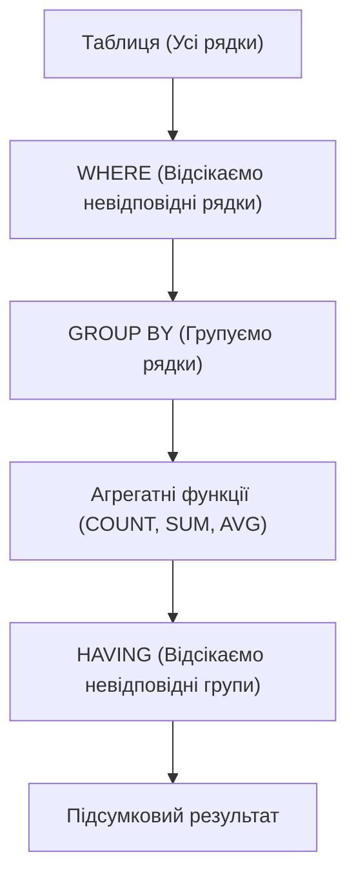

# Коли використовувати HAVING?

---

## 🟢 Junior Level

**HAVING** використовується виключно в тих випадках, коли необхідно відфільтрувати дані за результатами обчислення **агрегатних функцій** (`COUNT`, `SUM`, `AVG`, `MIN`, `MAX`) після об'єднання рядків у групи (`GROUP BY`).



### Наочна аналогія

Уявіть спортивний турнір із баскетболу:
1. **WHERE:** Спочатку відбираються гравці з дійсною медичною довідкою (`WHERE medical_check = true`).
2. **GROUP BY:** Гравці об'єднуються в команди за клубами (`GROUP BY club_id`).
3. **HAVING:** До участі в плей-оф допускаються лише ті команди, які в сумі набрали понад 100 очок (`HAVING SUM(points) > 100`) і в яких у складі не менше 5 осіб (`HAVING COUNT(*) >= 5`).

### Базові практичні сценарії

#### 1. Пошук дублікатів у таблиці
```sql
-- Знайти email-адреси, які зустрічаються в базі більше одного разу
SELECT email, COUNT(*) AS occurrences
FROM users
GROUP BY email
HAVING COUNT(*) > 1;
```

#### 2. Фільтрація за бізнес-порогами агрегатів
```sql
-- Знайти постійних клієнтів (понад 5 успішних замовлень)
SELECT customer_id, COUNT(*) AS orders_count
FROM orders
WHERE status = 'COMPLETED'
GROUP BY customer_id
HAVING COUNT(*) >= 5;
```

#### 3. Фільтрація за середніми показниками
```sql
-- Відділи із середньою зарплатою вище 120 000 ₴
SELECT department_id, AVG(salary) AS avg_salary
FROM employees
GROUP BY department_id
HAVING AVG(salary) > 120000;
```

---

## 🟡 Middle Level

### Архітектурний патерн: Синергія WHERE + HAVING

У високонавантажених системах `WHERE` та `HAVING` працюють у тандемі, суворо розділяючи зони відповідальності:

```sql
SELECT 
    seller_id,
    COUNT(*) AS total_sales,
    SUM(sale_amount) AS revenue
FROM sales
WHERE sale_date >= '2026-01-01'           -- 1. WHERE: фільтр рядків (активно використовує індекс!)
  AND refund_status IS NULL                -- 2. WHERE: відсікає повернення ДО потрапляння в пам'ять
GROUP BY seller_id                         -- 3. GROUP BY: формує групи в пам'яті
HAVING COUNT(*) >= 50                      -- 4. HAVING: бізнес-поріг за кількістю угод
   AND SUM(sale_amount) >= 1000000;        -- 5. HAVING: бізнес-поріг за обсягом виручки
```

**Чому розділення є критичним:**
- `WHERE` виконується **до** групування. Він використовує індекси та скорочує обсяг рядків, що надходять на вхід процесора агрегації (`HashAggregate` або `GroupAggregate`).
- `HAVING` виконується **після** групування над уже стисненим набором даних.

### Сценарії використання HAVING просунутого рівня

#### 1. Перевірка складу групи через FILTER (WHERE ...)
Знаходження груп, що задовольняють складну якісну умову:
```sql
-- Знайти проекти, де понад 10 завдань, і при цьому щонайменше 3 завдання заблоковані:
SELECT project_id, COUNT(*) AS total_tasks
FROM tasks
GROUP BY project_id
HAVING COUNT(*) >= 10
   AND COUNT(*) FILTER (WHERE status = 'BLOCKED') >= 3;
```

#### 2. Пошук груп зі 100% виконанням умови (Relational Division)
```sql
-- Знайти замовлення, у яких АБСОЛЮТНО ВСІ позиції вже доставлені:
SELECT order_id
FROM order_items
GROUP BY order_id
HAVING COUNT(*) = COUNT(*) FILTER (WHERE item_status = 'DELIVERED');
```

#### 3. Глобальний вартовий (HAVING без GROUP BY)
Якщо `HAVING` вказано без речення `GROUP BY`, вся таблиця агрегується як одна група:
```sql
-- Перевірка умови цілісності: повернути прапорець, якщо в системі виявлено аномалії
SELECT 'CRITICAL: High average response time!' AS alert
FROM http_access_logs
WHERE request_timestamp >= NOW() - INTERVAL '5 minutes'
HAVING AVG(response_time_ms) > 1500;
```

### Проекція в Java: Criteria API та JPQL у Spring Data JPA

У корпоративних Java-застосунках фільтрація груп реалізується через метод `having()` у `CriteriaBuilder` або явний JPQL-запит:

```java
// 1. Використання Spring Data JPA JPQL:
public interface OrderRepository extends JpaRepository<Order, Long> {

    @Query("""
        SELECT o.customer.id, COUNT(o.id), SUM(o.totalPrice)
        FROM Order o
        WHERE o.createdAt >= :startDate
        GROUP BY o.customer.id
        HAVING COUNT(o.id) >= :minOrders AND SUM(o.totalPrice) >= :minSpent
    """)
    List<CustomerStatsDto> findVipCustomers(
        @Param("startDate") LocalDateTime startDate,
        @Param("minOrders") long minOrders,
        @Param("minSpent") BigDecimal minSpent
    );
}

// 2. Використання JPA Criteria API:
CriteriaBuilder cb = em.getCriteriaBuilder();
CriteriaQuery<CustomerStatsDto> cq = cb.createQuery(CustomerStatsDto.class);
Root<Order> order = cq.from(Order.class);

cq.multiselect(order.get("customer").get("id"), cb.count(order), cb.sum(order.get("totalPrice")));
cq.where(cb.greaterThanOrEqualTo(order.get("createdAt"), startDate));
cq.groupBy(order.get("customer").get("id"));
cq.having(
    cb.and(
        cb.ge(cb.count(order), minOrders),
        cb.ge(cb.sum(order.get("totalPrice")), minSpent)
    )
);

List<CustomerStatsDto> results = em.createQuery(cq).getResultList();
```

---

## 🔴 Senior Level

### Проблема вибухового зростання кількості груп (Cardinality Explosion)

Якщо предикат у `WHERE` має низьку селективність (наприклад, повертає 100 млн рядків), а стовпець групування має високу кардинальність (наприклад, 10 млн унікальних `user_id`), секція `HAVING` **не рятує** від переповнення оперативної пам'яті.

```sql
-- ⚠️ НЕБЕЗПЕЧНО ДЛЯ ПАМ'ЯТІ:
SELECT user_id, SUM(amount)
FROM transactions
WHERE created_at >= '2024-01-01'  -- 100 000 000 рядків
GROUP BY user_id                   -- 10 000 000 груп!
HAVING SUM(amount) > 100000;       -- Фільтрує вже готові 10 млн груп!
```

**Що відбувається всередині PostgreSQL:**
1. Планувальник будує хеш-таблицю на 10 млн слотів у межах `work_mem`.
2. При перевищенні `work_mem` настає **Spill to Disk**: СУБД скидає розділи хешу в тимчасові файли `temp_files`, генеруючи десятки гігабайтів дискового I/O.
3. Час виконання деградує з кількох секунд до десятків хвилин.

**Архітектурні вирішення проблеми:**

1. **Попередня фільтрація за агрегатами (Pre-Aggregation CTE):**
   Якщо можливо заздалегідь відсікти транзакції з незначними сумами:
   ```sql
   WITH large_tx AS (
       SELECT user_id, amount
       FROM transactions
       WHERE created_at >= '2024-01-01'
         AND amount >= 1000 -- Відсікаємо дрібні транзакції ДО агрегації
   )
   SELECT user_id, SUM(amount)
   FROM large_tx
   GROUP BY user_id
   HAVING SUM(amount) > 100000;
   ```

2. **Матеріалізовані представлення (Materialized Views):**
   Для періодичних звітів агреговані дані розраховуються інкрементно у фоновому режимі:
   ```sql
   CREATE MATERIALIZED VIEW mv_user_turnover AS
   SELECT user_id, SUM(amount) AS total_amount, COUNT(*) AS tx_count
   FROM transactions
   GROUP BY user_id;

   CREATE INDEX idx_mv_user_turnover ON mv_user_turnover(total_amount);
   -- Тепер вибірка миттєва через B-Tree Index Scan:
   SELECT user_id, total_amount FROM mv_user_turnover WHERE total_amount > 100000;
   ```

### Коли HAVING категорично непридатний: Window Functions

Часта помилка навіть на рівні Senior — спроба використати `HAVING` для фільтрації результатів віконних функцій:

```sql
-- ❌ СИНТАКСИЧНА ПОМИЛКА:
-- Window functions are not allowed in HAVING
SELECT 
    department_id, 
    employee_id, 
    salary,
    DENSE_RANK() OVER (PARTITION BY department_id ORDER BY salary DESC) AS rank
FROM employees
HAVING DENSE_RANK() OVER (PARTITION BY department_id ORDER BY salary DESC) <= 3;
```

**Фундаментальна причина:**  
`HAVING` виконується над агрегатними акумуляторами в момент завершення `GROUP BY`. Віконні функції (`WindowAgg`) розраховуються **пізніше**, на етапі формування віконних рамок над уже згрупованими рядками.

**Правильний патерн вирішення:** Обгортання в CTE або похідну таблицю (Derived Table):
```sql
WITH RankedEmployees AS (
    SELECT 
        department_id, 
        employee_id, 
        salary,
        DENSE_RANK() OVER (PARTITION BY department_id ORDER BY salary DESC) AS salary_rank
    FROM employees
)
SELECT department_id, employee_id, salary, salary_rank
FROM RankedEmployees
WHERE salary_rank <= 3;
```

### Підзапити в секції HAVING

SQL допускає використання скалярних підзапитів усередині `HAVING`. Це корисно, коли поріг фільтрації групи залежить від глобального агрегату:

```sql
-- Знайти категорії товарів, середній чек яких вищий за загальний середній чек по всіх замовленнях
SELECT category_id, AVG(order_sum) AS cat_avg
FROM order_lines
GROUP BY category_id
HAVING AVG(order_sum) > (
    SELECT AVG(order_sum) FROM order_lines
);
-- Підзапит у HAVING обчислюється один раз (як InitPlan) і кешується!
```

---

## 🎯 Шпаргалка для інтерв'ю

### Обов'язково знати (Перші 30 секунд відповіді)
- **Призначення:** `HAVING` застосовується **виключно** для фільтрації згрупованих даних за значеннями **агрегатних функцій** (`COUNT`, `SUM`, `AVG`, `MIN`, `MAX`).
- **Розділення з WHERE:** Умови на звичайні стовпці зобов'язані перебувати у `WHERE` (щоб відсікти рядки до групування за допомогою індексів). Умови на результат обчислень — у `HAVING`.
- **Вплив на ресурси:** `HAVING` не знижує обсяг рядків, що надходять у хеш-таблицю агрегації; при мільйонах груп `HAVING` не запобігає дисковому скиданню (`spill to disk`).
- **Синтаксис без GROUP BY:** `HAVING` допустимий без `GROUP BY` — у цьому випадку агрегується вся таблиця як єдина група.
- **Віконні функції:** Віконні функції в `HAVING` заборонені стандартом SQL, оскільки фаза `WindowAgg` слідує суворо після `HAVING`.

### Часті уточнюючі запитання на співбесіді

1. **«Чи можна в HAVING написати умову HAVING id = 10, якщо колонка id входить до GROUP BY?»**  
   *Відповідь:* Технічно синтаксис SQL це дозволяє, але архітектурно це вважається грубою помилкою (Code Smell). Умову `id = 10` необхідно винести у `WHERE id = 10`, що дозволить СУБД застосувати B-tree індекс за `id` і прочитати рівно один рядок замість повного сканування таблиці та подальшого групування.

2. **«Як обчислюється скалярний підзапит усередині HAVING (SubPlan чи InitPlan)?»**  
   *Відповідь:* Якщо підзапит усередині `HAVING` не корелює з рядками зовнішньої таблиці (наприклад, `HAVING AVG(salary) > (SELECT AVG(salary) FROM employees)`), оптимізатор виконує його один раз на самому початку як `InitPlan` і перевикористовує скалярне значення для перевірки кожної групи.

3. **«У чому різниця між HAVING COUNT(*) > 0 та предикатом EXISTS(...) у зовнішньому запиті?»**  
   *Відповідь:* `HAVING COUNT(*) > 0` вимагає повної агрегації та обчислення точної кількості всіх пов'язаних рядків. Оператор `EXISTS` реалізує семантику Semi-Join і припиняє читання відразу після виявлення **першого** відповідного запису, що на кілька порядків швидше.

4. **«Як відрізнити справжню групу з NULL від рядка загальних підсумків при використанні GROUP BY ROLLUP з фільтром HAVING?»**  
   *Відповідь:* За допомогою стандартної функції `GROUPING(column_name)`: вона повертає `1`, якщо `NULL` згенеровано оператором `ROLLUP/CUBE` як підсумок, і `0`, якщо у вихідних даних дійсно зберігалося значення `NULL`.

### Червоні прапорці (НЕ говорити на інтерв'ю)
- ❌ *«HAVING потрібен для того, щоб швидше відфільтрувати рядки після JOIN»* — рядки після JOIN фільтруються у `WHERE`.
- ❌ *«У HAVING можна передати ROW_NUMBER() або RANK()»* — заборонено синтаксисом SQL, віконні функції обчислюються після HAVING.
- ❌ *«HAVING оптимізує використання пам'яті work_mem»* — ні, `HAVING` оцінюється вже після побудови хеш-таблиці у `work_mem`.
- ❌ *«Для пошуку дублікатів краще завантажити сутності в Java та відфільтрувати через stream().filter()»* — груба помилка масштабованості, що загрожує `OutOfMemoryError`.

### Пов'язані теми
- [У чому різниця між WHERE та HAVING](11.%20У%20чому%20різниця%20між%20WHERE%20та%20HAVING.md) → фундаментальний порядок виконання
- [Як працює GROUP BY](12.%20Як%20працює%20GROUP%20BY.md) → оператори HashAggregate та GroupAggregate
- [Що таке віконні функції](14.%20Що%20таке%20віконні%20функції.md) → агрегація зі збереженням початкових рядків
- [Що таке explain plan](20.%20Що%20таке%20explain%20plan.md) → виявлення Hash Spill та аналіз роботи фільтрів
