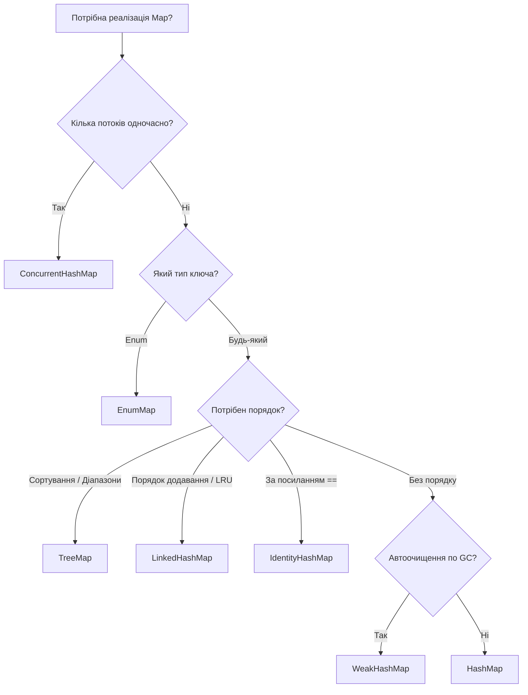

# Що краще

---

## 🟢 Junior Level

У Java Standard Edition представлене широке сімейство колекцій, що реалізують інтерфейс `java.util.Map`. Кожна реалізація спроєктована під чітко визначений сценарій використання та є компромісом між швидкістю, споживанням пам'яті, порядком елементів і потокобезпечністю.

### Експрес-шпаргалка з вибору:

* **`HashMap`** — вибір за замовчуванням. Найшвидша універсальна колекція для однопотокових сценаріїв. Порядок елементів не гарантується.
* **`LinkedHashMap`** — коли критичний передбачуваний порядок елементів (порядок вставки `insertion-order` або порядок останнього звернення `access-order` для LRU-кешу).
* **`TreeMap`** — коли ключі мають бути суворо відсортовані (за `Comparable` або `Comparator`), або потрібні діапазонні вибірки (`subMap`).
* **`ConcurrentHashMap`** — стандарт для високонавантажених багатопотокових застосунків. Забезпечує безпечний паралельний запис без повного блокування таблиці.
* **`EnumMap`** — спеціалізована надшвидка мапа, коли ключами є елементи `Enum`.
* **`WeakHashMap`** — мапа з автоочищенням пар збирачем сміття (GC), коли на ключ не залишилося сильних посилань.
* **`IdentityHashMap`** — рідкісна реалізація, яка порівнює ключі за посиланням (`==`), а не за методом `equals()`.

```java
import java.util.*;
import java.util.concurrent.ConcurrentHashMap;

public class MapChoiceDemo {
    public static void main(String[] args) {
        // 1. Стандартна робота
        Map<String, String> standard = new HashMap<>();

        // 2. Зі збереженням порядку додавання
        Map<String, String> ordered = new LinkedHashMap<>();

        // 3. З автоматичним сортуванням за ключами
        Map<String, String> sorted = new TreeMap<>();

        // 4. Багатопотокове середовище
        Map<String, String> threadSafe = new ConcurrentHashMap<>();
    }
}
```

> **Аналогія:** Вибір `Map` нагадує вибір транспортного засобу: `HashMap` — це легковий седан на щодень; `ConcurrentHashMap` — це метрополітен із паралельними коліями для мільйонів пасажирів; `TreeMap` — це потяг суворо за розкладом і маршрутом; `EnumMap` — гоночний болід Formula-1, що їздить виключно спеціальним фіксованим треком.

---

## 🟡 Middle Level

### Зведена архітектурна таблиця порівняння

| Реалізація | Внутрішня структура | Порядок ітерації | Потокобезпечність | Складність `get`/`put` | Допустимість `null` |
| :--- | :--- | :--- | :--- | :--- | :--- |
| **`HashMap`** | Хеш-таблиця (масив + списки / RB-Tree) | Відсутній | ❌ Ні | $O(1)$ | Ключ: 1 / Значення: будь-які |
| **`LinkedHashMap`** | `HashMap` + двозв'язний список вузлів | Вставка або Доступ (LRU) | ❌ Ні | $O(1)$ | Ключ: 1 / Значення: будь-які |
| **`TreeMap`** | Червоно-чорне дерево пошуку | Природний або `Comparator` | ❌ Ні | $O(\log N)$ | Ключ: ❌ (NPE)* / Значення: будь-які |
| **`ConcurrentHashMap`** | Масив + списки/дерева + CAS + synchronized | Відсутній | ✅ Так | $O(1)$ | Ключ: ❌ / Значення: ❌ (NPE) |
| **`EnumMap`** | Простий компактний масив `Object[]` | Порядок оголошення `Enum.ordinal()` | ❌ Ні | $O(1)$ (1 такт) | Ключ: ❌ (NPE) / Значення: будь-які |
| **`WeakHashMap`** | Хеш-таблиця з `WeakReference` на ключі | Відсутній | ❌ Ні | $O(1)$ | Ключ: 1 / Значення: будь-які |
| **`IdentityHashMap`** | Плаский масив із відкритою адресацією (`==`) | Відсутній | ❌ Ні | $O(1)$ | Ключ: 1 / Значення: будь-які |

*\*Примітка: `TreeMap` дозволяє `null`-ключ лише у разі передачі кастомного компаратора, що коректно обробляє null.*

### Ключові особливості спеціалізованих реалізацій

#### 1. `LinkedHashMap` та створення LRU-кешу
`LinkedHashMap` розширює `HashMap`, зв'язуючи всі вузли додатковим двозв'язним списком (`before`/`after`).
Прапорець `accessOrder = true` переносить елемент у кінець списку під час кожного читання `get()`:
```java
public class SimpleLruCache<K, V> extends LinkedHashMap<K, V> {
    private final int maxEntries;

    public SimpleLruCache(int maxEntries) {
        super(maxEntries, 0.75f, true); // true = access-order
        this.maxEntries = maxEntries;
    }

    @Override
    protected boolean removeEldestEntry(Map.Entry<K, V> eldest) {
        return size() > maxEntries; // Автоматичне видалення найстаріших при перевищенні ліміту
    }
}
```

#### 2. `TreeMap` та діапазонна навігація
Реалізує інтерфейс `NavigableMap`, забезпечуючи ефективний пошук граничних значень:
```java
NavigableMap<Integer, String> scores = new TreeMap<>();
scores.put(100, "UserA");
scores.put(250, "UserB");
scores.put(500, "UserC");

scores.subMap(100, true, 300, true); // Діапазон від 100 до 300 включно
scores.floorEntry(200);              // Найближчий менший або рівний (100)
scores.ceilingEntry(200);            // Найближчий більший або рівний (250)
```

#### 3. `EnumMap`: Екстремальна оптимізація
Якщо ключем є перелік `Enum`, використання `HashMap` — антипатерн.
`EnumMap` усередині є звичайним масивом `Object[] vals` фіксованого розміру `Enum.values().length`:
- Хешування відсутнє — індекс комірки обчислюється миттєво за полем `key.ordinal()`.
- Колізії неможливі в принципі.
- Споживання пам'яті мінімальне, а швидкість доступу найвища серед усіх колекцій Java.

---

## 🔴 Senior Level

### Глибокий аналіз: Memory Footprint та Cache Locality

Витрати пам'яті в купі (64-bit HotSpot JVM, Compressed OOPs) на 1 000 000 записів:

```text
EnumMap           [~8 MB]   (1 масив посилань на значення + enum-масив)
HashMap           [~48 MB]  (масив table + 1M об'єктів Node: 32B кожен)
ConcurrentHashMap [~56 MB]  (масив + 1M Node: 32B + CounterCell[] + volatile overhead)
LinkedHashMap     [~64 MB]  (масив + 1M Entry з посиланнями before/after: 48B кожен)
TreeMap           [~80 MB]  (1M вузлів Entry: parent, left, right, value, key, color: 48–56B)
```

1. **`EnumMap` та CPU Cache:** Завдяки зберіганню в неперервному масиві за порядковим номером `ordinal()` дані ідеально лягають у процесорні кеш-лінії (L1 Data Cache Hit $\approx 1$ нс).
2. **`LinkedHashMap`:** Ітерація `map.entrySet()` має складність суворо $O(N)$ (обхід двозв'язного списку), тоді як у `HashMap` ітерація займає $O(\text{capacity} + N)$ (сканування всіх бакетів). Проте створення кожного вузла вимагає на 16 байтів більше пам'яті на посилання `before` та `after`.
3. **`IdentityHashMap`:** Кардинально відрізняється за структурою. У ній немає зв'язних списків і методу ланцюжків (Chaining). Використовується **відкрита адресація з лінійним пробуванням (Linear Probing Open Addressing)** в одному пласкому масиві `Object[] table`, де ключі та значення чергуються в сусідніх комірках: `[key0, val0, key1, val1, ...]`.

### Дерево прийняття рішень (Decision Tree)



---

## 4 Tricky Questions

### 1. Чому в `LinkedHashMap` з `accessOrder = true` звичайний виклик `get()` призводить до `ConcurrentModificationException` під час циклу `for-each`?

**Відповідь:**
У стандартних колекціях метод `get()` є операцією лише для читання і не змінює лічильник `modCount`.
Однак у `LinkedHashMap` у режимі `accessOrder = true` будь-який виклик `get(key)` для знайденого елемента **переміщує вузол у самий кінець двозв'язного списку**. Метод модифікує зв'язки `before`/`after` та інкрементує лічильник структурних змін: `modCount++`.
Якщо викликати `get()` усередині циклу ітерації `for (var e : map.entrySet())`, наступна ітерація виявить `modCount != expectedModCount` і негайно викине `ConcurrentModificationException`.

---

### 2. У яких практичних задачах застосовується `IdentityHashMap`, і чому вона формально порушує контракт `java.util.Map`?

**Відповідь:**
Специфікація інтерфейсу `Map` стверджує: пошук ключа має відбуватися за правилом `(k1 == null ? k2 == null : k1.equals(k2))`.
`IdentityHashMap` **навмисно порушує цей контракт**, перевіряючи суворо ідентичність посилань у пам'яті: `k1 == k2`. Для хешування використовується не метод `key.hashCode()`, а системний адресний хеш `System.identityHashCode(k1)`.

**Практичні сценарії застосування:**
1. **Серіалізатори та фреймворки клонування (Jackson, Kryo, Java Serialization):** Під час обходу графа об'єктів `IdentityHashMap` відстежує вже відвідані об'єкти для запобігання нескінченних циклів (Circular References), де важливий конкретний екземпляр у пам'яті, навіть якщо два об'єкти рівні за `equals`.
2. **Профайлери та графи залежностей:** Облік унікальних фізичних алокацій.

---

### 3. Якщо потрібна відсортована потокобезпечна мапа, яку реалізацію обрати, якщо `ConcurrentTreeMap` не існує?

**Відповідь:**
Слід використовувати **`java.util.concurrent.ConcurrentSkipListMap`**.
Спроба використати `Collections.synchronizedSortedMap(new TreeMap<>())` створює єдиний глобальний м'ютекс і вузьке місце (bottleneck).
`ConcurrentSkipListMap` реалізує інтерфейси `ConcurrentMap` та `NavigableMap` на основі ймовірнісної структури даних **SkipList (список із пропусками)**. Вона забезпечує неблокувальне Lock-Free читання та паралельний запис із середньою логарифмічною складністю $O(\log N)$ зі збереженням суворого порядку сортування ключів.

---

### 4. Чому незмінні мапи `Map.of()` із Java 9+ рандомізують порядок ітерації під час кожного перезапуску JVM?

**Відповідь:**
У реалізаціях `Map.of()`, `Map.ofEntries()` порядок ітерації навмисно детермінований випадковим фактором (сіллю, яка ініціалізується під час старту JVM).
Це було зроблено творцями JDK свідомо:
1. **Запобігання неявним залежностям:** Розробники часто помилково покладалися на випадковий порядок ітерації в тестах. Рандомізація змушує писати код, що не залежить від порядку обходу.
2. **Безпека:** Ускладнює підбір колізій (HashDoS) для невеликих мап конфігурацій.
3. **Оптимізація пам'яті:** Для мап до 2 елементів (`Map1`, `Map2`) створюються спеціалізовані компактні об'єкти з полями `k0, v0`, які взагалі не виділяють масив у пам'яті.

---

## 🎯 Шпаргалка для інтерв'ю

* **Критерії вибору `Map`:**
  - Базовий випадок: `HashMap` ($O(1)$, без гарантії порядку).
  - Потрібен порядок вставки / LRU: `LinkedHashMap` ($O(1)$, двозв'язний список).
  - Потрібне сортування / діапазони: `TreeMap` ($O(\log N)$, червоно-чорне дерево).
  - Багатопотоковість: `ConcurrentHashMap` ($O(1)$, CAS + побакетне блокування).
  - Відсортована багатопотоковість: `ConcurrentSkipListMap` ($O(\log N)$, SkipList).
  - Ключі — це Enum: `EnumMap` ($O(1)$, плаский масив, 1 такт CPU).
  - Порівняння за посиланням `==`: `IdentityHashMap` (відкрита адресація, серіалізація).
* **Пастка `LinkedHashMap`:** `accessOrder = true` перетворює `get()` на мутувальну операцію (`modCount++`), що спричиняє `ConcurrentModificationException` в циклі `for-each`.
* **Витрати пам'яті:** `EnumMap` < `HashMap` < `ConcurrentHashMap` < `LinkedHashMap` < `TreeMap`.

### Червоні прапорці (чого уникати)
* Використання `HashMap` замість `EnumMap`, коли ключами є enum (величезні втрати продуктивності та пам'яті).
* Використання `TreeMap` лише для збереження порядку додавання (для цього є `LinkedHashMap`, яка набагато швидша — $O(1)$ проти $O(\log N)$).
* Твердження, що `IdentityHashMap` порівнює об'єкти за `equals()` (вона використовує виключно `==`).
* Використання `Collections.synchronizedMap` замість `ConcurrentHashMap` у високонавантаженому коді.

### Пов'язані теми
- [Як влаштований HashMap всередині](1.%20Як%20влаштований%20HashMap%20всередині.md)
- [Що таке ConcurrentHashMap і чим він відрізняється від HashMap](23.%20Що%20таке%20ConcurrentHashMap%20і%20чим%20він%20відрізняється%20від%20HashMap.md)
- [Що таке WeakHashMap](27.%20Що%20таке%20WeakHashMap.md)
- [В чому різниця між HashMap та Hashtable](26.%20В%20чому%20різниця%20між%20HashMap%20та%20Hashtable.md)
