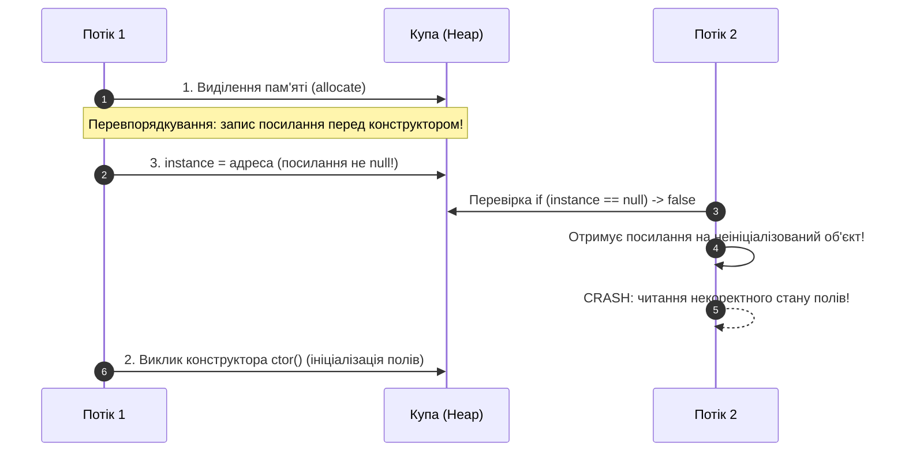

# Що таке Singleton

---

## 🟢 Junior Level

**Singleton (Одинак)** — це породжувальний патерн проєктування, який гарантує, що у класу є **рівно один екземпляр** під час роботи програми, і надає до нього **глобальну точку доступу**.

### Навіщо він потрібен
Деякі об'єкти в системі повинні існувати виключно в єдиному екземплярі:
- Глобальний логер застосунку.
- Менеджер конфігураційних налаштувань (наприклад, файл `application.properties`).
- Пул з'єднань із базою даних або апаратний драйвер пристрою.

Якщо кожен компонент створюватиме власний екземпляр, це призведе до надлишкового використання пам'яті, розсинхронізації стану та конфліктів під час одночасного доступу до спільних ресурсів.

**Аналогія з життя:** Президент держави або генеральний директор компанії. У державі може бути лише один чинний президент. У будь-який момент часу звернення «пан Президент» вказує на одну конкретну людину, а не на множину дублікатів.

### Як влаштований класичний Singleton
1. **Приватний конструктор:** унеможливлює створення об'єкта ззовні через оператор `new`.
2. **Приватне статичне поле:** зберігає посилання на єдиний екземпляр класу.
3. **Публічний статичний метод (зазвичай `getInstance()`):** глобальна точка доступу, що повертає цей екземпляр.

```java
public class ConfigurationManager {
    // 1. Статичне поле зберігає єдиний екземпляр
    private static final ConfigurationManager INSTANCE = new ConfigurationManager();

    // 2. Приватний конструктор забороняє виклик new ConfigurationManager() ззовні
    private ConfigurationManager() {
        System.out.println("Конфігурацію завантажено в пам'ять.");
    }

    // 3. Глобальна точка доступу
    public static ConfigurationManager getInstance() {
        return INSTANCE;
    }

    public String getProperty(String key) {
        return "value_for_" + key;
    }
}

// Використання:
public class Main {
    public static void main(String[] args) {
        ConfigurationManager config1 = ConfigurationManager.getInstance();
        ConfigurationManager config2 = ConfigurationManager.getInstance();

        // Посилання вказують на одну й ту саму адресу в купі (heap)
        System.out.println(config1 == config2); // true
    }
}
```

### Singleton проти статичного класу (Static Class / Utility Class)

| Критерій | Singleton | Клас зі статичними методами |
| :--- | :--- | :--- |
| **Реалізація інтерфейсів** | Може реалізовувати інтерфейси (`implements MyService`) | Не може реалізовувати інтерфейси статичною логікою |
| **Ліниве завантаження** | Підтримує відкладену ініціалізацію (Lazy loading) | Ініціалізується одразу під час першого звернення до будь-якого члена |
| **Передача в методи** | Можна передавати як об'єкт у параметри методів чи конструкторів | Не можна передати як об'єкт (відсутнє посилання на екземпляр) |
| **Поліморфізм / ООП** | Повноцінний об'єкт у купі з поліморфною поведінкою | Процедурний набір функцій, ООП відсутнє |

---

## 🟡 Middle Level

### Варіанти реалізації Singleton у Java

#### 1. Eager Initialization (Рання ініціалізація)
Екземпляр створюється завантажувачем класів у момент завантаження класу JVM.
```java
public class EagerSingleton {
    private static final EagerSingleton INSTANCE = new EagerSingleton();
    
    private EagerSingleton() {}
    
    public static EagerSingleton getInstance() {
        return INSTANCE;
    }
}
```
- **Переваги:** Гранична простота, потокобезпечність гарантована завантажувачем класів JVM.
- **Недоліки:** Об'єкт створюється навіть тоді, коли він взагалі не знадобиться в поточній сесії роботи застосунку (нераціональне витрачання пам'яті та ресурсів CPU під час старту).

---

#### 2. Lazy Initialization (Непотокобезпечна лінива ініціалізація)
```java
// ❌ АНТИПАТЕРН у багатопотоковому середовищі!
public class UnsafeLazySingleton {
    private static UnsafeLazySingleton instance;
    
    private UnsafeLazySingleton() {}

    public static UnsafeLazySingleton getInstance() {
        if (instance == null) {
            instance = new UnsafeLazySingleton(); // Стан гонки (Race Condition)!
        }
        return instance;
    }
}
```
- **Проблема:** Якщо два потоки одночасно зайдуть у блок `if (instance == null)`, обидва створять по окремому об'єкту. Інваріант єдиності буде непоправно порушено.

---

#### 3. Synchronized Accessor (Синхронізований метод)
```java
public class SynchronizedSingleton {
    private static SynchronizedSingleton instance;
    
    private SynchronizedSingleton() {}

    public static synchronized SynchronizedSingleton getInstance() {
        if (instance == null) {
            instance = new SynchronizedSingleton();
        }
        return instance;
    }
}
```
- **Переваги:** Потокобезпечно, лінива ініціалізація.
- **Недоліки:** Величезні накладні витрати на синхронізацію. Метод `getInstance()` синхронізується під час **кожного** виклику, навіть коли об'єкт уже давно створено. Це створює вузьке місце (lock contention) у багатопотоковому hot-path.

---

#### 4. Double-Checked Locking (DCL з volatile)
Оптимізація, яка виконує синхронізацію лише один раз — під час безпосереднього створення об'єкта.
```java
public class DoubleCheckedSingleton {
    // volatile критично необхідний для запобігання перевпорядкуванню інструкцій (Instruction Reordering)!
    private static volatile DoubleCheckedSingleton instance;

    private DoubleCheckedSingleton() {}

    public static DoubleCheckedSingleton getInstance() {
        DoubleCheckedSingleton local = instance; // Читання в локальну змінну (мікрооптимізація)
        if (local == null) {
            synchronized (DoubleCheckedSingleton.class) {
                local = instance;
                if (local == null) {
                    instance = local = new DoubleCheckedSingleton();
                }
            }
        }
        return local;
    }
}
```

---

#### 5. Bill Pugh Singleton (Initialization-on-demand Holder)
Елегантний спосіб лінивої та потокобезпечної ініціалізації без явних блокувань і ключового слова `synchronized`.
```java
public class BillPughSingleton {
    private BillPughSingleton() {}

    // Вкладений static-клас завантажується JVM ТІЛЬКИ під час першого звернення до нього
    private static class Holder {
        private static final BillPughSingleton INSTANCE = new BillPughSingleton();
    }

    public static BillPughSingleton getInstance() {
        return Holder.INSTANCE;
    }
}
```
- **Механіка:** Клас `BillPughSingleton` може бути завантажений у JVM, але внутрішній статичний клас `Holder` не завантажується в пам'ять і не ініціалізується доти, доки безпосередньо не буде викликано метод `getInstance()`. Ініціалізація статичних полів класу гарантовано атомарна і потокобезпечна відповідно до специфікації JVM (JLS §12.4.2).

---

#### 6. Enum Singleton (Рекомендація Джошуа Блоха)
```java
public enum EnumSingleton {
    INSTANCE;

    private int state;

    public void doBusinessLogic() {
        System.out.println("Виконання бізнес-логіки з екземпляром enum");
    }
}
```
- **Переваги:** Повний захист від атак через рефлексію, серіалізацію та множинні завантажувачі класів. Визнаний Джошуа Блохом найефективнішим способом реалізації класичного Singleton у Java.

---

### Як можна зламати Singleton та як захиститися

| Вектор атаки | Як зламує Singleton | Спосіб захисту |
| :--- | :--- | :--- |
| **Рефлексія (Reflection API)** | `Constructor.setAccessible(true)` дозволяє викликати приватний конструктор і створити другий об'єкт. | У конструкторі кидати виняток під час повторного виклику, або використовувати `enum`. |
| **Серіалізація (Serialization)** | Під час десеріалізації через `ObjectInputStream.readObject()` створюється новий екземпляр в обхід конструктора. | Реалізувати метод `protected Object readResolve() { return getInstance(); }` або використовувати `enum`. |
| **Клонування (Cloning)** | Якщо клас успадковує `Cloneable`, виклик `super.clone()` створює дублікат об'єкта. | Перевизначити `clone()` і кидати `CloneNotSupportedException`. |
| **Декілька ClassLoader** | Різні завантажувачі класів у контейнерах (Tomcat, OSGi) завантажують клас ізольовано, створюючи копію. | Використовувати спільний батьківський ClassLoader або Enum. |

```java
// Захист конструктора від Reflection API та серіалізації:
import java.io.Serializable;

public class RobustSingleton implements Serializable {
    private static final long serialVersionUID = 1L;
    private static volatile RobustSingleton instance;

    private RobustSingleton() {
        if (instance != null) {
            throw new IllegalStateException("Екземпляр Singleton уже створено! Рефлексія заборонена.");
        }
    }

    public static RobustSingleton getInstance() {
        DoubleCheckedSingleton local = instance;
        if (local == null) {
            synchronized (RobustSingleton.class) {
                local = instance;
                if (local == null) {
                    instance = local = new RobustSingleton();
                }
            }
        }
        return local;
    }

    // Захист від створення дубліката під час десеріалізації
    protected Object readResolve() {
        return getInstance();
    }
}
```

---

### Singleton у Spring Framework
У сучасних корпоративних застосунках розробники практично ніколи не пишуть `Singleton` вручну:
```java
@Service // За замовчуванням усі Spring-біни мають Scope Singleton
public class OrderService {
    // Spring самостійно керує життєвим циклом єдиного екземпляра всередині ApplicationContext
}
```
> [!IMPORTANT]
> **Принципова відмінність:**
> - **GoF Singleton:** один екземпляр на весь `ClassLoader` JVM, жорсткий статичний зв'язок (`Class.getInstance()`).
> - **Spring Singleton Scope:** один екземпляр на один екземпляр контейнера `ApplicationContext`. При цьому сам клас має звичайний публічний конструктор, легко підміняється моками в модульних тестах і впроваджується через Dependency Injection.

---

## 🔴 Senior Level

### Проблема Double-Checked Locking та модель пам'яті Java (JMM)

Чому в патерні Double-Checked Locking поле `instance` **обов'язково** має бути оголошене з модифікатором `volatile`?

Операція конструювання об'єкта `instance = new DoubleCheckedSingleton()` у байткоді JVM не є атомарною. Вона складається з трьох послідовних кроків:
1. Виділення пам'яті під об'єкт у купі (`allocate`).
2. Виклик конструктора об'єкта (`invokespecial <init>`) — ініціалізація полів об'єкта.
3. Запис адреси виділеної пам'яті у статичне посилання `instance`.

```
[Порядок виконання без volatile]:
1. allocate()
3. instance = addr;  <-- ПЕРЕВПОРЯДКУВАННЯ ІНСТРУКЦІЙ (Instruction Reordering)! Посилання вже не null!
2. ctor()            <-- Конструктор ще не завершив виконання!

Потік 2 викликає getInstance():
-> бачить (instance != null)
-> повертає посилання на НАПІВІНІЦІАЛІЗОВАНИЙ ОБ'ЄКТ!
-> NullPointerException або порушення цілісності даних у бізнес-логіці!
```



**Роль `volatile`:**
Специфікація JMM (JSR-133, починаючи з Java 5) гарантує, що запис у `volatile`-змінну формує відношення **happens-before** перед будь-яким наступним читанням цієї змінної. Компілятор і процесор вставляють апаратний бар'єр пам'яті (Memory Barrier / Fence), що забороняє перенесення запису посилання (`3`) перед викликом конструктора (`2`).

#### Навіщо потрібна локальна змінна `DoubleCheckedSingleton local = instance;`?
Читання `volatile`-змінної коштує дорожче, ніж звичайне читання з регістрів процесора, оскільки вимагає синхронізації з кешами L1/L2/L3 через бар'єр когерентності. Використання локальної змінної гарантує, що у випадку, коли об'єкт уже ініціалізовано (99.999% викликів), читання з `volatile`-поля відбувається **рівно один раз**.

---

### Singleton як архітектурний антипатерн

У чистій архітектурі класичний GoF Singleton часто розглядається як антипатерн із таких причин:

1. **Порушення Single Responsibility Principle (SRP):**
   Клас не лише виконує свою прикладну бізнес-логіку, але й примусово контролює власний життєвий цикл та забезпечує багатопотоковий доступ.
2. **Приховані залежності (Hidden Dependencies) та порушення DIP:**
   Коли клас усередині своїх методів викликає `DatabasePool.getInstance()`, ця залежність прихована від зовнішнього клієнта. Сигнатура конструктора приховує реальні потреби класу.
3. **Убивця модульного тестування (Unit Testing):**
   - Неможливо підмінити залежність моком (`Mockito.mock()`), оскільки статичний метод не можна перевизначити стандартними засобами.
   - Singleton накопичує глобальний спільний стан. Тест `A` змінює стан синглтона, внаслідок чого незалежний тест `B` падає через ефект протікання стану (State Bleeding).
4. **Витоки пам'яті в серверах застосунків (Metaspace Leaks):**
   У серверах застосунків (Tomcat, WildFly) кожен вебзастосунок завантажується власним `WebappClassLoader`. Якщо клас Singleton завантажений системним завантажувачем, а посилання в ньому утримує ресурси вебзастосунку, збирач сміття не зможе вивантажити завантажувач класів застосунку під час гарячого перезавантаження (Redeploy). Це призводить до `java.lang.OutOfMemoryError: Metaspace`.

---

### Singleton у розподіленій архітектурі (Distributed Systems)

У сучасній мікросервісній архітектурі поняття «один екземпляр на всю систему» втрачає фізичний зміст на рівні JVM:

```
                [Клієнтські запити / Балансувальник]
                                 │
         ┌───────────────────────┼───────────────────────┐
         ▼                       ▼                       ▼
  ┌──────────────┐        ┌──────────────┐        ┌──────────────┐
  │ Pod 1 (JVM)  │        │ Pod 2 (JVM)  │        │ Pod 3 (JVM)  │
  │  Singleton   │        │  Singleton   │        │  Singleton   │
  └──────────────┘        └──────────────┘        └──────────────┘
         │                       │                       │
         └───────────────────────┼───────────────────────┘
                                 ▼
          [Розподілений координатор: Redis / ZooKeeper]
```

- Якщо сервіс масштабовано в Kubernetes до 5 реплік, у кластері існуватиме **5 незалежних екземплярів** Singleton.
- Якщо вимагається глобальна унікальність виконання певної операції (наприклад, запуск фонової генерації звіту раз на добу), GoF Singleton безсилий. Рішення — **розподілені блокування (Distributed Lock)**:
  - **ShedLock** для періодичних розкладів і фонових задач.
  - **Redlock (Redis)** або **ZooKeeper Recipes / Curator** для вибору лідера (Leader Election).

---

## 🎯 Шпаргалка для інтерв'ю

### 30-секундна відповідь (Elevator Pitch)
> «**Singleton** гарантує існування єдиного екземпляра класу в JVM і надає до нього глобальний доступ через приватний конструктор і статичний метод `getInstance()`. Найкращий потокобезпечний спосіб із лінивою ініціалізацією без накладних витрат синхронізації — **Bill Pugh Singleton** (Holder class), а найбільш захищений від атак через рефлексію та серіалізацію — **Enum Singleton**. Однак у промисловій розробці класичний Singleton вважається антипатерном через приховані залежності та складність тестування. У Spring його замінює **Singleton Bean Scope**, керований IoC-контейнером через механізм Dependency Injection».

---

### 3–4 каверзних запитання з відповідями

1. **Чому реалізація Double-Checked Locking без volatile не працює на багатоядерних процесорах?**
   - *Відповідь:* Через оптимізаційне перевпорядкування інструкцій (Instruction Reordering) компілятором і процесором. Виділення пам'яті під об'єкт і присвоєння адреси посиланню можуть відбутися до того, як завершиться виконання конструктора. Інший потік побачить непорожнє посилання (`instance != null`) і почне взаємодіяти з напівініціалізованим об'єктом, що призведе до `NullPointerException` або зчитування пошкоджених даних.

2. **Яким чином Enum Singleton захищений від створення другого екземпляра через Reflection API?**
   - *Відповідь:* Захист реалізовано на рівні специфікації JVM та внутрішньої логіки методу `Constructor.newInstance()`. Якщо рефлексивний виклик намагається інстанціювати клас із прапорцем `ENUM`, метод `newInstance()` безумовно викидає виняток `IllegalArgumentException("Cannot reflectively create enum objects")`.

3. **Що відбувається з Singleton під час десеріалізації і як цьому запобігти?**
   - *Відповідь:* Механізм десеріалізації JVM створює новий об'єкт у купі в обхід стандартних конструкторів. Щоб повертати посилання на вже існуючий синглтон, клас зобов'язаний оголосити спеціальний метод `protected Object readResolve() { return getInstance(); }`.

4. **Чим відрізняється Singleton у класичному розумінні GoF від Singleton у Spring Framework?**
   - *Відповідь:* Singleton GoF гарантує один екземпляр на весь `ClassLoader` через приватний конструктор і статичне поле (жорстке зв'язування). У Spring бін зі scope `singleton` існує в єдиному екземплярі в межах конкретного `ApplicationContext`, при цьому сам клас залишається звичайним POJO з відкритим конструктором, що забезпечує легке тестування та слабку зв'язаність компонентів через Dependency Injection.

---

### Типові помилки та Red Flags

- 🚩 **Використання наївної лінивої ініціалізації без синхронізації** в багатопотоковому середовищі — прямий шлях до race condition та дублювання екземплярів.
- 🚩 **Відсутність `volatile` в реалізації Double-Checked Locking** — нерозуміння моделі пам'яті Java (JMM) та механізму instruction reordering.
- 🚩 **Зберігання змінного (мутабельного) спільного стану в Singleton** без потокобезпечних структур даних (наприклад, звичайний `HashMap` чи примітивний лічильник `int`), що викликає гонку даних і `ConcurrentModificationException`.
- 🚩 **Створення синглтонів вручну в проєктах на Spring Boot** замість використання стандартного життєвого циклу бінів та впровадження залежностей.
- 🚩 **Упевненість, що Singleton вирішує завдання координації в розподіленому кластері мікросервісів.**

---

### Пов'язані теми
- [Як реалізувати потокобезпечний Singleton](04.%20Як%20реалізувати%20потокобезпечний%20Singleton.md) — детальний розбір усіх підходів до реалізації
- [Що таке double-checked locking](05.%20Що%20таке%20double-checked%20locking.md) — глибокий аналіз JMM, перевпорядкування інструкцій та volatile
- [Які проблеми є у Singleton](06.%20Які%20проблеми%20є%20у%20Singleton.md) — антипатерни тестування, глобальний стан та висока зв'язаність
- [Які категорії патернів існують](02.%20Які%20категорії%20патернів%20існують.md) — класифікація породжувальних патернів
- [Які антипатерни ви знаєте](16.%20Які%20антипатерни%20ви%20знаєте.md) — God Object і глобальні змінні стани
