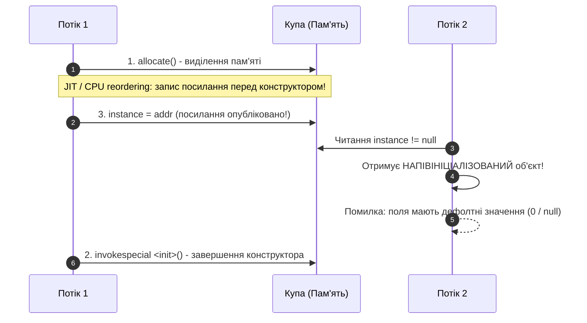

# Як реалізувати потокобезпечний Singleton

---

## 🟢 Junior Level

Коли застосунок працює в багатопотоковому середовищі, наївна реалізація Singleton із лінивою ініціалізацією ламається через стан гонки (Race Condition):

```java
// ❌ НЕПРАВИЛЬНО: Стан гонки (Race Condition)!
public class UnsafeSingleton {
    private static UnsafeSingleton instance;
    private UnsafeSingleton() {}

    public static UnsafeSingleton getInstance() {
        if (instance == null) {
            // Якщо Потік A і Потік B зайдуть сюди одночасно,
            // обидва виконають оператор new і створять ДВА РІЗНИХ об'єкти!
            instance = new UnsafeSingleton();
        }
        return instance;
    }
}
```

Щоб гарантувати існування виключно одного екземпляра, створення об'єкта має бути **потокобезпечним (Thread-Safe)**.

---

### Найпростіший і найнадійніший спосіб — Enum Singleton

Починаючи з Java 5, найпростіший, лаконічний і безпечний спосіб створення потокобезпечного Singleton — це використання `enum`:

```java
public enum AppSettings {
    INSTANCE;

    private String databaseUrl = "jdbc:postgresql://localhost:5432/mydb";

    public String getDatabaseUrl() {
        return databaseUrl;
    }

    public void setDatabaseUrl(String databaseUrl) {
        this.databaseUrl = databaseUrl;
    }
}

// Використання:
public class Main {
    public static void main(String[] args) {
        AppSettings settings = AppSettings.INSTANCE;
        System.out.println(settings.getDatabaseUrl());
    }
}
```

**Чому Enum безпечний «з коробки»:**
1. **Потокобезпечність:** JVM на рівні завантажувача класів гарантує, що константа `enum` створюється рівно один раз і повністю ініціалізується до першого використання.
2. **Захист від рефлексії:** Спроба викликати `Constructor.newInstance()` для типу `enum` безумовно викидає виняток `IllegalArgumentException`.
3. **Захист від десеріалізації:** Механізм серіалізації Java гарантує, що десеріалізація `enum` повертає вже існуючий екземпляр, а не створює новий об'єкт у купі.

---

## 🟡 Middle Level

У промисловій Java-розробці виділяють чотири основні підходи до реалізації потокобезпечного Singleton.

### 1. Eager Initialization (Рання ініціалізація)
Екземпляр створюється статичним ініціалізатором під час завантаження класу.

```java
public class EagerSingleton {
    private static final EagerSingleton INSTANCE = new EagerSingleton();

    private EagerSingleton() {}

    public static EagerSingleton getInstance() {
        return INSTANCE;
    }
}
```
- **Переваги:** Гранична простота, 100% потокобезпечність гарантована завантажувачем класів JVM.
- **Недоліки:** Об'єкт створюється в пам'яті одразу під час завантаження класу, навіть якщо він ресурсомісткий і в поточному сценарії роботи програми взагалі не знадобиться.

---

### 2. Double-Checked Locking (DCL з volatile)
Лінива ініціалізація, за якої синхронізація через блок `synchronized` відбувається лише під час першого звернення.

```java
public class DclSingleton {
    // volatile критично обов'язковий для запобігання перевпорядкуванню інструкцій (Instruction Reordering)!
    private static volatile DclSingleton instance;

    private DclSingleton() {
        // Захист від повторного створення через Reflection API
        if (instance != null) {
            throw new IllegalStateException("Екземпляр Singleton уже створено!");
        }
    }

    public static DclSingleton getInstance() {
        DclSingleton local = instance; // Читання volatile в локальну змінну
        if (local == null) {
            synchronized (DclSingleton.class) {
                local = instance;
                if (local == null) {
                    instance = local = new DclSingleton();
                }
            }
        }
        return local;
    }
}
```
- **Переваги:** Лінива ініціалізація, мінімальні накладні витрати на синхронізацію (лише один раз під час створення).
- **Недоліки:** Складність коду, необхідність чіткого розуміння ролі `volatile` та апаратних бар'єрів пам'яті.

---

### 3. Bill Pugh Singleton (Initialization-on-demand Holder)
Оптимальний баланс між лінивою ініціалізацією, високою продуктивністю та простотою синтаксису.

```java
public class BillPughSingleton {
    private BillPughSingleton() {}

    // Вкладений static class НЕ завантажується JVM до першого виклику getInstance()
    private static class Holder {
        private static final BillPughSingleton INSTANCE = new BillPughSingleton();
    }

    public static BillPughSingleton getInstance() {
        return Holder.INSTANCE;
    }
}
```
- **Як це працює:** Зовнішній клас `BillPughSingleton` може завантажуватися та використовуватися іншими частинами коду, але внутрішній статичний клас `Holder` не буде завантажено в пам'ять і проініціалізовано доти, доки безпосередньо не буде викликано метод `getInstance()`.
- **Потокобезпечність:** Специфікація мови Java (JLS §12.4.2) гарантує, що ініціалізація статичних полів класу захищена внутрішнім блокуванням завантажувача класів (Class Initialization Lock).

---

### 4. Комплексний захист від атак (Reflection, Serialization, Cloning)

Якщо клас реалізує інтерфейс `Serializable` або `Cloneable`, стандартні механізми JVM можуть порушити інваріант єдиності:

```java
import java.io.Serializable;

public class HardenedSingleton implements Serializable {
    private static final long serialVersionUID = 1L;

    private HardenedSingleton() {
        if (Holder.INSTANCE != null) {
            throw new IllegalStateException("Спроба створення другого екземпляра через рефлексію!");
        }
    }

    private static class Holder {
        private static final HardenedSingleton INSTANCE = new HardenedSingleton();
    }

    public static HardenedSingleton getInstance() {
        return Holder.INSTANCE;
    }

    // Захист від серіалізації: підміняє десеріалізований об'єкт на синглтон
    protected Object readResolve() {
        return getInstance();
    }

    // Захист від клонування
    @Override
    protected Object clone() throws CloneNotSupportedException {
        throw new CloneNotSupportedException("Клонування Singleton суворо заборонено!");
    }
}
```

---

### Порівняльна таблиця реалізацій

| Спосіб | Ліниве завантаження | Потокобезпечність | Захист від Reflection | Захист від Serialization | Складність |
| :--- | :---: | :---: | :---: | :---: | :---: |
| **Enum** | ❌ Ні | ✅ JVM | ✅ Нативний | ✅ Нативний | Мінімальна |
| **Bill Pugh** | ✅ Так | ✅ JVM | ⚠️ Ручна перевірка | ⚠️ `readResolve()` | Низька |
| **DCL + volatile** | ✅ Так | ✅ JMM volatile | ⚠️ Ручна перевірка | ⚠️ `readResolve()` | Висока |
| **Eager static** | ❌ Ні | ✅ JVM | ⚠️ Ручна перевірка | ⚠️ `readResolve()` | Мінімальна |
| **synchronized метод**| ✅ Так | ✅ Монітор класу | ⚠️ Ручна перевірка | ⚠️ `readResolve()` | Середня (повільно) |

---

## 🔴 Senior Level

### Глибокий аналіз JMM: Перевпорядкування інструкцій та апаратні архітектури (x86 vs ARM)

У виразі `instance = new DclSingleton()` JVM і компілятор виконують три послідовні кроки:
```
1. allocate_memory(sizeof(DclSingleton)) -> виділення пам'яті в купі
2. invokespecial DclSingleton.<init>()   -> виклик конструктора (ініціалізація полів)
3. instance = ref                        -> запис адреси пам'яті в змінну
```

**Небезпека без `volatile`:**
Компілятор JIT (C2) та суперскалярний процесор (Out-of-Order Execution) з метою оптимізації конвеєра мають право перевпорядкувати кроки: `1 -> 3 -> 2`.

```
[Потік 1]                                 [Потік 2]
1. allocate_memory()
3. instance = addr (посилання опубліковано!)
                                          Викликає getInstance():
                                          Перевіряє: if (instance == null) -> FALSE!
                                          Повертає напівініціалізоване посилання!
                                          Викликає метод: obj.doSomething() -> NPE / Пошкоджений стан!
2. invokespecial <init>() (конструктор)
```



#### Різниця в апаратних моделях пам'яті: x86 (TSO) проти ARM / Apple Silicon
- **Архітектура x86-64:** використовує модель пам'яті **Total Store Order (TSO)** — строгу модель пам'яті. Процесори x86 апаратно не перевпорядковують інструкції запису між собою (`StoreStore` перевпорядкування заборонене апаратно). Через це DCL без `volatile` міг роками «випадково працювати» на серверах Intel/AMD у продакшені без помітних збоїв.
- **Архітектури ARM64 (AWS Graviton, Apple M-series) та PowerPC:** використовують **Weak Memory Model (Слабку модель пам'яті)**. У них процесори агресивно перевпорядковують операції читання та запису заради максимальної енергоефективності та паралелізму. Запуск коду зі зламаним DCL без `volatile` на ARM64 негайно призводить до падінь та пошкодження бізнес-даних.

**Роль `volatile`:**
Згідно зі специфікацією JSR-133 (Java 5+), запис у `volatile`-змінну генерує інструкцію бар'єра пам'яті (`StoreStore` перед записом та `StoreLoad` після нього; на x86 це `lock addl` або `mfence`, на ARM — `dmb ish`). Це формує відношення **Happens-Before**: усі операції запису, виконані в конструкторі, гарантовано стають видимими іншим потокам до того, як вони прочитають ненульове посилання `instance`.

---

### Оптимізація через VarHandle (Java 9+)

Ключове слово `volatile` накладає строгі бар'єри пам'яті (Sequential Consistency). Починаючи з Java 9, для високонавантажених систем доступний механізм `VarHandle` із семантикою Acquire/Release:

```java
import java.lang.invoke.MethodHandles;
import java.lang.invoke.VarHandle;

public class VarHandleSingleton {
    private static final VarHandle INSTANCE_HANDLE;

    static {
        try {
            INSTANCE_HANDLE = MethodHandles.lookup()
                .findStaticVarHandle(VarHandleSingleton.class, "instance", VarHandleSingleton.class);
        } catch (ReflectiveOperationException e) {
            throw new ExceptionInInitializerError(e);
        }
    }

    private static VarHandleSingleton instance;

    private VarHandleSingleton() {}

    public static VarHandleSingleton getInstance() {
        VarHandleSingleton local = (VarHandleSingleton) INSTANCE_HANDLE.getAcquire();
        if (local == null) {
            synchronized (VarHandleSingleton.class) {
                local = (VarHandleSingleton) INSTANCE_HANDLE.getAcquire();
                if (local == null) {
                    local = new VarHandleSingleton();
                    INSTANCE_HANDLE.setRelease(local);
                }
            }
        }
        return local;
    }
}
```
- **Чому це швидше:** методи `getAcquire` та `setRelease` формують односпрямовані бар'єри пам'яті (Acquire-Release semantics), які є дешевшими за повні двосторонні бар'єри `volatile` (Seq-Cst) на архітектурах ARM64, зберігаючи при цьому повну гарантію видимості ініціалізованого об'єкта.

---

### Механіка Class Initialization Lock у Bill Pugh Singleton

Специфікація мови Java (JLS §12.4.2) детально описує процедуру ініціалізації класу. Ініціалізація вкладеного класу `Holder`:
1. Синхронізується унікальним внутрішнім блокуванням (Initialization Lock), асоційованим з об'єктом `Class<Holder>`.
2. Потік, який першим запросив завантаження `Holder`, захоплює це блокування, переводить клас у стан `initializing`, запускає статичний конструктор `<clinit>` і створює об'єкт `INSTANCE`.
3. Усі інші потоки, що одночасно викликали `getInstance()`, блокуються на моніторі ініціалізації класу доти, доки стан класу не перейде в `initialized`.
4. Після переходу в стан `initialized` будь-які наступні звернення до поля `Holder.INSTANCE` виконуються зі швидкістю звичайного читання статичної константи **без будь-яких блокувань та накладних витрат**.

---

## 🎯 Шпаргалка для інтерв'ю

### 30-секундна відповідь (Elevator Pitch)
> «Для реалізації потокобезпечного Singleton у Java є два найкращих підходи: **Enum Singleton** (гарантує потокобезпечність, захист від рефлексії та серіалізації на рівні специфікації мови) та **Bill Pugh Singleton** через статичний внутрішній клас Holder (забезпечує ліниве завантаження коштом Class Initialization Lock без накладних витрат `synchronized`). Якщо застосовується Double-Checked Locking (DCL), поле **зобов'язане бути `volatile`**, щоб запобігти перевпорядкуванню інструкцій (instruction reordering) компілятором і процесором, через яке інший потік може отримати посилання на напівініціалізований об'єкт».

---

### 3–4 каверзних запитання з відповідями

1. **Чому код із DCL без `volatile` міг роками працювати на серверах Intel, але негайно падає на AWS Graviton (ARM64)?**
   - *Відповідь:* Архітектура x86-64 має строгу модель пам'яті TSO (Total Store Order), де апаратне перевпорядкування записів (StoreStore) апаратно заборонене. Архітектура ARM64 має слабку модель пам'яті (Weak Memory Ordering), де процесор агресивно змінює порядок записів у пам'ять заради паралелізму конвеєра. Без ключового слова `volatile` на ARM64 посилання на об'єкт публікується до завершення ініціалізації полів у конструкторі, і паралельний потік зчитує нульові або некоректні дані.

2. **Навіщо в методі `getInstance()` патерна DCL оголошується локальна змінна `local = instance`?**
   - *Відповідь:* Це мікрооптимізація продуктивності (Local Variable Optimization). Читання `volatile`-поля коштує дорожче за читання зі стека або регістрів процесора через протокол когерентності кешів (MESI). Збереження посилання в локальну змінну гарантує, що при вже створеному об'єкті (99.9% випадків) звернення до `volatile`-поля виконується строго один раз.

3. **Чому Bill Pugh Singleton вважається кращим за метод із повною синхронізацією (`public static synchronized getInstance()`)?**
   - *Відповідь:* Синхронізований метод блокує монітор класу під час **кожного** виклику `getInstance()`, створюючи серйозну конкуренцію потоків (lock contention) у highload-сценаріях. Bill Pugh використовує блокування завантажувача класів (JLS §12.4.2), яке відпрацьовує рівно один раз під час ініціалізації вкладеного класу, після чого всі виклики відбуваються на швидкості читання звичайної константи взагалі без синхронізації.

4. **Як рефлексія ламає Bill Pugh Singleton і як від цього захиститися?**
   - *Відповідь:* Через виклики `constructor.setAccessible(true)` та `newInstance()`. Для захисту в приватному конструкторі Singleton додається перевірка: якщо екземпляр уже існує (або прапорець ініціалізації дорівнює true), викидається `IllegalStateException`.

---

### Типові помилки та Red Flags

- 🚩 **Використання DCL без модифікатора `volatile`** — фундаментальне нерозуміння JMM, instruction reordering та умов виникнення race condition.
- 🚩 **Синхронізація всього методу `getInstance()`** у високонавантажених сервісах — створення штучного вузького місця (bottleneck).
- 🚩 **Спроба стверджувати, що `Enum` Singleton можна створити через рефлексію** — метод `Constructor.newInstance()` у JVM містить явну перевірку на `Modifier.ENUM` і гарантовано викидає `IllegalArgumentException`.
- 🚩 **Ігнорування десеріалізації** у класах, що реалізують `Serializable` (відсутність методу `readResolve()`), що призводить до непомітного розмноження екземплярів при читанні з потоку байтів.

---

### Пов'язані теми
- [Що таке Singleton](03.%20Що%20таке%20Singleton.md) — концепція, класична структура та базові принципи
- [Що таке double-checked locking](05.%20Що%20таке%20double-checked%20locking.md) — детальний розбір DCL та стандарту JSR-133
- [Які проблеми є у Singleton](06.%20Які%20проблеми%20є%20у%20Singleton.md) — архітектурні недоліки, порушення SRP/DIP та проблеми тестування
- [Які категорії патернів існують](02.%20Які%20категорії%20патернів%20існують.md) — класифікація породжувальних патернів
- [Які антипатерни ви знаєте](16.%20Які%20антипатерни%20ви%20знаєте.md) — глобальний стан та супутні проблеми багатопотоковості
