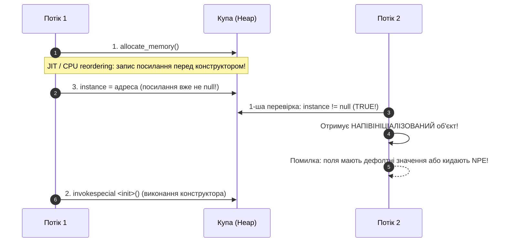

# Що таке double-checked locking

---

## 🟢 Junior Level

**Double-Checked Locking (DCL, блокування з подвійною перевіркою)** — це ідіома багатопотокового програмування, призначена для оптимізації лінивої ініціалізації важких ресурсів (найчастіше екземпляра Singleton).

Основна мета DCL — звести до мінімуму накладні витрати на синхронізацію потоків.

---

### У чому проблема наївних підходів?

#### 1. Синхронізований метод — занадто повільно
```java
// ❌ Повільно: блокування під час КОЖНОГО звернення
public static synchronized Singleton getInstance() {
    if (instance == null) {
        instance = new Singleton();
    }
    return instance;
}
```
Тут монітор класу блокується щоразу, навіть коли об'єкт уже давно створено і потрібно просто повернути посилання. У багатопотоковому застосунку з мільйонами звернень це створює критичне вузьке місце (lock contention).

#### 2. Проста лінива ініціалізація — потоконебезпечно
```java
// ❌ Небезпечно: стан гонки (Race Condition)
public static Singleton getInstance() {
    if (instance == null) { // Потоки А і B одночасно перевірять і зайдуть усередину
        instance = new Singleton(); // Буде створено два різні об'єкти!
    }
    return instance;
}
```

---

### Рішення: Double-Checked Locking

Перевірка умови виконується **двічі**:
1. **Перша перевірка (без блокування):** якщо об'єкт уже створено, негайно повертаємо його без захоплення монітора.
2. **Друга перевірка (всередині `synchronized`):** якщо об'єкт ще не створено, блокуємо монітор і повторно перевіряємо умову, щоб виключити створення дубліката іншим потоком, який міг встигнути ініціалізувати ресурс під час очікування блокування.

```java
public class DclSingleton {
    // ⚠️ Модифікатор volatile КРИТИЧНО ОБОВ'ЯЗКОВИЙ!
    private static volatile DclSingleton instance;

    private DclSingleton() {}

    public static DclSingleton getInstance() {
        // 1-ша перевірка (швидка, без синхронізації)
        if (instance == null) {
            synchronized (DclSingleton.class) {
                // 2-га перевірка (потокобезпечна)
                if (instance == null) {
                    instance = new DclSingleton();
                }
            }
        }
        return instance;
    }
}
```

---

## 🟡 Middle Level

### Чому необхідні рівно дві перевірки?

Розглянемо послідовність взаємодії двох потоків (Потік 1 та Потік 2):

```
Потік 1                          Потік 2
  │                                │
  ├─ 1-ша перевірка: instance == null│
  │  (успішно, йде до lock)        ├─ 1-ша перевірка: instance == null
  │                                │  (теж успішно!)
  ├─ Захоплює synchronized         │
  │                                ├─ Намагається увійти в synchronized
  ├─ 2-га перевірка: instance == null│  (ОЧІКУЄ звільнення монітора)
  │  (успішно, створює об'єкт)     │
  ├─ instance = new DclSingleton() │
  ├─ Виходить із synchronized ─────┼─ Захоплює звільнений монітор
  │                                ├─ 2-га перевірка: instance == null
  │                                │  (FALSE! Об'єкт уже створено Потоком 1)
  │                                ├─ Виходить без створення дубліката
```

- **Якщо прибрати 1-шу перевірку:** отримаємо звичайний `synchronized`-метод із падінням продуктивності під час кожного виклику.
- **Якщо прибрати 2-гу перевірку:** Потік 2 після захоплення монітора створить другий екземпляр, порушивши контракт Singleton.

---

### Чому `volatile` життєво необхідний?

Створення об'єкта в Java `instance = new DclSingleton()` на рівні байткоду та процесора складається з трьох незалежних операцій:

```
1. allocate_memory(DclSingleton)  -> виділення сирої пам'яті під об'єкт
2. invokespecial <init>            -> виклик конструктора (ініціалізація полів)
3. instance = address              -> запис адреси пам'яті в змінну instance
```

#### Проблема перевпорядкування інструкцій (Instruction Reordering)
Компілятор JIT і суперскалярний процесор заради оптимізації конвеєра команд мають право змінити порядок виконання на: `1 -> 3 -> 2`.

```
Потік 1 (Творець)                          Потік 2 (Читач)
  │                                         │
  ├─ 1. Виділив пам'ять                      │
  ├─ 3. Записав посилання в instance         │
  │     (посилання НЕ null, але об'єкт       ├─ Викликає getInstance()
  │      ще не проініціалізовано!)          ├─ 1-ша перевірка: instance != null (TRUE!)
  │                                         ├─ Повертає сире посилання Потоку 2
  │                                         ├─ Потік 2 викликає instance.getData()
  │                                         │  ❌ NPE або пошкоджений стан даних!
  ├─ 2. Виклик конструктора (запізно!)       │
```



Модифікатор `volatile` забороняє компілятору й апаратурі таке перевпорядкування, гарантуючи, що запис посилання відбудеться строго після завершення роботи конструктора.

---

### Оптимізація локальної змінної (Local Variable Optimization)

У високонавантаженому коді читання `volatile`-змінної коштує дорожче за звичайне читання зі стека чи регістрів, оскільки вимагає узгодження з протоколом когерентності кешів (MESI):

```java
public class OptimizedDclSingleton {
    private static volatile OptimizedDclSingleton instance;

    public static OptimizedDclSingleton getInstance() {
        // Одноразове читання volatile-поля в локальну змінну стека
        OptimizedDclSingleton local = instance;
        if (local == null) {
            synchronized (OptimizedDclSingleton.class) {
                local = instance;
                if (local == null) {
                    instance = local = new OptimizedDclSingleton();
                }
            }
        }
        return local; // Повернення з локальної змінної
    }
}
```

- **Ефект:** у 99.99% викликів, коли синглтон уже ініціалізовано, звернення до `volatile`-змінної `instance` виконується **строго один раз** замість двох. Це прискорює виконання методу приблизно на 25–30% у циклі частих викликів.

---

### Порівняльний аналіз альтернатив

| Підхід | Ліниве завантаження | Потокобезпечність | Накладні витрати після старту | Складність реалізації |
|---|:---:|:---:|:---:|:---:|
| **Synchronized метод** | ✅ Так | ✅ Так | 🔴 Високі (lock contention) | Мінімальна |
| **DCL без volatile** | ✅ Так | ❌ **НІ (UB)** | 🟢 Нульові | Помилкова |
| **DCL з volatile** | ✅ Так | ✅ Так | 🟢 Мінімальні | Висока |
| **Bill Pugh (Holder)** | ✅ Так | ✅ Так | 🟢 Нульові (JLS 12.4.2) | Низька |
| **Enum Singleton** | ❌ Ні (Eager) | ✅ Так | 🟢 Нульові | Мінімальна |

---

## 🔴 Senior Level

### Апаратна модель пам'яті: x86 (TSO) проти ARM64 та JSR-133

До виходу специфікації **JSR-133** (Java 5) у 2004 році модель пам'яті Java (JMM) містила прогалини: ключове слово `volatile` забезпечувало видимість, але не забороняло перевпорядкування звичайних читань/записів навколо `volatile`. Через це DCL до Java 5 був фундаментально зламаний на рівні мови.

#### Чому DCL без `volatile` міг роками «працювати» на серверах Intel?
- **x86-64 (Intel / AMD):** використовує модель пам'яті **Total Store Order (TSO)**. На апаратному рівні x86 не перевпорядковує інструкції `StoreStore` (запис після запису) та `LoadLoad` (читання після читання). Процесор апаратно не дозволяє адресі пам'яті опублікуватися раніше, ніж запишуться дані ініціалізованого об'єкта. Через це баг DCL без `volatile` залишався непоміченим на серверах x86.
- **ARM64 (Apple Silicon M-series, AWS Graviton, Ampere):** використовує **слабку модель пам'яті (Weak Memory Ordering)**. Процесор вільно перевпорядковує операції читання та запису в пам'ять, якщо між ними немає явних апаратних бар'єрів пам'яті. DCL без `volatile` на ARM64 гарантовано призводить до читання напівініціалізованих об'єктів та аварійних збоїв.

#### Бар'єри пам'яті JMM для volatile
Під час запису у `volatile`-поле JVM вставляє:
- `StoreStore` бар'єр перед записом (усі попередні операції запису завершено).
- `StoreLoad` бар'єр після запису (найважчий бар'єр, що запобігає читанню до завершення запису).
Під час читання з `volatile` вставляються бар'єри `LoadLoad` та `LoadStore`.

---

### Альтернатива на VarHandle (Java 9+)

Починаючи з Java 9, семантику Acquire/Release можна реалізувати за допомогою `VarHandle`, уникаючи жорсткого бар'єра повного послідовного порядку (`Sequential Consistency`), який накладає `volatile`:

```java
import java.lang.invoke.MethodHandles;
import java.lang.invoke.VarHandle;

public class VarHandleDcl {
    private static final VarHandle INSTANCE_HANDLE;
    private static VarHandleDcl instance;

    static {
        try {
            INSTANCE_HANDLE = MethodHandles.lookup()
                .findStaticVarHandle(VarHandleDcl.class, "instance", VarHandleDcl.class);
        } catch (ReflectiveOperationException e) {
            throw new ExceptionInInitializerError(e);
        }
    }

    private VarHandleDcl() {}

    public static VarHandleDcl getInstance() {
        // Односпрямований Acquire-бар'єр (дешевший за Seq-Cst читання volatile)
        VarHandleDcl local = (VarHandleDcl) INSTANCE_HANDLE.getAcquire();
        if (local == null) {
            synchronized (VarHandleDcl.class) {
                local = (VarHandleDcl) INSTANCE_HANDLE.getAcquire();
                if (local == null) {
                    local = new VarHandleDcl();
                    // Односпрямований Release-бар'єр (дешевший за StoreLoad бар'єр)
                    INSTANCE_HANDLE.setRelease(local);
                }
            }
        }
        return local;
    }
}
```

---

### DCL за межами Singleton: кешування та ліниві обчислення

Ідіома DCL застосовується всюди, де вимагається атомарне одноразове обчислення ресурсу:

```java
public class HeavyReportCache {
    private volatile byte[] cachedPdf;

    public byte[] getReportPdf() {
        byte[] local = cachedPdf;
        if (local == null) {
            synchronized (this) {
                local = cachedPdf;
                if (local == null) {
                    cachedPdf = local = generateExpensivePdfReport();
                }
            }
        }
        return local;
    }

    private byte[] generateExpensivePdfReport() {
        // Ресурсомісткі розрахунки та генерація звіту
        return new byte[1024];
    }
}
```

#### Виняток із правил: чому `String.hashCode()` не використовує `volatile`?
У класі `java.lang.String` поле `hash` кешується ліниво без `volatile` і без `synchronized`:
```java
// Вихідний код java.lang.String
public int hashCode() {
    int h = hash;
    if (h == 0 && !hashIsZero) {
        h = isLatin1() ? StringLatin1.hashCode(value) : StringUTF16.hashCode(value);
        if (h == 0) {
            hashIsZero = true;
        } else {
            hash = h;
        }
    }
    return h;
}
```
**Чому це безпечно (Benign Data Race):**
1. Поле `hash` — це примітив `int` (32 біти). Запис 32-бітного примітива в Java є атомарним (відсутній розрив слова / word tearing).
2. Обчислення детерміноване: якщо два потоки одночасно обчислять хеш, вони запишуть абсолютно однакове число.
3. Це допустимо **виключно для незмінних примітивів**, але категорично неприйнятно для посилань на складені об'єкти в купі!

---

## 🎯 Шпаргалка для інтерв'ю

### 30-секундна відповідь (Elevator Pitch)
> «**Double-Checked Locking (DCL)** — це ідіома багатопотокового програмування для лінивої ініціалізації об'єктів із мінімальними накладними витратами на синхронізацію. Перша перевірка виконується без блокувань заради високої продуктивності в hot-path, а друга — всередині блоку `synchronized` для запобігання дублюванню об'єкта паралельними потоками. Модифікатор **`volatile` критично обов'язковий**, оскільки без нього JIT-компілятор і CPU можуть перевпорядкувати інструкції (виділення пам'яті → публікація посилання → виконання конструктора), у результаті чого паралельний потік отримає посилання на напівініціалізований об'єкт».

---

### 3–4 каверзних запитання з відповідями

1. **Що станеться, якщо в DCL прибрати `volatile`? Чи буде код компілюватися і коли він впаде?**
   - *Відповідь:* Код успішно скомпілюється і навіть пройде більшість модульних тестів. Однак у багатопотоковому середовищі виникне стан гонки через Out-of-Order Execution: потік-читач на першій перевірці побачить `instance != null`, коли конструктор ще не завершив ініціалізацію внутрішніх полів. Це призведе до непередбачуваних `NullPointerException` або зчитування пошкодженого стану. На архітектурі ARM64 (наприклад, AWS Graviton) збій відтворюється негайно через слабку модель пам'яті.

2. **Навіщо зберігати `volatile`-змінну в локальну змінну `local = instance`?**
   - *Відповідь:* Це оптимізація локальної змінної (Local Variable Optimization). Читання `volatile`-поля вимагає дотримання когерентності процесорних кешів і коштує дорожче за читання зі стека. Збереження в локальну змінну скорочує кількість читань `volatile` до одного в 99.9% сценаріїв, знижуючи накладні витрати на 25–30%.

3. **Чому в JDK до версії 1.5 патерн DCL не працював навіть із ключовим словом `volatile`?**
   - *Відповідь:* До специфікації JSR-133 (Java 5) у моделі пам'яті Java були відсутні строгі правила для `volatile` щодо перевпорядкування зі звичайними змінними. Бар'єри пам'яті гарантували лише синхронізацію кешу, але не запобігали винесенню запису посилання за межі завершення конструктора.

4. **Чому `String.hashCode()` може кешувати значення без `volatile` і DCL, а Singleton так робити не може?**
   - *Відповідь:* Для `String.hashCode()` припустима «доброякісна гонка даних» (benign race condition), оскільки кешується примітив `int` (атомарний 32-бітний запис), а результат обчислення є детермінованим і не залежить від стану об'єкта в купі. У випадку зі складним об'єктом без `volatile` інший потік бачить посилання на незаповнені поля в купі.

---

### Типові помилки та Red Flags

- 🚩 **Використання DCL без `volatile`** — фундаментальне нерозуміння JMM, процесорних архітектур та Out-of-Order Execution.
- 🚩 **Твердження «на моєму комп'ютері без volatile все працює»** — незнання різниці між строгою моделлю пам'яті x86 (TSO) та слабкою моделлю пам'яті ARM64 / PowerPC.
- 🚩 **Видалення другої перевірки всередині `synchronized`** — призводить до створення дублікатів Singleton під час одночасного першого звернення.
- 🚩 **Ручне написання DCL у Spring Boot застосунках** замість використання штатного DI-контейнера (`@Component` / `@Service` із singleton-областю видимості).

---

### Пов'язані теми
- [Як реалізувати потокобезпечний Singleton](04.%20Як%20реалізувати%20потокобезпечний%20Singleton.md) — огляд усіх способів реалізації
- [Що таке Singleton](03.%20Що%20таке%20Singleton.md) — фундаментальні принципи патерна
- [Які проблеми є у Singleton](06.%20Які%20проблеми%20є%20у%20Singleton.md) — архітектурні антипатерни
- [Які категорії патернів існують](02.%20Які%20категорії%20патернів%20існують.md) — породжувальні шаблони проєктування
- [Які антипатерни ви знаєте](16.%20Які%20антипатерни%20ви%20знаєте.md) — типові помилки в архітектурі ПЗ
